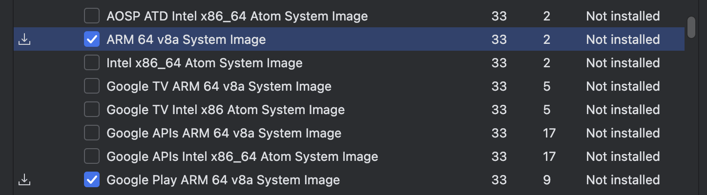

# RN 개발 환경 구축  

- [RN 개발 환경 구축](#rn-개발-환경-구축)
  - [개발환경 설치하기](#개발환경-설치하기)
  - [RN 개발환경 셋팅 요약 (0.77)](#rn-개발환경-셋팅-요약-077)
  - [RN 개발환경 셋팅 요약 (0.73)](#rn-개발환경-셋팅-요약-073)
  - [빌드](#빌드)


## 개발환경 설치하기  

react-native-cli를 통해서 프로젝트를 셋업  
- expo cli에 대비해서 장점은?  
  - 1.네이티브 모듈 자유도 : 네이티브 모듈을 호출해야 하는 경우 (JS에서 코틀린, 스위프트 함수를 호출할 수 있다.)     
  - 2.code push : 심사없이 업데이트 가능  
- ( expo-cli 에서도 prebuild를 이용해서 네이티브 모듈과의 연결이 잘 될것같은데... 아직까지는 잘 모르겠다.)  

>https://reactnative.dev/docs/0.73/environment-setup?guide=native&platform=android

## RN 개발환경 셋팅 요약 (0.77)
https://reactnative.dev/docs/getting-started-without-a-framework?package-manager=npm


```js
npx @react-native-community/cli@latest init AwesomeProject  


✔ Initializing Git repository
  Run instructions for Android:
    • Have an Android emulator running (quickest way to get started), or a device connected.
    • cd "/Users/workspace/projects/MatzipRN" && npx react-native run-android
  
  Run instructions for iOS:
    • cd "/Users/workspace/projects/MatzipRN"
    
    • npx react-native run-ios
    - or -
    • Open MatzipRN/ios/MatzipRN.xcworkspace in Xcode or run "xed -b ios"
    • Hit the Run button
    
  Run instructions for macOS:
    • See https://aka.ms/ReactNativeGuideMacOS for the latest up-to-date instructions.
    
```

## RN 개발환경 셋팅 요약 (0.73)  

1.아래 가이드로 루비 버전을 먼저 바꾸자.  

```
// 기본 버전이 2.6인데 RN 템플릿은 2.7을 요구한다. 
ruby -v
ruby 2.6.10p210 (2022-04-12 revision 67958) [universal.arm64e-darwin23]

brew install ruby-build
brew install rbenv
rbenv install 2.7.6
rbenv global 2.7.6

// 여전히 버전이 2.6이다.. 
ruby -v
ruby 2.6.10p210 (2022-04-12 revision 67958) [universal.arm64e-darwin23]
// 루비버전 안바뀌면 .zshrc에 추가  
// code ~/.zshrc
eval "$(rbenv init - zsh)"
source ~/.zshrc  

// 2.7 버전 변경 성공  
ruby -v
ruby 2.7.6p219 (2022-04-12 revision c9c2245c0a) [arm64-darwin23]
---
rbenv install 3.2.2
rbenv global 3.2.2
```

2.iOS

```
// 1 Node & Watchman
brew install node
brew install watchman

// 2 Xcode
// app store에서 설치하면 된다.
// - Please use the latest version of Xcode.
// - Command Line Tools 설치
// 📌 iOS 시뮬레이터 같이 설치하자.  

// 3.CocoaPods
// 📌 루비 2.7 버전 변경 먼저 선행할 것
sudo gem install cocoapods

```

3.안드로이드  
>https://reactnative.dev/docs/0.73/environment-setup?guide=native&platform=android
```
// 1 Java Development Kit
brew install --cask zulu@17
# Get path to where cask was installed to double-click installer
brew info --cask zulu@17

// 2.Android Studio
// SDK Manager에서 추가설치할 것
// 2.1 SDK Platform 13 버전

// 가상머신에 아래 패키지도 추가 설치하자.
// Intel x86 Atom_64 System Image or Google APIs Intel x86 Atom System Image 

// (for Apple M1 Silicon) Google APIs ARM 64 v8a System Image


// 3 환변경수 쉘 추가
export ANDROID_HOME=$HOME/Library/Android/sdk
export PATH=$PATH:$ANDROID_HOME/emulator
export PATH=$PATH:$ANDROID_HOME/platform-tools 
(내 쉘이 뭔지 출력 > echo $SHELL)

```
   

- SDK platform 13 추가    
  - ARM 64 v8a System Image 체크
  - Google Play ARM 64 v8a System Image 체크  

    
- Google Play Services 추가  

4.프로젝트 초기 생성  

```
npx react-native@0.72.6 init FoodRNWebview --version 0.72.6
npm run start  
```


## 빌드

```
# 빌드 캐시 초기화  

cd android
./gradlew clean


# 안드로이드 빌드
npx react-native run-android
```