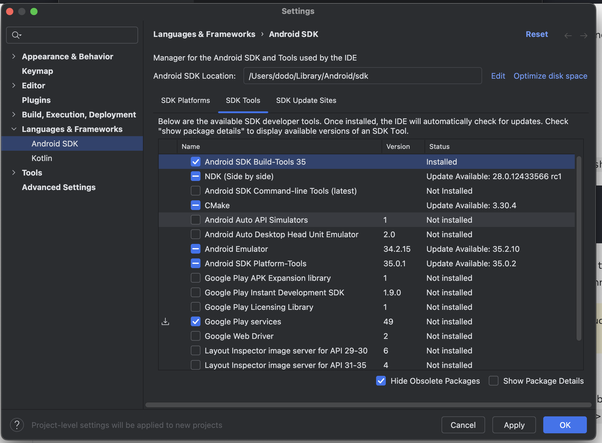

# react-native 개발 환경 구축  


## 개발환경 설치하기  

react-native-cli를 통해서 프로젝트를 셋업  
- 장점 : 네이티브 모듈을 호출해야 하는 경우 JS에서 코틀린, 스위프트 함수를 호출할 수 있다.  
- expo-cli 에서도 prebuild를 이용해서 네이티브 모듈과의 연결이 잘 될것같은데... 아직까지는 잘 모르겠다.  

>https://reactnative.dev/docs/0.73/environment-setup?guide=native&platform=android


### 개발환경 셋팅 요약  

- 1.아래 가이드로 루비 버전을 먼저 바꾸자.  

- 2.iOS

```
// 1 Node & Watchman
brew install node
brew install watchman

// 2 Xcode
// Please use the latest version of Xcode.
// Command Line Tools 설치
// 📌 iOS 시뮬레이터 같이 설치하자.  

// 3.CocoaPods
// 루비 2.7 버전 변경 먼저 선행할 것
sudo gem install cocoapods


```
- 3.안드로이드  

```
// 1 Java Development Kit
brew install --cask zulu@17
# Get path to where cask was installed to double-click installer
brew info --cask zulu@17

// 2.Android Studio
// 가상머신에 아래 패키지도 추가 설치하자.
// Intel x86 Atom_64 System Image or Google APIs Intel x86 Atom System Image 
// (for Apple M1 Silicon) Google APIs ARM 64 v8a System Image


// 3 환변경수 쉘 추가
export ANDROID_HOME=$HOME/Library/Android/sdk
export PATH=$PATH:$ANDROID_HOME/emulator
export PATH=$PATH:$ANDROID_HOME/platform-tools

```

  


- 4.프로젝트 초기화  

```
npx react-native@0.72.6 init bakeWebViewRN --version 0.72.6
npm run start  
```


### 루비 버전 이슈  

```
// 기본 버전이 2.6인데 RN 템플릿은 2.7을 요구한다. 
ruby -v
ruby 2.6.10p210 (2022-04-12 revision 67958) [universal.arm64e-darwin23]

brew install ruby-build
brew install rbenv
rbenv install 2.7.6
rbenv global 2.7.6

// 여전히 버전이 2.6이다.. 
ruby -v
ruby 2.6.10p210 (2022-04-12 revision 67958) [universal.arm64e-darwin23]
// 루비버전 안바뀌면 .zshrc에 추가  
// code ~/.zshrc
eval "$(rbenv init - zsh)"
source ~/.zshrc  

// 2.7 버전 변경 성공  
ruby -v
ruby 2.7.6p219 (2022-04-12 revision c9c2245c0a) [arm64-darwin23]

```
