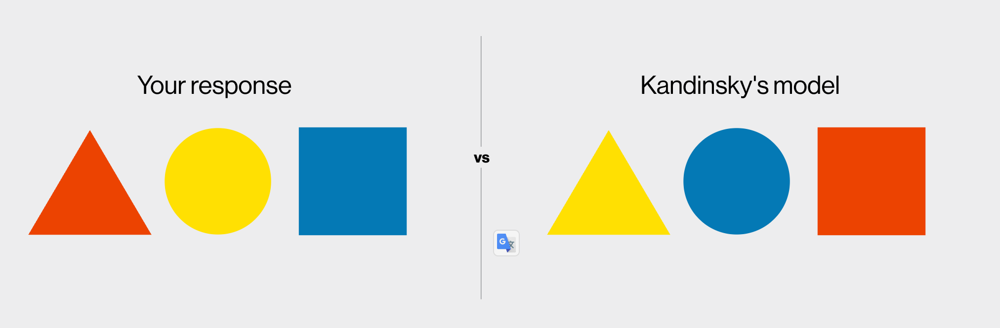

# 구도 Composition  

코멘트  
- 디자인은 인간의 심리에 기반한다. 어려운것은 *무의식의 표상*을 얼마나 잘 이해하고 끌어내는지.  
- 또 어려운것은 *보편성*이다. 나는 빨간색이 즐거움? 이더라도 대체로 사람들을 열정, 분노를 표상.  
  - Q.빨간색과 세모의 무의식 표상은?  
  - “빨간색”과 “세모(삼각형)“의 무의식적 표상은 각각 “위험・열정”과 “긴장・공격성・방향성”이에요.   

## 1.도입  

>좋은 구도(배치)는 시각적 즐거움을 준다.  

1.디자인의 본질은 ‘구도’  
- 웹사이트나 앱 디자인은 타이포그래피나 컬러보다 *요소 배치(구도)*가 핵심이에요.  
- 예술가 존 컨스터블의 그림처럼, 현실을 그대로 그리는 것이 아닌, 시각적으로 가장 조화로운 위치에 요소를 배치하는 것이 중요해요.  

2.구도는 감각이자 훈련 가능한 능력   
- 시선을 어디로 끌 것인지, 공간을 어떻게 활용할 것인지가 중요한 포인트예요.   
- 예: 그림 왼쪽 아래 소 → 사람들이 먼저 보는 위치에 시선을 집중시키기 위한 전략.   

3.실습 중심의 학습 방법 제안  
- 종이와 연필로 간단한 실습을 통해 구도 감각을 훈련.  
- 예: 빈 프레임 안에 선 하나 그리기, 정사각형 하나 넣어보기.  
- 실습은 짧게, 완벽하지 않아도 OK. 핵심은 “직관과 시각적 감각 훈련”이에요.  

4.디자인 요소는 적더라도 구도는 무한하다  
- 정사각형 하나만으로도 수십 가지 구도를 만들 수 있어요. 
- 요소가 적더라도 배치 방법에 따라 완전히 다른 느낌을 줄 수 있어요.  

5.좋은 구도 = 사용자의 시선 흐름을 조율하는 것  
- 웹 디자인에서도 가장 중요한 건 정보 구조나 시각적 질서예요.  
- 단순하지만 감각적인 배치가 가장 먼저 훈련해야 할 능력이에요.  

## 2.표현    

1.글자는 감정과 메시지를 전달한다  
- 같은 ‘a’라도 폰트나 스타일이 다르면 다른 성격과 감정을 전달해요.   
- 타이포그래피는 단순히 글자를 표현하는게 아니라 무의식적으로 메시지를 암시하는 시각적 언어예요.   

  

2.구도도 감정을 만든다  
- 사각형만으로도 감정 표현이 가능해요.
- 예: 공간의 밀도, 위치, 균형, 크기 등이 감정적 반응을 유도할 수 있어요.
- 디자인은 결국 시각적 요소들이 무엇을 말하는지에 대한 고민이에요.

3.실습 예시: 감정을 시각화한 도형 구도
- 취했다(drunk): 무게중심 불균형 + 각도 → 불안정함과 에너지 전달.
- 폐쇄공포증(clautrophobia): 질서정연한 배열 + 좁은 여백 → 갇힌 느낌 전달.
  - 포인트: 어떤 감정을 표현하려 했고, 왜 그렇게 구성했는지를 설명하는 것이 중요해요.

4.실습 목표: 감정을 시각적 언어로 바꾸는 능력
- “갈등”, “황홀감” 같은 단어를 듣고, 그것에 맞는 도형 배치나 구도를 그려보는 것이 실습의 핵심이에요.
- 정확한 정답은 없고, 본인이 왜 그렇게 표현했는지 설명할 수 있는 것이 더 중요해요.

5.의도적 설계 사고 훈련
- 직관적으로 구도를 짜는 감각을 키우고,
- 타인과의 협업이나 피드백 시 왜 이런 결정을 했는지 설명할 수 있는 사고력을 기르기 위한 훈련이에요.

## 3.균형

‘안정감’을 주는 디자인은 시각적 균형을 통해 달성할 수 있어요.  
균형은 단순한 대칭이 아니라, 무게·위치·밝기 같은 시각 요소들의 조화예요.

🔑 핵심 요약
1.‘안정감’은 브랜드와 디자인의 기본 감정
- 브랜드가 창의적이든 보수적이든, 궁극적으로는 사용자에게 신뢰와 안도감을 주고 싶어 해요.
- ‘안정성’은 디자인의 기본적인 심리적 요구예요.

2.균형은 시각적 무게의 분배
- 예술에서도 모든 요소가 한쪽에 치우치면 불편함을 느껴요.
- 예: 나무의 가지가 한쪽으로만 있으면 넘어질 것 같은 느낌을 줌 → 균형을 맞추려는 작동.

3.균형은 대칭만이 아니다
- 비대칭적인 균형도 가능해요:
  - 큰 도형 vs 작은 도형 여러 개
  - 중심에서 가까운 vs 멀리 떨어진 위치
  - 밝은 색상 vs 어두운 색상 → 대비가 곧 무게로 작용

4.디자인은 ‘시소’와 같다
- 시각적 요소의 무게를 조절하면서 균형 잡힌 구성을 만드는 것이 목표예요.
- 위치와 크기, 밝기 등을 조합해 균형을 맞출 수 있어요.

5.밝기도 시각적 무게의 요소
- 어두운 도형은 무겁게 느껴지고, 밝은 도형은 가볍게 느껴져요.
- 대비를 줄이면 시각적 무게도 줄어들어요.

6.실제 디자인에서 균형은 복잡해진다
- 텍스트, 이미지, 색상 등 다양한 요소들이 섞이기 때문에 직관이 중요해져요.
- 지금처럼 단순한 도형으로 많이 연습해두면 복잡한 디자인 상황에서도 균형 감각을 직관적으로 활용할 수 있어요.

🧪 실습 안내
- 목표: 정사각형 2~3개 이상을 사용해 균형감 있는 구도 만들기
- 팁:
  - 위치, 크기, 수량, 밝기(명도)를 조절해 보기
  - 같은 무게라도 ‘멀리 있으면 더 강한 힘’을 가진다는 점 기억하기 (시소 원리)
  - 대칭도 OK, 비대칭 균형도 OK

💡 한 줄 요약:
시각적 안정감은 무게, 위치, 명도 등 다양한 요소를 조합한 ‘균형’에서 나와요. 직관적으로 이해하려면 단순한 도형으로 꾸준히 실습하는 게 중요해요.  

## 4.대비    

시각적으로 조화롭고 균형 잡힌 디자인을 위해선 ‘대비’와 ‘제한’을 적절히 활용해야 해요.    
대비는 흥미를 유발하지만, 지나치면 혼란을 줘요.  

🔑 핵심 요약

1. 비움도 하나의 균형
	- 아무것도 넣지 않는 것도 균형 있는 디자인일 수 있어요.
	- 하지만 실제 마케팅에서는 너무 비어 보이는 디자인은 비호감일 수 있어요.

2. 완벽한 대칭 ≠ 좋은 디자인
	- 사람은 자연스럽고 현실적인 걸 선호해요.
	- 너무 정돈되면 오히려 기계적이고 따분하게 느껴질 수 있어요.

3. ‘약간의 대비’가 핵심
	- 약간의 긴장감과 불균형 요소가 사용자의 주의를 끌고 몰입감을 줘요.
	- 예: 큰 사각형 vs 다른 성질의 작은 모양 (원, 이파리 등)

4. 다양한 대비 요소
	- 형태: 네모 vs 원, 자연 vs 인공
	- 크기: 작고 크고
	- 색상: 초록 vs 빨강
	- 질감: 매끄러움 vs 거칠음
	- 선: 굵기, 각도, 정렬

5. 너무 많은 대비는 독이 될 수 있음
	- 요소가 많아질수록 여백이 중요해짐 → 시각적 숨 쉴 공간 제공
	- 대비의 양을 제한해야 함. 너무 다양하면 혼란스러워져요.

6. 대비와 균형을 동시에 고려해야 함
	- 대비가 있어도 전체 구도에서 무게 중심이 맞아야 해요.
	- 원, 사각형, 이파리 등의 시각적 무게를 조합해서 구성.

7. 복잡성이 올라가면 규칙이 필요
	- 처음엔 자유롭게 구성해도 괜찮아요.
	- 하지만 모양, 색, 질감이 많아지면 자연스레 패턴(규칙)을 만들고 싶어질 것이에요.
	- 규칙이 시각적 질서를 제공함 → 조화롭고 편안하게 느껴짐

⸻

🧪 실습 제안  
	- 목표: 대비를 활용하되 조화를 유지하는 다양한 구도 만들기  
	- 조건:  
	- 대비적 요소 포함: 모양(원 vs 네모), 색상, 크기, 질감 등  
	- 처음엔 12개 요소로 시작 → 점점 34개로 확장  
	- 너무 과한 대비는 피하고, 여백을 고려하기  
	- 실험을 통해 자연스럽게 규칙이 생겨나도록 유도  

⸻

💡 한 줄 요약

좋은 디자인은 안정적인 균형과 적절한 대비의 조화에서 나와요. 너무 정돈되어도, 너무 혼란스러워도 안 돼요. 적절한 제한과 규칙이 자연스레 생겨날 수 있도록 디자인을 실험해보세요.  

## 5.형태    

https://bauhaus.netlify.app/form_color/interactive/  
    
  
- 칸딘스키는 사람의 심리랑 연결시켜서 생각한다. 
 - 색상 -> 어떤 심리적 심상 -> 모양과 매칭  
 - 그리고 이것을 시켜봤을때 많은 사람들이 그렇게 매칭했다.  

Variations  
- 모양, 질감, 패턴, 크기, 투명도, 
- 구도 (안정, 불안정), 대조  

## 6.계층구조    

디자인에서 시각적 위계를 활용하여 사용자로 하여금 ‘무엇을 먼저 보고, 그 다음에 볼지’를 자연스럽게 유도하는 법을 배우는 데 있어요.

✅ 핵심 메시지 요약

1. 우리는 예술이 아닌 ‘쓸모 있는 디자인’을 만든다
	- 디자인은 실용적이어야 하며, 정보 전달이 목적이에요.
	- 단순히 보기 좋은 구도뿐 아니라 정보의 우선순위를 명확히 드러내야 해요.

2. 시각적 위계(Visual Hierarchy)의 중요성
	- 무엇을 먼저 보고, 그 다음에 볼지를 시선의 흐름으로 유도해야 해요.
	- 예술가들 역시 위계를 통해 관람자의 시선을 유도하듯, 디자이너도 마찬가지로 구도 속 우선순위를 명확히 전달해야 해요.
	- 사람은 1초 안에 판단하기 때문에 혼란 없이 명확한 시각적 안내가 중요해요.

3. 디자인 기법을 활용한 위계 표현 방법
	- 텍스트 크기, 색상 대비, 위치, 공간 배분, 배치 등을 이용해 정보의 중요도를 구분할 수 있어요.
	- 예: 뉴스 홈페이지에서 가장 중요한 헤드라인은 크게, 위에, 강한 색상으로 배치해 시선을 끌어요.
	- 같은 크기의 요소가 여러 개 있으면 무엇이 중요한지 모호해지고, 사용자 혼란을 유발해요.

4. 실습 과제
	- 기존 실습물 중 하나를 골라서 시각적 위계를 고려해 구도를 다시 만들어보기
	- 가장 중요한 요소 하나를 정하고, 그다음 중요한 것들을 정리
	- 색상, 크기, 위치를 조정해서 위계를 드러내기
	- 나중에는 요소 수를 늘려가며 일관된 위계를 유지하는 훈련을 해보기

⸻

📌 실전 팁  
	- “하나만 크게 강조하고 나머지는 절제하기”  
	- “비슷하게 생긴 건 비슷한 중요도를 갖는다 → 구분하고 싶다면 차이를 줘야 함”  
	- “사람 눈은 다르면 집중하고, 같으면 흘려보낸다”  

⸻

필요하시면 이 내용을 페르소나 분석용 요약, 혹은 캐릭터 대사톤 분해 등으로 가공해드릴 수도 있어요. 어떻게 활용하실 계획이신가요?

## 7.관계  

## 8.정렬 

## 9.순서 & 속도  

