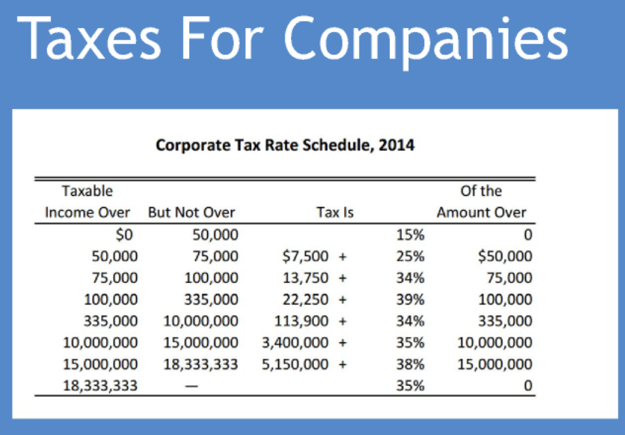

# 1-3:회사 창업, 비즈니스 프레젠테이션, 벤처 캐피털 파트1-2  

- [1-3:회사 창업, 비즈니스 프레젠테이션, 벤처 캐피털 파트1-2](#1-3회사-창업-비즈니스-프레젠테이션-벤처-캐피털-파트1-2)
  - [1.회사 창업](#1회사-창업)
  - [3. 개요, 최고 기업가의 자질](#3-개요-최고-기업가의-자질)
  - [4. 성공하는 회사 창업하는 법, 최고 기업가의 자질](#4-성공하는-회사-창업하는-법-최고-기업가의-자질)
  - [5. 회사와 가족을 법적으로 보호하는 법, 세금에 대해 알아보기](#5-회사와-가족을-법적으로-보호하는-법-세금에-대해-알아보기)
    - [개인\&회사에 대한 세금](#개인회사에-대한-세금)
    - [IP 지적 재산권 보호 3가지 방법](#ip-지적-재산권-보호-3가지-방법)
  - [6. 무료 200페이지 이상의 네트워킹 도서 첨부](#6-무료-200페이지-이상의-네트워킹-도서-첨부)
  - [7. 네트워킹하는 법, 일자리를 구하고 고객을 만나게 해 주는 미팅 잡는 법](#7-네트워킹하는-법-일자리를-구하고-고객을-만나게-해-주는-미팅-잡는-법)
    - [링크드인 네트워킹 노하우](#링크드인-네트워킹-노하우)
    - [추가 비디오](#추가-비디오)
  - [8. 사이드 노트: 반대자가 되어 여러분의 가치를 높이세요!](#8-사이드-노트-반대자가-되어-여러분의-가치를-높이세요)
  - [2.비즈니스 프레젠테이션, 매출을 올려 주는 유용한 팁](#2비즈니스-프레젠테이션-매출을-올려-주는-유용한-팁)
    - [스티브 잡스처럼 연설하는 법과 청중, 고객, 동료의 마음을 사로잡는 법](#스티브-잡스처럼-연설하는-법과-청중-고객-동료의-마음을-사로잡는-법)
    - [훌륭한 프레젠테이션의 예(대부분 믿을 수 없을 정도로 영감을 줍니다!):](#훌륭한-프레젠테이션의-예대부분-믿을-수-없을-정도로-영감을-줍니다)
  - [강의 3: 벤처 캐피털 파트1, 자금 조달하는 법](#강의-3-벤처-캐피털-파트1-자금-조달하는-법)
    - [벤처 캐피털이란 무엇인가, 자금 조달하는 법, 자문 위원회 구성하는 법, 네트워킹 팁](#벤처-캐피털이란-무엇인가-자금-조달하는-법-자문-위원회-구성하는-법-네트워킹-팁)
    - [두 가지 영업 기술](#두-가지-영업-기술)
    - [참고](#참고)
  - [강의 4: 벤처 캐피털 파트2, 여러분을 보호해 주고 수익을 올려 줄 안전/법적 장치](#강의-4-벤처-캐피털-파트2-여러분을-보호해-주고-수익을-올려-줄-안전법적-장치)
    - [이제 자금을 조달하고자 할 때 어떤 벤처 캐피털 회사를 노려야 하는지](#이제-자금을-조달하고자-할-때-어떤-벤처-캐피털-회사를-노려야-하는지)
    - [벤처 캐피털 회사는 계약을 어떻게 성사할까요?](#벤처-캐피털-회사는-계약을-어떻게-성사할까요)
    - [요약 - VC가 지원하는 회사](#요약---vc가-지원하는-회사)

---

## 1.회사 창업

## 3. 개요, 최고 기업가의 자질

1.열정 
>좋아하는 일을 직업으로 삼으면 일하는 날은 인생에서 단 하루도 없을것이다.  
- 공통점은 열정이다. 자신의 일을 사랑한다.  
- 일을 한다는 개념이 아니다.!  

2.Optimism  
> 자신이 뭐든 이룰 수 있다고 생각하는 사람  

3.Small companies win.  
> 작은 회사는 반드시 이길거라고 믿는다.  

---

## 4. 성공하는 회사 창업하는 법, 최고 기업가의 자질  

1.Networking  
>relationships are more important than product knowledge  

2.TAM  
>Total Adressable Market, TAM 최소 200억 시장 , 점유율 5% 차지 목표   

3.휼륭한 기업은 마켓팅 팀과 세일즈팀
- 기술이 뛰어나다고 이기는것이 아니다.  

--- 
## 5. 회사와 가족을 법적으로 보호하는 법, 세금에 대해 알아보기

1.비법인 기업 Proprietorship  
- 빠르게 세우며, 싸게 설립 가능  
- 소송 당하면 개인적으로 책임 져야 한다.  
- 수익없는 초기단계에서만 설립 할 것  
  
2.합명 회사 General Partnership   
- 빠르게 세우며, 싸게 설립 가능, 2인 이상  
- 여전히 개인이 책임, 소송 당하면 개인적으로 책임 져야 한다.  

3.합자회사 Limited Parternship  
- 싸게 설립, 제한된 책임, 2인 이상  
- 투자자들을 모집할 수 있다만, 그들은 돈만 주고 경영관여 X 및 책임도 없다.  

5.법인 Corporations  
- 가장 합리적인 구조, 매각하기 쉽다.  
- 이사회 = 주주와 투자자를 보호  

6.유한 책임 회사 LLC, Limited Liability Company  
- 많은 유형, 회사가 수익 발생하고 조금 규모가 있을때 LLC 설립  
- 법인보다는 자산이 낮다.  
- 고소를 당했을때 가족과 가족의 자산은 보호된다.  
- 1년에 800달러 이하 + 델라웨어주 선택 추천, 세법 유리  

### 개인&회사에 대한 세금   
  
- 세금 구간별 과세 표준이 다르다.  

  
- 회사의 순수익이 발생하면 세금이 부과  
- 수익금을 배당하면 배당금에 또 세금  

### IP 지적 재산권 보호 3가지 방법  

1.특허, 저작권, 상표  
특허
- 하나의 상품을에대해서 특허 신청 가능, 최소 100만원  
- 보통 1년 안에 특허가 나온다.  

트레이드 마크 TM
- TM: 브랜드 보호 목적이다. 몇개의 주에서만 보호 가능
- R: 브랜드 보호 목적이다. 모든 주에서만 보호 가능

저작권 Copyright C
- SW, 미디어, 음악 등 

  

2.기밀 유지 계약서, NDA

3.고용계약서  

- VC가 투자한 회사가 유니콘이 될 확률은 1538:1  

## 6. 무료 200페이지 이상의 네트워킹 도서 첨부

## 7. 네트워킹하는 법, 일자리를 구하고 고객을 만나게 해 주는 미팅 잡는 법  

### 링크드인 네트워킹 노하우  

네트워킹 
- 링크드인을 적극 활용한다. 성공확률 95%  
- 원하는 직장을 구하거나, 원하는 사람을 만나기 위한 스킬이다.  

공통점이 있는 사람들을 찾도록 필터를 걸어준다.    
- 뭄바이(우편번호) 반경 150km를 필터링 한다.  
- 콜드 이메일을 보내는데, 간단한 안부인사와 꼭 공통점을 하나 넣어준다.  
  - 같은 학교 출신, 같은 고향, 같은 직장 등  

### 추가 비디오  

[https://www.youtube.com/watch?v=zkTf0LmDqKI](https://www.youtube.com/watch?v=zkTf0LmDqKI)
- 대부분의 사람들은 ask 물어보지 않는다.  
- 무엇을 원하고 어떻게 원하는것을 다른사람으로부터 가져오는지 노력하지 않는다.

[https://www.youtube.com/watch?v=POKSiisnY1o](https://www.youtube.com/watch?v=POKSiisnY1o)
- 인생은 당신보다 똑똑하지 않은 사람들에 의해 만들어졌다는 간단한 사실 하나를 발견하면 인생은 훨씬 더 넓어질 수 있다.
- 그리고 그들을 이용할 수 있는 방법이 있다. 
- 한쪽을 뾰족한것으로 찌르면 다른 한쪽이 나오는데, 이를 가둘 수 있다. 

## 8. 사이드 노트: 반대자가 되어 여러분의 가치를 높이세요!   

일반인들과 반대로 생각하고 행동해라.    
- 모두가 두려워 할 때 매수하고, 모두가 매수할때 두려워 해라.  
- 모두가 같은 길로 가려할때, 다른 길을 찾아라.  

---

## 2.비즈니스 프레젠테이션, 매출을 올려 주는 유용한 팁

### 스티브 잡스처럼 연설하는 법과 청중, 고객, 동료의 마음을 사로잡는 법  

과한것 보다는 부족한것이 낫다.  
- 항상 심플해야 한다. PPT를 아주 간단하게 작성할 것, 최대 3가지만.  
- 내용 자체보다, 어떻게 전달하지가 중요  

영감을 주기, 열정을 보여주기  
- 경험을 전달하기  
- *절대로 대본을 외우지 말것  
- *PT는 연극과 같은 것 이다.  
- *열정 선언문 만들기 : (Apple) 우리는 우주에 흔적을 남기려고 태어났다.  
- 우리 vs 그들 이라는 워딩    
  - 대결 구도를 만들어서 충성심을 만들도록 한다.  

연습, 연습, 연습  
- 손을 자주 사용하고, 아이컨택을 해라  
- 수백번 연습해야 한다.  

ref
- 코난 오브라이언 다트머스 축사  
- Merly Streep 연설  

### 훌륭한 프레젠테이션의 예(대부분 믿을 수 없을 정도로 영감을 줍니다!):

Matthew McConaughey의 가슴에서 우러나오는 열정적이고 탁월한 연설을 소개합니다. www.tiny.cc/chris109

최고의 CEO와 기업가는 대개 최고의 프레젠테이션 기술을 갖추고 있습니다. 연습을 거치면 여러분도 기술을 크게 개선할 수 있습니다. 제 의견을 말씀드리자면 스티브 잡스는 역사상 가장 뛰어난 프레젠테이션 기술을 갖춘 사람입니다. 그도 처음부터 그렇진 않았습니다. www.tiny.cc/chris19

스티브 잡스의 생전 마지막 프레젠테이션 비디오와 비교해 보십시오. 얼마나 이해하기 쉽게 말하고 얼마나 슬라이드가 간단한지 확인해 보십시오(간결할수록 좋습니다... 연습만 하면 여러분도 스티브 잡스처럼 능숙하게 프레젠테이션을 할 수 있다는 점을 명심하시기 바랍니다). www.tiny.cc/chris20

레이건은 대본 없이 공산주위를 종식시킨 이 멋진 두 마디를 만들어냈습니다. “이 문을 여십시오”. “이 장벽을 허무시오”. www.tiny.cc/chris22

또한 회사는 프레젠테이션이나 제품 광고에서 공공의 적을 찾으려 해야 합니다. 이 비디오에서 선수는 애플을 나타내고 다른 모든 인물은 IBM을 나타냅니다. www.tiny.cc/chris23 ....1984년에 이 광고를 제작하는 데는 100만 달러가 들었고 슈퍼볼 경기에서 1분밖에 공개되지 않았습니다. 이 광고의 감독은 글래디에이터의 감독이기도 한 리들리 스콧이었습니다.

2007년 애플은 당시 경쟁사였던 마이크로소프트를 희화하기 위해 적절한 유머 전략을 사용했습니다(이 비디오의 등장인물은 빌 게이트와 닮은 꼴입니다): https://www.youtube.com/playlist?list=PLfU3qsYRecFQoKItxbFNZ6ChVmm54iLBB

메릴 스트립은 프레젠테이션에서 놀라울 정도로 명쾌한 (동시에 유머러스한) 모습을 보여줍니다. www.tiny.cc/chris27

다트머스에서의 코난 오브라이언이 한 축사도 확인해 보십시오. 그는 프레젠테이션에서의 유머(특히 자조) 활용에 대한 시금석입니다. www.tiny.cc/chris29

단순함에 대한 애플과 스티브 잡스의 이 비디오는 매우 큰 영감을 줍니다. https://youtu.be/dMBW1G4U54g

정치적 성향과 무관하게 많은 사람 앞에서 발표하는 데 있어 오바마의 역량은 존경할 만합니다. 손을 어떻게 사용하는지, 어떻게 멈추는지, 어떻게 가능한 한 많은 사람과 눈을 마주치려 하는지, 그리고 어떻게 가슴에서 우러나온 말을 하는지 눈여겨보십시오. www.tiny.cc/chris33

---

## 강의 3: 벤처 캐피털 파트1, 자금 조달하는 법

이제 0-1년 차는 졸업했습니다. 프레젠테이션을 훌륭하게 해내 시드 머니를 모았습니다.!  

### 벤처 캐피털이란 무엇인가, 자금 조달하는 법, 자문 위원회 구성하는 법, 네트워킹 팁  

투자할때 가장 중요한 것 : 매우매우 중요   
- 비즈니스 모델 혹은 상품을 보는 것이 아니다.  
- 말을 타는 기수를 봐야 한다. 경영진을 봐야 한다.  
- 그 회사의 경영진이 훌륭한지 봐야 한다.  
- 1.과거 투자 회수 경험이 있는가 ?
  - 없다면 주변에 굉장히 유능한 자문 위원이 있는가?  
  - 링크드인에서 구글에 다니면서 동문인 사람을 찾아 미팅을 잡아라.  
- 2.직원들이 경영진에게 만족하고 같이 일하는것을 좋아하는가?  
  - 직원들의 평가를 보면 안다.  

VC기업이 돈을 버는 2가지 방법  
- 1.투자하는 돈의 2퍼센트에 해당하는 운용 수수료를 매년 받는다.   
- 2.이익의 20프로를 성과 보수로 받는다.  
- 3.회사가 상장하거나 매각되면 투자액을 회수 할 수 있다.  

Investment Stages  
- 1.Seed 단계 ( Pre Seed)  
- 2.Venture Capital 단계
  - A Round
  - B Round  
  - C Round
- 3.IPO 단계 : 7~8년이 걸린다.  

VC Captial 기대 수익  
- 5년 안에 500% 수익을 기대한다. 매우 하이리스크 하이리턴이다.  
- 장기적인 안목을 길러야 한다. 아마존과 링크드인을 볼 수 있어야 함.  

How to pitch to a VC  
- 30초, 5분, 30분 짜리를 만들어야 한다.  
- 초등학생도 이해할 수 있을 정도로,  
- 제품을 보여주고, 심플하게, 열정과 영감, 흥미  

### 두 가지 영업 기술  

1.구매전환이 되었다고 생각하면, 더 이상 말하지 않기  
- 왜냐고요? 이미 사려고 마음먹었는데 계속 얘기하면
- 고객은 여러분의 그 필사적인 행동을 보고
- 그 뭔가 잘못됐다고 느끼기 때문이죠, 너무 과해지는 거예요
- 판매가 성사됐다고 느끼면 말을 그만 하기  

2.두 번째는 고객의 흥미가 떨어졌다는 확신이 들기 전까지는 계속 판매하는 겁니다  
- 흥미를 보이면 그만 말하고  
- 흥미가 있는지 확실하지 않다면 계속하라는 거예요.  
- ‘됐어요’라는 말을 듣기 전까지 계속 판매하세요.  

### 참고  

CEO나 기업가가 지지할 만한 사람인지 평가할 방법이 무엇일까요? 경영진에 대한 직원의 리뷰를 www.Glassdoor.com에서 읽어볼 수 있습니다.

이 사람이 벤처 자금사와 고액 투자자에게 프레젠테이션하는 방식과 다르게 벤처 자금 회사는 주로 탁월한 경영진을 보유하는 데 집중합니다. 이 비디오에서 안 좋은 예에 면밀히 집중하세요. https://www.youtube.com/watch?v=48TR0vUPQCs 

## 강의 4: 벤처 캐피털 파트2, 여러분을 보호해 주고 수익을 올려 줄 안전/법적 장치

벤처 캐피털의 역사
- 첫 번째는 전쟁이고
- 두 번째는 평화입니다
- 세 번째는 전쟁과 평화인데요

1.전쟁  
- 네트워크, GPS, 암호화기술, DB 등등  
- 전쟁을 위해, CIA VC의 투자로 기술 개발이 시작  

2.평화  
- 전쟁 대신 사랑을  
- 오픈소스 프로젝트 탄생  
- 연구 자금 50%가 군사 목적 투자,  
- 스탠퍼드 대학교 학생들은 운동, 오픈소스 
- 스탠퍼드 대학의 학생과 교수들은 자신들만의 비즈니스 모델을 만들고 그로부터 수익을 얻었어요  

다르게 생각해라.  
- 서쪽 해안가 사는 사람들은 실패하는 것도 멋있다  
- 부모님이 데이트할 때 어떤 사람이 저희 엄마한테 부끄러운 줄 알라고 말했대요. 다른 인종끼리 결혼하는 걸 그런 식으로 봤던 거죠  

3.전쟁과 평화  

창업자가 떠난 큰 회사는 더는 혁신하지 못해요
- 왜 그럴까요?
- 만약 여러분이 큰 회사의 임원인데 창업자가 세상을 바꾸고 싶다면서 회사를 나갔다고 생각해 보세요
- 남은 임원들은 회사 내 사다리를 오르는 데만 관심 있고 사내 정치가 판을 치겠죠 임원들은 사다리만 올랐어요 
- 정상에 오르는 것만 신경 썼죠, 돈을 많이 벌려고요  

페이팔 마피아  
- 회사를 키우고 판매해본 경험이 중요한 이유  

- 다른 사람들이 욕심을 낼 때는 두려워하고 다른 사람들이 두려워할 때는 욕심을 내라 낮은 값에 사서 높은 값에 팔라는 말이에요

### 이제 자금을 조달하고자 할 때 어떤 벤처 캐피털 회사를 노려야 하는지  

- 어떤 라운드에 전문인 VC 인지 선택  
- 어떤 도메인에 전문인 VC 인지 선택  
- 여러분 회사에 투자하면 이사진이 되어 경영에 간섭하고 참여하게 되죠 평판을 아는 게 참 중요하고요
- 목표 투자 수익률이 얼마인지도 알아야 해요

이 부분을 강조하고 싶은데요, 투자자들은 굉장히 철학적이란 걸 여러분이 알아야 해요  
- 성장 투자자와 가치 투자자로 나뉜다. 
- 무슨 뜻일까요? 성장 투자자는 투자한 회사가 빨리 성장하길 바라요, 현재의 기업 가치에는 전혀 관심이 없죠  
- 현재 회사 가치보다 큰돈을 버는 거죠, 가치 투자자들은 테크 기업에 투자는 잘 못합니다 성장 투자자들은 잘하죠  

### 벤처 캐피털 회사는 계약을 어떻게 성사할까요?
- 네트워킹, 네트워킹, 바로 네트워킹입니다
- 관계 맺기가 중요하다고 여러 번 강조했죠
- 정말 중요해요, 관계를 맺는 게 상품에 대한 지식보다 중요해요, 네트워킹을 통해서 최고의 계약을 성사시킬 수 있어요  

누군가 여러분에게 상장 기업이든 비상장 기업에 투자할 좋은 기회가 있다고 제안한다면  
- 한번 생각해 보세요, 왜 내게 이런 행운이 온 거냐고요
- 왜 이런 기회가 저절로 찾아온 건지 의심하세요
- 보통은 아무도 투자하지 않은 건일 거예요 그렇죠? 
- 여러분이 마지막일 겁니다 그러니 의심하세요  

### 요약 - VC가 지원하는 회사  

1.탄탄한 경영팀 ( 엑싯 경험 )   
2.시장규모가 큰 회사 TAM, 최소 200억 달러  
3.강력한 신디케이트, 성공한 투자자
4.혁신적인 비즈니스 모델  
