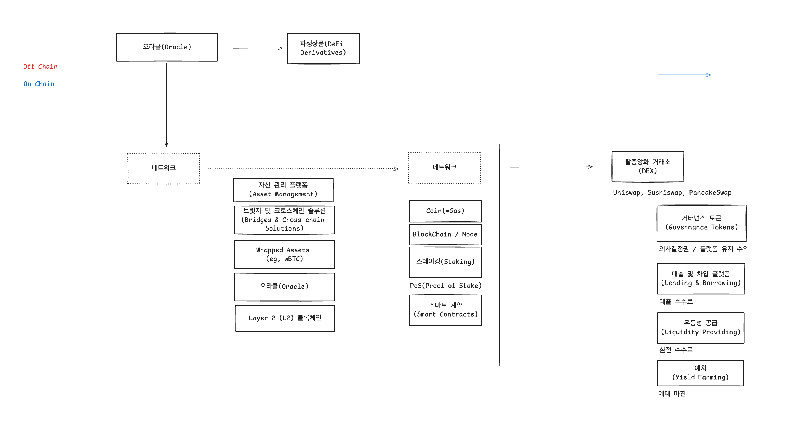
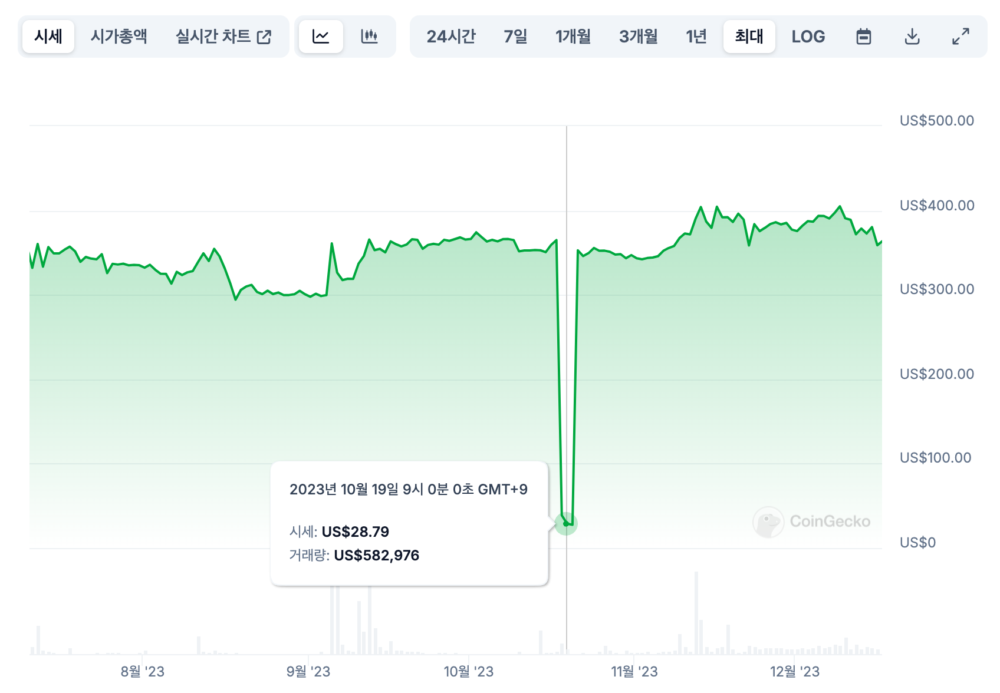

# Beefy 소개서 1편  

- [Beefy 소개서 1편](#beefy-소개서-1편)
  - [DeFi란?](#defi란)
  - [1.비피(Beefy)란 무엇인가요?](#1비피beefy란-무엇인가요)
  - [2.How to set up a wallet](#2how-to-set-up-a-wallet)
    - [MetaMask](#metamask)
    - [Trust Wallet](#trust-wallet)
    - [Rabby Wallet](#rabby-wallet)
  - [3.Risk Deepdive : Multichain 프로토콜의 붕괴](#3risk-deepdive--multichain-프로토콜의-붕괴)
  - [4.Introduction to Beefy](#4introduction-to-beefy)
    - [비피(Beefy)란 무엇인가요?](#비피beefy란-무엇인가요)
    - [비피의 역사](#비피의-역사)
    - [비피의 독창성은 무엇인가요?](#비피의-독창성은-무엇인가요)
    - [다른 체인에서의 자동 복리](#다른-체인에서의-자동-복리)
  - [Beefy Protocol](#beefy-protocol)
    - ["프로토콜"이란 무엇을 의미하나요?](#프로토콜이란-무엇을-의미하나요)
    - [비피 프로토콜의 구조](#비피-프로토콜의-구조)
    - [프로토콜은 어떻게 작동하나요?](#프로토콜은-어떻게-작동하나요)

## DeFi란?  

디파이 생태계  

디파이(DeFi, Decentralized Finance)는 탈중앙화 금융    
- 예금, 대출, 결제 등의 핀테크를 블록체인과 스마트 컨트렉으로 구현한 것 

https://excalidraw.com/#json=gVB7i7R9YS_c9UtoU4x11,jA5tKZXPUZMQgiJmZqQSLw

- 탈중앙화 거래소(DEX): 중앙 기관 없이 암호화폐를 거래할 수 있는 플랫폼이에요. 대표적으로 Uniswap, Sushiswap 등이 있어요. 
- 대출 및 차입: 스마트 계약을 통해 담보를 제공하고, 이자를 받거나 대출을 받을 수 있어요. 대표적으로 Aave, Compound 등이 있어요. 
- 스테이킹(Staking): 보유한 암호화폐를 네트워크에 예치하고, 그 대가로 보상을 받는 방식이에요.

## 1.비피(Beefy)란 무엇인가요?  

멀티체인 수익률 최적화, 안전과 효율성을 염두에 두고 23개 체인에서 가장 높은 APY를 획득하세요.

- 비피(Beefy)는 탈중앙화된 멀티체인 수익 최적화 플랫폼 
- 복리 이자 받을 수 있음. 
- 비피는 스마트 계약에 의해 실행
- 다양한 유동성 풀(LPs), 자동화된 시장 메이킹(AMM) 프로젝트, DeFi 생태계의 기타 수익 농사

비피의 주요 제품은 "Vaults"
- 탈중앙화 거래소에서 발생하는 임의의 농사 보상 토큰을 다시 처음 예치한 자산으로 복리화
- 자산이 어떤 계약에도 잠기지 않고, 언제든지 자산을 인출 가능.  
- 신뢰할 수 있는 중개인이 필요 없다. ( 사용자가 100% 통제권을 가진다. )  

$BIFI란 무엇인가요?  
- $BIFI 토큰은 비피 DAO의 거버넌스 토큰이에요.
- 이 토큰의 유틸리티는 두 가지예요
- 첫째, 토큰 보유자는 DAO의 중요한 거버넌스 결정에 투표할 권리 
- 둘째, 비피 프로토콜 내 Vault에서 생성된 모든 수익의 일부가 토큰 보유자 인센티브 프로그램으로 배분.   
  - 인센티브는 정기적으로 프로토콜의 BIFI Pool과 BIFI Vault를 통해 지급되며, 참여하려면 $BIFI 토큰을 예치해야 해요.  

- $BIFI의 공급량은 80,000 토큰으로 한정  
- 발행이나 소각 기능은 없다. 비피 DAO는 $BIFI 토큰을 발행하거나 거래하지 않는다.  
- $BIFI는 바이낸스, 크립토닷컴, 유니스왑과 같은 제3자 거래소를 통해서만 획득 가능  
- 가격 및 공급량 확인 : https://www.coingecko.com/ko/%EC%BD%94%EC%9D%B8/beefy  

## 2.How to set up a wallet

**지갑 설정 방법**  
DeFi(탈중앙화 금융)에서는 암호화폐의 진정한 소유자가 바로 여러분이에요. 여러분의 자산은 여러분이 직접 관리하는 지갑에 보관돼요. 무엇을 하기 전에 항상 다음의 안전 수칙을 준수하는 것이 중요해요:

- 절대로 복구 구문을 다른 사람과 공유하지 마세요. 어떤 상황에서도 예외는 없어요.
- 새 기기에 지갑을 가져올 때를 제외하고는 복구 구문을 웹사이트나 앱에 입력하지 마세요.
- 가짜 웹사이트, 가짜 경품 이벤트, 또는 기타 악의적인 행위를 조심하세요.
- 지갑의 최신 버전을 공식 출처에서만 다운로드하고 설치하세요.
- 선호하는 지갑의 설정 가이드를 신중하게 따르세요.
- 복구 구문을 안전하게 백업하고, 가능하면 오프라인에 보관하세요.

### MetaMask  
MetaMask는 매우 인기 있는 브라우저 기반 지갑 플러그인
- 기본적으로 이더리움을 지원하며, BNB 체인, 아발란체, 폴리곤과 같은 이더리움 호환 블록체인도 추가 가능.
- MetaMask는 Ledger와 Trezor 같은 하드웨어 지갑과도 호환돼요.
- [MetaMask 다운로드](https://metamask.io/download)

### Trust Wallet  
Trust Wallet은 인기 있는 모바일 지갑이에요. 여러 블록체인 네트워크가 미리 설정되어 있어서 사용자 친화적이며, DApp 브라우저도 내장되어 있어요. 그러나 MetaMask만큼 설정을 세밀하게 할 수는 없어요.  
- [Trust Wallet 다운로드](https://trustwallet.com/)

### Rabby Wallet  
Rabby는 여러 EVM 및 비-EVM 체인을 지원하는 오픈 소스 비수탁 암호화폐 지갑이에요.  

- [Rabby 다운로드](https://rabby.io/)

## 3.Risk Deepdive : Multichain 프로토콜의 붕괴      

BIFI라는 DAO 토큰이 있어요. 이 토큰의 가격이 2023년 10월에 -90% 씩 떨어졌어요. 왜 그랬을까요?

1.Multichain 프로토콜의 붕괴  
- Beefy Finance는 다양한 체인에서 운영되기 위해 Multichain의 브리징 서비스를 사용  
- 이 Multichain이 기술적 문제와 주요 인물의 실종으로 인해 서비스를 중단  
- Beefy Finance는 새로운 ERC-20 토큰으로의 전환을 결정  

  

## 4.Introduction to Beefy

### 비피(Beefy)란 무엇인가요?  

비피(Beefy)는 사용자가 자동 복리(compounding)의 마법을 통해 자신이 좋아하는 암호화 자산을 더 많이 얻을 수 있도록 돕는 탈중앙화 금융(DeFi) 수익 최적화 프로젝트.  
- 비피(Beefy) = 복리 자동 수익 + 탈중앙화    
- 오픈 소스 DeFi 애플리케이션은 허가가 필요 없고 신뢰할 수 있는 중개인이 필요 없도록 설계. 
- ( 모든 코드를 공개하고 블록체인에서 검증 가능 ) -> ( 누구나 DeFi가 어떻게 작동하는지 확인하고 서비스의 안전성을 신뢰할 필요 없이 직접 상호작용 )

비피 프로토콜은 검증된 Vault 사용  
- 1.전략 계약을 통해 유동성 풀(LP), 자동화 시장 조성자(AMM), 및 기타 수익 농사 기회로부터 사용자가 받을 수 있는 보상을 최대화
- 2.비피는 보상을 자동으로 청구, 교환, 재예치하여 자동 복리를 통해 기하급수적인 수익을 창출.
- 3.가스 비용을 공유하고 거래량을 집계함  

### 비피의 역사

비피는 2020년 9월에 4명의 창립팀이 이더리움 기반 DeFi 프로젝트의 자동 복리 기술을 더 저렴한 비용의 체인으로 가져오기 위해 함께하면서 탄생했어요. 
- 첫 번째 Vault 세트는 2020년 10월 8일 BNB 체인에서 라이브되었으며, 이를 통해 비피는 해당 체인의 첫 수익 최적화 프로젝트가 되었어요.
- 1년이 채 되지 않아 비피는 총 예치 자산(TVL) 8억 달러를 관리하게 되었고, 시가총액 1억 달러를 돌파. 
- 2022년 말까지 비피는 10개의 다른 블록체인에서 라이브되었고, 그로부터 1년 후에는 18개의 블록체인에서 활동하고 있어요.

### 비피의 독창성은 무엇인가요?
비피는 몇 가지 중요한 측면에서 다른 DeFi 수익 최적화 및 애그리게이터와 차별화돼요:

- 비피의 Vault는 주로 "단일 전략"에 집중해요. 이는 여러 기회를 분산시키기보다는 하나의 수익 농사 기회를 최적화하는 방식이에요.
- 안전성은 비피의 최우선 순위예요. 모든 제품은 엄격한 안전 기준인 **SAFU Standards**를 통해 운영돼요.
- 비피 프로토콜은 플랫폼 수익을 직접 $BIFI를 스테이킹한 사용자에게 돌려줘요.

### 다른 체인에서의 자동 복리  

비피는 이더리움보다 더 높은 거래 속도와 낮은 가스 비용을 활용하기 위해 자동화된 수익 농사 기술을 다양한 블록체인에 전파하려는 목표로 만들어졌어요.

- 이더리움에서는 이벤트 타이밍이 수익성을 보장하는 데 중요 + 이더리움과 같은 체인에서는 이동 비용이 비싸기 때문에 신중히 고려해야 해요. 
- 다른 체인에서는 저비용 복리의 빈도가 수익률에 큰 영향을 미쳐요. 

## Beefy Protocol

비피는 자율적이고 탈중앙화된 수익 최적화 프로토콜이에요. 
- 비피 프로젝트와 DAO가 프로토콜의 운영과 정체성에 중심적 역할을 하지만, 실제로는 이 프로토콜은 이러한 개인들과 전혀 무관하게 완전히 독립적으로 작동해요. 
- 이 프로토콜은 다른 모든 이해관계자가 떠난 후에도 블록체인에서 영구히 계속 작동할 것입니다(비록 그 시점에서 많이 손상되더라도).

### "프로토콜"이란 무엇을 의미하나요?  

비피 프로토콜의 핵심은 블록체인에 있는 여러 Vault와 관련된 스마트 계약들의 집합 
- 비피의 스마트 계약 
  - 1.사용자의 예금을 받아 자동화된 수익 농사 과정에 자금을 투입 
  - 2.수수료를 다양한 온체인 이해관계자들에게 지급  
  - *모든 지원 이해관계자가 이를 유지하지 않더라도 프로토콜은 자율적으로 운영됩니다.  

### 비피 프로토콜의 구조

  
비피 프로토콜의 중심에 있는 스마트 계약이 유지되고 일반 사용자에게 접근 가능하려면 추가적인 서비스가 필요
- 이러한 서비스는 일반적으로 계속적인 인간의 개입이 필요하며, 비피의 기여자 팀에 의해 수행돼요. 

- 1. 기존 스마트 계약의 유지관리: 취약하거나 오작동하는 계약을 일시 중지하거나 성능을 개선하기 위해 실시간 변경 또는 업그레이드를 수행하는 것.
- 2. 새로운 계약의 개발 및 배포: 기존 프로토콜을 대체하거나 보완하기 위해 새로운 계약을 개발하고 배포.  
- 3. 기능적 웹 애플리케이션 UI 제공: 사용자가 스마트 계약에 접근하고 그들의 작동에 대한 실시간 정보를 볼 수 있도록 돕는 기능적 웹 애플리케이션 제공.
- 4. 실시간 서버 및 데이터베이스 유지 관리: 애플리케이션 프로그래밍 인터페이스(API)와 같은 서비스와 관련된 모든 측면의 프로토콜에 관한 필요한 데이터를 저장하고 배포하기 위한 실시간 서버 및 데이터베이스 유지 관리.
- 5. 자동 계약 상호작용 운영: 비피의 Vault에서 수익성 있는 복리 이벤트를 감시하고 트리거하는 봇과 같은 자동 계약 상호작용을 운영.
  * 비록 프로토콜이 위의 서비스 중 하나 없이 일정 기간 동안 운영될 수 있지만, 이러한 모든 서비스는 비피 프로토콜의 스마트 계약을 안전하고, 운영 가능하며, 접근 가능하고 이해할 수 있게 유지하기 위해 필수적이에요.  

### 프로토콜은 어떻게 작동하나요?
비피 프로토콜의 전반적인 과정과 흐름은 다음과 같아요:  

  

프로토콜은 자금을 다양한 지갑과 스마트 계약을 통해 전달하여 두 가지 핵심 기능을 수행해요:

자동화된 수익 농사 수행 및 최적화: 사용자가 직접 동일한 과정을 수행하는 것보다 비피를 통해 더 많은 수익을 얻을 수 있도록 수익 농사를 자동화하고 최적화해요.
온체인 이해관계자들에게 보상 제공: 프로토콜의 지속적인 운영을 지원하고 촉진하는 이해관계자들에게 보상과 인센티브를 제공해요.
수익 농사 기능은 어떻게 작동하나요?
수익 농사 과정의 핵심 요약은 전략 페이지에 제공되어 있으므로 여기에서는 반복하지 않을게요.

수익 농사 과정은 사용자의 예금과 그 예금을 활용한 농사를 통해 온체인 수익을 생성하고, 농사 보상을 원금 자산으로 다시 교환하는 데 중점을 둬요.

이해관계자 인센티브 기능은 어떻게 작동하나요?
이해관계자 인센티브 기능은 프로토콜 및 전체 프로젝트의 개발과 유지 관리, 기술적 기여와 비기술적 기여를 촉진하고 장려하는 것을 목표로 해요.

프로토콜의 이해관계자는 누구인가요?
프로토콜은 다음과 같은 이해관계자를 식별하고 이들과 상호작용하며, 이들의 이익과 필요를 지속적으로 균형 있게 조정해요:

사용자: 사용자들은 프로토콜의 주요 수혜자로, 이 서비스를 즐기고 혜택을 받는 사람들이에요.
토큰 보유자: 토큰 보유자들은 프로토콜의 2차 수혜자로, 비피 DAO와 그 자산 및 운영을 통제하며, 따라서 프로토콜이 생성한 수수료에 대한 권리를 가지고 있어요.
기여자: 기여자들은 프로토콜의 마지막 핵심 수혜자 그룹으로, 흥미롭고 수익성 있는 작업을 통해 혜택을 누려요.
이해관계자의 이러한 다른 범주들은 종종 겹쳐지며, 일반 사용자들이 토큰 보유자나 기여자가 되기도 하고 그 반대도 성립돼요. 모든 이해관계자 그룹은 비피 커뮤니티를 크게 반영해요.

비피 DAO와의 차이점은 무엇인가요?
비피 DAO는 비피의 조직 형태로, 기여자, 회원 및 (덜 중요한 수준에서) 커뮤니티를 포함해요. 프로토콜이 DAO 없이도 생존할 수 있는 것처럼, DAO도 프로토콜과 독립적으로 존재하며, 자체적인 문화, 관행, 자산 및 활동을 가지고 있어요.

DAO는 프로토콜을 유지할 주요 책임을 지고 있지만, 사용자는 DAO의 통제 영역과 프로토콜의 독립적인 영역을 명확히 구분해야 해요. 예를 들어, 사용자가 비피 프로토콜의 변경할 수 없고 독립적인 스마트 계약과 상호작용하고, 그 과정에서 자금을 잃어버리게 되면, DAO가 그 자금을 회수할 권한이나 능력이 없는 경우가 많아요. 따라서 프로토콜을 사용할 때 주의가 필요하며, 모든 사용자는 일반적으로 이러한 상호작용을 관리하기 위해 비피의 프론트엔드 웹 애플리케이션을 사용하는 것이 좋습니다.

