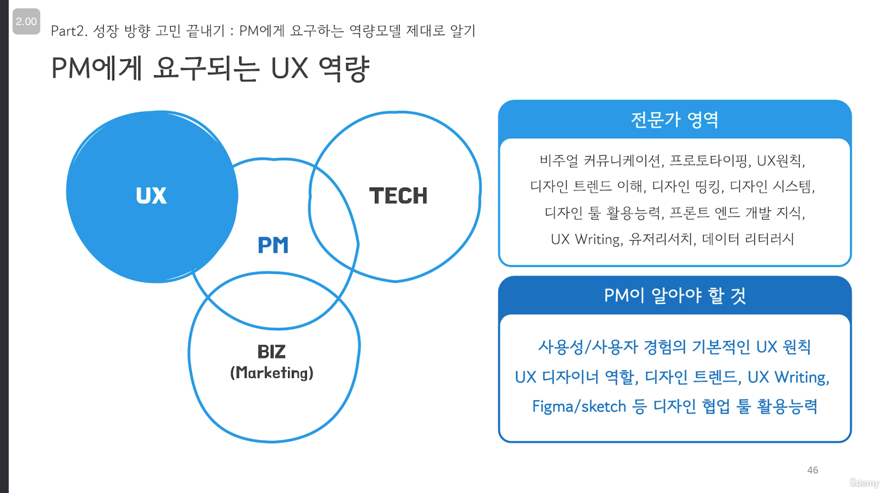
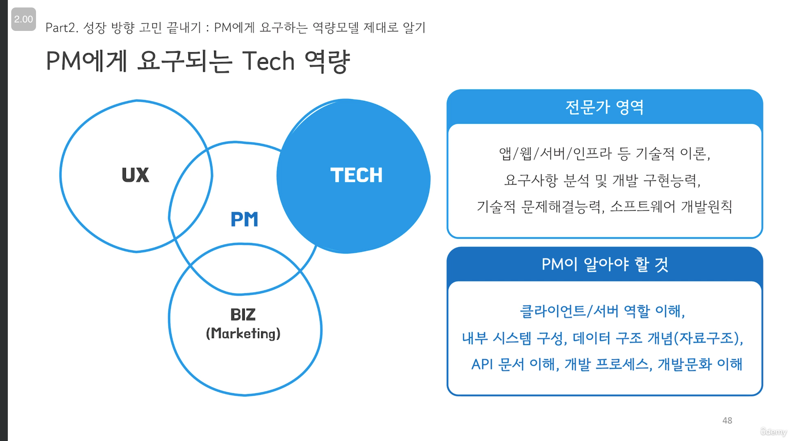
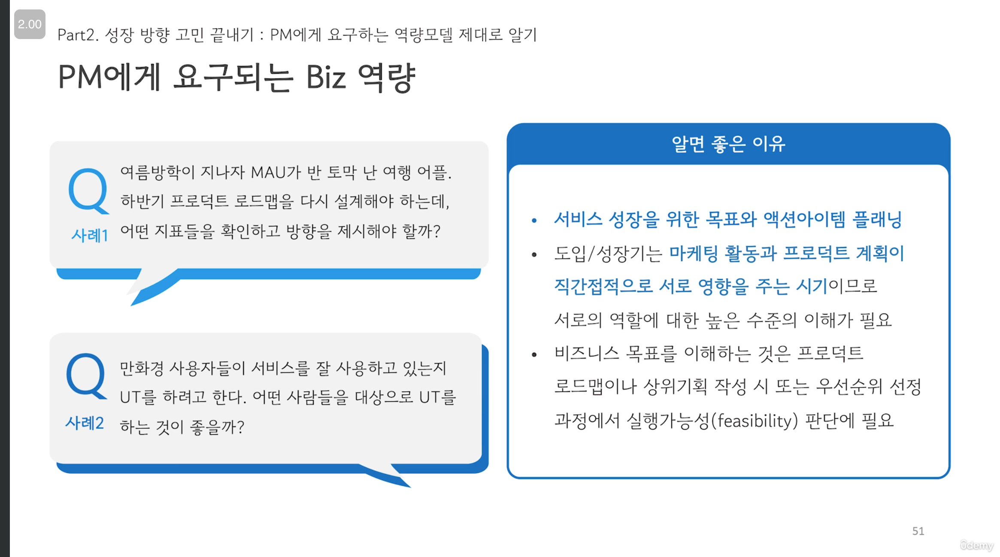
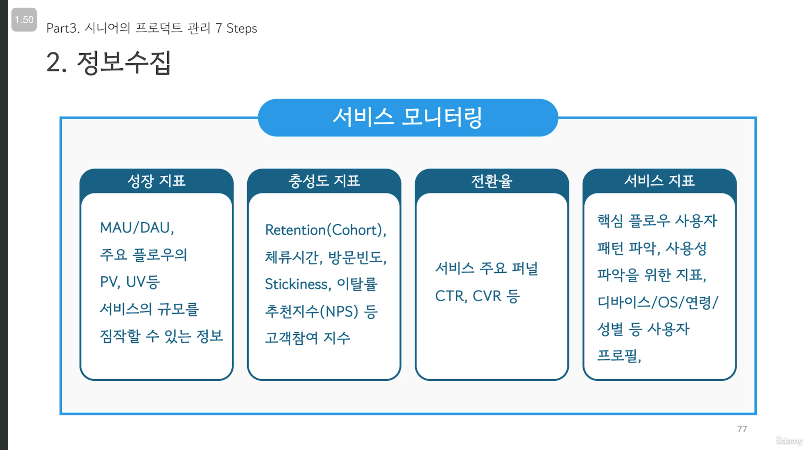
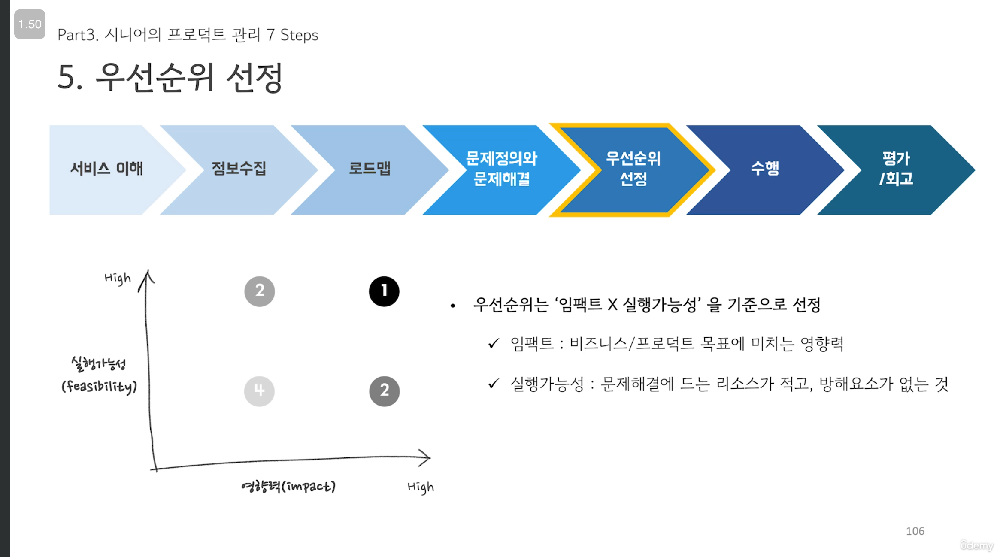
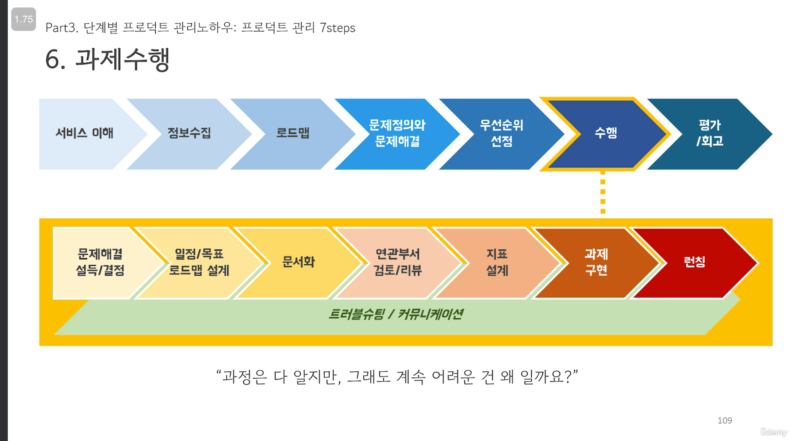
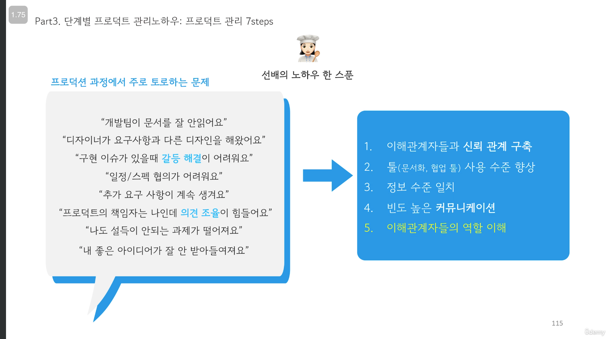
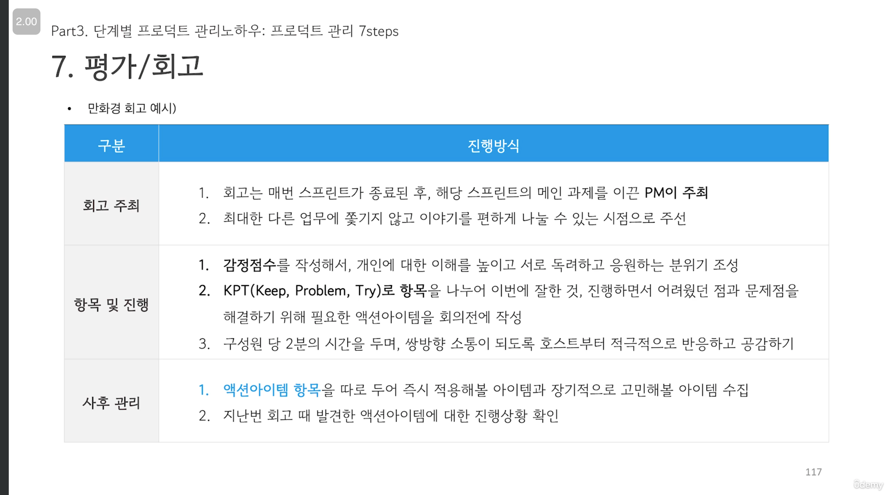

# Senior Product Manager RoleModel  -

- 3-5년차 PM, 이제 그만 '주니어' 타이틀을 벗어던지고 싶다면? 아직 1-3년차 PM이지만 고속성장을 하고 싶다면? 저와 함께 성장 전략을 찾아보아요. 

## Part1. 제품수명주기(PLC)와 PM의 역할
2. Who we are?
3. What we do?

## Part2. 성장방향 고민 끝내기

### 4. 역량모델 제대로 알기

  
    

✓ 도입기 vs 성숙기 어느 단계의 서비스에서 일하는 것이 나의 성향과 맞는지?
✓ 검색, 주문, 광고, 전시, 클레임 등 특정 도메인 전문가로 성장하고 싶은 지?
✓ 이커머스, 컨텐츠, 커뮤니티, 페이먼츠 등 산업군에 대한 전문성을 키우고 싶은 지?
✓ 제품 성장전략을 위한 역량으로 어떤 분야를 공부하고 싶은 지?
- 비즈니스 관점의 가치확장 vs 데이터 관점의 분석/최적화  

### 5. 역량성장 로드맵 그리기

    

    
    
    
    
    
    
    
    
    
    
    
    
    
    

## Part3. 시니어의 프로덕트 관리 7 Steps  

## 1.서비스 이해   

프로덕트 이해
- [ ] 서비스 핵심가지 확인하기
- [ ] 주요 사용자 집합의 유저 저니 맵 그리기
- [ ] 서비스 백엔드 구조 확인하기
- [ ] 접근할 수 있는 데이터 종류와 어드민을 확인하고, 팀의 KPI와 중요하게 다루는 지표 확인하기 
- [ ] 중장기 프로덕트 로드맵 확인하기 

사용자 이해
- [ ] 사용자 향 이해관계자 지도 그리기
- [ ] 사용자 향 이해관계자가 느끼는 프로덕트의 니즈와 페인포인트 확인하기

이해관계자 협업구조 파악
- [ ] 프로덕트 배포주기와 프로세스 확인하기
- [ ] 프로덕트 담당자들의 역량과 동기부여 요소 확인하기
- [ ] 연관된 도메인이나 단계별 의사결정 권한을 갖고 있는 담당자 확인
- [ ] 기획-디자인-개발-OA 단계에서 반복되는 비효율은 없는지 확인하기

이럴 때 시도 해보세요  
✓ 새로운 프로젝트나 새로운 프로덕트를 만났을 때,   
✓ 조직이 자주 변경되고 새로운 사람이 들어오는 시기에   
✓ 워크샵처럼 하거나, 온보딩 문서로 작성 

## 2.정보수집  

2.1 리서치  
- 사용자 조사  
- 경쟁사/산업동향  
- 벤치마킹 서비스  

2.2 사용자 보이스  
- 사용자 VOC  
- 내부고객 VOC  
- 채널 모니터링   

2.3 데이터   
- 서비스 모니터링    

  

1.성장 지표
- MAU/DAU  
- 주요 플로우의 PV, UV등 서비스의 규모를 짐작할 수 있는 정보

2.충성도 지표
- Retention (Cohort),체류시간, 방문빈도, Stickiness, 이탈률 추천지수(NPS) 등 고객참여 지수

3.전환율
- 서비스 주요 퍼널
- CTR, CVR 등

4.서비스 지표
- 핵심 플로우 사용자 패턴 파악, 
- 사용성 파악을 위한 지표
- 디바이스/0S/연령/ 성별 등 사용자 프로필

  

## 3.로드맵   

비즈니스 로드맵(OKR 등)과 프로덕트 로드맵을 일치시키는 과정  
- 지속적으로 회사의 비즈니스와 얼라인을 시켜야 한다.  

  

## 4.문제정의 및 문제해결   

문제의 종류 :
1. 탑다운으로 부여 받은 문제
2. 유관부서에서 전달받은 문제
3. PM이 바텀업으로 도출한 문제

PM의 역할  
1. 문제정의를 통해 문제의 선명도 증대 : WHY를 물어보기  
2. 문제를 해결해야 하는 이해관계자가 문제를 동일하게 바라보도록 커뮤니케이션 : 문서화/근거마련/리뷰/설득/공감대형성  
3. 기대상태에 대한 정량/정성적 목표설정  

   

  
문제 정의에 대해서 **이거 왜 하는 거지** 라고 물어보기  
- 문제 정의에 따라서, 해결방법이 정말 다양함을 알게된다.  

문제 해결 방법  
- 1.Tech  
- 2.UX  
- 3.운영(Biz)  

팁  
- 만약 다른 구성원들이 보유한 판단근거나 정보가 PM의 것과 다른 경우, 또는 아직 구성원간 신뢰를 쌓지 못한 경우 등 문제해결 방법에 대해 이견은 언제든 생길 수 있으니 열린 마음으로 대화하세요!
- 문제해결 과정에서 설득/협상 등의 스킬이 많이 필요하니 커뮤니케이션 하드 스킬도 키우면 좋습니다. 

## 5.우선순위 선정   

    

우선순위 점수  
- 1.ROI (Biz Impact)  
- 2.Resource (Feasibility, Blocker)  

임팩트 추정 질문  
1. 사업목표 달성) KPI 달성에 직접적으로 영향을 미치는 지표인가?  
2. 사용자 만족도 상승) 직접적으로 영향을 받는 사용자의 수는 얼마나 되는가? 해당 고객은 얼마나 중요한 사용자인가?  
3. 업무효율성 강화) 실제로 절감되는 운영효율 또는 시스템적 영향도는 얼마인가?  

실행 가능성 추정  
1. 조직의 현재 목표에 부합하는 과제인가?  
2. 법무/정보보안 등 내부 리스크와 사용자/공급자 등의 외부 리스크를 확인하여 방해요소가 없는가?  
3. 서비스 구축 과정에서 리소스 확보나 기술난이도에 대한 구현측면의 어려움이 없는가?  
4. 비용이나 예산 측면에서 과제수행에 필요한 재원이 확보되어 있는가?  

## 6.수행  

    
     
     

## 7.평가/회고  

정량적 평가 : 보고  
- 목적/목표에 따라 사용자들의 반응을 확인할 수 있는 지표나 서비스 모니터링이 필요하다.  
- 수집된 정보를 통해 발견한 인사이트를 이해관계자에 전파하여 향후 계획 수립을 돕는다.   
- 상위보고의 경우 활용의도에 따라 스토리라인을 구성해야 하는 등의 작성요령이 있으며, 하드 스킬 로써 역량강화가 필요하다.  

정성적 평가 : 회고  
- 스프린트 종료나 배포완료 등 마무리 시점에 구성원들과 함께 잘했던 부분과 아쉬웠던 부분을 확인한다.  
- 회고를 통해 프로덕트 관리 프로세스를 개선할 수 있는 실질적인 액션아이템을 도출한다.  

     