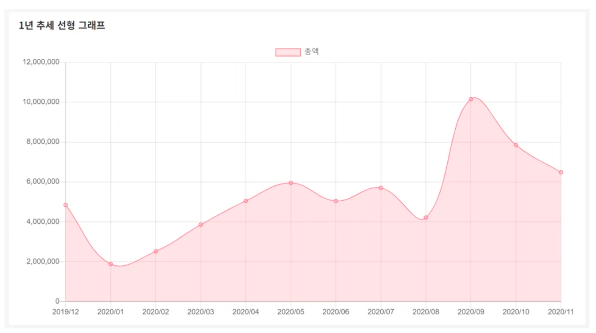

# (리뷰)코딩 에듀 테크    

## 핵심  

1.Product Market Fit을 검증해야 한다.  
- 마켓핏을 찾는것이 가장 큰 문제이다.  
- 제품을 개발하고, 고객과 만나고, 식사하고, 운동하는것 그 뿐이다.  
- 정부지원사업은 경우에따라 독이 된다.  

2.비즈니스 모델을 통해서 돈을 벌어야 한다.  
- PMF로 고객이 들어왔다고 가정하자.  
- 하지만 돈을 못버는 경우가 많다.  
- 무료로 자료를 풀면 좋지만, 구매까지는 절때 안하는 제품일 수 있다.  

## 출판 비즈니스 모델

   

- 수익 : 월 20만원 언더  (ROI = 심각한 마이너스 )  
- 비용이 크다. 2천만원 그 이상 필요할 수 있다.  
- 인쇄비 뿐만 아니라 재고관리비용도 존재한다.  
- 피봇팅 : 무료책으로 오픈 및 가치사다리로 전환.  

## 온라인 강의 비즈니스 모델  

- 수익 : 월 200만원 ~ 월 1,000만원  
- ROI가 시작으로 괜찮다.  
- 핵심 역량 : 팔리는 온라인 강의 콘텐츠 제작 능력  
- 1인 비즈니스를 유지할 수 있는 최소 기준이 된다.  
- 특징 : 온라인 학점 평가 및 취업 연계   

## 오프라인 프로젝트 수업  

  

- 수익 : 온라인 강의의 4~5배, 월 800만원 ~ 5,000만원  
- 영상 콘텐츠를 바탕으로 오프라인 강의를 믹스해서 진행한다.  
- 특징 : B2B 비즈니스 판로를 개척해야 한다.  
  - 기업형 오프라인 프로젝트 수업 B2B  
  - 기업형 SW 개발 및 공급업 : 선택적으로 외주를 운영한다.  
  - 오프라인 학원 수업  
  - CP사 운영, 기업형 영상콘텐츠 공급  
  - 책 수입  

## 외주, 에이전시  

- 초기 데스밸리를 우회하기 위한 전략으로 많이 사용한다.  