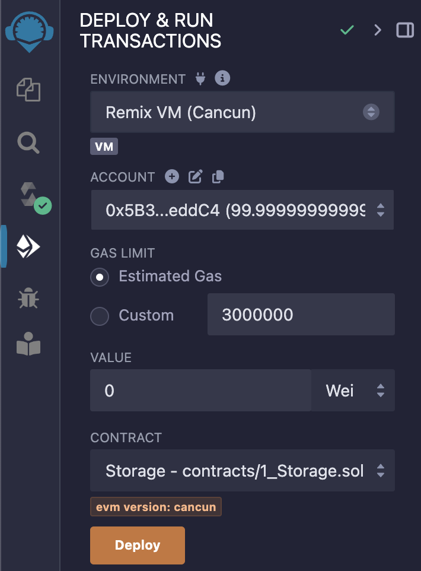
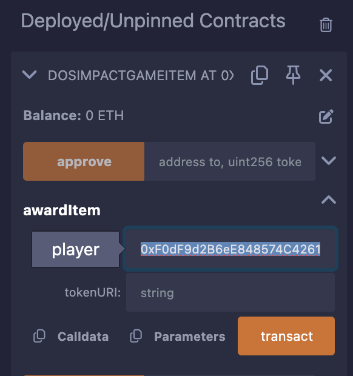

# CyptoTech Background 1    

- [CyptoTech Background 1](#cyptotech-background-1)
  - [1.Main Idea BlockChain](#1main-idea-blockchain)
    - [블록체인의 정의 :](#블록체인의-정의-)
    - [블록체인의 역사](#블록체인의-역사)
  - [2.Smart Contracts](#2smart-contracts)
    - [스마트 계약 개요](#스마트-계약-개요)
      - [스마트 계약의 정의와 중요성](#스마트-계약의-정의와-중요성)
      - [스마트 계약의 주요 특징](#스마트-계약의-주요-특징)
  - [3.Gas](#3gas)
      - [가스(Gas)의 정의](#가스gas의-정의)
      - [가스의 작동 원리](#가스의-작동-원리)
      - [가스 가격 단위와 변동성](#가스-가격-단위와-변동성)
      - [가스 비용 책정 옵션](#가스-비용-책정-옵션)
  - [4.EVM](#4evm)
      - [EVM 개요](#evm-개요)
      - [EVM과 솔리디티](#evm과-솔리디티)
  - [5.Remix](#5remix)
      - [Remix의 기능](#remix의-기능)
      - [테스트넷 사용](#테스트넷-사용)
      - [필요한 도구](#필요한-도구)
  - [6.Tools](#6tools)
  - [7.Remix](#7remix)
  - [실습:ERC20 토큰 생성 후 테스트넷 배포해보기](#실습erc20-토큰-생성-후-테스트넷-배포해보기)
    - [메타마스크에 BSC testnet 추가하기](#메타마스크에-bsc-testnet-추가하기)
    - [ERC20](#erc20)
  - [실습:ERC721 토큰 생성 후 테스트넷 배포해보기](#실습erc721-토큰-생성-후-테스트넷-배포해보기)
      - [동일한 티커(symbol)의 NFT는 불가능 하다.](#동일한-티커symbol의-nft는-불가능-하다)


## 1.Main Idea BlockChain  

Single Ledger : 단일 원장이다.  
Shared : 모두에게 공유된다.  
Distributed : 분산원장 기술이다.  
Permanent : 영구적 
Immutable : 데이터 변경 불가능  

*Ledger : 원장, 거래 내역 히스토리  

### 블록체인의 정의 : 

A blockchain is a constantly growing ledger  
that keeps a permanent record of all the transactions   
that have taken place, in a secure, chronological and immutable way  

### 블록체인의 역사

1. **비트코인**
   - 2008년 10월 31일 Satoshi Nakamoto에 의해 비트코인 백서가 발표되었습니다.
   - 2009년 1월 3일 제네시스 블록이 생성되었습니다.
   - 비트코인은 중앙 집중식 금융기관 없이 P2P 방식으로 거래를 가능하게 합니다.

2. **이더리움**
   - 2013년 이더리움 백서가 발표되었으며, 2015년 7월 30일 제네시스 블록이 생성되었습니다.
   - 이더리움은 스마트 계약을 생성하고 실행할 수 있는 탈중앙화 오픈 소스 블록체인입니다.

---  

## 2.Smart Contracts  

### 스마트 계약 개요

#### 스마트 계약의 정의와 중요성

스마트 계약 : 비즈니스 규칙을 컴퓨터 코드로 작성하여 제3자의 개입 없이 자동으로 계약을 집행하고 이행하는 시스템입니다.

#### 스마트 계약의 주요 특징

1. **제3자 불필요**
   - 스마트 계약에서는 브로커, 변호사 또는 에스크로 같은 제3자의 개입 없이도 계약을 이행할 수 있습니다.
   - 모든 규칙과 조건은 스마트 계약에 프로그래밍되어 있다.    

2. **자동화된 계약 이행**
   - 스마트 계약은 계약서에 포함된 모든 규칙을 자동으로 이행합니다.
   - 가능한 모든 상황을 고려하여 프로그램 되어야 하며, 계약 불이행이나 초과 상황 등 모든 경우를 처리할 수 있어야 합니다.

3. **다양한 당사자 참여 가능**
   - 스마트 계약에는 둘 이상의 당사자가 필요하며, 당사자는 반드시 사람이 아니어도 됩니다. 다른 스마트 계약이 당사자가 될 수도 있습니다.
   - 스마트 계약 체인을 구축하여 연속적으로 다른 스마트 계약이 실행되도록 할 수 있습니다.

4. **변경 불가능한 정보**
   - 블록체인에 기록된 스마트 계약의 정보는 변경할 수 없습니다.
   - 모든 조건과 정보는 신뢰 없이 자동으로 실행됩니다.

5. **Trustless**
   - 신뢰를 요구 하지 않는다.  

---

## 3.Gas

#### 가스(Gas)의 정의

가스는 이더리움 네트워크에서 특정 작업을 수행하는 데 필요한 컴퓨팅 파워의 양을 측정하는 단위입니다. 이더리움 트랜잭션을 수행하는 데 소요되는 컴퓨팅 자원에 대한 수수료를 의미합니다. 
- 이는 이더리움 상의 트랜잭션을 성공적으로 수행하기 위한 수수료로, 이더로 지불됩니다.

#### 가스의 작동 원리

가스의 작동 원리를 이해하기 위해 실제 상황을 예로 들어 설명하겠습니다. 뉴욕에서 플로리다주 마이애미까지 운전해서 이동하는 경우를 가정해 보겠습니다.

1. **거리와 연비 계산**
   - 뉴욕과 마이애미 사이의 거리는 1,291마일입니다.
   - 차량의 연비가 25마일/갤런이라면, 1,291마일을 이동하는 데 51.64갤런의 가솔린이 필요합니다.

2. **가솔린 비용 계산**
   - 갤런당 가솔린 가격이 4~6달러일 때, 필요한 총 금액은 206.56달러에서 309.84달러 사이가 됩니다.

이를 이더리움 네트워크의 가스로 바꿔서 생각해 보면, 트랜잭션을 수행할 때 가스 비용이 듭니다. 이 비용은 이더로 지불하며, 스마트 계약을 실행할 때 필요한 가스의 양은 계약의 규모와 수행 속도에 따라 달라집니다.

#### 가스 가격 단위와 변동성

가스 가격의 단위는 Gwei입니다. 1 Gwei는 1 이더의 10억분의 1입니다. 이더리움 네트워크의 가스 가격은 네트워크 상태에 따라 달라지며, 네트워크 사용자가 많을수록 가스 가격이 올라갑니다. 이는 컴퓨팅 리소스에 대한 경쟁이 높아지기 때문입니다.

#### 가스 비용 책정 옵션

스마트 계약 프로그래밍 및 배포 시 지불할 가스 비용을 책정할 수 있습니다. 낮은 가스 가격을 책정했을 때에도 채굴자가 해당 가격에 트랜잭션을 수행할 의사가 있다면, 스마트 계약은 실행됩니다. 이 부분은 추후 강의에서 자세히 다룰 예정입니다.

## 4.EVM

#### EVM 개요

이더리움 가상 머신(EVM)은 스마트 계약 기반의 탈중앙화 앱을 실행하기 위해 이더리움에서 사용되는 소프트웨어 플랫폼입니다. EVM은 이더리움 네트워크의 모든 스마트 계약과 이더리움 계정이 존재하는 곳이며, 스마트 계약을 실행하는 역할을 합니다.

#### EVM과 솔리디티

- **솔리디티**: 이더리움 가상 머신에서 코드를 작성하고 실행할 수 있는 고급 프로그래밍 언어입니다.
- **컴파일 과정**: EVM은 솔리디티 코드를 직접 읽지 못하므로, 솔리디티 코드를 컴파일하여 옵코드와 바이트코드로 변환해야 합니다.
  - **옵코드(Op_Codes)**: 이더리움 가상 머신이 이해할 수 있는 저수준의 명령어 코드입니다.
  - **바이트코드(Bytecode)**: EVM이 실제로 실행할 수 있는 코드로, 솔리디티 코드를 컴파일하여 생성됩니다.

## 5.Remix  

#### Remix의 기능

- **Solidity 계약 작성 및 배포**: Remix를 사용하면 브라우저에서 직접 Solidity 스마트 계약을 작성하고 배포할 수 있습니다.
- **코드 컴파일**: 이더리움 가상 머신(EVM)은 Solidity 코드를 직접 읽지 못하므로, Remix를 사용해 바이트코드로 컴파일합니다.
- **배포 옵션**: 작성한 스마트 계약을 로컬 블록체인, 이더리움 메인넷, Binance Smart Chain, Rinkeby, Kovan 등의 테스트넷에 배포할 수 있습니다.

#### 테스트넷 사용

블록체인 개발을 시작할 때는 주로 테스트넷을 사용하게 됩니다. 
- 테스트넷에서는 실제 이더리움을 사용하지 않고도 스마트 계약을 테스트할 수 있습니다. 
- Rinkeby와 Kovan 같은 테스트넷에 배포하면, 이더리움 메인넷에 올리지 않아도 코드를 확인하고 테스트할 수 있습니다.

#### 필요한 도구

- **브라우저**: 기본 브라우저로 Chrome을 사용할 것입니다. 이는 MetaMask라는 브라우저 확장 프로그램을 사용할 것이기 때문입니다.
- **MetaMask**: MetaMask는 스마트 계약을 배포할 때 사용하는 암호화폐 지갑입니다. Firefox, Brave, Edge와도 호환되지만, 본 강의에서는 Chrome을 사용할 것입니다.

## 6.Tools  

Remix : Web Solidity IDE 이다.  
- Solidity 언어로 스마트 계약을 작성하고, 컴파일, 배포, 테스트 할 수 있다.  
- https://remix.ethereum.org/  

Ganache 
- https://archive.trufflesuite.com/ganache/
- 가나슈, 로컬에서 가상 블록체인 네트워크 환경을 테스트 할 수 있다.  

MetaMask : 이더리움 생태계의 지갑    
- https://metamask.io/

Truffle : Local Ethereum development framework   
- https://www.npmjs.com/package/truffle
- Remix보다 더 많은 기능들이 있다. 

OpenZeppelin  
- 토큰, 스마트 계약을 만들 수 있느 오픈소스 코드   
- https://docs.openzeppelin.com/contracts/5.x/  
- https://github.com/OpenZeppelin/openzeppelin-contracts/tree/master/contracts  

## 7.Remix  

  

- *주황색 버튼은 액션에 비용이 필요하다.  
- *파란색 버튼을 그렇지 않다.  

1.Env  

배포할 네트워크를 선택한다.  
- 1.Remix 테스트 가상 환경  
- 2.로컬 나가슈 환경  
- 3.테스트 넷 배포  
- 4.실제 네트워크 배포  


## 실습:ERC20 토큰 생성 후 테스트넷 배포해보기  

### 메타마스크에 BSC testnet 추가하기  

  

### ERC20

목표 
- ERC20 토큰을 배포한다.  

0.개발환경 셋업 
- Remix :https://remix.ethereum.org에서 새로운 워크스페이스를 만든다.  
- ERC-20.sol 파일을 하나 만든다.  


1.아래 openzeppelin에서 코드를 Import해서 사용한다.    
- https://docs.openzeppelin.com/contracts/5.x/erc20  


```js
// contracts/GLDToken.sol
// SPDX-License-Identifier: MIT
pragma solidity ^0.8.20;

import {ERC20} from "@openzeppelin/contracts/token/ERC20/ERC20.sol";

contract GLDToken is ERC20 {
    constructor(uint256 initialSupply) ERC20("Gold", "GLD") {
        _mint(msg.sender, initialSupply);
    }
}
```

## 실습:ERC721 토큰 생성 후 테스트넷 배포해보기  

DevEnv  
- Remix, MetaMask, openzeppelin  
- 아래 처럼 ERC721 코드를 가져와서 배포를 진행한다.  


```js
// contracts/DosImpactGameItem.sol
// SPDX-License-Identifier: MIT
pragma solidity ^0.8.20;

import "@openzeppelin/contracts/token/ERC721/extensions/ERC721URIStorage.sol";

contract DosImpactGameItem is ERC721URIStorage {
    uint256 private _nextTokenId;

    constructor() ERC721("DosImpactGameItem", "DOSIMPGI") {}

    function awardItem(address player, string memory tokenURI)
        public
        returns (uint256)
    {
        uint256 tokenId = _nextTokenId++;
        _mint(player, tokenId);
        _setTokenURI(tokenId, tokenURI);

        return tokenId;
    }
}
```
스마트 컨트렉의 awardItem을 통해서 NFT를 보낸다.  

- tokenURI는 NFT에 관련된 메타 정보를 기입하는 곳이다.  

  

- 계정에서 NFT를 추가할때는 token 주소 + tokenId(몇번째 NFT인가?)를 입력한다.  
  - 주소는 스마트컨트렉의 배포된 주소를 입력한다.  


#### 동일한 티커(symbol)의 NFT는 불가능 하다.  

- 동일한 티커(symbol)는 동일한 블록체인 네트워크 내에서 여러 ERC721 스마트 컨트랙트에 사용할 수 없습니다.   