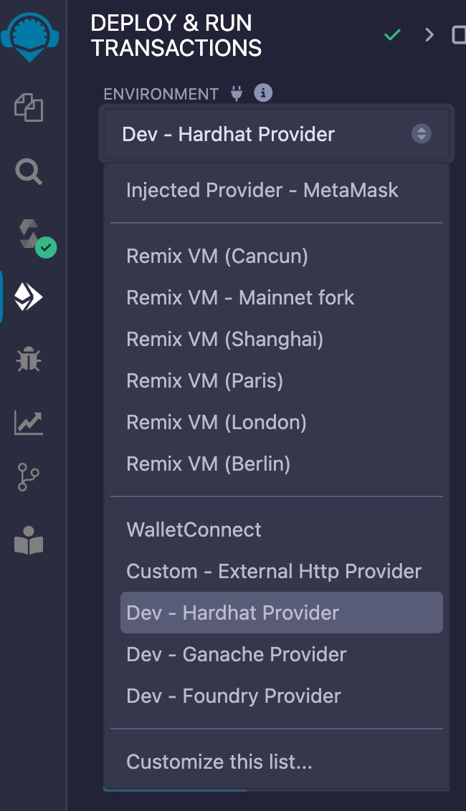

# Solidity 입문  


## Refs 
- solidity docs : https://solidity-kr.readthedocs.io/ko/latest/introduction-to-smart-contracts.html#

## Fork에 대한 개념  

Fork에는 하드포크, 소프트포크 2가지가 있다.  

1.HardFork : 기존 네트워크의 규칙과 호환이 안된다.    
- 하드포크가 발생하면 새로운 블록체인이 발생
- 이더리움 클래식과 이더리움이 있는 이유, 
- 하드포크 발생하면, 강제적으로 소프트웨어 업데이트가 필요.  

*DAO해킹사건   
- 이더리움 DAO 스마트 컨트렉이 해킹되어 > 5천만 달러가 탈취, 이를 복구하고자 하드포크 결정  
- 해킹된 네트워크는 이더리움 클래식이며, 해킹이 복구된 네트워크는 이더리움 이다.  

2.SoftFork : 기존규칙과 호환되어 업데이트 한다.  

1. Berlin Hard Fork (베를린 하드 포크)
- 활성화 시기: 2021년 4월
  - 여러 EIP(Ethereum Improvement Proposals)를 포함하여 가스 비용을 최적화하고, EIP-2565 (모듈러 거듭제곱 연산의 가스 비용 감소)

2. London Hard Fork (런던 하드 포크)
- 활성화 시기: 2021년 8월
  - EIP-1559: 거래 수수료 메커니즘을 개편하여 기본 수수료(Base Fee)를 도입하고 이를 소각하는 구조로 변경, 장기적으로 ETH의 공급량 감소 가능성을 제시.
  - EIP-3554: 이더리움 2.0으로의 전환을 준비하기 위해 난이도 폭탄(Difficulty Bomb)을 연기.

3. Paris Hard Fork (파리 하드 포크)
- 활성화 시기: 2022년 9월
  - 이더리움의 "The Merge"라는 역사적인 전환점으로, 이더리움 네트워크가 작업 증명(Proof of Work, PoW)에서 지분 증명(Proof of Stake, PoS)으로 전환됨.
  - 이 하드 포크는 에너지 소비를 크게 줄이고, 이더리움 네트워크의 보안과 확장성을 개선함.

4. Shanghai Hard Fork (상하이 하드 포크)
- 활성화 시기: 2023년 4월
  - 이더리움 2.0의 완성 단계로, PoS로의 전환을 완료한 후 첫 번째 주요 업데이트.
  - 주요 업데이트로는 스테이킹된 이더(ETH)를 인출할 수 있는 기능이 포함되었음.

5. Cancun Hard Fork (칸쿤 하드 포크)
- 예상 활성화 시기: 2024년 이후
  - 이더리움 네트워크에서의 데이터 가용성, 특히 이더리움 롤업을 위한 데이터 샤딩 기능을 포함하는 Proto-Danksharding 등의 업데이트가 예상됨.
  - 이 업그레이드는 네트워크 확장성을 대폭 향상시킬 것으로 기대됨.


## 개발환경  

1.Remix  
- Solidity - Web IDE  
- https://remix.ethereum.org/  

2.Hardhat  
- 기존에는 로컬에 가상 네트워크를 구현하기 위해 가나슈를 사용했으나, hardhat으로 변경되었다. (최신 네트워크 버전을 지원하는 듯).  
- https://hardhat.org/hardhat-runner/docs/getting-started  

```
# hardhat 프로젝트 실행  
npx hardhat init

# 로컬 네트워크 오픈  
npx hardhat node

# Remix에서 hardhat 연동하기.   
```



## solidity 예제 1.SimpleStorage  

- [스마트 컨트랙트 소개](https://solidity-kr.readthedocs.io/ko/latest/introduction-to-smart-contracts.html#)

```js
// SPDX-License-Identifier: MIT
pragma solidity ^0.8.20;
// pragma solidity >=0.4.0 <0.6.0;

contract SimpleStorage {
    uint storedData;

    function set(uint x) public {
        storedData = x;
    }

    function get() public view returns (uint) {
        return storedData;
    }
}
```
1.pragma 을 통해서 컴파일러 버전을 명시한다. 
- 권장 : 라이센스를 헤더에 명시 : SPDX-License-Identifier: MIT    

솔리디티 언어로된 코드가 컴파일 되면 바이트 코드로 변환이 된다.  
- 컴파일 결과 opcode가 보이며, 이는 바이트코드와 매핑된다. opcode를 솔리디티에 적을수도 있다.  
- EVM은 스택방식이며 LIFO 으로 처리된다.  
- *컴파일러 버전에 맞추어 만들어진 opcode가 네트워크 버전에 호환이 안될 수 있다.   

네트워크에 스마트 컨트랙 배포의 의미 
- Solidity의 관점에서 컨트랙트란 무수한 코드들(함수)과 데이터(상태)가 Ethereum 블록체인의 특정 주소에 존재하는 것.  

2.public 키워드  
- 외부에 인터페이스로 노출시킨다. 상호작용이 가능하다. ABI 명시될듯  

3.view 키워드  
- 해당함수는 내부 상태를 변경시키지 않음을 명시한다.  

## solidity 예제 2.Coin  

```js
// SPDX-License-Identifier: MIT
pragma solidity ^0.8.20;

contract Coin {
    // The keyword "public" makes those variables easily readable from outside.
    // pulbic변수를 외부에서 읽는데 비용이 들지는 않는다.  
    address public minter;
    mapping (address => uint) public balances; // mapping은 객체 이다. 
    // address 타입 = 컨트랙트 주소나 외부 사용자들의 키 쌍을 저장

    // 이벤트:블록체인 상에서 발생한 이벤트들을 큰 비용을 들이지 않고 받아볼 수 있습니다.
    event Sent(address from, address to, uint amount);

    // This is the constructor whose code is run only when the contract is created.
    constructor() {
        minter = msg.sender;
    }

    function mint(address receiver, uint amount) public {
        require(msg.sender == minter); // 생성자만 mint함수를 작동시킬 수 있다.  
        require(amount < 1e60);
        balances[receiver] += amount;
    }

    function send(address receiver, uint amount) public {
        require(amount <= balances[msg.sender], "Insufficient balance."); // 오류 발생시 취소  
        balances[msg.sender] -= amount;
        balances[receiver] += amount;
        emit Sent(msg.sender, receiver, amount); // 이벤트 발생  
    }
}
```

1.변수에 public을 붙이는것의 의미  
- 외부에서 해당 변수를 읽을 수 있게된다. 이는 getter함수를 만들어주는 효과이다.  

## solidity 예제 
```js
contract Will {
  address owner;
  uint  fortune;
  bool deceased;

  constructor() payable public{
    owner = msg.sender;
    fortune = msg.value;
    deceased = false;
  }
  modifier onlyOwner{
    require(msg.sender = owner);
    _;
  }
  modifier mustBeDeceased {
    require(deceased == true);
    _;
  }

  address payable[] familyWallets;
  mapping(address => uint) inheritance;

  function setInheritance(address payable wallet, uint amount){
    familyWallets.push(wallet);
    inheritance[wallet] = amount;
  }
}
```

1.payable 키워드  
1.1 함수명 payable : 
- 이더리움을 해당 계약에 보낼 수 있는 특별한 키워드.  
- 함수에 적용할 수 있으며, 스마트계약의 잔고에 이더가 저장될 수있도록 코드가 자동으로 추가된다.  
1.2 address payable: 
- 해당 주소는 이더리움을 받을 수 있는 주소로 간주된다.  

참고 transfer  
- address payable이더를 전송할때 사용한다. 
- `address payable recipient; recipient.transfer(amount);`

2.modifier 키워드  
- require 조건을 재사용하고자 할때 사용  
- 합성 가능 : _ 언더바 부분에 본래의 함수가 들어간다.  