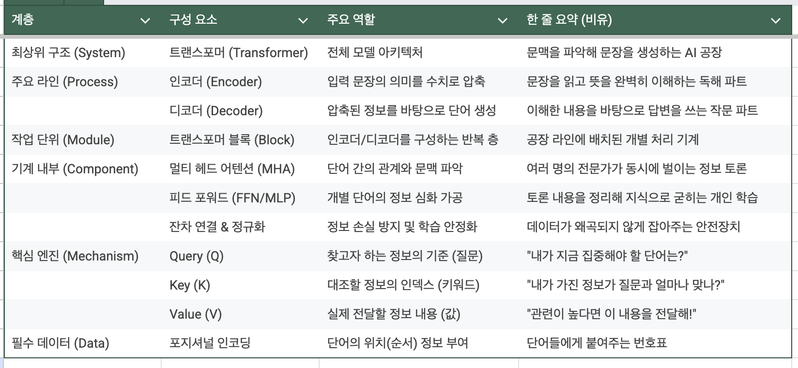

# 2장 파운데이션 모델 이해하기  

- [2장 파운데이션 모델 이해하기](#2장-파운데이션-모델-이해하기)
  - [\_2.1 학습 데이터](#_21-학습-데이터)
  - [\_2.2 모델링](#_22-모델링)
  - [\_2.3 사후 학습](#_23-사후-학습)
  - [\_2.4 샘플링](#_24-샘플링)


## _2.1 학습 데이터


```
__2.1.1 다국어 모델
__2.1.2 도메인 특화 모델
```

웹사이드 수십억개의 데이터를 정기적으로 수집한 커먼 크롤 이라는 데이터셋이 있다.  
- 물론 저품질의 데이터, 인종 차별 등 필터링 해야 할 항목들이 있지만, 이러한 데이터를 사용해서 Open AI에서 학습을 진행  

다국어와 언어 모델의 성능    
- 학습 자료의 절반은 영어로 만들어져 있다.  
- 양질의 데이터가 많을수록 당연히 해당 언어의 AI모델의 성능이 좋다.   
- 같은 수학 문제를 영어로 풀게하는것과 텔루구어로 풀게하는것에는 성능 차이가 크다.  
- 영어로 번역해서 모델에 넣는 방법도 있지만 번역 과정에서 역시 데이터의 손실이 발생할 수 있다.  

도메인 지식과 언어 모델의 성능  
- 데이터를 수집 후 데이터의 카테고리를 분류하면 비즈니스/기술 관련 토픽이 전체의 30%을 차지한다.  
- 모델이 잘 모르는 도메인 지식일수록 대답의 성능은 좋지 못하다.  
- 그래서 특정 전문 지식 데이터를 쌓았다면 그에 특화된 모델을 개발하는것이 가능하다.  

예로 알파폴드는 기존 LLM의 구조와 데이터 학습 방식 자체가 완전히 다른 From Scratch 모델이다.  
- 알파폴드(특히 AlphaFold 2)는 텍스트를 생성하는 언어 모델(LLM) 기반이 아닙니다.  
- 입력 데이터 : 미노산 서열(Protein Sequences), 다중 서열 정렬(MSA) 데이터  
- 모델 구조 : 트랜스포머(Transformer)의 원리를 응용, 트랜스포머(Transformer)의 원리를 응용  
- 학습 방식 : 단백질의 3차원 좌표를 예측하도록 학습되었기 때문에, GPT 같은 범용 모델을 가져와서 미세 조정(Fine-tuning)한 것과는 차원이 다른 작업  


왜 파인튜닝이 아닌 '사전 학습(Pre-training)'인가? 알파폴드나 딥마인드의 과학용 모델들이 처음부터 다시 학습(Train from scratch)하는 이유  
- 데이터의 특수성 : 단백질 구조 데이터는 언어 텍스트와 완전히 구조가 달라, 기존의 LLM 가중치는 도움이 안된다.  
- *GraphCast (기상 예측): 기상 데이터를 그래프 신경망(GNN) 형태로 처음부터 학습  
- *AlphaGeometry (기하학 증명): 기하학적 논리를 풀기 위해 합성 데이터를 생성하여 바닥부터 학습  


## _2.2 모델링

```
__2.2.1 모델 아키텍처
__2.2.2 모델 크기
```

📌 트랜스포머 아키텍처    

  

1, 트랜스포머 쉽게 이해하기  
- 트랜스포머는 문장 전체를 한눈에 훑어보는 방식으로 진행  
  - 예, 그는 사과를 먹으려 했지만, 그것이 너무 딱딱해서 포기했다. => 그것 = 사과'라는 연결고리를 찾아낸다.  
- 트랜스포머는 크게 두 부분으로 나뉩니다.  
- 인코더 (Encoder): 입력받은 정보를 완벽하게 이해하는 부분입니다. (읽기 능력)  
- 디코더 (Decoder): 이해한 내용을 바탕으로 적절한 답변을 생성하는 부분입니다. (쓰기 능력)   
  - 트랜스포머의 가장 중요한 핵심 = '어텐션(Attention, 주목)', 어떤 단어가 다른 어떤 단어와 밀접하게 연관되어 있는지 점수  

  

1-1, 인코더/디코더 
- 트랜스포머가 나오기 전까지는 RNN이 인코더와 디코더 역할을 독점  

---

2, seq2seq에서 트랜스포머 아키텍처로     
- **시퀀스 변환(Sequence-to-Sequence, Seq2Seq)**이란, 이름 그대로 하나의 시퀀스(연속된 데이터)를 입력받아 다른 형태의 시퀀스로 출력하는 기술을 의미  
- 시퀀스 변환의 가장 쉬운 예시는 문장을 다른 형태의 문장으로 바꾸는 것  


2-1, RNN 인코더-디코더의 작동 방식  
- 인코더 (RNN) : 문장의 단어를 하나씩 순서대로 읽음 -> 단어를 읽을 때마다 이전 단어의 정보를 기억하며 업데이트 -> 컨텍스트 벡터(Context Vector) 출력 = 문장 전체의 요약본  
- 디코더 (RNN) : 컨텍스트 백터를 첫 번째 입력 -> 첫 단어를 출력 -> 그 단어를 다시 자기 자신의 입력으로 넣어 다음 단어를 예측  

2-2, 치명적인 약점이 두 가지  
- ① "기억력의 한계" (장기 의존성 문제) : 문장이 길어지면 인코더가 만든 Context Vector의 맨 앞 단어의 정보가 거의 남지 않게되어 번역 품질이 떨어짐.  
- ② "너무 느린 속도" (병렬 처리 불가) : RNN은 첫 번째 단어를 처리해야 두 번째 단어를 처리    

2-3, Attention 매커니즘  
- 어텐션이라는 기술은 예전부터 있었지만, 그걸 극대화해서 완전히 새로운 판을 짠 게 트랜스포머다.  
- Seq2Seq에서의 어텐션 : RNN의 부족한 기억력을 도와주는 '비서' 역할  
- RNN이 단어를 하나씩 읽다가, 너무 길어서 기억이 안 날 때쯤 "어이, 어텐션! 아까 앞부분에서 뭐가 중요했지?"라고 물어보는 식, 속도가 느렸다.  
- 트랜스포머는 RNN이라는 구식 엔진을 아예 떼어버리고, 오직 어텐션만으로 전체 모델을 설계 : 문장 안의 모든 단어가 서로를 쳐다보게(Self-Attention) 만들어서 맥락을 파악  

3, 어텐션 매커니즘

3-1, 단어 임베딩 (Word Embedding) 혹은 시맨틱 공간(Semantic Space)  
- AI가 처음 태어났을때는 모든 단어에 무작위 백터를 부여한다.   
- GPT-2 모델의 경우	1,024 차원을 사용한다.  
- AI는 수많은 문장을 읽으면서 스스로 문장의 빈칸을 만들어내며 자기 지도 학습을 진행한다.  
- 그 결과 비슷한 뜻을 가진 단어들은 숫자 공간상에서 서로 가까운 곳에 모이게 된다.  
  - 왕에서 남자의 특징을 빼고 여자의 특징을 더하면 신기하게도 '여왕'의 좌표 근처로 가게 된다.  

3-2, 어텐션 매커니즘, K, V, Query Vector 설명  

Q, K, V 라는 세 가지 벡터(Query, Key, Value)를 사용 
- Query (Q): 현재 분석하려는 단어를 나타냅니다. "내가 지금 찾고자 하는 정보가 무엇인가?"를 묻습니다.  
- Key (K): "나는 이런 정보를 담고 있어"라고 말하며 Query와 얼마나 맞는지 비교  
- Value (V): 실제 담겨 있는 정보입니다. Key를 통해 중요도가 결정되면, 그 비중만큼 최종 결과에 반영됩니다.  

3-3, 어텐션이 계산되는 3단계  

  
- 1, 유사도 계산 (Score): 내가 찾고자 하는 단어(Query)와 모든 대상 단어(Key)를 내적(곱) 한다.  
  - 결과값이 클수록 두 단어는 서로 연관성이 높다.   
- 2, 스케일링 & 정규화: 값이 너무 커지는 것을 방지하기 위해 차원의 크기($\sqrt{d_k}$)로 나눈다.  
  - Softmax를 적용합니다. 이렇게 하면 모든 점수의 합이 **1(100%)**이 되어, 각 단어에 대한 '집중도'가 나온다.  
- 3, 정보 추출 (Weighting): 계산된 집중도를 실제 정보(Value)에 곱해 준다.
  - 중요한 정보는 크게 반영하고, 관련 없는 정보는 희미하게 만든다.   
  - (Score × V): 관련성 높은  내용은 많이 가져오고, 아닌 내용은 거의 무시합니다.
- 4, 최종 합산: 모든 Value를 더해 현재 단어에 대한 최종 맥락 정보를 생성  
  - 이것들을 다 합치면 **"내가 찾던 정보의 최종 요약본"**이 완성됩니다.   

3-4, 멀티 헤드 개념
- 이러한 어텐션 과정은 여러 개로 나누어서 병렬로 처리된다.    
- 하나의 어텐션(Single-head)만 사용하면 모델은 문장 내에서 한 번에 하나의 관계에만 집중하게 되는데, 멀티헤드를 사용하면 모델은 문장의 입체적인 맥락을 훨씬 더 풍부하게 이해한다.  
  - 전문가 A: "이 문장의 문법적 구조(주어-동사 관계)를 봐!"
  - 전문가 B: "나는 단어들 사이의 의미적 연관성을 찾을게."
  - 전문가 C: "나는 이 대명사가 누구를 가리키는지(지칭 관계) 조사할게."

3-5, 멀티 헤드 작동 원리  
- 분할 (Split): 입력된 $Q, K, V$ 벡터를 헤드 수($h$)만큼 작은 차원으로 쪼갭니다. (예: 512차원을 8개의 헤드로 나누면 각 헤드는 64차원씩 담당)  
- 병렬 어텐션 (Parallel Attention): 각 헤드가 독립적으로 자신만의 어텐션 연산을 수행  
- 결합 (Concat) : 결과값들을 다시 하나로 길게 이어 붙입니다.  
- 변환 (Linear) : 합쳐진 결과를 최종적으로 한 번 더 행렬 곱을 통해 정리하여 다음 레이어로 보냅니다.  

4, 트랜스포머 블록  

4-1, 트랜스포머 블록 구조  

트랜스포머 블록 : 하나의 블록 안에는 크게 두 가지 핵심 파트로 구성 되며, 이 똑같이 생긴 블록을 수십 개씩 수직으로 쌓아 올려 만든다.  
- 트랜스포머 블록의 수를 레이어의 수라고 부른다.  
- 트랜스포머 블록의 내부 구조  
  - ① 멀티 헤드 어텐션 (Multi-Head Attention) : 어텐션 모듈  
    - 단어 간 상호작용 (Contextualizing)	-> "주변 단어들과의 관계를 파악"  
    - 어텐션: 문장 내에서 정보를 전달하는 통로 (Communication)  
  - ② 피드 포워드 신경망 (Feed-Forward Network, FFN) : MLP 모듈  
    - 개별 단어의 특징 추출 (Feature Extraction) -> "파악된 관계를 바탕으로 각 단어의 의미를 고도화   
    - FFN: 모델이 학습 데이터에서 배운 일반적인 지식을 꺼내 쓰는 곳 (Knowledge Retrieval)

4-2, 피드 포워드 신경망 (Feed-Forward Network, FFN) 과정    
- 1, Up-projection (확장): 정보를 넓게 펼쳐서 미세한 특징들을 뽑아낼 준비를 함.
  - 공간의 확장, 트랜스포머 모델의 기본 차원(예: 512)은 정보를 담기에 좁다. 그래서 FFN은 첫 번째 층에서 이 차원을 보통 **4배(2048)**로 확 늘린다.  
- 2, Activation (변환): 비선형 함수를 통해 불필요한 노이즈를 거르고 핵심적인 '논리'를 적용함.
  - 활성화 함수(ReLU, GELU): FFN의 중간에 들어가는 이 함수  
- 3, Down-projection (압축): 정제된 핵심 정보만 남겨서 다시 원래 차원으로 압축함.  


## _2.3 사후 학습 
```
__2.3.1 지도 파인튜닝
__2.3.2 선호도 파인튜닝
```

## _2.4 샘플링

```
__2.4.1 샘플링의 기초
__2.4.2 샘플링 전략
__2.4.3 테스트 시점 연산
__2.4.4 구조화된 출력
__2.4.5 AI의 확률적 특성
_2.5 마치며
```