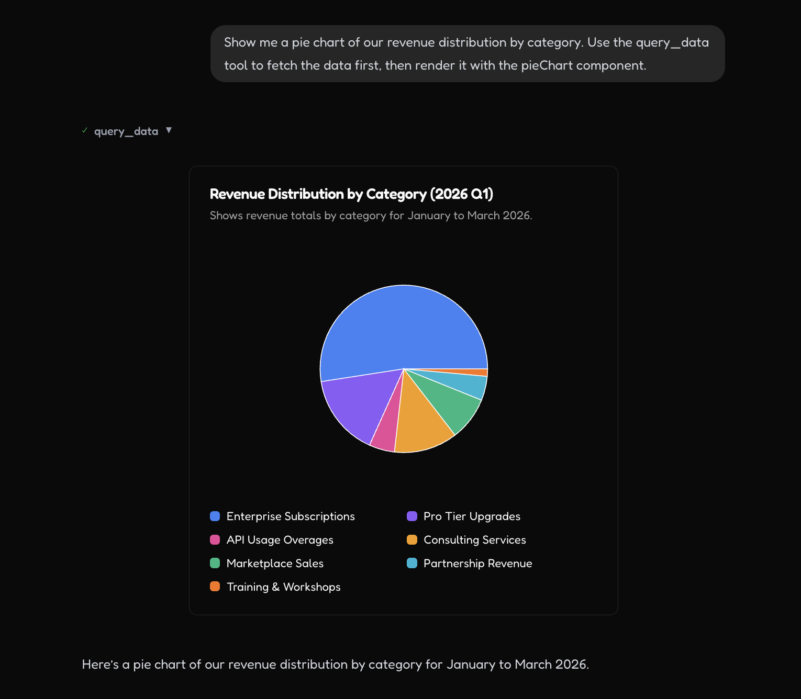
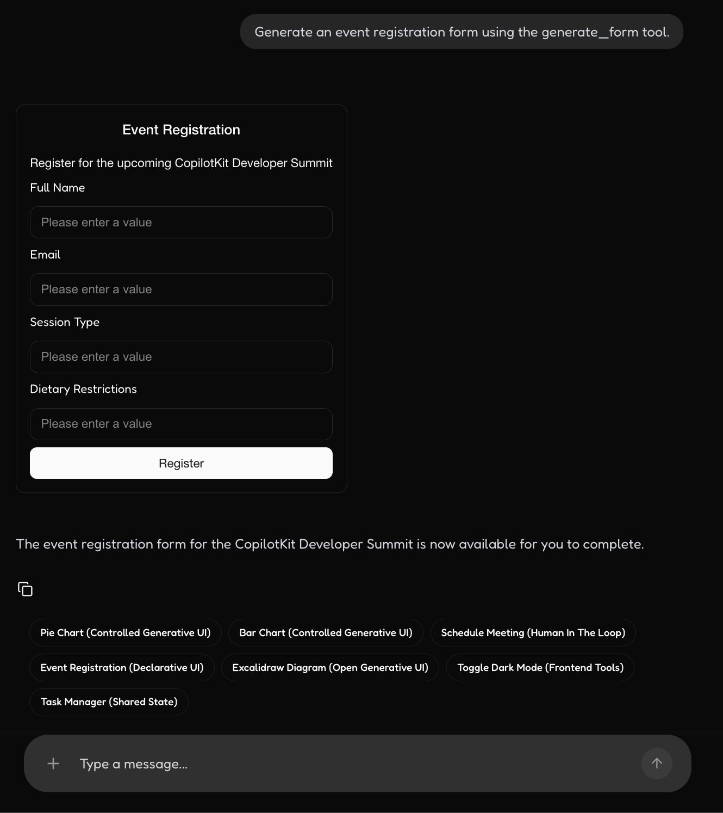

# copilotkit.ai - 1 Intro

## Goal  

프로젝트는 : copilotkit-langgraph-template 샘플이다.  

오픈소스 이용  
- 그대로 사용하는것 -> 커스터마이징이 어려워짐, 
- 처음부터 개발하는것 -> 좋은 기회, 리스크는 리소스와 실패가능성  
- copilotkit을 사용할지 아니면 커스터마이징 할지 고민

Requirements  
- [ ] 디자인 시스템에 맞는 UI Generation이 되어야 한다.  
- [ ] 랭그래프 LLM Backend 랑 연동이 되어야 한다.  
- [ ] Next.js, React 모두 PoC을 완성해야 한다.  
- [ ] 내부 동작에 대한 이해가 되어야 한다.  

Demo Ananlysis 
- [ ] 데모 분석 : https://www.copilotkit.ai/use-cases/co-creation-copilot
- [ ] 데모 분석 : https://www.copilotkit.ai/use-cases/saas-copilot

Demo Page  
- [ ] (Idea) 광고 센터 진단 리포트 생성  

## Preview

  
UI Generation - Graph/Chart

  
UI Generation - Chart  

  
UI Generation - Form and Submit

  
  
UI Generation with Human In the Loop  

  
UI Control - Excalidraw

  
UI Control - In app - Toggle Theme

  
UI Control - In app - Todo List  

---

## Overview 

Tech Stack  
- LangChain = 에이전트 내부 부품
- LangGraph = 에이전트 실행 엔진 + 서버 API
- LangSmith = 그 실행을 관찰하고 디버깅하는 외부 도구
- Copilot Kit = Agent의 생성 프로토콜에 따라서 UI에 렌더링 해주는 SDK (Streaming 처리 + 렌더러)  

🌿 LangGraph Agent 최소지식

크게 4가지로 구성된다.  
- State: The state is the data that the agent is using to make and communicate its decisions. 
  - You can see all of the state variables in the bottom left of the screen. 
  - State will only update between node transitions.  

- Nodes: Nodes are the building blocks of a LangGraph agent. 
  - They are the steps that the agent will take to complete a task. 
  - In this case, we have nodes for the agent, tools and human input and processing feedback.

- Edges: Edges are the arrows that connect nodes together. 
  - They define the logic for how the agent will move from one node to the next. 
  - They are defined in code and conditional logic is handled with a route function.

- Interrupts: Interrupts are a way to allow for a user to work along side the agent and review its decisions. 
  - In this case, we have an interrupt after the human node which blocks the agent from proceeding until the user provides feedback.

🌿 LangSmith의 대표 기능  

1. 트레이싱
  - LLM 호출, 프롬프트, 응답, 툴 호출, 에이전트 단계, 상태 변화를 실행 단위로 기록합니다.
  - "이 답이 왜 나왔는지"를 추적할 때 핵심입니다.

2. 디버깅
  - 한 번의 실행을 단계별로 펼쳐서 볼 수 있습니다.
  - 어느 노드에서 실패했는지, 어떤 입력이 들어갔는지, 어떤 툴 결과가 모델에 전달됐는지 확
    인합니다.

3. 평가
  - 데이터셋을 만들어 여러 프롬프트, 모델, 에이전트 버전을 비교할 수 있습니다.
  - 정답 기반 평가, LLM-as-a-judge 평가, 휴먼 리뷰 워크플로우에 모두 쓸 수 있습니다.

4. 모니터링
  - 운영 환경에서 지연 시간, 에러율, 토큰 사용량, 품질 저하 같은 신호를 봅니다.
  - 배포 후 이상 동작을 빨리 찾는 용도입니다.

5. 실험 관리
  - 프롬프트 변경, 모델 변경, 체인 구조 변경 전후를 실험처럼 관리합니다.
  - "어느 조합이 더 좋은가"를 팀 단위로 비교하기 좋습니다.

대표적인 사용 사례  
  - RAG 품질 개선
      - 검색된 문서가 적절했는지, 최종 답변이 근거를 잘 썼는지 분석
      - 검색기, 리랭커, 프롬프트를 바꿔가며 비교 평가
  - 에이전트 디버깅
      - 툴을 왜 잘못 골랐는지
      - 불필요한 반복 호출이 있었는지
      - 특정 노드에서 상태가 깨졌는지 확인
  - 프롬프트 A/B 테스트
      - 같은 입력셋으로 프롬프트 버전별 결과 비교
      - 응답 정확도, 형식 준수, 비용, 속도까지 같이 판단
  - 운영 관측
      - 실제 사용자 요청 중 실패한 케이스 수집
      - 특정 유형 질문에서만 성능이 떨어지는지 추적
  - 회귀 테스트
      - 예전엔 되던 요청이 새 변경 후 망가졌는지 확인
      - 배포 전에 데이터셋으로 자동 검증
  - 사람 검토 워크플로우
      - 사람이 결과를 보고 점수나 피드백을 남김
      - 이후 그 데이터를 평가셋으로 재사용
