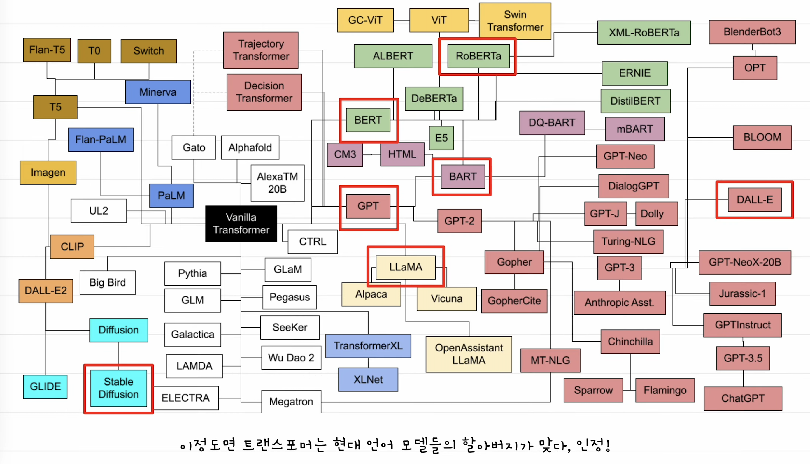
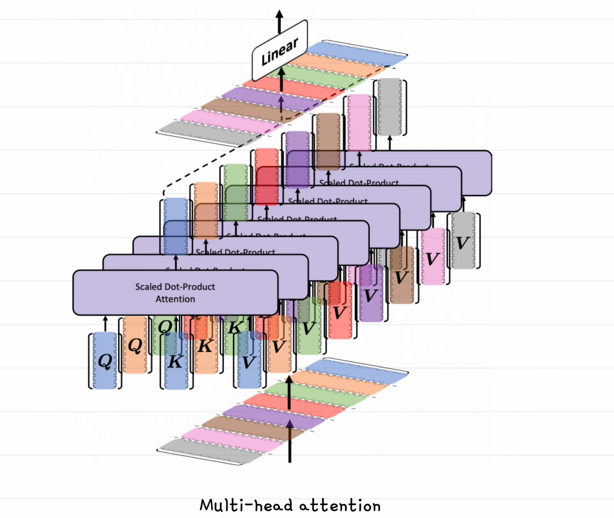
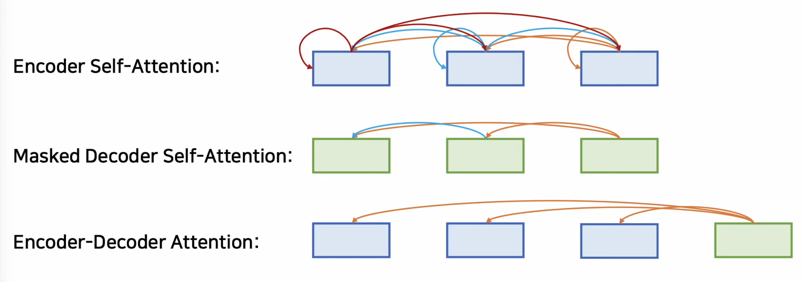
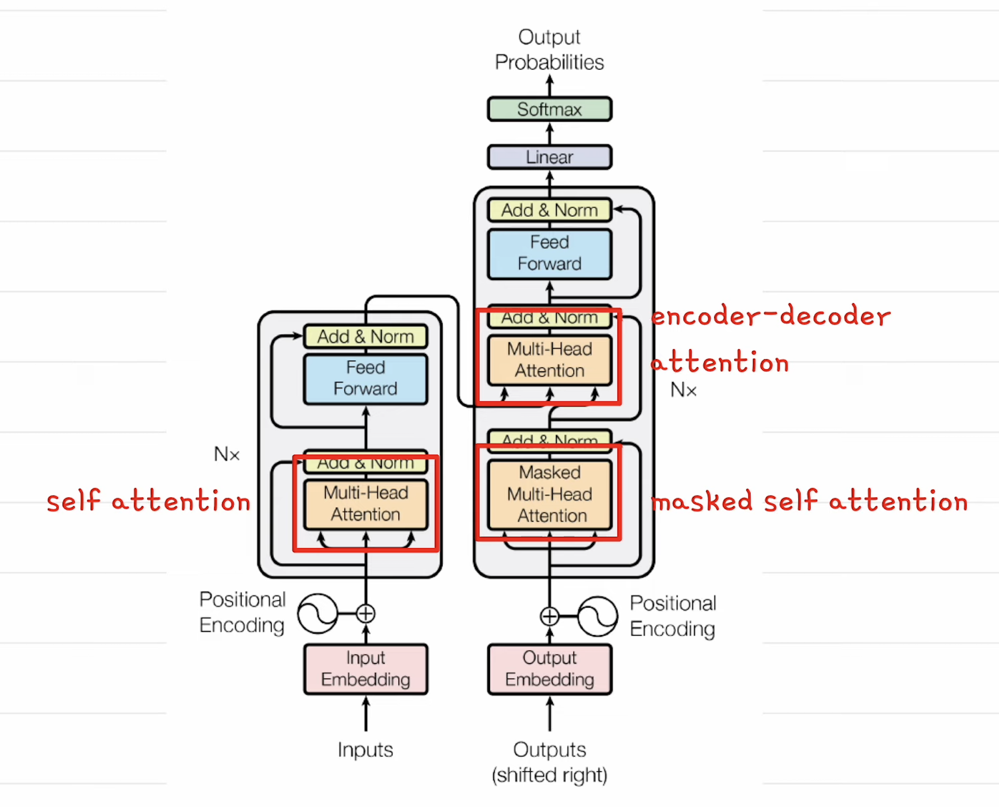
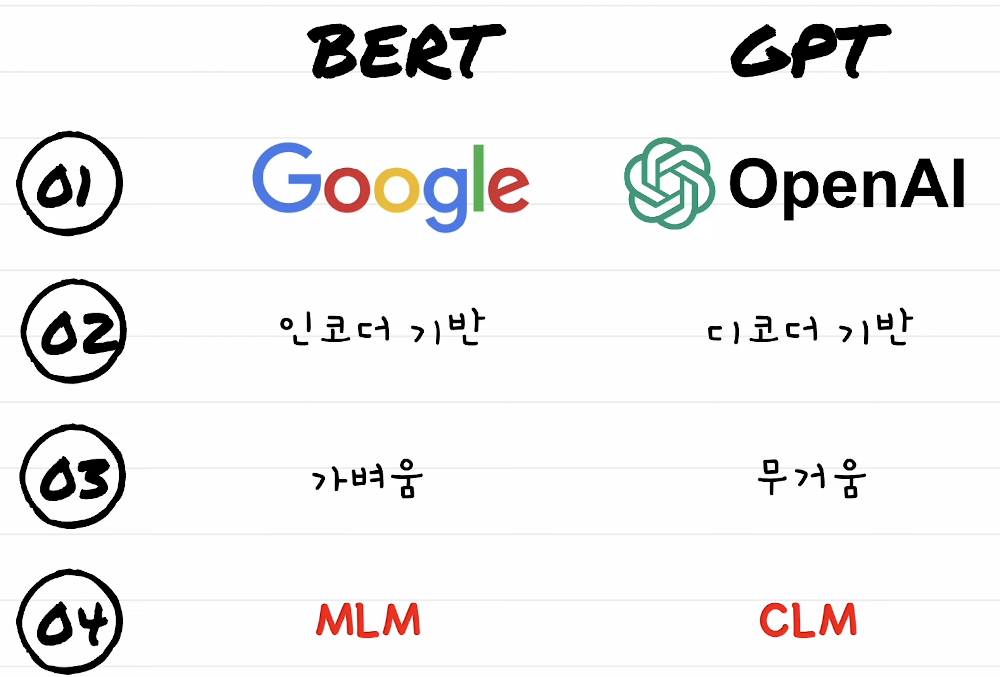

# 1, LLM의 원리

- [1, LLM의 원리](#1-llm의-원리)
  - [ChatGPT와 LLM의 원리 쉬운설명](#chatgpt와-llm의-원리-쉬운설명)
  - [📌 LLM 설명 (요약버전)](#-llm-설명-요약버전)

## ChatGPT와 LLM의 원리 쉬운설명

https://www.youtube.com/watch?v=c9C7jusij4I&t=1213s

1, ChatGPT에 문장을 입력하면, 토크나이징, 임베딩, 포지셔널 인코딩 과정을 거쳐 GPT 모델에 입력  
- GPT 모델은 다음 단어를 예측하는 모델에 불과  
- 토큰화 과정은 문장을 의미 단위로 나누는 작업.  
- 토큰 아이디 값은 학습 데이터 셋에서 나온다. 토큰 아이디 값은 백터로 변환이 되어 있다.  
- 결국 문장이 토큰단위로 분리되고 백터가 된다.   

  
2, LLM의 아버지는 트랜스포머  
- 트랜스포머는 비전 트랜스포머에도 쓰이고 다양한 AI모델의 성능을 크게 올렸다.  
- 트랜스포머는 크게 보면 디코더 + 인코더로 구성된 모델이다.  

- 1, 영어문장이 인코더로 들어가서 백터로 변환이 된다. 이를 컨텍스트 백터라고 함. (문맥 담고 있음)  
- 2, 인코더에서 나온 백터를 디코더에서 참조를 하는데, 전문용어로 어텐션이라 함.  
- *어텐션은 2개 문장 사이에서 관계 점수를 구하는 것

- 셀프 어텐션은 같은 문장을 가지고 관계점수를 구하는것, 이유는 문장 내 단어들 관계를 이해하기 위해
  - eg) i am a man => i와 man이 같음에 높은 관계 점수를 준다.  
- 어텐션을 구할 때 하나의 방식 대신 여러개의 방식으로 어텐션을 구한다. 이를 Multi-head attention이라 함.

  
- 1,인코더는 셀프 어텐션을 구함
- 2,마스크드된 디코더의 셀프 어텐션을 구함, 이때 뒤쪽의 단어를 미리 보지 않고 수함 
- 3,인코더-디코더 어텐션( 인코더의 출력 컨텍스트 백터 - 디코더의 입력 간) 을 구함  

- 위 1~3 과정을 거친다.  

트랜스포머를 이용해서 GPT와 BERT가 나왔다. 2가지가 양대산막이다.  

  
- 버트(구글)와 GPT(OpenAI)의 차이점   
- 버트는 트랜스포머 모델 중 인코더를 쌓은 것, GPT는 디코더를 쌓아 만들었다.  
- 버트는 가벼운 대신에 도메인에 맞게 파인튜닝을 해야한다. 반대로 GPT는 파인튜닝을 안하기 위해 모든 데이터를 학습했다.
- *현신은 총기 제조, 부도덕한 응답 등 때문에 파인튜닝을 해야 하는 상황임.  
- 버트 MLM, GPT는 CLM으로 사전학습 방법이 많이 다르다.  

사전 학습, 프리트레이닝 : 방대한 양의 데이터로 언어의 특징을 학습 시켜 놓는다.  
- 파인 튜닝 : 프리 트레이닝 된 모델을 가지고 특정 테스크에 맞는 데이터로 파라미터를 조정하는 과정.  
- 전이 학습 = 사전 학습 + 파인 튜닝, 사전 학습 비용에 천문학적인 비용이 든다.  

버트 MLM, 마크스트 랭귀지 모델링  
- 입력 문장이 15% 비율로 랜덤하게 마스킹이 된다. 마스킹된 부분 양방향 모두 참고를 한다.  
- Bidirectional Encoder Representation from Transformers = BERT  
- CLM, 문장을 주고 마지막 단어를 맞추도록 모델링 하는 방법. 생성에 특화되어 있다.  
- Auto regressive : 나온 문장을 다시 입력으로 나와 다음 단어를 나오게 한다.  
- GPT ( Generative Pretrainded Transformer )  

LORA ( Low Rank Adaption )  
- 파인튜닝할때 LORA라는 방식을 사용한다.  
- 뉴럴 네트워크에서 D차원 백터에서 K 차원 백터로 가는 가중치는 D*K 행렬로 표현.  
- D*K를 모두 학습시키지 않고, 
- D*R 과 R*K로 분리해서 작은 단위로 만들어서 파인 튜닝을 한다.    

## 📌 LLM 설명 (요약버전)

https://www.youtube.com/watch?v=HnvitMTkXro  

LLM : 방대한 양의 텍스트 데이터를 학습하여, 문장 다음에 올 단어를 결정적으로 예측하는 거대 언어 모델  
- 거대 : 파라미터 수가 수십억 이상 / 언어 : 언어를 처리 대상으로 / 모델 : 데이터의 패턴을 학습해 최적의 결과를 내놓는다.  
- 2017년 구글 연구팀이 발표한 트랜스포머 모델은 텍스트 전체를 병렬로 처리하여 연산 속도를 획기적으로 향상  
- 트랜스포머의 핵심은 어텐션이라는 알고리즘입니다. 어텐션은 단어들이 서로 정보를 주고받으며 맥락에 따라 의미를 조정   
  - 트랜스포머안에 피드 포워드 연산도 들어있다. 더 많은 언어 패턴을 저장함.  
  - 어텐션 + 피드포워드 연산을 여러 레이어로 걸쳐서 반복한다.  
- 1, 프리트레이닝 과정을 거치고 2, RLHF 강화학습으로 사람이 직접 모델의 응답을 골라준다.    

📌 AI Native Engineer   
- 정의 : AI 활용을 극대화 하여 창의력과 생산성을 극대화 하는 개발자.  
- 컨텍스트 엔지니어링 : 프롬프트 + RAG + Memory + State/History + 구조화된 출력
  - 메모리 : 장기화된 기억이다. 대화 세션이 끊겨도 개인화된 기억이 살아있는 것.  
  - State/History : 이번 대화 세션에서 기억하고 있는 것.  

