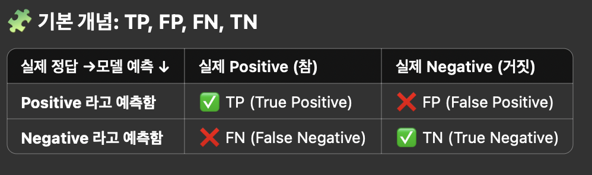
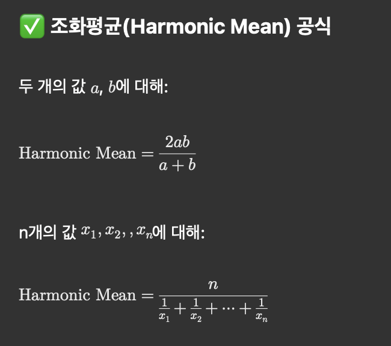
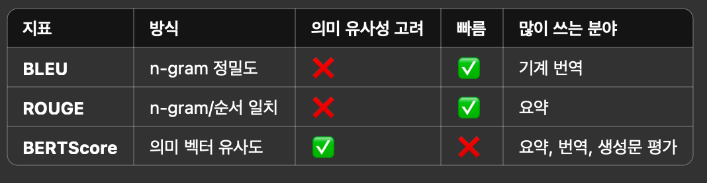
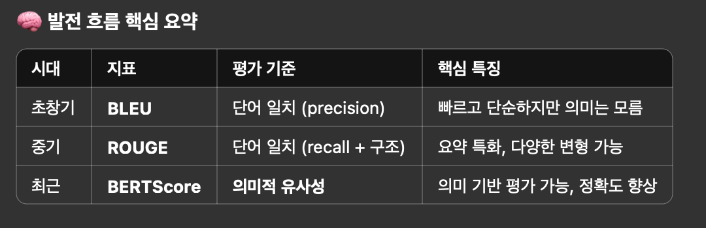
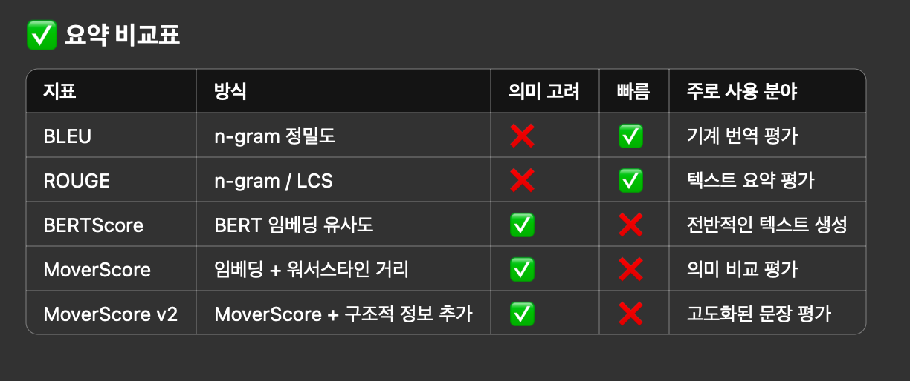
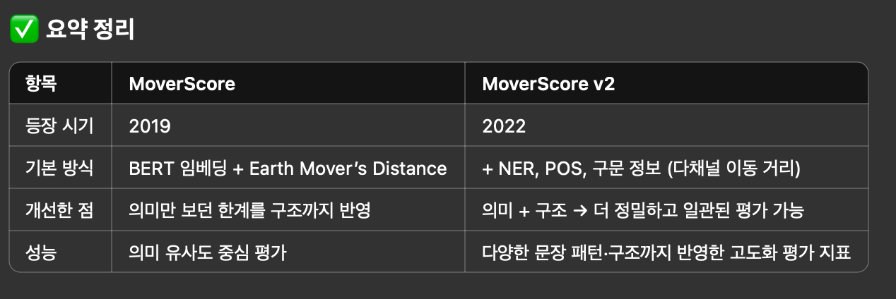

# 3.Evaluation LLM Summarization    

- [3.Evaluation LLM Summarization](#3evaluation-llm-summarization)
  - [Precision, Recall, F1 Score](#precision-recall-f1-score)
      - [Precision 과 Recall 의 관계](#precision-과-recall-의-관계)
  - [Evaluate LLM Summarization](#evaluate-llm-summarization)
  - [NLP Evaluation - BLEU, ROUGE, BERTScore, MoverScore](#nlp-evaluation---bleu-rouge-bertscore-moverscore)

## Precision, Recall, F1 Score  

  

✅ TP (True Positive)  
 - Positive = 참이라고 모델이 예측했는데, True 그것이 진실이다.  
 - 예: 암 환자인데 모델도 암이라고 예측함  

❌ FP (False Positive)
 - Positive = 참이라고 모델이 예측했는데, False 그것이 진실이다.  
 - 예: 멀쩡한 사람인데 모델이 암이라고 잘못 판단함 (거짓 경보)   

❌ FN (False Negative)  
 - 정답은 Yes, 예측은 No  
 - 예: 암 환자인데 모델이 건강하다고 예측함 (놓친 정답)  

✅ TN (True Negative)  
 - 정답도 No, 예측도 No   
 - 예: 건강한 사람을 건강하다고 잘 맞춤    

--- 

📐 위 기준으로 지표 계산

Precision (정밀도)
- TP / ( TP + FP )  
- 모델이 맞췄다고 한 것 중 실제로 맞은 비율

Recall (재현율)
- TP / ( TP + FN )  
- 실제 정답 중에서 모델이 잘 맞춘 비율 

F1 Score
- Precision + Recall의 조화평균
- 정밀도와 재현율을 균형 있게 평가한 지표

🎯 왜 중요한가요?
 - TP, FP, FN, TN은 모델 성능을 진짜로 분석할 때 기본이 되는 값이에요.
 - 이 4개 값을 알면 모든 평가 지표를 계산할 수 있어요.
 - 특히 불균형 데이터(예: 사기 탐지, 암 진단)에서는 Accuracy(정확도)보다 훨씬 중요해요.

--- 

조화평균의 공식   
  
**값들 중 작은 값에 더 큰 가중치를 두어, 전체 균형을 평가**하려는 목적이에요.  
- 🔍 비유: “느린 놈이 전체를 느리게 만든다”  
- 두 값 중 작은 값이 전체 평균을 지배하게 되는 구조예요.  
  - 🎯 접근 2: 작업 효율 비유 (좀 더 일반적인 설명)  
    - 어떤 사람이 1시간에 a개 작업, 다른 사람은 1시간에 b개 작업, 이 둘이 같이 1개의 작업을 하면 얼마나 걸릴까요?    

--- 

#### Precision 과 Recall 의 관계  

✅ 1. Precision ↑, Recall ↑ (정밀도 높고, 재현율도 높음)
 - 최고의 이상적인 상황, 모델이 정답도 잘 찾고, 틀리는 경우도 거의 없음.
 - 예:스팸 필터가 스팸을 거의 다 잡아내면서
 - 🎯 모델 성능 우수, 실용성 높음

✅ 2. Precision ↑, Recall ↓ (정밀도 높고, 재현율 낮음)
 - 모델이 정답을 놓치긴 하지만, 맞췄다고 한 건 거의 다 진짜 정답이에요.
 - 암 진단 모델이 확실한 경우에만 ‘암’이라고 예측함
- 🎯 보수적 판단, 거짓 양성(False Positive)을 줄이는 게 중요한 경우에 적합
- → 예: 재판, 약 추천, 고위험 금융 모델

✅ 3. Precision ↓, Recall ↑ (정밀도 낮고, 재현율 높음)
 - 모델이 정답을 많이 찾긴 하지만,헛다리도 많이 짚음 (오답도 많음)
 - 스팸메일 대부분을 탐지했지만, 정상 메일까지 스팸으로 오판
 - 암 진단에서 환자는 거의 다 걸러내지만, 건강한 사람도 암이라고 오진
- 🎯 정답을 놓치면 안 되는 상황에 적합 → 예: 범죄 탐지, 응급 질병 스크리닝, 테러 탐지

## Evaluate LLM Summarization    

https://medium.com/data-science/how-to-evaluate-llm-summarization-18a040c3905d#60ce

결론부터 말하면, 이 글은 LLM 요약 평가의 어려움과 기존 평가 방법의 한계점을 설명하고, 이를 보완한 실용적이고 정량적인 요약 평가 프레임워크를 제안한 글이에요. 핵심은 요약 평가를 정밀하고 체계적으로 수행하려면 정밀도(precision)와 재현율(recall)의 관점에서 접근해야 하며, DeepEval 프레임워크를 기반으로 보완이 필요하다는 점이에요.

⸻

✅ 핵심 요약

1. LLM 요약 평가가 어려운 이유
 - 요약은 정답이 정해지지 않은 개방형(open-ended) 작업이라 정량적 평가가 어렵고 주관성이 커요.
 - 레퍼런스 요약 생성이 어렵기 때문에 자동화된 평가 데이터셋 구성이 어려워요.
 - 기존 BLEU, ROUGE 등 전통적인 평가지표는 추출 요약(extractive)에 적합하며, LLM의 추상 요약(abstractive)에는 잘 맞지 않아요.

2. 좋은 요약의 조건 (4가지 요소)  
 - **Relevance**: 원문에서 중요한 내용을 잘 담고 있어야 해요.  
 - **Conciseness**: 반복 없이 핵심만 담아 간결해야 해요.  
 - Coherence: 구조적으로 논리적 흐름이 있어야 해요.  
 - Faithfulness: 원문에 없는 내용을 환각(hallucination)하면 안 돼요.  
   - *첫번째 두번째를 합쳐서 F1 Score 처럼 만들 수 있다.  

3. 기존 DeepEval 요약 평가 방식
 - Alignment (정밀도): 요약의 주장들이 원문에서 나온 정보와 일치하는지 평가.
 - Coverage (재현율): 원문에 기반한 질문에 요약만으로 얼마나 잘 답할 수 있는지 평가.
   - 최종 점수는 min(alignment, coverage)로 계산돼요.

🛠 개선된 요약 평가 방식 (작성자가 직접 개발)

✅ 문제점 & 해결책

1.Yes/No 질문만 사용하는 Coverage 평가
 - 단답형이어서 정보 풍부도 측정에 한계.
 - → 복잡한 열린 질문을 생성하고, 요약에서 생성한 답변과 원문에서 생성한 정답을 0~5점으로 비교해 정량화.

2.Alignment 평가 시 원문에서 일부 정보만 추출  
 - 요약의 진실성 검증이 불완전.  
 - → 요약의 주장과 전체 원문을 함께 LLM에 제공해 정확하게 비교.  

3.최종 점수가 min(alignment, coverage)  
 - 재현율만 낮아도 점수가 낮아짐.  
 - → F1 score 사용으로 정밀도·재현율 균형 있게 반영.  

📏 추가 평가 지표  
1.	Entity Density (정보 밀도)  
 - 요약 문장당 고유명사 비율 (0.15가 이상적)  
 - 너무 낮으면 부실, 너무 높으면 과밀.  
2.	Vagueness Score (모호성)  
 - 요약 문장을 문장 단위로 쪼개고, 모호한 표현 여부 평가.
3.	Repetitiveness Score (반복성)
 - 요약 내 중복된 정보나 주장을 LLM이 평가.
4.	Coherence Score (문장 흐름 일관성)
 - 인접하지 않은 문장 간 의미 유사도 (cosine similarity)로 평가.

## NLP Evaluation - BLEU, ROUGE, BERTScore, MoverScore

    
   
 

BERTScore, ROUGE, BLEU는 모두 자연어 처리(NLP)에서 요약, 번역, 생성된 문장 평가 등에 쓰이는 텍스트 유사도 평가 지표예요. BERTScore, ROUGE, BLEU, MoverScore, MoverScore v2는 **자연어 처리(NLP)**에서 생성된 문장(예: 요약, 번역, 챗봇 답변 등)이 얼마나 좋은지를 평가하는 문장 간 유사도 측정 방법이에요. 각각 다른 방식으로 기준 문장(reference)과 생성 문장(candidate)의 유사도를 계산해요.  

1. BLEU (Bilingual Evaluation Understudy), 2002년  
 - 방식: 단어 n-gram(연속된 단어 조합) 비교  
 - 특징: 기계 번역 품질 평가용으로 처음 개발됨  
 - 단점: 단어의 정확한 일치만 보기 때문에 어휘나 표현이 달라도 점수가 낮게 나올 수 있음
 - 기준: The cat is on the mat
 - 생성: The cat is sitting on the mat
 - → “is on the mat”은 일치하지만 “sitting”이 들어가서 점수는 낮게 나올 수 있어요.

2. ROUGE (2004년) (Recall-Oriented Understudy for Gisting Evaluation)
 - 방식: 생성 문장에서 기준 문장과 겹치는 단어(또는 n-gram) 비율 측정
 - 언제 쓰나요?: 요약 평가에서 많이 사용해요.  
 - 종류가 여러 개 있어요.  
 - ROUGE-N: n-gram recall 기반 (BLEU는 precision 기반이었죠)  
 - ROUGE-L: Longest Common Subsequence (LCS) 기반 → 두 문장 사이의 가장 긴 공통 부분열 길이.  
   - 장점: 문장 길이에 따라 잘 맞게 recall 기반으로 평가 가능.   
   - 단점: 역시 단어 매칭 기반이라 의미는 이해 못함.  
 - 용도: 요약 평가에 많이 사용됨  
 - 특징: 기억률(recall) 중심 — 기준 문장에서 얼마나 많이 건졌나를 본다는 뜻  

3. BERTScore (2019년)  
 - BERT 같은 사전학습된 언어 모델을 이용해서, 문장 내 **단어의 의미(embedding)**를 벡터로 바꿔요.   
 - 생성된 문장과 참조 문장의 **단어 의미 벡터 간 유사도(코사인 유사도)**를 비교해 점수를 내요.  
 - 장점:문장이 다르더라도 의미가 비슷하면 높은 점수 가능 → 패러프레이징에도 강함.  
 - 단점: 계산이 BLEU/ROUGE보다 무거움 (하지만 요즘 성능 충분한 GPU면 문제 없어요).  

4. MoverScore
 - 방식: 단어 임베딩 벡터를 바탕으로, 하나의 문장에서 다른 문장으로 단어 의미를 ‘이동’시키는 비용(워서스타인 거리)을 측정
 - MoverScore는 BERTScore를 ‘개선’한 것이 아니고, BERTScore와는 다른 아이디어 기반의 평가 지표예요.
 - 핵심 방식 :	단어 임베딩 간 의미 유사도 (cosine similarity)	임베딩 분포 간 이동 거리 (Earth Mover’s Distance) 계산
 - 장점: 문장 전체 구조나 의미 흐름 반영 / 단점: 계산 복잡도 있음

예를 들어 설명하면   
 - 기준 문장: “The cat is on the mat”    
 - 생성 문장: “The feline rests on the rug”   

BERTScore  
 - “cat” ↔ “feline” → 코사인 유사도 높음 → 높은 점수 
 - 단어 단위 매칭 + 유사도 평균  

MoverScore
 - “cat”, “mat” → “feline”, “rug”  
 - 문장 전체의 의미 분포를 하나에서 다른 쪽으로 ‘이동’시킴  
 - 단어 수나 위치 차이도 반영하면서 의미적 유사성 고려  

--- 

5. MoverScore v2
 - 업그레이드 버전: MoverScore v2는 MoverScore의 “의미만 보는 한계”를 개선해서, 문법·구문·개체명 등 더 풍부한 문장 구조 정보를 반영한 평가 지표   
 - 문장 구조, 개체명(NER), 구문 구조까지 반영해서 더 정교하게 문장 유사도 판단    
 - 실험적으로 여러 benchmark에서 성능 개선됨  

      

🔸 예시로 비교

- 문장1	문장2	실제 의미 차이	MoverScore	MoverScore v2
- “The doctor helped the patient”	“The patient helped the doctor”	
- 실제 의미 차이는 큼, 근데 MoverScore는 유사 (단어 유사) 라고 판단.  
- MoverScore v2는 다르다고 나옴 (구조까지 반영)

