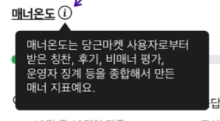
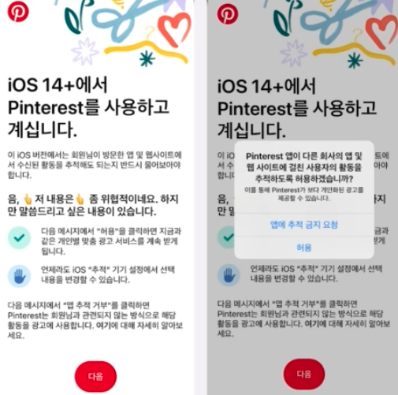
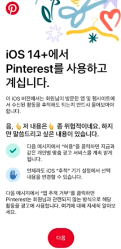
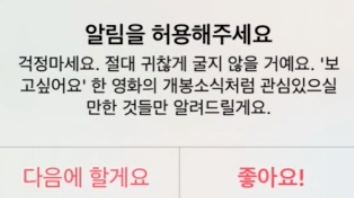
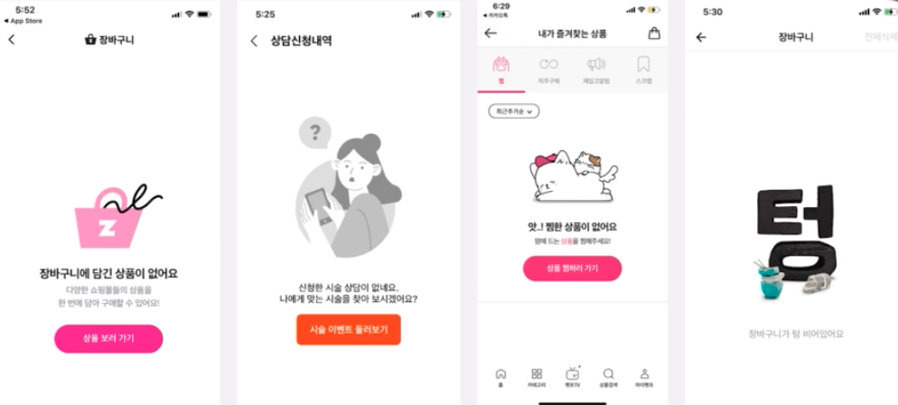
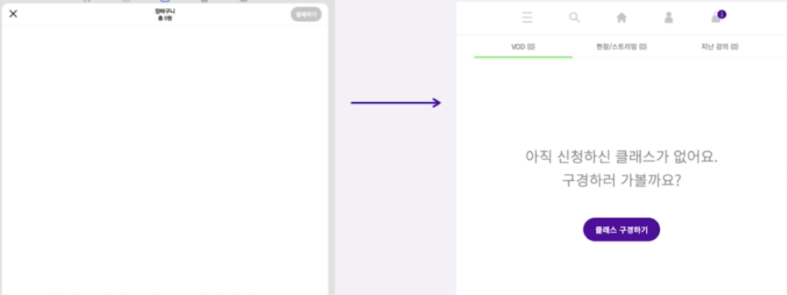
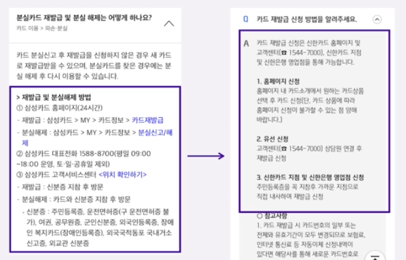
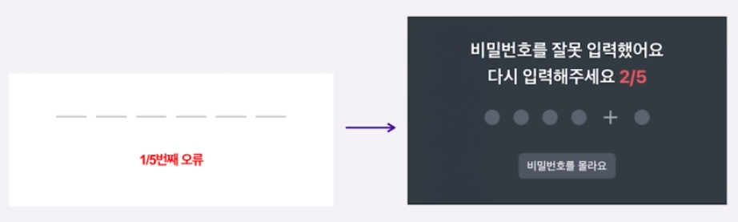
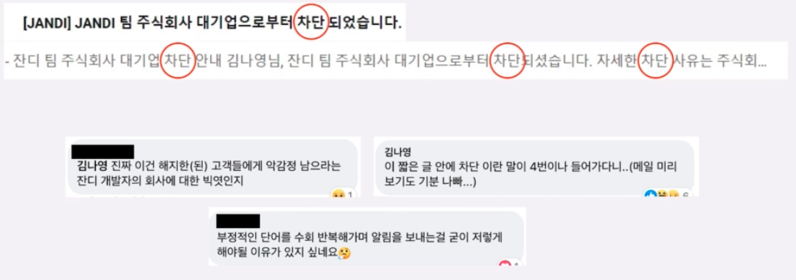

# UX Writing 

## Terms

Writing : **정보 전달**을 목적으로, **단어,문장을 정리**하여 글을 쓰는 것   
UX : User Experience, 사용자의 경험을 편안하게 만드는 것    
- UX Writing : 사용자와 직접 상호작용 할 수 있는 인터페이스 제작 + 복잡하고 어려운 용어를 사용자 친화적으로 바꾸어 행동을 이끌어내는 글쓰기  

CopyWriting  
- 판매 중심, 사용자를 후킹하는 **매력적인** 어휘  
- 기억에 남게끔 자주 노출  
- 익숙함을 파괴하고 브랜드, 상품, 서비스의 특성을 개성있게 드러낸다.  
- 사용자에게 일방적으로 이야기를 한다.  

UX Writing  
- 제품 중심, 제품을 설명하는 단순,명확한 어휘  
- 필요한 순간에 적절하게 쓰임, 한번이라도 제대로 전달  
- 오히려 익숙한 문구를 사용하여 브랜드, 상품, 서비스 이용에 오해와 불편함이 없게끔 한다. 
- 사용자와 대화를 한다.  

  

마이크로 카피  
- 작은 하나의 버튼의 문구 등  

## UX Writer 역할  

- 구글 : 디자인과 제품의 경험을 향상시키는 것
- 애플 : 아이디어를 명확하게 전달할 수 있는 가장 좋고 가장 짧은 방법을 찾는 것
- 우버 : 사람들이 물리적으로 움직일 수 있는 경험을 촉진시키는 것
- 드롭박스 : 복잡한 기술 언어를 사람들의 언어로 번역하는 것

고객 입장으로 생각하기 + 창의적으로 브랜딩 녹여내기 + 원하는 행위를 이끌어내기 + 프로덕트를 빠짐없이 이해하기   
예) 
- 청자에 대해 정의하기  
- 용어를 통일해서 사용하기  
- 맞춤법 지키기  
- CS공수를 줄이도록 QnA 페이지 업데이트  


## UX 라이팅의 네 가지 조건 

### 1.고객지향성
• 고객과 오프라인에서 대화하듯이 쓴다.
• 고객을 명확하게 설정하고 지칭하기
• 높은 공감력과 감수성 탑재!

뱅크 샐러드  
아껴 쓰느라 고생 많으셨어요~ < 오늘 등록된 지출 내역을 확인해보세요!  

스타벅스  
최상의 맛을 위해 지금 픽업대에서 만나요!


### 2.일관성
• 하나의 디지털 제품에 들어가는 문구는 동일한 보이스, 톤, 용어 유지하기
• 헷갈림이 없게 하자
• 요즘 애들은...불편하면 바로 이탈해요.

- 스크랩했습니다.
- 스크랩북 보기
- 스크랩북


### 3.명확성

• 필수적인 사항만 전달하여 핵심 메시지가 흐려지지 않게 하기
• 한 문장에서 한 가지 목표에 집중하기
• 어떤 과정인지를 명확히 알려서 현재 상태와 해야 할 행동을 알리기

토스에서는 한 문장에 하나의 의미만 전달한다.   
- 서류 심사 없이 한도와 금리 확인, 대출 실행까지  
- 카드 본인 인증만으로 3분만에 대출 실행이 가능해요  
- 안전한 거래를 위해 딱 한번 본인 인증을 진행합니다:)

### 4.효율성

• 한정된 인터페이스 내에서 정보 전달하려면   
• 짧고 가독성 좋게 쓰기  
• 불필요한 단어, 문장 부호 생략하기   

카카오톡 배너는 비싸고, 짧은 문장으로 후킹을 해야 한다.  
- 무료촬영권 도착했습니다.
- 나만없어..아이폰12 재고정리! • 예약하기 Swiftmall 다시 없을 특가


## UX 라이팅의 여섯 가지 전략

### 1.명확하고 올바르게 쓰기

• 한자식 표현을 자제한다.  
예) 우선적으로 - 먼저  
• 번역투의 표현을 자제한다.  
예) 사용가능한 - 사용할 수 있는  

• 과도한 외래어를 쓰지 않는다.  
• 올바른 숫자, 기호 표기를 사용하자.  
• 맞춤법 검사는 필수!  
• 헷갈림, 불편함이 없게 쓰자  

  


### 2.간결하게 쓰기

• 모바일에서 가장 중요한 전략이다.  
• 불필요한 단어와 조사는 모두 뺀다.  
• 중복되는 내용도 뺀다.  
• 뺄수록 의미가 명확해지는 마법!  
• 전체를 다 읽지 않아도 되게끔  
• 두괄식으로 쓰자.  

eg)
```
증가하도록 하기 위해서는 > 늘리려면
규제로 인하여 > 규제 때문에
~에 비해 > ~보다
일정부분 > 일부
진행 중에 있다 > 진행 중이다
참여하게 됨으로써 > 참여해서
```

eg) 토스  
  

### 3.쉽게 쓰기

• 성별, 나이 상관없이 이해가 가능하게 쓰자.  
• 나에 대해 모른다는 생각으로 쓰기 시작하자.  
• 서비스, 브랜드를 모른다는 생각으로 시작한다. 
• 업계 외계어를 주의하자.  

eg)
User0001님, 환영합니다 -> 환영합니다.
• 장기 휴면- 장기 미사용 
• 월납요금 ~ 월 납입액  
• 중복인증 - 이중인증  
• 신규발급 회원 - 신규회원  
• 마스킹 - 정보가림 

### 4.고객과 대화하듯 쓰기  

• 고객의 입장에서 출발하자.  
• 오프라인에서 실제로 대화한다고 생각하자.  
• 적절한 구어체의 사용은 친근함을 느끼게 할 수 있다.  
• 대상의 목적과 상황, 수준 등을 고려하자.  
• 부정적인 표현을 최소화하자.  

eg)
사용자가 결제를 취소하셨습니다 > 결제가 취소되었습니다. 다른 방법으로 시도해보시겠어요?  
선택 작품으로 분석된 회원님의 취향입니다. > 선택하신 작품을 바탕으로 회원님의 취향을 골라봤어요!   
도착지 입력 > 어디로 갈까요?  

    
    
    


### 5.폰트, 색상, 글꼴, 이모지 .. 활용  

• 가독성 좋은 폰트 사용  
• 강조해야 할 부분은 크기와 색상을 바꾸거나, 볼드체 활용  
• 센스있게 이모지 활용  
• 디자이너와 함께 작업하며, 어떤 부분을 강조하고 어떤 부분을 숨길지 정하자.  

폰트 : Noto Sans  

eg)
    

### 6.사용자 피드백과 데이터 활용하기

• 문의가 많은 부분, 이탈이 많은 부분은 텍스트를 수정하거나 추가해보자. 
(장바구니나 뒤로가기 등)  
• 상품이 아니라 텍스트만 바꿔도 매출이 오를 수 있다.    
• CTA라면 더더욱, A/B 테스트를 통해 전환률이 높은 텍스트를 선택한다.  

eg)  
    

## 사례  

    
    
    
    
    
    
    
    
    
    
    
    
    
    
    
    


## 연구

UX/UI 많이 보기 + 키워드 연구  
https://wwit.design/  
https://emojitracker.com/ 
https://whereispost.com/keyword/  
https://blackkiwi.net/   


https://channel.io/ko/blog/crm-marketing-aarrr-case3  