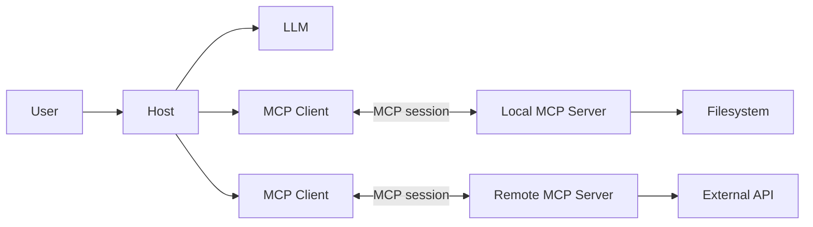

# Model Context Protocol(MCP)

[MCP - 초심자 해설]

이번 문서에서 주목할 포인트 몇 가지를 짚어 보겠습니다.

## 포인트 1. MCP는 AI와 외부 시스템 사이의 연결 규칙이다

MCP(Model Context Protocol)는 AI 애플리케이션이 외부 데이터와 기능을 일관된 방식으로 사용하게 해주는 개방형 프로토콜입니다. MCP가 모델의 추론 능력을 높이는 것은 아닙니다. 모델과 파일시스템, 데이터베이스, SaaS, 사내 API 사이에 공통 연결 규칙을 만드는 것이 핵심입니다.

MCP가 없다면 AI Host나 agent framework마다 외부 서비스에 맞는 adapter를 따로 구현해야 합니다. MCP를 사용하면 외부 기능을 Server에 캡슐화하고 여러 Host에서 같은 인터페이스로 재사용할 수 있습니다.

```text
직접 연동
AI App A ── 전용 adapter ── External API
AI App B ── 또 다른 adapter ── External API

MCP 연동
AI App A ─┐
          ├── MCP Server ── External API
AI App B ─┘
```

MCP는 다음 상황에서 특히 유용합니다.

- 여러 AI Host가 같은 데이터나 기능을 사용해야 할 때
- 하나의 Host가 여러 외부 시스템을 연결해야 할 때
- 로컬과 원격 실행 환경을 교체할 가능성이 있을 때
- Server를 Host와 독립적으로 개발하고 배포해야 할 때

반대로 단일 애플리케이션 내부에서 고정 함수 몇 개만 호출한다면 직접 function calling이나 SDK 호출이 더 단순할 수 있습니다. MCP는 외부 API의 품질, 인증, 권한 문제까지 자동으로 해결해 주는 도구가 아닙니다.

## 포인트 2. Host·Client·Server는 서로 다른 책임을 가진다

MCP의 구조는 Host, Client, Server 세 역할로 이해하면 쉽습니다. Host는 전체 AI 애플리케이션이고, Client는 특정 Server와 통신하는 연결 객체이며, Server는 실제 데이터와 기능을 제공합니다.

| 구성 요소 | 주요 책임 | 예시 |
| --- | --- | --- |
| Host | 사용자 경험, 모델 통합, 승인 정책, Client 생명주기 관리 | IDE, desktop AI app, agent runtime |
| Client | Server 연결, protocol 협상, 메시지 송수신 | Host 내부의 MCP 연결 객체 |
| Server | Resource, Prompt, Tool 제공 | filesystem server, database server |

하나의 Host는 여러 Client를 만들 수 있지만, 각 Client는 특정 Server와 1:1 session을 유지합니다. 이 구조는 Server마다 신뢰 경계를 분리하는 데 중요합니다. 파일, DB, SaaS처럼 권한과 장애 범위가 다른 기능은 별도 Server로 나누는 편이 좋습니다.



대화 전체와 다른 Server의 데이터는 Host가 관리합니다. 각 Server에는 작업에 필요한 정보만 전달해야 하며, Server가 다른 Server나 전체 대화를 임의로 들여다볼 수 있다고 가정하면 안 됩니다.

## 포인트 3. MCP는 JSON-RPC 메시지를 transport 위에서 교환한다

MCP 요청, 응답, notification은 JSON-RPC 2.0 형식을 사용합니다. JSON-RPC는 메시지 모양을 정의하고, transport는 그 메시지를 실제로 전달하는 방법을 결정합니다.

표준 transport는 실행 위치에 따라 선택합니다.

- `stdio`: Client가 로컬 MCP Server를 subprocess로 실행할 때 적합합니다.
- `Streamable HTTP`: 독립적으로 실행되는 원격 MCP Server에 연결할 때 적합합니다.
- 구형 `HTTP+SSE`: 2024-11-05 protocol version과의 호환이 필요할 때만 고려합니다.

연결은 `Initialization → Operation → Shutdown` 순서로 진행합니다.

```text
Client                         Server
  | -------- initialize --------> |
  | <---- version/capability ---- |
  | -- notifications/initialized >|
  | ------- list/call/read ------> |
  | <------- result/error -------- |
  | ----------- shutdown --------> |
```

초기화에서는 protocol version과 양쪽이 지원하는 capability를 협상합니다. 이후에는 협상된 범위 안에서만 기능을 사용해야 합니다. 예를 들어 Server가 `tools` capability를 선언하지 않았다면 Client는 Tool 호출을 시도하면 안 됩니다.

구현할 때는 다음 규칙을 놓치기 쉽습니다.

- `stdio` Server의 stdout에는 유효한 MCP 메시지만 기록하고 로그는 stderr로 보냅니다.
- HTTP 연결은 협상한 `MCP-Protocol-Version`과 session을 관리합니다.
- 모든 요청에는 timeout을 두고 cancellation과 연결 종료를 처리합니다.
- 원격 연결은 재연결뿐 아니라 인증과 권한 실패도 구분해 표시합니다.

## 포인트 4. Tools·Resources·Prompts는 제어 주체와 용도가 다르다

MCP Server가 제공하는 대표 primitive는 Tools, Resources, Prompts입니다. 세 기능은 비슷해 보이지만 누가 선택하고 무엇을 제공하는지 다릅니다.

| Primitive | 기본 제어 주체 | 적합한 용도 | 대표 예시 |
| --- | --- | --- | --- |
| Tools | Model | 조회, 계산, 변경 작업 실행 | API 호출, DB 질의, 파일 변경 |
| Resources | Application | 읽을 context 제공 | 파일, 문서, DB record |
| Prompts | User | 재사용할 작업 template 선택 | slash command, 분석 workflow |

Tools는 `tools/list`로 발견하고 `tools/call`로 실행합니다. 입력은 `inputSchema`로 제한하고, 가능하면 `outputSchema`와 `structuredContent`를 사용해 결과도 예측 가능한 형태로 만듭니다. 파일 삭제처럼 side effect가 있는 Tool은 이름과 설명만 믿고 실행하지 말고 Host에서 승인과 권한을 확인해야 합니다.

Resources는 `resources/list`로 발견하고 `resources/read`에 URI를 전달해 읽습니다. 고정 URI는 Resource로 제공하고, 경로나 검색어 같은 인자를 받아 URI가 달라진다면 Resource Template을 사용합니다. `name`, `description`, `mimeType`을 명확히 적고 큰 데이터는 pagination이나 범위 조회로 제한합니다.

Prompts는 `prompts/list`로 template을 발견하고 `prompts/get`으로 완성된 message를 가져옵니다. 사용자가 직접 선택하는 반복 workflow에 적합하며, 애플리케이션의 모든 system prompt를 MCP Prompt로 옮길 필요는 없습니다.

선택이 헷갈릴 때는 다음 기준으로 판단합니다.

```text
읽을 데이터인가?              → Resource
사용자가 선택할 workflow인가? → Prompt
실행하거나 변경할 기능인가?   → Tool
```

## 포인트 5. 구현의 핵심은 많은 기능보다 명확한 계약이다

MCP Server를 만들 때는 Python, TypeScript, Java, C# 등 운영 환경에 맞는 공식 SDK를 선택합니다. Server 하나가 너무 많은 도메인을 담당하지 않게 범위를 먼저 정한 다음, 필요한 Tool, Resource, Prompt만 등록합니다.

Server 구현은 다음 순서로 진행할 수 있습니다.

1. Server가 담당할 도메인과 접근 권한을 정합니다.
2. 로컬 `stdio` 또는 원격 `Streamable HTTP` transport를 선택합니다.
3. Server metadata와 capability를 선언합니다.
4. Tool, Resource, Prompt handler와 schema를 등록합니다.
5. 입력 검증, 구조화된 오류, timeout, logging을 추가합니다.
6. MCP Inspector 또는 실제 Client 통합 테스트로 검증합니다.

좋은 interface는 모델이 이름만 보고도 기능을 구분할 수 있습니다. capability 이름에는 동사와 대상을 드러내고, description에는 사용 조건, 제외 조건, side effect를 적습니다. schema에는 `required`, `enum`, 값의 범위를 사용해 애매한 입력을 줄입니다.

```text
모호한 이름: process_data
구체적인 이름: search_support_tickets

모호한 설명: 티켓을 처리한다.
구체적인 설명: status와 priority로 지원 티켓을 조회한다. 데이터를 변경하지 않는다.
```

Client를 연동할 때는 연결 후 initialization을 완료하고 협상된 capability만 조회합니다. 호출 직전에는 Server의 설명을 그대로 신뢰하지 말고 Host 정책에 따라 사용자 승인, arguments, 결과 크기를 확인해야 합니다. 정상 응답뿐 아니라 timeout, 권한 거부, schema 오류, 연결 종료도 테스트 대상으로 고정합니다.

## 포인트 6. MCP 도입 여부는 재사용성과 운영 비용을 함께 보고 결정한다

MCP를 사용한다고 모든 연동이 자동으로 좋아지는 것은 아닙니다. 표준화로 얻는 재사용성이 Server 운영과 보안 비용보다 클 때 도입하는 것이 좋습니다.

도입 전에 다음 질문을 확인합니다.

- 같은 기능을 여러 Host나 agent에서 재사용하는가?
- 기능 탐색과 capability 협상이 필요한가?
- Server를 독립적으로 배포하거나 로컬·원격 실행을 교체해야 하는가?
- Resource, Prompt, Tool의 경계를 명확히 설명할 수 있는가?
- 인증, 최소 권한, 사용자 승인과 감사 방법이 준비되어 있는가?
- timeout, 재연결, 오류 응답과 version 호환성을 운영할 수 있는가?

대부분이 아니라면 우선 직접 API 또는 function calling으로 작게 시작하는 편이 낫습니다. MCP를 선택했다면 많은 기능을 한꺼번에 공개하기보다 읽기 전용 Resource나 위험이 낮은 Tool 하나로 연결, schema, 승인, 오류 처리 흐름을 먼저 검증해야 합니다.

참고 자료

- [MCP Specification 2025-11-25](https://modelcontextprotocol.io/specification/2025-11-25)
- [Architecture](https://modelcontextprotocol.io/specification/2025-06-18/architecture)
- [Lifecycle](https://modelcontextprotocol.io/specification/2025-11-25/basic/lifecycle)
- [Transports](https://modelcontextprotocol.io/specification/2025-11-25/basic/transports)
- [Server Resources](https://modelcontextprotocol.io/specification/2025-11-25/server/resources)
- [Schema Reference](https://modelcontextprotocol.io/specification/2025-11-25/schema)
