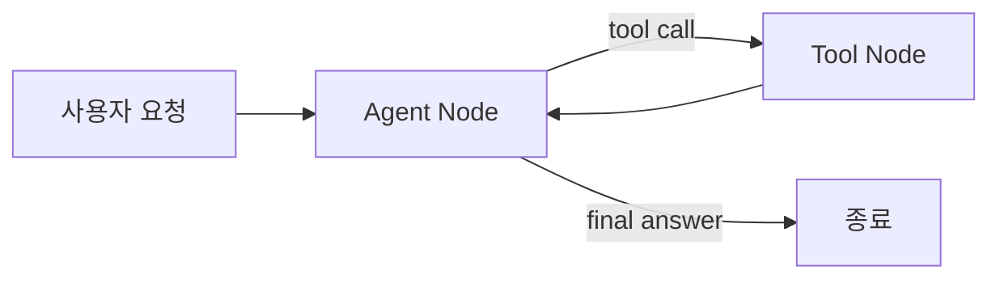
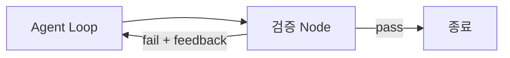
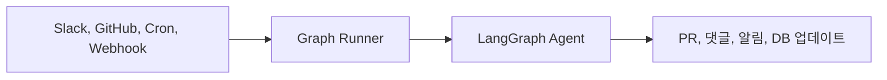
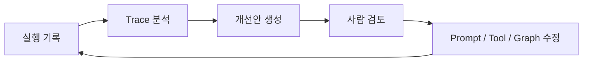

# Loop Engineering

에이전트는 단순히 LLM을 한 번 호출하는 프로그램이 아니다. 실제 작업을 맡기려면 모델이 도구를 호출하고, 결과를 확인하고, 실패하면 다시 시도하고, 외부 이벤트에 반응하고, 실행 기록을 기반으로 점점 개선되는 구조가 필요하다.

LangChain의 글 [The Art of Loop Engineering](https://www.langchain.com/blog/the-art-of-loop-engineering)은 이 구조를 여러 겹의 루프로 설명한다. LangGraph는 이 루프들을 명시적인 그래프 구조로 표현하기 좋은 도구다.

## 핵심 아이디어

Loop Engineering은 에이전트를 하나의 거대한 프롬프트로 해결하려는 접근이 아니다. 대신 에이전트가 반복적으로 수행해야 하는 흐름을 분리하고, 각 루프의 책임을 명확히 설계하는 방식이다.

대표적인 루프는 다음과 같다.

| 루프 | 역할 | LangGraph 관점 |
| --- | --- | --- |
| Agent Loop | 모델이 도구를 호출하며 작업을 완료할 때까지 반복 | LLM 노드, Tool 노드, 조건부 엣지 |
| Verification Loop | 결과를 평가하고 실패하면 피드백과 함께 재시도 | Grader 노드, Retry 엣지 |
| Event-driven Loop | 외부 이벤트가 에이전트 실행을 트리거 | API, Cron, Queue, Webhook |
| Hill-climbing Loop | 실행 기록을 분석해 에이전트 자체를 개선 | Trace, Eval, Prompt/Tool 개선 |

## 1. Agent Loop

가장 기본적인 루프는 모델이 도구를 호출하고, 도구 실행 결과를 다시 모델에 전달하는 흐름이다. 모델이 더 이상 도구 호출이 필요 없다고 판단하면 최종 응답을 반환한다.

LangGraph에서는 이 구조를 노드와 조건부 엣지로 표현할 수 있다.

이 루프의 핵심은 “모델이 생각한다”가 아니라 “모델이 다음 행동을 선택하고, 시스템이 그 행동을 실행한 뒤, 결과를 다시 상태에 반영한다”는 점이다.

LangGraph로 구현할 때는 보통 다음 요소가 필요하다.

- 현재 대화와 작업 상태를 담는 `State`
- 모델 호출을 수행하는 agent 노드
- 실제 행동을 실행하는 tool 노드
- 도구 호출 여부에 따라 흐름을 나누는 conditional edge

## 2. Verification Loop

기본 Agent Loop만으로는 결과 품질을 보장하기 어렵다. 모델은 도구를 호출할 수 있지만, 결과가 요구사항을 만족하는지 항상 정확히 판단하지는 못한다.

Verification Loop는 에이전트 실행 결과를 별도의 기준으로 평가하고, 실패하면 피드백을 상태에 추가해 다시 실행한다.

검증 노드는 결정적인 코드일 수도 있고, LLM 기반 grader일 수도 있다.

예를 들어 문서 작성 에이전트라면 다음 항목을 검증할 수 있다.

- 링크가 깨지지 않았는가?
- 요청 범위를 벗어난 파일을 수정하지 않았는가?
- 빌드가 통과하는가?
- 문서의 대상 독자와 톤이 맞는가?

LangGraph에서는 검증 결과를 상태에 저장하고, 조건부 엣지에서 `pass`와 `fail`을 분기하면 된다. 실패 횟수가 무한히 늘어나지 않도록 최대 재시도 횟수도 상태에 포함하는 것이 좋다.

## 3. Event-driven Loop

에이전트가 실제 시스템에서 유용해지려면 사람이 매번 수동으로 실행하지 않아도 되어야 한다. 특정 이벤트가 발생했을 때 자동으로 그래프가 실행되는 구조가 필요하다.

예시는 다음과 같다.

- GitHub 이슈가 생성되면 관련 문서를 찾아 초안을 작성한다.
- Slack 채널에 요청이 올라오면 담당 에이전트가 작업을 시작한다.
- 매일 정해진 시간에 실패한 작업 로그를 분석한다.
- 외부 API 이벤트가 들어오면 고객별 후속 작업을 실행한다.

이 루프에서 LangGraph는 전체 작업 흐름을 담당하고, 이벤트 수신은 FastAPI, 서버리스 함수, 메시지 큐, 스케줄러 같은 외부 실행 환경이 담당하는 식으로 분리하는 것이 일반적이다.

## 4. Hill-climbing Loop

앞의 세 루프는 작업을 자동화한다. Hill-climbing Loop는 에이전트를 개선하는 루프다.

에이전트가 실행되면 다음과 같은 기록이 남는다.

- 어떤 입력에서 실패했는가?
- 어떤 도구 호출이 불필요했는가?
- 어떤 프롬프트가 오해를 만들었는가?
- 검증 단계에서 반복적으로 실패하는 조건은 무엇인가?

이 기록을 분석하면 프롬프트, 도구 설명, 라우팅 조건, 검증 기준을 개선할 수 있다.

중요한 점은 개선 루프가 최종 응답으로 돌아가는 것이 아니라, 에이전트의 내부 구조로 돌아간다는 것이다. 즉 실행 결과를 보고 다음 실행의 harness 자체를 개선한다.

## LangGraph로 설계할 때의 기준

LangGraph에서 Loop Engineering을 적용할 때는 다음 질문을 먼저 던지는 것이 좋다.

1. 어떤 상태가 루프를 돌면서 누적되어야 하는가?
2. 어떤 조건에서 다음 노드로 이동해야 하는가?
3. 실패를 어떻게 감지하고, 어떤 피드백을 다시 넣을 것인가?
4. 재시도는 몇 번까지 허용할 것인가?
5. 어떤 단계에 사람의 승인이 필요한가?
6. 실행 기록을 어떻게 남기고 개선에 사용할 것인가?

단순한 Agent Loop는 빠르게 만들 수 있지만, 운영 가능한 에이전트는 대개 Verification Loop와 Event-driven Loop가 함께 필요하다. 품질을 지속적으로 끌어올리려면 Hill-climbing Loop까지 고려해야 한다.

## 정리

Loop Engineering은 에이전트의 신뢰성을 프롬프트 하나에 맡기지 않는 설계 방식이다. 모델 호출, 도구 실행, 검증, 이벤트 트리거, 실행 기록 기반 개선을 각각 독립적인 루프로 바라보고 조합한다.

LangGraph는 이 구조를 코드 안에 명시적으로 드러내기 좋다. 노드는 책임을 나누고, 엣지는 전이 조건을 표현하며, 상태는 루프 사이에서 필요한 맥락을 보존한다. 따라서 복잡한 에이전트를 만들수록 “어떤 모델을 쓸 것인가”만큼 “어떤 루프를 설계할 것인가”가 중요해진다.
