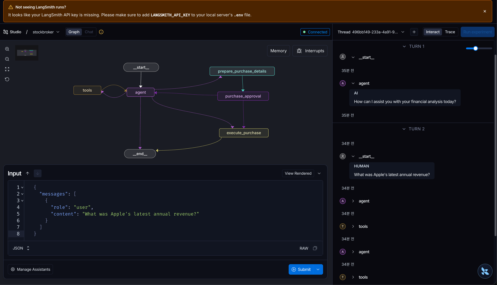
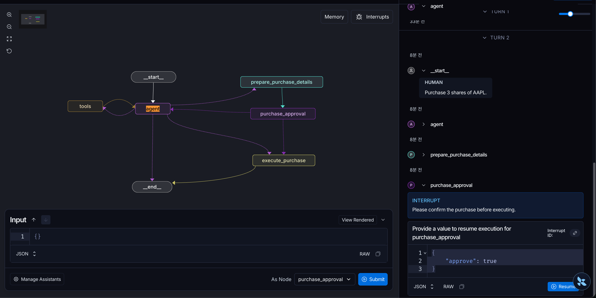
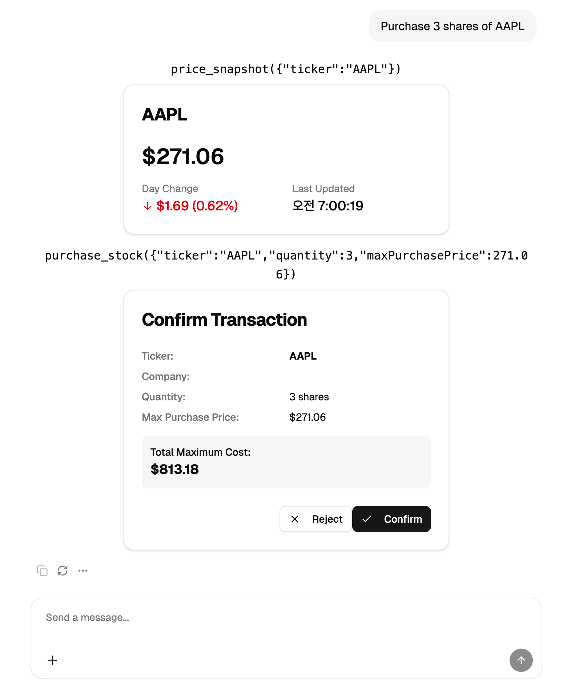

# Langgrah

선행지식
- uv python 설정 방법 : https://dosimpact.github.io/docs/g-mle/py/py01-uv  

## Langgrah 예제 분석  

설치 
- langgraph-cli : Standard API, Studio UI, API Docs 3가지를 만들어준다.  

```json
API: http://127.0.0.1:2025
Studio UI: https://smith.langchain.com/studio/?baseUrl=http://127.0.0.1:2025
API Docs: http://127.0.0.1:2025/docs
---
# langgraph.json  
{
  "python_version": "3.12",
  "dependencies": ["."],
  "graphs": {
    "stockbroker": "./src/backend_py/graphs/stockbroker/graph.py:graph"
  },
  "env": ".env"
}
```

### 테스트 해보기  

    

```json
  {
    "messages": [
      {
        "role": "user",
        "content": "What was Apple's latest annual revenue?"
      }
    ]
  }
```

agent node에서 LLM이 web_search 도구 호출을 원하면, 보통 최종 자연어 답변을 바로 내는 게 아니라 tool call이 포함된 AIMessage로 응답.  
- 여러 모델 Provider에 대응하기 위해서 AIMessage로 추상화 한다.  

```Json
OpenAI API 관점 request
{
    "model": "gpt-4.1-mini",
    "messages": [
      {
        "role": "system",
        "content": "You are a helpful stockbroker assistant."
      },
      {
        "role": "user",
        "content": "What was Apple's latest annual revenue?"
      }
    ],
    "tools": [
      {
        "type": "function",
        "function": {
          "name": "web_search",
          "description": "Search the web for recent or factual information.",
          "parameters": {
            "type": "object",
            "properties": {
              "query": {
                "type": "string",
                "description": "Search query"
              }
            },
            "required": ["query"]
          }
        }
      }
    ],
    "tool_choice": "auto"
  }
---
OpenAI API 관점 reponse 
  {
    "role": "assistant",
    "content": null,
    "tool_calls": [
      {
        "id": "call_drPLvWYJrfsxm4vui2FJrYYb",
        "type": "function",
        "function": {
          "name": "web_search",
          "arguments": "{\"query\":\"Apple latest annual revenue 2023\"}"
        }
      }
    ]
  }
---
Lang graph의 메시지 객체로 변환  
  AIMessage(
      content="",
      tool_calls=[
          {
              "id": "call_drPLvWYJrfsxm4vui2FJrYYb",
              "name": "web_search",
              "args": {
                  "query": "Apple latest annual revenue 2023"
              },
          }
      ],
  )
```

## 🌿 툴 정의  

```py
import json
from langchain_core.tools import tool
from langchain_tavily import TavilySearch

@tool
async def web_search(query: str) -> str:
    """Search the web for current information, such as a ticker symbol."""
    try:
        tool_impl = TavilySearch(max_results=2)
        result = await tool_impl.ainvoke({"query": query})
        return json.dumps(result, indent=2)
    except Exception as exc:
        return f"An error occurred while searching the web: {exc}"
--- 
정리하면:
  - 함수 이름 web_search: tool name으로 나감  
  - 함수 docstring: tool description으로 나감 (docstring은 Python에서 함수/클래스/모듈 바로 아래에 쓰는 설명 문자열)    
  - 함수 인자 타입/이름: tool parameters schema로 나감  
  - -> bind_tools(ALL_TOOLS_LIST): 이 tool들을 OpenAI request의 tools로 변환해서 붙임  
```

## human-in-the-loop  




```json
  {
    "messages": [
      {
        "role": "user",
        "content": "Purchase 3 shares of AAPL"
      }
    ]
  }
```

- purchase_approval 단계에서 interrupt가 발생한다.  
- interrupt에 대해서 resume하면 LangGraph는 그 노드를 다시 처음부터 다시 호출해서 실행 (즉 purchase_approval 함수가 처음부터 다시 호출)  
- 인터럽트 메시지를 보내는것은 좀 어렵다. Tool Call을 가정하고 있기때문이다.  


```json
 {
    "messages": [
      {
        "type": "tool",
        "name": "purchase_stock",
        "tool_call_id": "현재_trace의_purchase_stock_call_id",
        "content": "{\"approve\": true}",
        "status": "success"
      }
    ]
  }
---
  messages:
    - type: tool
      name: purchase_stock
      tool_call_id: call_gXbuUvLL8fZBkWmbv4ZgtkXc
      content: '{"approve": true}'
      status: success
```
