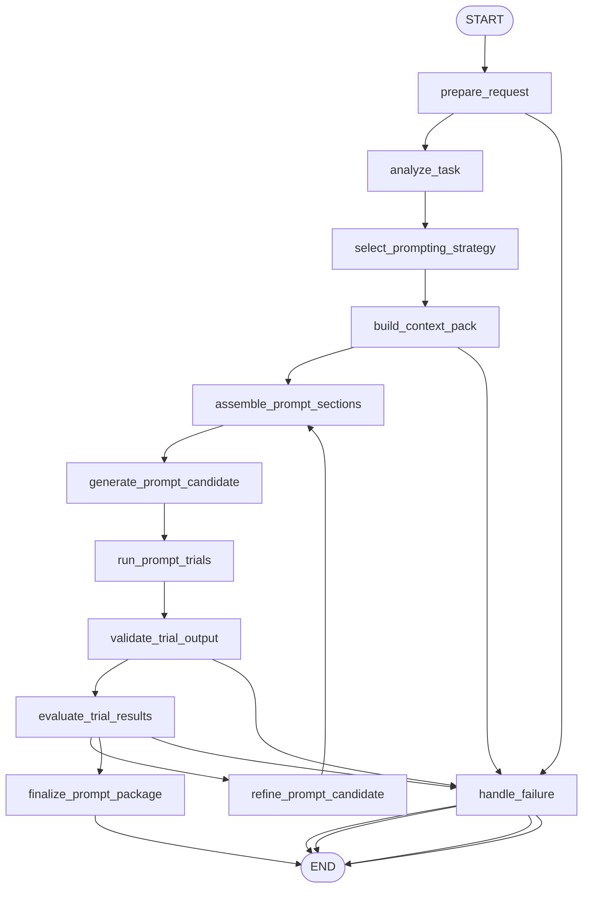

# Appendix A: Advanced Prompting Techniques (ko)

## 패턴 요약

고급 프롬프트 기법은 범용 언어 모델을 에이전틱 워크플로우 안에서 예측 가능한 구성 요소로 바꾸는 실용적 제어 수단이다. 부록 A는 명확성, 구체성, 간결함, 능동형 동사, 긍정적 지시, 반복적 정제 같은 핵심 프롬프트 원칙으로 시작한다. 이어서 제로샷/원샷/페샷/매샷 예시, 시스템 프롬프트, 역할 프롬프트, 구분자, 컨텍스트 엔지니어링, 구조화 출력, 사고 기법(Chain of Thought, self-consistency, step-back, Tree of Thoughts), 동작 기법(함수 호출, ReAct), 프롬프트 최적화 방법(Automatic Prompt Engineering, DSPy 스타일 최적화, 반복 정제, 반례, 비유, 분해, RAG, 페르소나, 지속형 작업 전용 어시스턴트, 메타 프롬프트 정제, 코드 프롬프트, 멀티모달 프롬프트) 등을 단계적으로 다룬다.

구현 관점에서 이 부록은 하나의 단일 프롬프트가 아니라 프롬프트 엔지니어링 작업대(workbench)로 다뤄야 한다. LangGraph 예제는 사용자 작업을 받아 어떤 종류의 프롬프트 지원이 필요한지 분석하고, 명시적 섹션으로 프롬프트 패키지를 조립한 뒤, 주입 가능한 모델/테스트 더블을 통한 제한된 시범 평가를 실행하고, 구조화 출력이 필요하면 검증한 다음, 실패를 바탕으로 정제하여 최종 프롬프트 패키지와 평가 메타데이터를 반환해야 한다.

## 패턴 설명

### 개념 개요

프롬프트는 에이전틱 시스템과 언어 모델 사이의 인터페이스 계층이다. 부록에서는 프롬프트 엔지니어링을 규율 있는 실천으로 보고, 작업을 명확히 기술하고, 필요한 컨텍스트만 제공하며, 예시가 유용할 때 목표 동작을 보여주고, 다운스트림 컴포넌트가 답변에 의존한다면 기계 판독 가능한 형식이 필요할 때 이를 요구하고, 실제 모델 출력 기반으로 반복 정제한다.

에이전트 시스템에서 프롬프트는 단발성 텍스트 조각이 아니다. 그래프 노드, 도구, 메모리, 검색, 모델 호출 사이의 재사용 가능한 계약으로 동작한다. 좋은 프롬프트는 모델의 역할, 입력, 컨텍스트 경계, 출력 스키마, 추론/도구 사용 기대치, 중단 조건을 충분히 설명해 그래프가 결과를 파싱하고 검증하며 라우팅할 수 있게 한다.

### 문제

언어 모델은 확률적이며 모호한 지시, 누락된 컨텍스트, 품질 낮은 예시, 상충되는 제약, 불충분한 출력 형식에 민감하다. 에이전트 그래프에서는 작은 결함이 연쇄적으로 증폭되어 파서를 깨뜨리거나 잘못된 도구를 호출하거나, 추론 단축으로 지원 불가 답변을 만들거나, 과도한 컨텍스트로 핵심 사실이 가려질 수 있다.

고급 프롬프트 기법은 이를 해결하기 위해 프롬프트 구성 과정을 명시적이고 테스트 가능하며 반복 가능하게 만든다. 그래프는 작업별로 단일 범용 프롬프트에 의존하지 않고 적절한 기법을 선택해야 한다.

### 사용해야 할 때

- 에이전트 노드에서 신뢰할 수 있고 반복 가능한 모델 동작이 필요할 때.
- 모델 출력이 다른 노드, 파서, 도구 호출, API, Pydantic 모델로 전달될 때.
- 형식, 어조, 분류 경계, 추출 스키마를 가르치기 위해 예시가 필요할 때.
- 다중 단계 추론, 대체 경로 탐색, 추상화, 분해가 필요한 작업일 때.
- 응답을 검색 기반 최신/사유자산/사용자 특화 컨텍스트에 근거해야 할 때.
- 운영에서 프롬프트를 재사용해야 하며 버전 관리/평가/정제가 필요한 경우.
- 샘플 입력 여러 건에서 프롬프트 품질을 측정해야 할 때.

### 사용하지 말아야 할 때

- 간단한 직접 지시로 충분한 작업은 복잡한 프롬프트 워크플로우를 피한다.
- 사용자에게 노출할 원시 chain-of-thought을 노출하지 않는다. 대신 간결한 근거, 검증 가능한 산출물, 증거를 반환한다.
- 예시 품질이 낮거나 편향/반복이 심하거나 실시간 작업에 컨텍스트를 과다 소모한다면 one-shot/many-shot 사용을 피한다.
- 지연/토큰 비용/모델 호출 예산이 촘촘한데 self-consistency나 Tree of Thoughts를 피한다.
- 도구 스키마, 권한, 실행 경계가 명확하지 않으면 도구 사용 프롬프트를 사용하지 않는다.
- 구조화 출력 프롬프트는 파서 검증과 실패 시 폴백 없이 사용하지 않는다.
- 금형 데이터, 점수 지표, 검토 프로세스 없이 자동 최적화를 하지 않는다.

### 작동 방식

1. 그래프는 작업 설명, 대상 사용자, 원하는 출력, 선택적 예시, 선택적 컨텍스트, 선택적 평가 케이스를 받는다.
2. 작업이 제로샷, 예시 필요, 역할 지정, 동적 컨텍스트, 구조화 출력, 추론 지원, 도구 사용 지시, 검색 기반 근거, 프롬프트 최적화 중 무엇이 필요한지 분석한다.
3. 시스템 지시, 역할, 과제, 컨텍스트, 예시, 반례, 구분자 규칙, 출력 스키마, 평가 노트 같은 명확한 섹션으로 프롬프트 패키지를 만든다.
4. 하나 이상의 프롬프트 후보를 생성하되 간결하고 명확하게 유지한다.
5. 주입 가능한 모델 실행기 또는 테스트 더블로 대표 입력에 대한 제한된 시범 호출을 수행한다.
6. 구조화 출력이 요구될 때 JSON/XML/Pydantic 파싱까지 검증한다.
7. 결정론적 검사, 기대 레이블, 스키마 유효성, 검토자 피드백으로 결과를 평가한다.
8. 품질이 임계치 미만이고 반복 예산이 남으면 구체성 추가, 구분자 개선, 더 나은 예시, 명확한 페르소나, 강한 출력 형식 지시로 정제한다.
9. 선택된 기법, 평가 요약, 알려진 한계, 선택 사유를 포함한 최종 프롬프트 패키지를 확정한다.

### 트레이드오프

| 이점 | 비용 또는 위험 |
| --- | --- |
| 노드 내 모델 동작을 더 예측 가능하게 만든다. | 설계, 평가, 유지보수 오버헤드가 증가한다. |
| 구조화 출력으로 하위 파싱과 그래프 라우팅이 쉬워진다. | 여전히 잘못된 JSON 또는 스키마 불일치 출력이 나올 수 있다. |
| 예시가 형식/라벨/스키마 준수성을 높인다. | 나쁜 예시는 잘못된 패턴을 학습하거나 과적합을 유도한다. |
| 동적 컨텍스트와 RAG로 최신/사설 데이터 기반 응답을 만든다. | 컨텍스트 파이프라인은 개인정보, 토큰 예산, 검색 품질, 출처 신뢰성 위험을 만든다. |
| 추론 프롬프트는 복잡한 작업 성능을 높인다. | 추가 추론은 비용/지연을 늘리므로 그대로 노출하면 안 된다. |
| self-consistency/Tree of Thoughts는 단발 오답을 줄일 수 있다. | 다중 호출이라도 검증 없이는 잘못된 답에 수렴할 수 있다. |
| 프롬프트 최적화는 다수 작업에서 정제 효율을 높인다. | 대표 데이터와 객관 지표가 없으면 다른 행동을 최적화할 수 있다. |

### 최소 예시

```text
사용자 작업: "지원 이메일에서 고객 연락처 정보를 JSON으로 추출하라."
  -> 작업 분석: 추출, 구조화 출력, 스키마 검증 필요
  -> 기법 선택: 시스템 프롬프트, 구분자, few-shot 예시, JSON 스키마, 반례
  -> <email> 구분자와 필수 키를 포함해 후보 프롬프트 생성
  -> 시범 이메일을 fake/model runner로 실행
  -> Pydantic 스키마로 JSON 검증
  -> phone_number 누락/형식 오류 시 정제
  -> 최종 프롬프트 패키지와 평가 요약 반환
```

### LangGraph 매핑

| 패턴 개념 | LangGraph 요소 |
| --- | --- |
| 사용자 작업과 기대 동작 | 상태 필드 `input`, `task_description`, `success_criteria` |
| 핵심 프롬프트 원칙 | `analyze_task` 노드와 `prompt_requirements` 상태 필드 |
| 제로샷/원샷/페샷/매샷 선택 | `select_prompting_strategy` 노드와 `selected_techniques` 상태 필드 |
| 시스템/역할/구분자/컨텍스트 섹션 | `assemble_prompt_sections` 노드와 `prompt_sections` 상태 필드 |
| 컨텍스트 엔지니어링 및 RAG 컨텍스트 | `build_context_pack` 노드와 `context_pack` 상태 필드 |
| 구조화 출력 계약 | `output_schema`, `parser_type` 상태 필드와 `validate_trial_output` 노드 |
| Chain of Thought, step-back, self-consistency, Tree of Thoughts | `selected_techniques`의 전략 플래그와 `reasoning_config`의 실험 메타데이터 |
| 함수 호출 및 ReAct 프롬프트 지원 | `tool_contracts`, `action_format` 상태 필드 |
| 자동/반복적 프롬프트 정제 | `evaluate_trial_results`, `refine_prompt_candidate` 노드 |
| 프롬프트 시도 기록 | `prompt_versions`, `trial_results`, `evaluation_summary` 상태 필드 |
| 최종 재사용 가능한 프롬프트 패키지 | `finalize_prompt_package` 노드와 `final_output` 상태 필드 |

## LangGraph 구현 목표

`advanced_prompting_workbench`라는 LangGraph 예제를 만들어 엔지니어가 에이전틱 노드용 프롬프트를 설계·평가·정제할 수 있게 한다. 사용자는 프롬프트 설계 작업, 선택적 대상 청중/페르소나, 선택적 예시/반례, 선택적 검색 컨텍스트, 선택적 출력 스키마, 선택적 시범 입력을 제공한다. 그래프는 Appendix A의 기법을 근거로 적절한 기법을 선택해 구조화 프롬프트 패키지를 조립하고, 주입 가능한 모델 실행기를 통해 제한된 시범 평가를 돌려 출력값을 검증하고, 실패를 반영해 정제한 뒤 최종 패키지와 평가 메타데이터를 반환한다.

첫 구현은 네트워크 의존을 피해야 한다. 모델 호출, 검색, 프롬프트 점수 산정은 주입 가능하게 만들어 테스트에서 결정론적 fake를 사용할 수 있어야 한다. 이 부록의 핵심 아이디어는 명시적 구조, 예시, 컨텍스트, 출력 계약, 평가, 반복이 프롬프트 품질을 높인다는 점을 보여야 한다.

예상 결과:

- 간단한 작업은 최소 섹션의 직접 제로샷 프롬프트를 만들 수 있다.
- 형식 민감 작업은 예시, 구분자, 구조화 출력 지시를 추가한다.
- 추론이 필요한 작업은 step-back, 간결한 추론 요약, self-consistency, Tree of Thoughts 설정을 노출된 원시 추론 없이 사용한다.
- 도구 사용 작업은 실제 실행은 안 하고 도구 설명 및 동작/관측 형식을 포함한다.
- RAG형 작업은 검색 컨텍스트 블록과 출처 메모를 주입 컨텍스트 프로바이더로 포함한다.
- 최종 출력은 프롬프트 텍스트, 선택된 기법, 스키마/파서 지시, 테스트/평가 결과, 정제 이력, 알려진 한계를 포함한다.

## 상태 형태

| 필드 | 타입 | 목적 |
| --- | --- | --- |
| `input` | `str` | 프롬프트 작성 또는 개선 요청의 원문 |
| `task_description` | `str` | 목표 프롬프트가 수행할 일의 정규화된 설명 |
| `target_audience` | `str \| None` | 모델 출력의 대상 독자/페르소나 |
| `model_role` | `str \| None` | 분석가/튜터/추출기/리뷰어 등 모델에 부여할 역할 |
| `success_criteria` | `list[str]` | 프롬프트 출력 평가에 사용할 관측 가능한 기준 |
| `prompt_requirements` | `dict[str, Any]` | 작업 유형, 위험도, 출력 형식, 컨텍스트 요구, 추론 요구, 도구 사용 요구 분석 |
| `selected_techniques` | `list[str]` | 선택된 기법: `few_shot`, `structured_output`, `rag_context`, `self_consistency` 등 |
| `examples` | `list[dict[str, str]]` | 원샷/페샷/매샷 예시 입력-출력 |
| `negative_examples` | `list[dict[str, str]]` | 금지 출력이나 분류 경계를 보여주는 반례(선택) |
| `context_sources` | `list[dict[str, Any]]` | 출처 식별자와 신뢰 메타데이터가 붙은 검색/제공 컨텍스트 |
| `context_pack` | `str \| None` | 프롬프트에 삽입할 구분된 컨텍스트 블록 |
| `output_schema` | `dict[str, Any] \| None` | JSON 키나 Pydantic 호환 필드 정의 등 기계 판독 가능한 계약 |
| `parser_type` | `str \| None` | `json`, `xml`, `markdown_table`, `free_text` 같은 파서 기대치 |
| `tool_contracts` | `list[dict[str, Any]]` | 도구 이름/설명/인자 스키마(도구 사용 프롬프트 포함 시) |
| `reasoning_config` | `dict[str, Any]` | 추론 프롬프트, self-consistency 샘플 수, 브랜치 한도, 사용자 안전 근거 구성 |
| `prompt_sections` | `dict[str, str]` | 시스템, 역할, 과제, 컨텍스트, 예시, 반례, 제약, 스키마, 최종 응답 섹션 |
| `prompt_candidate` | `str \| None` | 현재 조립된 프롬프트 텍스트 |
| `prompt_versions` | `list[dict[str, Any]]` | 후보군, 선택 기법, 변경사항, 점수 이력 |
| `trial_inputs` | `list[dict[str, Any]]` | 평가용 대표 테스트 입력 |
| `trial_results` | `list[dict[str, Any]]` | 프롬프트 시도 출력, 파싱 결과, 점수, 오류 |
| `validation_errors` | `list[dict[str, Any]]` | 스키마, 파서, 구분자, 누락 필드, 위험 출력 오류 |
| `evaluation_summary` | `dict[str, Any] \| None` | 통합 통과율, 최상위 후보 ID, 실패 기준, 권고사항 |
| `refinement_feedback` | `list[str]` | 다음 후보 개선을 위한 구체적 지시 |
| `iteration` | `int` | 현재 정제 반복 횟수 |
| `max_iterations` | `int` | 정제 반복 상한 |
| `status` | `str` | `ok`, `needs_review`, `partial`, `invalid_input`, `failed` 등 상태 |
| `errors` | `list[str]` | 회복 가능한 그래프/검증/모델 실행/평가 오류 |
| `final_output` | `dict[str, Any] \| None` | 최종 프롬프트 패키지, 선택 기법, 평가 메타데이터, 한계 |

## 노드

| 노드 | 책임 |
| --- | --- |
| `prepare_request` | 빈 입력 검사 후 정규화, 카운터/기본값/산출물 목록 초기화 |
| `analyze_task` | 출력 유형, 복잡도, 컨텍스트 요구, 추론 요구, 위험, 다운스트림 파서 요구를 기준으로 작업 분류 |
| `select_prompting_strategy` | 필요할 때만 예시, 스키마, 컨텍스트, 추론, 도구 계약을 점진적으로 추가 |
| `build_context_pack` | 제공/검색 컨텍스트를 토큰 예산을 고려해 구분된 섹션으로 조립 |
| `assemble_prompt_sections` | 시스템/역할/과제/컨텍스트/예시/반례/출력 스키마/응답 형식 섹션 생성 |
| `generate_prompt_candidate` | 섹션을 조합해 간결한 후보 프롬프트를 만들고 `prompt_versions`에 저장 |
| `run_prompt_trials` | 후보를 대표 입력으로 주입 가능한 실행기 또는 결정론적 테스트 더블을 통해 실행 |
| `validate_trial_output` | 설정 파서·스키마·필수 필드·안전 제약으로 출력 검증 |
| `evaluate_trial_results` | 성공 기준 대비 점수 산정 후 후보 합격 여부 판단 |
| `refine_prompt_candidate` | 오류 및 실패 기준을 기준으로 유용한 기존 섹션 유지하며 정밀 수정 |
| `finalize_prompt_package` | 최종 프롬프트, 선택 기법, 평가 요약, 버전 이력, 파서 가이드, 한계를 반환 |
| `handle_failure` | 입력 불량, 충돌 요구사항, 스키마 누락, 반복 예산 소진 시 실패/리뷰 상태로 종료 |

## 엣지

조건부 분기를 포함한 그래프 흐름:



조건부 엣지 요구사항:

- `prepare_request`에서 `input`이 비어 있거나 필요한 작업 상세를 추론할 수 없으면 `handle_failure`로 라우팅한다.
- `select_prompting_strategy`에서 예시가 없으면 간단한 작업은 바로 제로샷 조립 경로로 간다.
- one-shot/few-shot/many-shot/반례 선택 시 해당 예시 섹션을 반드시 거친다.
- RAG, 사용자 이력, 도구 출력, 도메인 문서가 필요하면 컨텍스트 조립 경로를 수행한다.
- `parser_type`이 `free_text`가 아니면 구조화 출력 검증 경로로 간다.
- `evaluate_trial_results`는 필수 기준 충족 또는 시범 입력이 없더라도 구문이 유효하면 `finalize_prompt_package`로 이동한다.
- `evaluate_trial_results`는 실패가 조치 가능하고 `iteration < max_iterations`일 때 `refine_prompt_candidate`로 이동한다.
- 결과가 임계치 미달이거나 스키마 충돌, 안전/리뷰 정책 차단이면 `handle_failure`로 이동한다.

## 입력 및 출력

- 입력: 자연어 프롬프트 설계 요청, 선택적 대상 청중, 선택적 모델 역할, 선택적 예시/반례, 선택적 출력 스키마, 선택적 도구 계약, 선택적 컨텍스트 레코드, 선택적 시범 입력, 선택적 최대 반복 횟수.
- 출력: `final_output`으로, `status`, `final_prompt`, `selected_techniques`, `prompt_sections`, `parser_type`, `output_schema`, `evaluation_summary`, `prompt_versions`, `validation_errors`, `known_limitations` 포함.
- 중간 산출물:
  - 정규화된 작업 설명
  - 프롬프트 요구사항
  - 컨텍스트 패키지
  - 후보 프롬프트
  - 시범 출력
  - 파서 결과
  - 정제 피드백
  - 반복 카운터

성공 출력 예시:

```json
{
  "status": "ok",
  "final_prompt": "You are a precise information extraction assistant...\\n<email>{email}</email>\\nReturn only valid JSON with keys: name, address, phone_number.",
  "selected_techniques": [
    "role_prompting",
    "delimiters",
    "few_shot",
    "structured_output",
    "iterative_refinement"
  ],
  "parser_type": "json",
  "evaluation_summary": {
    "trial_count": 3,
    "passed": 3,
    "failed_criteria": []
  },
  "known_limitations": [
    "The prompt assumes one contact record per email."
  ]
}
```

부분 출력 예시:

```json
{
  "status": "partial",
  "final_prompt": "Draft prompt omitted here for brevity.",
  "selected_techniques": ["structured_output", "few_shot"],
  "evaluation_summary": {
    "trial_count": 4,
    "passed": 3,
    "failed_criteria": ["phone_number must be normalized to E.164 format"]
  },
  "validation_errors": [
    {
      "trial_id": "case_004",
      "error": "phone_number format mismatch"
    }
  ]
}
```

## 실패 사례

- 빈 입력이나 대화형 입력은 프롬프트 생성 전에 실패 처리한다.
- "JSON만 반환"과 "본문 설명을 JSON 외부로 출력"처럼 충돌 요구는 `needs_review` 또는 명시적 정정 질문 오류로 처리한다.
- 과도한 예시/컨텍스트는 토큰 예산 정리 또는 명확한 실패 처리로 대응해야 하며, 조용히 잘라내지 않는다.
- 품질이 낮은 예시/일치하지 않는 라벨/편향된 분류 예시는 임베딩 전에 플래그 처리한다.
- 반례 사용은 과도할 경우 모델이 금지 항목에 과몰입할 수 있어 신중히 사용한다.
- 구조화 출력은 여전히 잘못된 JSON/XML/표를 만들 수 있으므로, 신뢰하지 말고 검증/정제한다.
- Pydantic/스키마 검증 실패는 누락 필드, 타입 오류 등 실행 가능한 정제 피드백을 만든다.
- self-consistency 다수결은 공통 오류가 동일하게 반복되면 잘못된 답을 고를 수 있다. 다수결이 참이라고 간주하지 않는다.
- 도구 사용 또는 ReAct 패키지는 동작 형식만 정의하고 실제 도구 실행은 하지 않는다.
- RAG/컨텍스트 엔지니어링은 거버넌스가 없으면 민감정보 유출 위험이 있으므로 민감 컨텍스트는 리뷰로 라우팅한다.
- 프롬프트 최적화는 소규모 골드셋 과적합 위험이 있으므로 커버리지를 보고 일반 정답성 주장 금지.
- 멀티모달 요청은 이미지/음성/비디오 모델 실행기와 테스트 픽스처가 없으면 `unsupported` 또는 `partial`로 처리한다.
- 모델 실행기가 없으면 구문 검증만 통과한 경우에도 미평가 패키지와 `partial` 상태를 반환할 수 있어야 한다.

## 테스트 아이디어

- 간단한 요약 작업이 제로샷을 선택하고 불필요한 예시/추론 설정을 추가하지 않는지 검증한다.
- 추출 작업에서 구조화 출력, 구분자, 검증이 추가되는지 검증한다.
- 분류 작업에서 예시 다양성이 보존되고 라벨이 한 클래스로 병합되지 않았는지 검증한다.
- 충돌 요구사항이 `handle_failure` 또는 `needs_review`로 이동하는지 검증한다.
- 시범 출력의 잘못된 JSON이 검증 오류와 정제 루프로 이어지는지 검증한다.
- `max_iterations` 이후 루프를 중단하고 부분/실패 메타데이터를 반환하는지 검증한다.
- 컨텍스트 레코드가 구분되어 `context_pack`에 출처 식별자가 보존되는지 검증한다.
- 토큰 예산 제한이 초과 컨텍스트를 결정론적으로 잘라내거나 거부하는지 검증한다.
- 복잡 추론 작업이 원시 chain-of-thought를 노출하지 않고 사용자 안전 추론 요약 설정을 선택하는지 검증한다.
- 도구 사용 작업이 `tool_contracts`에 도구 이름과 인자 스키마를 넣고 실제 실행은 하지 않는지 검증한다.
- 모델 실행기/검색 프로바이더/채점기가 fake로 치환되어 테스트 가능한지 검증한다.
- `prompt_versions`가 모든 후보와 점수, 정제 사유를 기록하는지 검증한다.

## 열린 질문

- TOC는 Appendix A를 논리 페이지 `330-357`로 표시하지만, 실제 추출은 PDF 파일 라벨 `349`(인덱스 `348`) 시작~`377`(인덱스 `376`)로, local 카운터 `1-29`를 갖는다. TOC 28페이지 범위와 불일치한다.
- 본 부록은 하나의 단일 패턴이 아니라 여러 기법의 개요다. 따라서 `advanced_prompting_workbench` 단일 그래프로 선택/조립/시범/검증/반복 정제 흐름을 구현한다.
- 본문에는 `Contextual Enginnering` 오탈자가 있어 본문 내용은 `context engineering`으로 표기하면서 추출 주석을 유지한다.
- 원문 self-consistency 예시는 “모든 새는 날 수 있다”와 같은 주장에 다수결을 사용해 더 높은 추론 품질 가중이 필요함을 언급한다. 구현은 self-consistency를 신뢰도 신호로만 간주하고 사실 정합성 검증이 필요하다.
