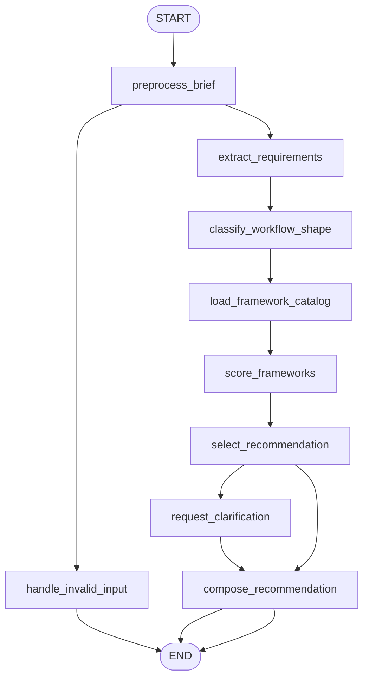

# Appendix C: Agentic Frameworks Overview (ko)

## 패턴 요약

Appendix C는 단일 런타임 패턴이 아니라 프로젝트에 맞는 에이전트 프레임워크를 고르는 가이드다. 단순 체인 조합, 명시적 상태 그래프 제어, 상위 멀티 에이전트 오케스트레이션, 검색 우선 시스템, 대규모 검색 파이프라인, 역할/SOP 중심 팀, 라이프사이클 플랫폼, 엔터프라이즈 플러그인/플래너 SDK, 경량 모델 중심 루프 방식 SDK를 대비한다.

요구사항으로는, 이 부록을 LangGraph 프레임워크 선택 자문자(어드바이저)로 구현해야 한다. 프로젝트 브리프를 받아 원하는 워크플로우 형태, 운영 요구, 데이터 요구, 팀 조정 요구, 제어 요구를 분류하고, Appendix C의 프레임워크 중 1개 이상을 간단한 근거와 트레이드오프로 추천한다.

## 패턴 설명

### 개념 개요

에이전틱 프레임워크는 추상화 수준이 다르다. 단순 선형 체인엔 LangChain이 적합하고, 반복/재시도/도구 사용/계획/인간 체크포인트가 필요한 경우 LangGraph가 상태와 루프를 제공한다. Google ADK·CrewAI 같은 고수준은 그래프 배선보다 에이전트 팀 협업에 초점을 둔다. 다른 프레임워크는 대화형 멀티 에이전트, 검색, 대규모 검색, SOP 기반 팀, 자율 에이전트 라이프사이클, 엔터프라이즈 플러그인 통합, 경량 모델 기반 루프를 특화한다.

핵심은 인기 순서가 아니라 애플리케이션의 제어 흐름 요구와 운영 모델에 맞춰 선택한다는 점이다.

### 문제

많은 프레임워크가 겹치면서 팀은 과도한 도입 혹은 부족한 도입을 할 위험이 있다. 명시적 선택 프로세스가 없다면 간단 작업에 복잡 플랫폼을 쓰거나, 상태와 도구가 필요한 반복형을 순수 선형 체인에 가두거나, 협업 문제를 검색 문제 프레임워크로 풀거나 하는 오류가 생긴다.

본 요구사항은 이를 구현 가능한 결정 워크플로로 바꾼다.

### 사용해야 할 때

- 새로운 프로젝트에서 에이전트 프레임워크를 선택해야 하는 팀.
- 선형 파이프라인, 루프, 재시도, 계획-실행, 병렬 작업, 인간 체크포인트 등 워크플로우 형태가 명시된 경우.
- LangChain, LangGraph, ADK, CrewAI, AutoGen, LlamaIndex, Haystack, MetaGPT, SuperAGI, Semantic Kernel, Strands Agents를 비교해야 할 때.
- 관측성, 라이프사이클 관리, 엔터프라이즈 통합, 모델/제공자 유연성이 함께 고려될 때.
- 이해관계자에게 근거·위험·대안까지 함께 제시해야 할 때.

### 사용하지 말아야 할 때

- 프레임워크가 이미 정해진 경우.
- 이미 정해진 단일 LangGraph 요구사항을 구현만 하는 작업.
- 작은 결정형 함수나 스크립트로 충분한 경우.
- 현재 벤더 기능/가격/라이선스/API 호환을 별도 최신 확인해야 하는 경우.
- 추천을 아키텍처 보증으로 오해하지 말고 PoC 보완용으로만 사용해야 함.

### 작동 방식

1. 프로젝트 브리프를 받아 작업유형, 복잡도, 데이터 소스, 인간 리뷰 필요, 멀티에이전트 필요, 운영 제약, 선호 생태계를 수집한다.
2. `linear_flow`, `stateful_graph`, `multi_agent_team`, `conversation_driven`, `retrieval_heavy`, `search_pipeline`, `sop_driven`, `lifecycle_platform`, `enterprise_plugins`, `lightweight_mcp` 같은 결정 신호로 정규화한다.
3. 각 신호를 Appendix C의 카테고리에 매핑한다.
4. 적합성, 제어 수준, 추상화 수준, 운영 오버헤드, 알려진 위험 기반으로 후보 스코어링.
5. 주 추천안과 보조안 1~2개를 선택한다.
6. 구현에 바로 쓸 수 있도록 이유와 대안 미선정 사유를 설명한다.
7. 선형/상태루프, 검색 파이프라인/협업 팀처럼 분기점이 애매하면 보완 질문을 요청한다.

### 트레이드오프

| 이점 | 비용 또는 위험 |
| --- | --- |
| 워크플로우 요구에 기반한 프레임워크 선택을 강제 | 브리프가 정보 부족이면 오판 가능 |
| 체인→그래프→관리형 팀까지 추상 레벨을 명시 | Appendix C 자체가 개요로, 완전 비교 아님 |
| 단순 선형 과잉구현 방지 | 프레임워크 특징/가격/성숙도는 외부 최신 확인 필요 |
| 테스트 가능한 결정 구조 제공 | 일부 프로젝트는 다중 프레임워크/혼합 구조 필요 |
| 대안과 근거를 함께 제시 | 점수는 과신될 수 있어 신뢰도 표기가 필요 |

### 최소 예시

```text
프로젝트 브리프:
  "고객지원 에이전트를 만들어 문서 검색, 도구 호출, 실패 재시도,
   환불 전 인간 승인."

의사결정 흐름:
  -> 요구사항 추출
  -> retrieval_heavy, stateful_loop, tool_use, human_checkpoint 감지
  -> LangGraph 높은 점수 (상태, 조건부 루프 필요)
  -> 단순 검색 체인은 LangChain만 가능 경로로 보조 제시
  -> LangGraph 추천(회복: RAG + 인간 승인)
```

### LangGraph 매핑

| 패턴 개념 | LangGraph 요소 |
| --- | --- |
| 프로젝트 브리프 | 상태 필드 `input` |
| 추출된 프로젝트 요구사항 | 상태 필드 `requirements` |
| 워크플로우 형태 분류 | 노드 `classify_workflow_shape` |
| Appendix C 카탈로그 | `score_frameworks`에서 쓰는 정적 구성 |
| 적합도 점수 | 상태 필드 `candidate_scores` |
| 주 추천안 | 상태 필드 `recommendation` |
| 대안 프레임워크 | 상태 필드 `alternatives` |
| 모호/누락 처리 | 조건부 엣지 `request_clarification` |
| 권고문 생성 | 노드 `compose_recommendation` |
| 최종 응답 | 상태 필드 `final_output` |

## LangGraph 구현 목표

`framework_selector` 이름의 LangGraph 예제를 구축한다. 프로젝트 브리프를 입력으로 받아 해당 요구사항에 맞는 프레임워크를 추천한다. 실 API는 호출하지 않는다. Appendix C에서 파생한 로컬 카탈로그로 아래를 설명하는 구조화 추천을 출력한다:

- 검출된 워크플로우 형태
- 주 추천 프레임워크
- 왜 맞는지
- 1~2개 대안
- 핵심 트레이드오프 및 위험
- 모호한 경우 보완 질문

예상:

- 단순 선형 파이프라인 → LangChain
- 상태 루프/재시도/도구 루프/plan-and-execute/병렬 노드/인간 체크포인트 → LangGraph
- 운영형 다중 에이전트 오케스트레이션 → Google ADK
- 역할/팀 협업 중심 → CrewAI
- 대화형 멀티 에이전트 협업 → AutoGen
- 검색 우선 지식 시스템 → LlamaIndex
- 대규모 검색·QA·요약 파이프라인 → Haystack
- SOP 기반 소프트웨어팀 시뮬레이션 → MetaGPT
- 자율 에이전트 라이프사이클+GUI 모니터링 → SuperAGI
- 플러그인·플래너 연동으로 엔터프라이즈 통합 → Semantic Kernel
- 경량 모델 중립 루프와 MCP 도구 접근 → Strands Agents

## 상태 형태

| 필드 | 타입 | 목적 |
| --- | --- | --- |
| `input` | `str` | 원본 프로젝트 브리프 또는 프레임워크 선택 질문 |
| `requirements` | `dict[str, Any]` | 브리프에서 정규화한 프로젝트 요구사항 |
| `workflow_shape` | `str \| None` | `linear`, `stateful_graph`, `managed_team`, `retrieval_first`, `search_pipeline`, `unknown` |
| `decision_signals` | `dict[str, bool]` | `needs_cycles`, `needs_human_review`, `retrieval_heavy`, `multi_agent`, `conversation_driven`, `sop_driven`, `production_lifecycle`, `enterprise_integration`, `mcp_tools` |
| `framework_catalog` | `dict[str, dict[str, Any]]` | Appendix C 기반 프레임워크, 강점, 위험, 적합 신호 |
| `candidate_scores` | `list[dict[str, Any]]` | 점수, 일치 신호, 누락 신호, 주의사항을 포함한 후보 정렬 |
| `recommendation` | `dict[str, Any] \| None` | 주 추천안(근거, 신뢰도) |
| `alternatives` | `list[dict[str, Any]]` | 유의미한 보조 대안 |
| `clarification_questions` | `list[str]` | 모호/충돌 시 보완 질문 |
| `ambiguities` | `list[str]` | 선택에서 발견한 모호점 |
| `errors` | `list[str]` | 검증 또는 처리 오류 |
| `final_output` | `dict[str, Any] \| None` | 사용자 응답용 권고, 대안, 트레이드오프, 다음 단계 |

## 노드

| 노드 | 책임 |
| --- | --- |
| `preprocess_brief` | 빈 입력 검증/정규화 후 상태 초기화 |
| `extract_requirements` | 브리프를 구조 요구사항/결정 신호로 변환 |
| `classify_workflow_shape` | 선형·상태 그래프·관리형 팀·검색 우선·검색 파이프라인·SOP·라이프사이클·엔터프라이즈 SDK·경량 루프·미상 분류 |
| `load_framework_catalog` | Appendix C 프레임워크 카탈로그를 로컬 상수에서 로드 |
| `score_frameworks` | 신호·추상화·제어 요구·운영 요구를 반영해 점수 계산 |
| `select_recommendation` | 주 추천, 대안, 신뢰도, 주의사항 결정 |
| `request_clarification` | 모호할 때 질문 생성 |
| `compose_recommendation` | 최종 권고 텍스트와 구조화 출력 생성 |
| `handle_invalid_input` | 빈/사용 불가 입력에 대한 명확한 실패 반환 |

## 엣지



조건부 엣지 요구사항:

- `preprocess_brief`는 빈/너무 짧은 입력이면 `handle_invalid_input`.
- `select_recommendation`는 신뢰도 낮거나 상위 후보 동률/신호 충돌 시 `request_clarification`.
- 충분히 일치하면 `compose_recommendation`로 바로 이동.
- `compose_recommendation`은 검출 형태, 주 추천, 대안, 주의사항을 항상 포함한다.

## 입력 및 출력

- 입력: 자연어 프로젝트 브리프(예: `"문서 검색, 도구 호출, 재시도, 위험 액션 전 인간 승인이 필요한 에이전트 필요"`).
- 출력: `final_output`으로 감지 요구사항, 추천 프레임워크, 신뢰도, 근거, 대안, 트레이드오프, 필요 시 질문.
- 중간 산출물: 정규화 요구사항, 결정 신호, 형태, 카탈로그, 후보 점수, 추천, 대안, 모호점, 오류.

성공 출력 예시:

```json
{
  "status": "ok",
  "workflow_shape": "stateful_graph",
  "recommended_framework": "LangGraph",
  "confidence": "high",
  "rationale": [
    "The brief requires loops, tool-use retries, and human approval checkpoints.",
    "Appendix C positions LangGraph for cyclical, stateful agent workflows."
  ],
  "alternatives": [
    {
      "framework": "LangChain",
      "fit": "Use only if the workflow can be reduced to a simple linear RAG chain."
    },
    {
      "framework": "Google ADK",
      "fit": "Consider if managed multi-agent deployment matters more than explicit graph control."
    }
  ],
  "clarification_questions": [],
  "caveats": [
    "Verify current framework APIs and licensing before production adoption."
  ]
}
```

질문 필요 출력 예시:

```json
{
  "status": "needs_clarification",
  "workflow_shape": "unknown",
  "recommended_framework": null,
  "confidence": "low",
  "clarification_questions": [
    "Is the workflow a fixed sequence, or does it need loops, retries, or conditional routing?",
    "Is the main challenge retrieval from private data, multi-agent collaboration, or production lifecycle management?"
  ],
  "alternatives": []
}
```

## 실패 사례

- 빈 입력은 `handle_invalid_input`으로 모델 호출 없이 검증 오류 반환.
- `"build an AI app"`처럼 모호한 브리프는 고신뢰 추천하지 않고 보완 질문.
- `"간단 체인"`과 `"멀티 에이전트 자율 팀 + 재시도"`가 충돌하면 충돌을 보고 신뢰도 하향.
- Appendix C에 없는 능력을 임의 주장하면 안 된다.
- 현재 API/가격/라이선스/성숙도 정보는 주의사항으로 처리.
- 동률 후보가 있으면 강제 단일 추천 대신 순위 비교로 제시.
- 카탈로그 밖 프레임워크 요구 시 `out of catalog`로 표시하고 근거 신호가 검증 가능한 범위만 비교.
- 모델 기반 추출 실패/비정상 출력은 키워드 기반으로 폴백하거나 질문.
- 핵심 루프가 단순 선형이면 고수준 멀티 프레임워크를 추천하지 않는다.
- 루프·재시도·도구 반복·인간 체크가 핵심인데 단순 선형 체인 추천도 금지.

## 테스트 아이디어

- 단순 RAG/요약/추출 브리프가 높은 신뢰도로 LangChain을 추천하는지 검증.
- plan-and-execute/재시도/도구 사용/HITL 브리프가 LangGraph 추천인지 검증.
- 병렬 콘텐츠 생성 브리프가 `stateful_graph` 혹은 `parallel_graph`로 분류되는지 검증.
- 관리형 팀 배포 브리프에서 Google ADK 포함 여부 검증.
- 역할 기반 리서치 팀 브리프가 CrewAI 추천인지 검증.
- 대화형 멀티에이전트가 AutoGen 추천인지 검증.
- 프라이빗 데이터 검색·합성 브리프가 LlamaIndex인지 검증.
- 대규모 검색/QA 파이프라인이 Haystack 추천인지 검증.
- SOP 기반 소프트웨어 팀 브리프가 MetaGPT 추천인지 검증.
- 라이프사이클 관리 브리프가 SuperAGI 추천인지 검증.
- 플러그인/플래너 통합 브리프가 Semantic Kernel 추천인지 검증.
- MCP 도구 접근 경량 모델 루프가 Strands Agents 추천인지 검증.
- 모호 입력이 질문 위주의 `needs_clarification`을 반환하는지 검증.
- 충돌 입력이 낮은 신뢰도로 설명을 포함하는지 검증.
- 최종 상태가 요구 필수 필드(`requirements`, `workflow_shape`, `candidate_scores`, `recommendation`, `alternatives`, `clarification_questions`, `errors`, `final_output`) 포함하는지 검증.

## 열린 질문

- TOC는 Appendix C를 논리 페이지 `364-371`로 표시하지만, 추출은 라벨 `385-392`(파일 `385-392`, 인덱스 `384-391`)의 내부 페이지 `1-8`이다.
- 추출 코드 조각은 형식적으로 깨진 부분이 있어 점수 로직은 구현자가 명시해야 함.
- Appendix C의 ADK 예시는 대소문자/변수명 불일치로 추출이 내부적으로 일관되지 않음.
- Appendix C는 빠른 개요서라 완전한 채점 규칙을 제공하지 않는다.
- 벤더 기능·가격·라이선스·운영 준비는 시간이 지나며 바뀌므로 구현은 시장 보고가 아님을 명시한다.
