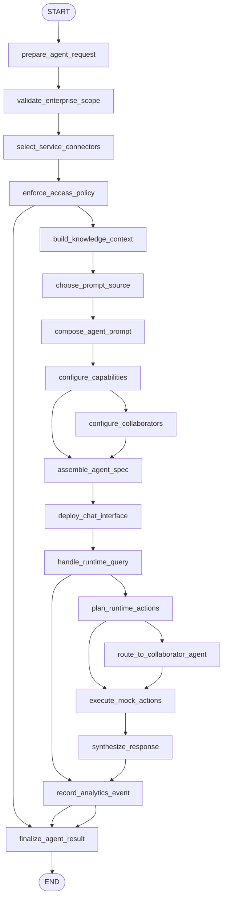

# Appendix D: Building an Agent with AgentSpace (ko)

## 패턴 요약

Appendix D는 AgentSpace를 무코드/저코드 GUI 환경 기반 엔터프라이즈 에이전트 플랫폼으로 설명한다. 여기에는 엔터프라이즈 검색, 연결된 비즈니스 서비스, 프롬프트 구성, 지식 그래프, 보안 제어, 분석, 웹 노출, 채팅 인터페이스가 포함된다. 또한 Agent2Agent(A2A) 프로토콜 기반 멀티 에이전트 상호운용도 다룬다.

구현적으로는 엔터프라이즈 에이전트 조립 워크플로우를 대상으로 한다: 에이전트 목표 정의, 승인된 데이터/서비스 연결, 프롬프트 선택 또는 작성, 지식/런타임 기능 구성, 접근 제어 시행, 채팅 노출, 사용량 기록. 챗봇이 아니라 검색·추론·계획·다단계 동작을 수행하는 업무형 에이전트다.

LangGraph 구현은 실 AgentSpace/Google Cloud/외부 SaaS 연동 없이, 구성 요청과 샘플 질의로 동작하는 로컬 모사형 그래프를 만든다. 요청을 검증하고, 보안·연결자 선택을 처리하고, `agent_spec`을 조립한 뒤, 결정론적 모의 검색/행동 흐름을 수행해 감사 가능한 응답을 반환한다.

## 패턴 설명

### 개념 개요

AgentSpace는 에이전트 구축을 개발자 개별 결합보다 플랫폼 방식으로 패키징한다. 조직 자산(문서/이메일/DB/달력/메일/티켓/지식 그래프/스토어/프롬프트/분석/채팅)을 연결하고, 거기에서 에이전트를 설정하도록 돕는 것이다.

핵심은 조직 고유의 디지털 흔적에 근거하면서 접근 규칙으로 제약되는 엔터프라이즈 에이전트다.

### 문제

많은 조직은 내부 문서·애플리케이션·업무흐름을 넘나드는 질문/업무 수행 에이전트를 원한다. 단순 챗봇은 어떤 데이터에 접근 가능한지, 어떤 서비스를 실행할 수 있는지, 누가 승인 권한이 있는지, 사용 이력이 어떻게 감시되는지를 알지 못한다.

이 요구사항은 승인된 커넥터·프롬프트·지식원·접근제어·런타임 표면으로 선행 조립되는 통제된 구성 파이프라인으로 해결한다.

### 사용해야 할 때

- 에이전트가 내부 문서/이메일/DB/업무 앱에 걸쳐 동작해야 할 때.
- 비전문가가 목적과 프롬프트를 노코드/로우코드로 구성해야 할 때.
- 조직 데이터스토어/지식 그래프 기반 맥락이 필요할 때.
- 검색/행동 전 접근 제어가 필수일 때.
- 채팅 배포, 웹 노출, 분석, 사용량 모니터링이 운영 필수일 때.
- 대규모 워크플로에 멀티 에이전트 협력(A2A)이 필요할 때.

### 사용하지 말아야 할 때

- 단일 독립 프롬프트 작업이며 엔터프라이즈 데이터/도구 접근이 없는 경우.
- 민감 조직 시스템 접근 자체가 허용되지 않은 경우.
- 필요한 서비스가 없거나 로컬 모의가 어려운 경우.
- 노드/검색/도구 호출의 세밀한 직접 제어가 더 중요할 때.
- 고위험 비즈니스 자동 실행은 승인/감사/롤백이 없으면 적용하지 말 것.
- 조직 접근성은 사용자·소스별로 다르게 평가해야 함을 간과하지 말 것.

### 작동 방식

1. 빌더가 Google Cloud 콘솔(개념상)에서 AgentSpace 진입.
2. 달력/메일/티켓/작업관리/서비스관리 같은 승인 서비스에 연결.
3. 갤러리 프롬프트 또는 커스텀 프롬프트 선택.
4. 데이터스토어, 지식 그래프, 웹 노출, 분석 같은 고급 기능 설정.
5. 역할 기반 접근/데이터 보호 등 보안 제어 적용.
6. 구성 완료 후 AgentSpace 채팅 인터페이스에서 사용 가능.
7. 런타임에서 설정된 프롬프트/연결소스/지식 문맥/허용 도구를 바탕으로 추론·계획·통합 응답·승인된 다단계 동작 수행.
8. 분석/운영 제어로 사용량과 결과를 모니터링.

### 트레이드오프

| 이점 | 비용 또는 위험 |
| --- | --- |
| 노코드로 에이전트 구축 접근성을 높임 | 추상화가 디버깅에 필요한 세부를 가릴 수 있음 |
| 조직 특화 문서/서비스/지식 그래프 기반 응답 | 연결자/권한 오설정 시 민감 정보 노출 위험 |
| 프롬프트 갤러리+커스텀 프롬프트로 거동 표준화 | 프롬프트 품질이 낮으면 모호/불안전 동작 |
| 채팅·웹노출·분석으로 시범→운영 전환 지원 | 운영면에서 모니터링/감사/변경관리 부담 증가 |
| A2A 상호운용으로 복잡 워크플로 지원 | 다중 전달은 조정/실패/책임 추적 복잡 |
| 보안 제어로 거버넌스 정합성 확보 | 과도 제한은 신뢰성 저하로 보일 수 있음 |

### 최소 예시

```text
입력:
  agent_goal: "고객 갱신 미팅용 브리핑 도우미"
  requested_services:
    - calendar
    - email
    - crm_notes
    - support_tickets
  prompt_choice: "custom"
  custom_prompt: "계정 상태, 미해결 리스크, 다음 액션을 요약"
  user_role: "account_manager"
  runtime_query: "Acme 갱신 콜 브리핑을 준비해줘"

흐름:
  validate_agent_request -> pass
  select_service_connectors -> calendar, email, crm_notes, support_tickets
  enforce_access_policy -> account_manager는 배정 계정만 조회
  build_knowledge_context -> 계정 노트, 티켓 요약, 미팅 메타데이터
  compose_agent_prompt -> 갱신 브리핑용 사용자 프롬프트
  assemble_agent_spec -> 구성된 엔터프라이즈 에이전트
  deploy_chat_interface -> 로컬 모의 채팅 엔드포인트 준비
  handle_runtime_query -> 허용된 컨텍스트로 계획/행동 수행
  synthesize_response -> 출처와 감사 메타데이터 포함 답변
```

### LangGraph 매핑

| 패턴 개념 | LangGraph 요소 |
| --- | --- |
| AgentSpace 에이전트 빌더 | 하나의 AgentSpace 스타일 빌더+런타임 그래프 |
| Google Cloud 진입점 | `prepare_agent_request` 노드 및 `input` 상태 |
| 서비스 통합 | `select_service_connectors` 노드, `requested_services`, `available_services`, `selected_connectors` |
| 기업 디지털 자산 | `source_documents`, `mock_service_records`, `knowledge_context` |
| 엔터프라이즈 지식 그래프 | `build_knowledge_context` 노드와 `knowledge_graph` |
| 프롬프트 갤러리 | `prompt_gallery`, `prompt_choice`, `choose_prompt_source` |
| 커스텀 프롬프트 | `custom_prompt`, `compose_agent_prompt` |
| Agent Designer 설정 | `configure_capabilities`, `assemble_agent_spec` |
| RBAC 및 데이터 보호 기대 | `enforce_access_policy`, `security_policy`, `access_decision`, `audit_log` |
| 고급 기능(데이터스토어/웹/분석) | `configure_capabilities`, `record_analytics_event`, `enabled_capabilities` |
| A2A 상호운용 | `route_to_collaborator_agent`, `a2a_enabled`, `collaborator_agents` |
| AgentSpace 채팅 인터페이스 | `deploy_chat_interface`, `handle_runtime_query` |
| 추론·계획·다단계 동작 | `plan_runtime_actions`, `execute_mock_actions` |
| 모니터링된 출력 | `finalize_agent_result`, `response`, `citations`, `usage_events`, `deployment_status` |

## LangGraph 구현 목표

실제 AgentSpace 의존성 없이 AgentSpace 스타일 로컬 그래프를 만든다. 허가된 서비스, 프롬프트, 지식 출처, 접근 제어, 런타임 기능으로 에이전트를 구성하고 모의 채팅 질의에 답변하는 형태다.

입력은 에이전트 구성 요청과 선택적 질의이다. 요청된 서비스를 검증하고 접근 규칙을 적용해 `agent_spec`을 조립한 후, 선택적으로 A2A 협업을 시뮬레이션하며, 결정론적 모의 검색/행동 플랜을 돌려 인용·차단 동작·분석 이벤트를 포함한 응답을 반환한다.

예상:

- 목표 미기재/지원되지 않는 커넥터/안전하지 않은 프롬프트/미승인 데이터 접근은 거부.
- 갤러리 프롬프트 또는 커스텀 프롬프트 중 선택 가능.
- 구성체 `agent_spec`에 연결자, 지식 문맥, 프롬프트, 기능, 보안 정책을 포함.
- 샘플 질의는 허용된 모의 데이터만 사용해 처리.
- 구성/검색/계획/차단/최종 응답에 대한 감사 이벤트 기록.
- 네트워크·실 구글/실 SaaS 연동 없이 테스트 가능.

## 상태 형태

| 필드 | 타입 | 목적 |
| --- | --- | --- |
| `input` | `str` | 에이전트 구성 요청 원문 |
| `agent_goal` | `str` | 구성 에이전트의 목적 |
| `builder_id` | `str` | 구성자(인간/프로세스) 식별자 |
| `user_role` | `str` | 런타임 사용자 역할 |
| `requested_services` | `list[str]` | 요청된 서비스 목록 |
| `available_services` | `dict[str, dict[str, Any]]` | 로컬에서 지원되는 모의 커넥터와 기능 |
| `selected_connectors` | `list[dict[str, Any]]` | 검증된 연결자 |
| `source_documents` | `list[dict[str, Any]]` | 모의 문서/데이터스토어 레코드 |
| `mock_service_records` | `dict[str, list[dict[str, Any]]]` | 달력/메일/티켓/CRM 등 모의 서비스 반환값 |
| `knowledge_graph` | `dict[str, Any]` | 사람/문서/서비스/엔티티 관계의 단순화 그래프 |
| `knowledge_context` | `list[dict[str, Any]]` | 접근 권한 필터링된 문맥 |
| `prompt_gallery` | `dict[str, str]` | 사용 가능한 버전 프롬프트 |
| `prompt_choice` | `str` | 선택한 프롬프트 키 |
| `custom_prompt` | `str \| None` | 갤러리 외 사용자 프롬프트 |
| `agent_prompt` | `str` | 최종 구성 프롬프트 |
| `security_policy` | `dict[str, Any]` | 역할, 커넥터 권한, 데이터 등급, 인간 검토 트리거 |
| `access_decision` | `dict[str, Any]` | 허용/거부 출처와 이유 |
| `enabled_capabilities` | `dict[str, bool]` | 데이터스토어/지식그래프/웹/분석/A2A 기능 플래그 |
| `a2a_enabled` | `bool` | 협업 라우팅 사용 여부 |
| `collaborator_agents` | `dict[str, dict[str, Any]]` | 로컬 모의 협력자 목록 |
| `agent_spec` | `dict[str, Any] \| None` | 최종 조립된 에이전트 스펙 |
| `deployment_status` | `str` | `not_started`, `ready`, `blocked`, `deployed`, `failed` |
| `runtime_query` | `str \| None` | 선택적 샘플 질의 |
| `runtime_plan` | `list[dict[str, Any]]` | 런타임 검색/도구 호출/협력자 호출 계획 |
| `tool_calls` | `list[dict[str, Any]]` | 시도한 모의 액션 |
| `blocked_actions` | `list[dict[str, Any]]` | 정책/연결자/권한으로 차단된 액션 |
| `citations` | `list[dict[str, Any]]` | 최종 응답 근거 출처 |
| `response` | `dict[str, Any] \| None` | 채팅 스타일 최종 응답 |
| `usage_events` | `list[dict[str, Any]]` | 운영·구성 단계 분석 이벤트 |
| `audit_log` | `list[dict[str, Any]]` | 보안/운영 의사결정 기록 |
| `errors` | `list[str]` | 검증·권한·프롬프트·연결자·런타임 오류 |

## 노드

| 노드 | 책임 |
| --- | --- |
| `prepare_agent_request` | 입력 검증, 서비스명 정규화, 기본값 및 감사 로그 시작 |
| `validate_enterprise_scope` | 실시간 클라우드 작업 요청이 아닌지 확인 |
| `select_service_connectors` | 요청 서비스를 로컬 모의 커넥터와 매칭, 미지원 기록 |
| `enforce_access_policy` | 역할 및 데이터 분류 규칙을 커넥터/문서/기록/기능에 적용 |
| `build_knowledge_context` | 허용 문서/서비스/지식 그래프 관계에서 문맥 생성 |
| `choose_prompt_source` | 갤러리 또는 커스텀 선택 및 존재 검증 |
| `compose_agent_prompt` | 목표·선택 프롬프트·허용 서비스·보안 제약을 결합 |
| `configure_capabilities` | 데이터스토어/지식 그래프/웹/분석/A2A 기능 토글 |
| `configure_collaborators` | A2A 활성 시 모의 협력자 등록 |
| `assemble_agent_spec` | 커넥터, 프롬프트, 문맥 정책, 기능, 감사 메타 포함 스펙 생성 |
| `deploy_chat_interface` | 검증 성공 시 모의 채팅 준비 상태 표시 |
| `handle_runtime_query` | 질의 유효성 검증 후 플랜 또는 종료 라우팅 |
| `plan_runtime_actions` | 허용 문맥·모의 도구·협력자 조합으로 런타임 계획 수립 |
| `route_to_collaborator_agent` | 필요한 협력자에게 A2A handoff 시뮬레이션 |
| `execute_mock_actions` | 모의 검색/서비스 액션 실행과 차단 액션 기록 |
| `synthesize_response` | 허용 문맥·행동 결과·인용을 기반으로 최종 답 생성 |
| `record_analytics_event` | 분석 기능 활성 시 구성/런타임 이벤트 기록 |
| `finalize_agent_result` | `agent_spec`, 배포 상태, 응답, 감사 로그, 사용 이벤트, 오류 반환 |

## 엣지



조건부 엣지 요구사항:

- `validate_enterprise_scope` 또는 `select_service_connectors`에서 실시간 AgentSpace/실 Google Cloud 변경/외부 SaaS 자격증명/지원 불가 연결 시 `deployment_status: "blocked"`로 `finalize_agent_result`.
- 접근 필터 후 허용 소스가 없거나 요청 기능이 정책 위반이면 `finalize_agent_result`.
- `configure_capabilities`는 `a2a_enabled`가 true일 때만 `configure_collaborators`.
- 질의가 없으면 `handle_runtime_query`에서 바로 분석 이벤트 기록 후 종료 가능.
- 런타임 계획에서 협력자 필요 시만, 그리고 허용된 경우에만 `route_to_collaborator_agent`.
- 런타임 계획 또는 실행에서 비인가/연결 불가 동작은 `blocked_actions`로 반환 후 종료.
- 모델 호출은 주입 가능, 테스트는 fake/planner로 결정론적 유지.

## 입력 및 출력

- 입력:
  - `input`: 에이전트 구축 설명
  - `agent_goal`: 비즈니스 목적
  - `requested_services`: 사용 서비스 목록
  - `prompt_choice`/`custom_prompt`: 프롬프트 선택지
  - `security_policy`: 역할/데이터 접근 제약
  - `runtime_query`: 선택적 테스트 질의
- 출력:
  - `agent_spec`: 연결자, 최종 프롬프트, 기능, 문맥 정책, 배포 메타
  - `deployment_status`: `deployed`, `blocked`, `failed` 중 하나
  - `response`: 인용/차단 동작 포함 선택적 응답
  - `audit_log`: 권한·구성 결정 로그
  - `usage_events`: 분석 이벤트
- 중간 산출물: `selected_connectors`, `knowledge_context`, `access_decision`, `runtime_plan`, `tool_calls`, `blocked_actions`, `citations`

## 실패 사례

- `agent_goal` 누락, 빈 `input`, 프롬프트 미설정은 배포 전 실패.
- 지원 불가 서비스는 명확히 기록, 모두 미지원이면 배포 차단.
- 실시간 AgentSpace/클라우드/외부 SaaS 요청은 차단.
- 정책 위반 프롬프트는 차단 또는 리뷰 상태.
- 접근 정책으로 소스가 모두 차단되면 제한 배포 또는 차단 처리.
- A2A가 켜졌지만 협력자가 없거나 미승인이면, 안전하게 수행 가능한 범위만 진행.
- 분석이 꺼지면 필수 감사 이외 이벤트 추가 안 함.
- 비인가 동작은 `blocked_actions`에 남기고 허용된 컨텍스트만으로 답변.
- 검색 결과 근거가 없으면 사실을 임의 생성하지 않고 승인된 컨텍스트 부재를 알림.
- 고위험 변화/광범위 데이터 접근/웹 노출/범위 확장 프롬프트는 인간 리뷰 필요.

## 테스트 아이디어

- 지원 커넥터+갤러리 프롬프트+권한 허용 문서+쿼리로 정상 생성.
- 커스텀 프롬프트 경로의 `agent_prompt` 및 `agent_spec` 확인.
- 미지원 커넥터 거부 후 차단 동작 확인.
- 역할 기반 접근으로 제한 문서/기록 필터링 확인.
- 런타임 질의의 인용이 허용된 컨텍스트만 포함되는지 확인.
- 미인가 동작이 `tool_calls` 완료가 아닌 `blocked_actions`로 남는지 확인.
- A2A 비활성/활성 시 라우팅 동작 검증.
- 분석 이벤트는 enabled 상태에서만 기록.
- 실시간 AgentSpace/Google Cloud 요청이 `validate_enterprise_scope`에서 차단.
- fake 모델/플래너로 네트워크 없이 결정론 테스트 가능.

## 열린 질문

- TOC의 논리 페이지 `372-377`와 실제 추출 파일 페이지 `393-398` 불일치.
- 추출 본문에서 그림 캡션은 있으나 이미지 본문은 텍스트화되지 않음.
- `Workaday` 표기 가능성은 본문 오차성으로 `Workday`를 임의 수정하지 않고 기록 보존.
- Appendix D는 알고리즘 패턴보다 플랫폼 절차형이므로 로컬 모사로 구현.
