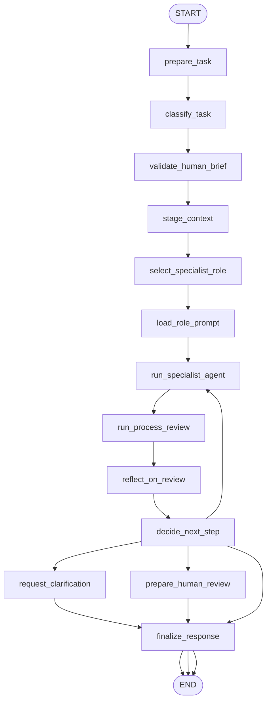

# Appendix G: Coding Agents (ko)

## 패턴 요약

코딩 에이전트는 일회성 코드 생성 기능을 인간 주도형 팀 워크플로로 바꾼다. 부록은 빠른 기획을 위한 “vibe coding”을 출발점으로 삼되, 운영 소프트웨어는 더 구조화된 협업이 필요하다고 본다. 개발자는 오케스트레이터이자 아키텍트, 품질 게이트로 남고, 특화 AI 코딩 에이전트는 scaffolding, 테스트 생성, 문서화, 리팩터링, 리뷰 같은 집중 작업을 수행한다.

구현 요구사항은 통제된 코딩 에이전트 팀이다. 사용자는 완전한 작업 브리프와 정제된 컨텍스트를 제공하고, 그래프는 specialist 역할을 선택해 범위 제한 산출물을 생성한 뒤 process/reviewer가 평가·반성한다. 인간 리뷰 경계는 명시적이어야 하며, 결과는 공통 모델 어댑터, 버전화된 역할 프롬프트, 리뷰 루프, 선택적 Git 훅 자동화만 시뮬레이션한다.

## 패턴 설명

### 개념 개요

부록은 코딩 에이전트를 인간 중심 엔지니어링 팀의 특화 구성원으로 본다. 빠른 시작을 위한 vibe coding은 유용하나, 견고한 소프트웨어는 맥락·역할 분리·리뷰·반성·최종 인간 판단이 필요하다.

중심 구조는 증폭된 팀으로, 개발자가 목표 설정·맥락 수집·적절한 specialist 선택·출력 평가·구조 통제를 수행한다. AI 에이전트는 구현/테스트/문서/최적화/리뷰 같은 전술 작업의 보조자로 동작한다.

### 문제

무가공 AI 코드 생성은 신속하지만 프로젝트 맥락, 아키텍처 정합성, 테스트 규율, 유지보수성 측면에서 취약하다. 단일 프롬프트로 다중 역할이 필요한 작업을 다루기 어렵다.

이 패턴은 컨텍스트 준비, specialist 실행, 리뷰, 반성, 인간 승인 단계를 분리해 제어권을 코드베이스에 두는 방식으로 해결한다.

### 사용해야 할 때

- 구현/테스트/문서/리팩터링/리뷰 등 역할별 지원이 필요한 소프트웨어 작업.
- 관련 코드, 요구사항, 스타일을 충분히 줄 수 있는 환경.
- 출력이 검토 후 수용될 제안이어야 할 때.
- 반복 사용 가능한 프롬프트 역할을 버전 관리 자산으로 유지하고자 할 때.
- 로컬 오케스트레이터가 투명한 컨텍스트 패키징을 제공할 때.
- pre-commit 같은 리뷰 자동화가 통제된 자문 역할이면 유용할 때.

### 사용하지 말아야 할 때

- 단순한 결정론적 변경 한 건에 작은 스크립트/포매터/직접 수정이 더 맞는 경우.
- 안정적 컨텍스트 공급이 불가능할 때.
- 에이전트 산출물을 검증 없이 권위 있는 코드로 받아들이면 안 될 때.
- 비밀/무관 파일 대량 전송 같은 과도한 컨텍스트 수집.
- 자율 커밋/배포/파괴 작업은 승인 없는 자동 실행 금지.
- 특정 벤더 모델명이나 제품명을 구현 필수 요구로 보존하면 안 됨.

### 작동 방식

1. 개발자 브리프에 목표, 제약, 수락 기준, 관련 파일, 스타일 규칙, 기대 산출물을 작성.
2. 컨텍스트 스테이징이 코드 스니펫/API 문서/PR 노트/테스트 철학 같은 재료를 조합.
3. 오케스트레이터가 작업을 분류해 scaffolder, test engineer, documenter, optimizer, process/reviewer 중 역할 선택.
4. 선택된 specialist가 역할 프롬프트와 컨텍스트 번들로 bounded 산출물(코드/테스트/문서/리팩터 제안/리뷰 결과) 생성.
5. process agent가 산출물을 검토하고 비판 후 우선순위 피드백 생성.
6. 그래프는 추가 specialist 라운드, 추가 컨텍스트 요청 또는 최종 검토 결과 반환.
7. 최종 적용 여부는 인간이 결정.

### 트레이드오프

| 이점 | 비용 또는 위험 |
| --- | --- |
| 초기 아이디어·일상 업무 속도 향상 | 리뷰 없는 코드 생성은 얕고 취약할 수 있음 |
| 역할 분리로 프롬프트/출력 추론이 쉬워짐 | 역할 수 증가로 오케스트레이션 복잡 |
| 컨텍스트 준비가 명시적·감사 가능 | 스테이징이 중요하고 누락 시 품질 저하 |
| 아키텍처·최종 승인 권한이 인간에 유지 | 위험 변경 시 인간 처리량 병목 |
| 버전 관리 프롬프트로 점진 개선 | 프롬프트 라이브러리 관리 소홀 시 표준 이탈 |
| 리뷰/반성으로 인수인계 품질 향상 | 리뷰어가 사소한 점에 치우치거나 미스 가능 |

### 최소 예시

```text
입력:
  Goal: "CSV import validation 추가"
  Context: brief, 기존 파서 코드, validation 스타일 가이드, 현재 테스트
  Requested role: test_engineer

흐름:
  stage_context
  classify_task -> test_creation
  select_specialist -> test_engineer
  run_specialist_agent -> pytest 케이스 초안
  run_process_review -> 커버리지/우선순위 재검토
  decide_next_step -> final_human_review

출력:
  테스트 파일 제안
  커버리지 노트
  리뷰 요약
  적용 전 인간 승인 필요
```

### LangGraph 매핑

| 패턴 개념 | LangGraph 요소 |
| --- | --- |
| 인간 오케스트레이터 | 상태 `input`, `human_brief`, `approval_policy` |
| 컨텍스트 스테이징 영역 | `stage_context` 노드, `context_bundle` |
| 역할별 코딩 에이전트 | `run_specialist_agent` 노드, `selected_role`, `role_prompt` |
| Scaffolder | `selected_role: "scaffolder"` 및 구현 산출물 |
| Test engineer | `selected_role: "test_engineer"` 및 테스트 산출물 |
| Documenter | `selected_role: "documenter"` 및 문서 산출물 |
| Optimizer | `selected_role: "optimizer"` 및 리팩터 제안 |
| Process/Reviewer | `run_process_review` 노드, critique/reflect |
| 반복 오케스트레이션 | `decide_next_step`에서 `request_clarification`/`stage_context`/`run_specialist_agent`로 회귀 |
| 인간 최종 게이트 | `prepare_human_review` 노드, `requires_human_approval` |
| 프롬프트 라이브러리 | `prompt_library`, `load_role_prompt` |
| Git 훅형 자동화 | `trigger_source` 입력 및 리뷰 전용 모드 |

## LangGraph 구현 목표

`coding_agent_team` LangGraph 예제를 구현한다. 개발자 작업, 스테이징된 저장소 컨텍스트, 프롬프트 라이브러리, 선택 role, 승인 정책을 받아 적절한 specialist를 선택하고, 리뷰 가능한 산출물을 생성해 인간 승인용 패키지를 반환한다.

실제 파일 수정·임의 셸·커밋·배포·실 벤더 코딩 에이전트 호출을 하지 않는다. 저장소의 공유 모델 패턴을 사용해 결정론적 fake 응답으로 테스트 가능하게 한다. 파일/프롬프트 입력은 메모리 fixture 또는 명시적 문자열.

포함 주제:
- early idea로 vibe coding은 유효하나 최종 프로덕션은 아님
- 인간 주도 오케스트레이션 및 아키텍처 소유
- 컨텍스트가 품질 결정의 핵심
- 역할별 프롬프트 사용
- 리뷰와 반성 루프
- 선택적 pre-commit 검토 전용 모드
- 제안 산출물은 최종 적용 전에 인간 승인 필요

예상:

- 빈/애매 작업은 코드 생성보다 clarification 요청.
- 구현 요청은 scaffolder로.
- 테스트 요청은 test_engineer로.
- 문서 요청은 documenter로.
- 성능/유지보수 요청은 optimizer로.
- review-only나 pre-commit 트리거는 process/reviewer 우선.
- 모든 산출물은 review 후 반환.
- 최종 출력은 적용된 파일이 아니라 제안/리뷰 메타 데이터.

## 상태 형태

| 필드 | 타입 | 목적 |
| --- | --- | --- |
| `input` | `str` | 원본 개발 요청 |
| `normalized_input` | `str` | 분류/프롬프트용 정규화 텍스트 |
| `human_brief` | `dict[str, Any]` | 목표/제약/수락 기준/스타일 규칙/기대 산출물 |
| `requested_role` | `str \| None` | 사용자 지정 역할 |
| `selected_role` | `str \| None` | 선택된 specialist 역할 |
| `task_type` | `str \| None` | ideation/implementation/test_creation/documentation/optimization/review/unsupported |
| `trigger_source` | `str` | `manual`, `pre_commit`, `review_pipeline` |
| `context_sources` | `list[dict[str, Any]]` | 코드 조각/문서/API/PR/스타일/테스트 노트 |
| `context_bundle` | `dict[str, Any]` | specialist 전달용 번들 컨텍스트 |
| `context_warnings` | `list[str]` | 부족/과다/모호/안전 이슈 |
| `prompt_library` | `dict[str, str]` | 역할별 버전화 프롬프트 |
| `role_prompt` | `str \| None` | 선택된 역할 프롬프트 |
| `model_config` | `dict[str, Any]` | 실행 adapter 설정 |
| `specialist_artifact` | `dict[str, Any] \| None` | 코드/테스트/문서/리뷰 제안 |
| `critique` | `dict[str, Any] \| None` | 전문가 리뷰 결과 |
| `reflection` | `dict[str, Any] \| None` | critique 우선순위 정리 |
| `iteration_count` | `int` | specialist/review 반복 횟수 |
| `max_iterations` | `int` | 최대 대화 반복 횟수 |
| `requires_human_approval` | `bool` | 적용 전 인간 승인 필요 여부 |
| `approval_policy` | `dict[str, Any]` | 쓰기/커밋/명령/비밀/외부 호출/리뷰 트리거 |
| `blocked_actions` | `list[dict[str, Any]]` | 정책으로 중단된 동작 |
| `action_log` | `list[dict[str, Any]]` | 분류/스테이징/프롬프트 로드/모델 호출/리뷰/라우팅 |
| `status` | `str` | `ok`, `needs_context`, `needs_review`, `unsupported`, `failed` |
| `final_output` | `dict[str, Any] \| None` | 최종 사용자 응답 |

## 노드

| 노드 | 책임 |
| --- | --- |
| `prepare_task` | 입력 검증, 정규화, 기본값 초기화, 입력 brief/라이브러리/정책/컨텍스트 로드 |
| `classify_task` | ideation/implementation/tests/docs/optimization/review/unsupported 분류 |
| `validate_human_brief` | 목표/제약/수락 기준/기대 출력 누락 여부 확인 |
| `stage_context` | 코드/문서/스타일/요구사항 위주로 과도한 자동 검색 없이 컨텍스트 번들 생성 |
| `select_specialist_role` | 요청, task_type, trigger_source, 컨텍스트 경고 기반 역할 선택 |
| `load_role_prompt` | 선택 role에 맞는 버전 프롬프트 로드 및 누락 보고 |
| `run_specialist_agent` | 공유 모델 어댑터로 role_prompt+context_bundle 실행해 산출물 생성 |
| `run_process_review` | 버그/불일치/테스트 누락/문서 불명확성/유지보수 이슈 비판 |
| `reflect_on_review` | 비판 항목 우선순위화 후 행동 지침 생성 |
| `decide_next_step` | 추가 컨텍스트 요청, specialist 반복, 인간 리뷰 준비, 실패 여부 결정 |
| `request_clarification` | 부족한 brief/컨텍스트를 사용자에게 요청 |
| `prepare_human_review` | 산출물·리뷰·반성·차단 액션·승인 지침 패키징 |
| `finalize_response` | `final_output` 조립: 상태, 역할, 산출물 요약, 리뷰, 경고, 감사 메타 |

## 엣지



조건부 엣지 요구사항:

- `prepare_task`에서 입력 공백/형식오류는 `status: "failed"`.
- `validate_human_brief`에서 목표/수락 기준/필수 컨텍스트 누락 시 clarification.
- `stage_context`에서 컨텍스트가 너무 희소하면 clarification.
- `stage_context`에서 비밀/금지 데이터 노출 시 `status: "failed"`.
- `select_specialist_role`에서 자율 커밋/배포/credential/파괴명령 요청은 `unsupported`.
- `trigger_source`가 `pre_commit`이면 reviewer-only 모드.
- `load_role_prompt`에서 역할 프롬프트 누락 시 실패.
- `decide_next_step`에서 수정 가능 + 잔여 반복 + 승인 정책 허용 시 specialist 재실행.
- 코드/테스트/문서/리팩터/명령/커밋 변경 제안 시 `prepare_human_review`.
- 리뷰 없는 advisory 출력(`needs_review` 아닌 `ok`)은 ideation/요약 등 비적용 항목만 허용.
- 파일 수정/커밋/외부 호출 등 실제 조작 금지.

## 입력 및 출력

- 입력: 개발자 작업, human_brief, context_sources, prompt_library, 선택 role, trigger_source, model_config, approval_policy.
- 출력: `final_output`으로 상태, `selected_role`, `task_type`, `artifact_summary`, `specialist_artifact`, `critique`, `reflection`, `context_warnings`, `blocked_actions`, `requires_human_approval`, `action_log`.
- 중간 산출물: 정규화 요청, 검증된 brief, 컨텍스트 번들, 로드된 role_prompt, specialist 산출물, 리뷰, 반성, 라우팅 결정, 인간 리뷰 패키지.

성공 리뷰 예시:

```json
{
  "status": "needs_review",
  "selected_role": "test_engineer",
  "task_type": "test_creation",
  "requires_human_approval": true,
  "artifact_summary": "Proposed pytest coverage for CSV import validation, including malformed rows, missing required columns, and duplicate IDs.",
  "specialist_artifact": {
    "kind": "tests",
    "path": "tests/test_csv_import.py",
    "content": "<proposed test code>"
  },
  "critique": {
    "findings": [
      "The tests cover parser failures but do not assert the user-facing error message."
    ]
  },
  "reflection": {
    "priority": "Add one assertion for the displayed validation message before applying the tests."
  },
  "blocked_actions": [
    {
      "action": "write_file",
      "reason": "Generated artifacts require human approval before filesystem changes."
    }
  ]
}
```

명확화 필요 예시:

```json
{
  "status": "needs_context",
  "selected_role": null,
  "task_type": "implementation",
  "requires_human_approval": false,
  "context_warnings": [
    "No existing code or interface contract was supplied for the requested feature."
  ],
  "final_output": {
    "message": "Provide the target module, expected behavior, and acceptance criteria before invoking a scaffolder agent."
  }
}
```

## 실패 사례

- 빈 입력은 `failed` + 간결한 검증 오류.
- brief 누락 시 목표/수락기준/대상 파일/기대 산출물 요청.
- prompt 누락은 실패와 함께 선택 역할을 보고.
- 컨텍스트 부족은 추측 금지, 추가 요청으로 전환.
- 과도/안전하지 않은 컨텍스트(비밀, 크레덴셜, 대량 무관 코드)는 차단.
- 지원 불가 요청: 자율 커밋·배포·credential·파괴 명령·운영 변경은 거부.
- 산출물 품질 낮으면 반복/리플렉션으로 개선하되, 반복 한도면 `needs_review`.
- 리뷰 전용 모드에서는 불필요한 신규 코드 생성 억제.
- 모델/도구 실패는 로그 유지 후 `failed` 또는 `needs_review`.
- 사람 승인 경계: 적용 가능한 제안은 모두 `needs_review`; 자동 적용 금지.

## 테스트 아이디어

- 구현 브리프 완전 입력 시 scaffolder 선택 후 리뷰·출력.
- 테스트 요청이 test_engineer 라우트 및 리뷰 반영 검증.
- 문서 요청이 documenter로 동작.
- 최적화 요청이 optimizer로 리팩터 제안.
- pre_commit trigger가 review-only 모드인지 검증.
- 컨텍스트 부족 시 `needs_context` 반환.
- prompt library 누락 시 통제된 실패.
- 커밋/배포/파괴 명령 요청이 policy로 차단되는지.
- 산출물이 파일 작성/명령 실행했음을 주장하지 않음.
- fake model로 경로 및 결과 결정론.
- 반복 한도 초과 시 안정 종료.
- 최종 상태에 핵심 필드 존재.

## 열린 질문

- TOC 및 추출된 Appendix G는 페이지/중복이 불일치.
- 동일 본문이 중복되어 추출되어 본문의 경계를 보수적으로 지정함.
- TOC의 `397-403`과 실제 파일 6페이지 본문/중복 14? 추적의 불일치.
- Appendix F 부재 환경에서 G의 일부 맥락이 단편적이므로 버전 관리가 필요.
- 원문은 특정 모델명을 예시로 들지만 구현은 공급자 선택을 공유 모델 패턴 설정으로 처리.
