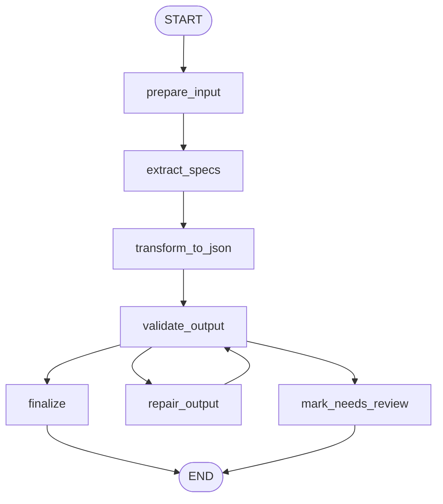

# 1: Prompt Chaining (ko)

## 패턴 요약

프롬프트 체이닝은 복잡한 LLM 작업을 순서가 있는 집중된 하위 작업으로 분해한다. 
- 예, 전자제품 제품 텍스트에서 사양을 추출하는 에이전트 -> 단순하게 사양을 추출하는 것이 아니라.
  - 입력 다듬기 -> 스펙 추출하기(llm) -> json 변환(llm) -> validator(python) -> repair(retry) -> pass, fail mark 의 정교한 단계로 분리한다.   
- 각 단계는 좁은 책임을 가지며, 한 단계의 출력이 다음 단계의 입력이 된다. 
- 이를 통해 지시사항 과부하, 컨텍스트 이탈, 환각 위험, 디버깅하기 어려운 거대한 단일 프롬프트를 줄인다.


## 패턴 설명

### 개념 개요

프롬프트 체이닝은 하나의 큰 모델 작업을 더 작은 연결된 프롬프트들로 나누는 방식이다. 
- 모델에게 이해, 변환, 검증, 포맷팅을 한 번에 모두 요청하는 대신, 각 프롬프트가 하나의 집중된 일을 수행하고 그 결과를 다음 단계로 넘긴다.
- 에이전트 시스템에서 이 방식은 모호한 LLM 상호작용을 관찰 가능한 워크플로로 바꾼다. 
- 각 단계는 명확한 입력, 명확한 출력, 그리고 다음 단계가 그 결과에 의존하기 전에 검증이나 복구가 일어날 수 있는 지점을 가진다.

### 문제

큰 프롬프트는 너무 많은 책임을 섞는 경우가 많다. 이로 인해 출력 예측이 어려워지고, 테스트가 어려워지며, 일부가 실패했을 때 복구도 어려워진다. 
- 프롬프트 체이닝은 책임을 분리하고 중간 출력을 명시적으로 만들어 이 문제를 해결한다.

### 사용해야 할 때

- 작업에 여러 의존 단계가 있을 때 이 패턴을 사용한다.
- 중간 출력을 *검증, 파싱, 변환*해야 할 때 사용한다.
- LLM 호출 사이의 디버깅 가시성이 워크플로에 도움이 될 때 사용한다.
- JSON 같은 구조화된 전달 데이터가 자유 형식 텍스트보다 안전할 때 사용한다.

### 사용하지 말아야 할 때

- 단순한 1단계 질문에는 이 패턴을 피한다.
- 모든 단계가 동일한 전체 컨텍스트에 의존하고, 분리가 명확성 없이 비용만 늘릴 때는 피한다.
- 관찰 가능성보다 지연 시간, 토큰 비용, 오케스트레이션 복잡도가 더 중요할 때는 불필요한 체인을 피한다.

### 작동 방식

1. 워크플로가 원본 입력을 준비하거나 정규화한다.
2. 첫 번째 프롬프트가 후보 사실 추출 같은 좁은 작업을 수행한다.
3. 이후 프롬프트가 이전 결과를 더 엄격한 형식으로 변환하거나 정제한다.
4. 검증기가 전달 데이터가 파싱 가능하고, 완전하며, 입력에 근거하는지 확인한다.
5. 워크플로는 결과를 최종화하거나, 잘못된 단계를 복구하거나, 검토 대상으로 표시한다.

### 트레이드오프

| 이점 | 비용 또는 위험 |
| --- | --- |
| 중간 출력이 보이므로 디버깅이 쉬워진다. | LLM 호출이 늘어나 지연 시간과 비용이 증가할 수 있다. |
| 집중된 프롬프트와 검증을 통해 신뢰성이 좋아진다. | 검증하지 않으면 초기의 잘못된 출력이 이후 단계에 계속 영향을 줄 수 있다. |
| 구조화된 출력 파이프라인에 자연스럽게 맞는다. | 신중한 스키마와 재시도 설계가 필요하다. |

### 최소 예시

```text
제품 텍스트
  -> 기술 사양 추출
  -> 사양을 JSON으로 변환
  -> 필수 필드 검증
  -> 최종 구조화 사양
```

### LangGraph 매핑

| 패턴 개념 | LangGraph 요소 |
| --- | --- |
| 원본 작업과 중간 출력 | `input`, `raw_extraction`, `specifications` 같은 상태 필드 |
| 체인의 각 프롬프트 | `extract_specs` 또는 `transform_to_json` 같은 노드 |
| 순차 전달 | 한 노드에서 다음 노드로 이어지는 일반 엣지 |
| 검증과 복구 결정 | `validate_output`에서 나가는 조건부 엣지 |
| 복구 소진 경로 | `mark_needs_review` 같은 종료 노드 |

## LangGraph 구현 목표

비정형 제품 텍스트를 검증된 구조화 기술 사양으로 변환하는 LangGraph 예제를 만든다. 사용자는 노트북 설명 같은 제품 설명을 제공한다. 그래프는 먼저 텍스트에서 기술 사양을 추출한 다음, 추출된 정보를 `cpu`, `memory`, `storage` 같은 필수 필드를 포함하는 JSON 호환 객체로 변환한다.

이 예제는 LangGraph 상태와 조건부 엣지를 사용해 워크플로를 관찰 가능하고 신뢰할 수 있게 만들면서, 장에서 설명한 핵심 프롬프트 체이닝 동작을 보여주어야 한다. 정상 경로는 선형이지만, 검증 단계는 잘못되었거나 불완전한 중간 출력을 최종화 전에 한 번의 복구 프롬프트로 라우팅하거나 검토 대상으로 표시할 수 있다.

## 상태 형태

그래프에 필요한 상태 필드를 나열한다.

| 필드 | 타입 | 목적 |
| --- | --- | --- |
| `input` | `str` | 원본 사용자 입력 또는 작업 설명. |
| `clean_text` | `str` | 추출 프롬프트에 전달되는 정규화된 원문 텍스트. |
| `raw_extraction` | `str` | 추출된 사양을 담은 첫 번째 LLM 출력. |
| `raw_transformation` | `str` | JSON 파싱과 검증 전의 두 번째 LLM 출력. |
| `specifications` | `dict` | 파싱된 구조화 결과. `cpu`, `memory`, `storage`를 포함해야 한다. |
| `missing_fields` | `list[str]` | 찾거나 검증할 수 없었던 필수 필드. |
| `validation_errors` | `list[str]` | 파싱 오류, 스키마 오류, 지원되지 않는 값, 근거 불일치. |
| `retry_count` | `int` | 이미 수행한 복구 시도 횟수. |
| `max_retries` | `int` | 복구 시도 상한 설정값. |
| `intermediate_artifacts` | `list[dict]` | 프롬프트 입력, 프롬프트 출력, 파서 결과, 검증 결정을 순서대로 기록한 목록. |
| `status` | `str` | 워크플로 상태: `ok`, `needs_review`, `failed`. |
| `final_output` | `dict` | 상태, 구조화 사양, 검증 메타데이터를 포함하는 사용자 대상 결과. |

## 노드

| 노드 | 책임 |
| --- | --- |
| `prepare_input` | 입력 텍스트를 다듬고 정규화하며, 빈 입력을 거부하고 재시도 및 산출물 필드를 초기화한다. |
| `extract_specs` | LLM을 이용해 `clean_text`에서 기술 사양만 식별하도록 요청하는 집중된 추출 프롬프트를 실행한다. |
| `transform_to_json` | LLM을 이용해 `raw_extraction`을 필수 키가 있는 엄격한 JSON 객체로 변환하는 두 번째 집중 프롬프트를 실행한다. |
| `validate_output` | Python코드를 이용해 `raw_transformation`을 파싱하고, 필수 키와 값 형식을 검증하며, 누락 필드를 감지하고 검증 오류를 기록한다. |
| `repair_output` | 검증이 실패하면 원문 텍스트, 이전 출력, 검증 오류를 사용해 대상화된 복구 프롬프트를 실행한다. |
| `finalize` | 검증이 성공하면 구조화 객체와 선택된 메타데이터를 포함한 `final_output`을 만든다. |
| `mark_needs_review` | 복구가 소진되었거나 필수 정보가 실제로 없을 때 체인을 중단하고, 오류와 산출물을 보존한다. LLM이 처리하지 못하고 이제 사람이 봐야하는 기록물이다. |

## 엣지

조건부 분기를 포함한 그래프 흐름을 설명한다.



조건부 엣지 요구사항:

- JSON 파싱이 성공하고, 필수 키가 존재하며, 값이 원문 텍스트로 뒷받침될 때 `validate_output`에서 `finalize`로 라우팅한다.
- 출력이 잘못되었거나 불완전하고 `retry_count < max_retries`일 때 `validate_output`에서 `repair_output`으로 라우팅한다.
- 복구 시도가 소진되었거나 입력에 필수 필드를 뒷받침할 충분한 근거가 없을 때 `validate_output`에서 `mark_needs_review`로 라우팅한다.
- `retry_count`는 복구 경로에서만 증가시킨다.

## 입력과 출력

- 입력: 기술 사양이 포함된 비정형 제품 또는 문서 텍스트.
- 출력: `cpu`, `memory`, `storage`와 `status`, 검증 메타데이터를 포함하는 JSON 호환 딕셔너리.
- 중간 산출물: 정제된 입력 텍스트, 추출 프롬프트 출력, 변환 프롬프트 출력, 파서 결과, 검증 오류, 누락 필드, 복구 시도.

예시 입력 형태:

```json
{
  "input": "The laptop includes a 3.5 GHz octa-core processor, 16GB RAM, and a 1TB NVMe SSD."
}
```

성공 출력 형태 예시:

```json
{
  "status": "ok",
  "specifications": {
    "cpu": "3.5 GHz octa-core processor",
    "memory": "16GB RAM",
    "storage": "1TB NVMe SSD"
  },
  "missing_fields": [],
  "validation_errors": []
}
```

## 실패 사례

예상 실패, 재시도, 폴백 동작, 사람 검토 지점을 문서화한다.

- 비어 있거나 공백뿐인 입력은 LLM 호출 전에 실패해야 하며 `status`를 `failed`로 설정해야 한다.
- 변환 프롬프트가 만든 잘못된 JSON은 검증 오류로 파싱되어야 하며, 재시도가 남아 있으면 `repair_output`으로 라우팅해야 한다.
- 누락된 필수 필드는 환각으로 채우면 안 된다. 그래프는 원문 텍스트를 다시 확인해 복구하거나, 누락 필드 목록과 함께 `needs_review`를 반환해야 한다.
- 원문 텍스트로 뒷받침되지 않는 추출 값은 거부하거나 검토 대상으로 표시해야 한다.
- 지나치게 큰 입력은 추출 프롬프트 전에 자르기, 청킹, 또는 문서화된 검증 오류로 처리해야 한다.
- 반복적인 복구 실패는 무한 루프가 아니라 `mark_needs_review`로 끝나야 한다.
- 제공자 또는 모델 호출 오류는 `validation_errors`나 전용 런타임 오류 필드에 캡처한 뒤 `final_output`에 노출해야 한다.

## 테스트 아이디어

- 장의 노트북 문장 스타일에 맞춘 정상 경로를 검증하고 `cpu`, `memory`, `storage`가 채워졌는지 확인한다.
- 모킹한 잘못된 JSON 응답이 `repair_output`을 거쳐 유효한 복구 후 최종화되는지 검증한다.
- 스토리지 정보가 없는 경우 스토리지를 지어내는 대신 `needs_review` 또는 문서화된 null 정책을 반환하는지 검증한다.
- `retry_count`가 복구 경로에서만 증가하고 `max_retries`를 초과할 수 없는지 검증한다.
- `intermediate_artifacts`가 각 프롬프트 출력과 검증 결정을 실행 순서대로 포함하는지 검증한다.
- 빈 입력이 LLM 호출 전에 실패하는지 검증한다.
- 최종 상태가 항상 `status`, `final_output`, 검증 메타데이터를 포함하는지 검증한다.

## 열린 질문


- 첫 구현은 장의 고정 `cpu`, `memory`, `storage` 스키마를 유지해야 하는가, 아니면 더 넓은 문서 처리 예제를 지원하도록 설정 가능한 추출 스키마를 받아야 하는가?
- 없는 필수 필드는 `specifications`에서 `null`로 표현해야 하는가, 완전히 생략해야 하는가, 아니면 `needs_review`로 처리해야 하는가?
- 실행 가능한 예제는 어떤 모델 제공자를 먼저 대상으로 해야 하며, 구조화 출력은 제공자 네이티브 JSON 모드, LangChain 파서, 또는 결정론적 후처리 중 무엇으로 강제해야 하는가?
