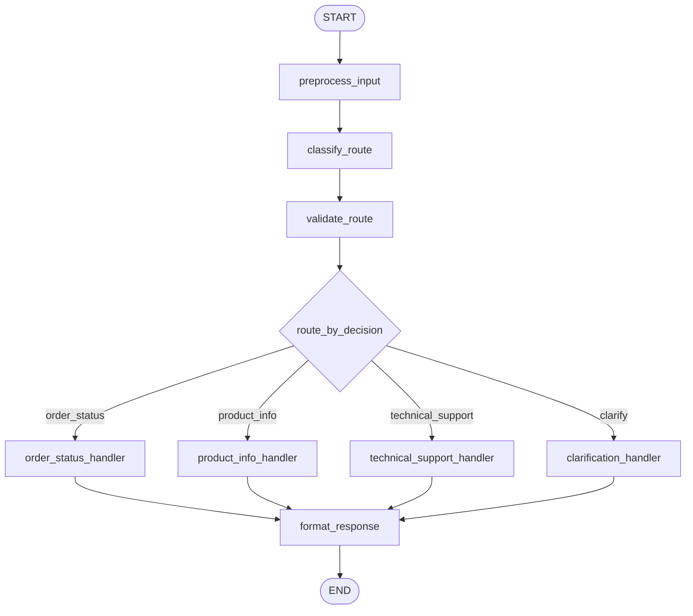

# 2: Routing (ko)

## 패턴 요약

사용자는 혼합된 질문을 하는 경우가 있다. 의도 분석을 통해서 의도를 분류하고 명확하지 않은 경우는 재질문을 하도록 분기.  
- 사용자의 복합 질문 -> Routing 노드에서 llm이 질문 의도(enum) + confidence 값 함께 리턴  
- Confidence threshold을 넘으면 해당 의도를 처리하고, 의도가 불문명한 예외 케이스의 경우 재질문 핸들러 노드로 분기한다.  

## 패턴 설명

### 문제

많은 에이전트 애플리케이션은 혼합된 요청을 받는다. 
- 고객 지원 도구는 주문 질문, 제품 질문, 기술 이슈, 모호한 문의를 한 화면에서 받는 경우가 많다. 
- 모든 요청을 하나의 범용 핸들러로 처리하면 취약하고 평가하기 어렵다. 
- Routing은 사용자의 의도 분류를 먼저하고 각 의도별 핸들러로 처리  


### 개념 개요

Routing은 에이전트가 본 작업을 수행하기 전 요청에 맞는 경로를 골라가는 방식
- 라우터는 입력 또는 현재 상태를 검사해 제한된 목적지로 분류하고, 해당 처리기로 워크플로우를 전달  
- 단일 프롬프트 체인과 다른 점은 다음 단계가 고정되지 않는다는 것이다. 


### 사용해야 할 때

- 입력이 알려진 카테고리로 나눠질 때 사용한다.
- 카테고리마다 도구/프롬프트/정책/전문가가 다를 때 사용한다.
- 불명확하거나 신뢰도가 낮은 입력은 액션 전에 명확화가 필요한 경우 사용한다.
- 의사결정 경로 추적이 중요할 때 사용한다.

### 작동 방식

1. 워크플로가 사용자 입력을 정규화하고 검증한다.
2. 라우터가 제한된 라우트 라벨 세트 중 하나로 분류한다.
3. 라우터는 라벨, 신뢰도, 폴백 정책을 검증한다.
4. 조건부 엣지가 선택된 전문 핸들러로 상태를 전달한다.
5. 선택된 핸들러가 도메인별 응답을 생성하고 formatter가 최종 답변을 반환한다.

### 트레이드오프

| 이점 | 비용 또는 위험 |
| --- | --- |
| 전문 프롬프트와 도구의 책임이 명확해진다. | 잘못된 라우팅은 사용자를 잘못된 워크플로로 보낼 수 있다. |
| 라우트별로 동작을 테스트하기 쉽다. | 라우트 라벨, 신뢰도 임계값, 폴백 정책이 필요하다. |
| 다중 처리기 시스템 확장성이 좋아진다. | 브랜치가 늘면 유지보수와 관측성 요구가 커진다. |

### 최소 예시

```text
고객 요청
  -> 라우트 분류
  -> 라우트 검증
  -> order_status | product_info | technical_support | clarify
  -> 최종 응답
```

### LangGraph 매핑

| 패턴 개념 | LangGraph 요소 |
| --- | --- |
| 라우트 결정 | 상태 필드 `route`, `route_reason`, `route_confidence` |
| 라우터 | 노드 `classify_route` |
| 라우트 검증 | 노드 `validate_route` |
| 브랜치 선택 | `route`를 읽는 조건부 엣지 |
| 전문 워크플로 | `order_status_handler` 등의 핸들러 노드 |
| 폴백 | `clarification_handler` 브랜치 |

## LangGraph 구현 목표

입력 요청을 분류하여 다음 네 가지 전문 노드 중 하나로 분기하는 고객 문의 라우터를 구현한다.

- 주문 추적이나 계정/주문 조회를 위한 `order_status_handler`
- 제품 카탈로그, 기능, 가격, 호환성, 가용성 질문을 위한 `product_info_handler`
- 문제 해결 및 지원 요청을 위한 `technical_support_handler`
- 불명확/지원되지 않음/저신뢰도 요청을 위한 `clarification_handler`

예제는 선형 체인이 아니라 LangGraph의 조건부 엣지를 보여야 한다. 라우터 노드는 LLM 프롬프트로 구조화된 결정을 만들 수 있지만, 그래프는 테스트에서 그 라우터를 결정적 규칙 기반/가짜 분류기로 교체할 수 있어야 한다.

## 상태 형태

그래프가 필요로 하는 상태 필드를 정리한다.

| 필드 | 타입 | 목적 |
| --- | --- | --- |
| `input` | `str` | 원본 사용자 요청. |
| `normalized_input` | `str` | 분류에 쓰이는 정규화된 요청 문자열. |
| `route` | `Literal["order_status", "product_info", "technical_support", "clarify"] \| None` | 라우터가 선택한 제한된 목적지. |
| `route_reason` | `str \| None` | 관측성 및 디버깅용 짧은 설명. |
| `route_confidence` | `float \| None` | 라우터/분류기의 선택 신뢰도. |
| `handler_output` | `str \| None` | 선택된 전문 핸들러가 만든 출력. |
| `final_output` | `str \| None` | 사용자에게 반환되는 최종 응답. |
| `errors` | `list[str]` | 실행 중 파싱/분류/핸들링 과정의 복구 가능한 오류. |
| `retry_count` | `int` | 잘못된 출력이나 일시적 실패 후 재시도한 라우팅 횟수. |
| `requires_human_review` | `bool` | 자동 응답 대신 Escalation이 필요한지 여부. |
| `metadata` | `dict[str, Any]` | 요청 ID, 계정 ID, 라우터 모델명, 추적 데이터 등. |

## 노드

| 노드 | 책임 |
| --- | --- |
| `preprocess_input` | `input` 존재 여부를 검사하고 공백을 정규화하며 기본 상태 필드를 초기화한다. |
| `classify_route` | `normalized_input`을 분석해 라우트 결정, 이유, 신뢰도를 생성한다. |
| `validate_route` | 라우터 출력을 정규화하고 알 수 없는 라벨을 거부, 신뢰도 임계값을 적용해 유효하지 않으면 `clarify`로 매핑한다. |
| `order_status_handler` | 주문 조회 요청을 시뮬레이션/조회한다. |
| `product_info_handler` | 제품 관련 질문에 대한 카탈로그 조회를 시뮬레이션/실행한다. |
| `technical_support_handler` | 문제 해결 가이드를 시뮬레이션/실행한다. 복잡하거나 위험한 지원 건은 `requires_human_review`를 설정한다. |
| `clarification_handler` | 모호하거나 지원되지 않은 요청일 때 타깃형 추가 질문을 한다. |
| `format_response` | 선택된 핸들러 결과를 `final_output`으로 정리하며 추적 필드를 유지한다. |

## 엣지

그래프 흐름을 조건부 분기 포함해 설명한다.



조건부 엣지 요구사항:

- 조건부 엣지는 검증된 정규 상태(`route` 같은)만 읽어야 한다.
- 알 수 없거나 비어 있거나 잘못된 라벨은 기본적으로 예외를 발생시키지 말고 `clarification_handler`로 보내고 오류를 추가해야 한다.
- `classify_route`가 일시적으로 실패하면 최대 `retry_count` 한도까지 재시도한 뒤 폴백한다.
- `technical_support_handler`가 인간 검토가 필요하다고 판단하면 `finalize`를 통과해 최종 응답에 승격 상태를 명시한다.

## 입력과 출력

- 입력: 단일 자연어 고객 요청. 선택적으로 사용자 ID, 계정 ID, 테스트용 라우트 오버라이드 같은 메타데이터.
- 출력: `final_output`, 선택된 `route`, 경로 검증을 위한 진단 필드.
- 중간 산출물: 정규화 입력, 라우터 raw 출력, 라우트 이유, 신뢰도, 핸들러 출력, 오류, 인간 검토 플래그.

예시 입력 형태:

```json
{
  "input": "Where is order 12345?",
  "user_id": "user-123",
  "metadata": {
    "channel": "chat"
  }
}
```

다른 예시 입력:

```json
{
  "input": "Does this laptop support two external monitors?",
  "user_id": "user-456",
  "metadata": {
    "channel": "web",
    "locale": "en-US"
  }
}
```

```json
{
  "input": "My device will not connect to Wi-Fi.",
  "user_id": "user-789",
  "metadata": {
    "channel": "mobile",
    "device_type": "phone"
  }
}
```

```json
{
  "input": "Can you help me with that thing from yesterday?",
  "user_id": "user-321",
  "metadata": {
    "channel": "chat",
    "conversation_id": "conv-20240610-001"
  }
}
```

예시 입력 카테고리:

- 주문 상태: `"Where is order 12345?"`
- 제품 정보: `"Does this laptop support two external monitors?"`
- 기술 지원: `"My device will not connect to Wi-Fi."`
- 명확화: `"Can you help me with that thing from yesterday?"`

## 실패 사례

예상 실패, 재시도, 폴백 동작, 인간 검토 포인트를 기록한다.

- 입력이 없거나 공백이면 전처리 단계에서 중단하고 명확화 응답 및 오류 항목을 남긴다.
- LLM 라우터가 허용 라벨이 아닌 문장을 반환하면 검증 후 오류를 추가하고 선택적으로 재시도한 뒤 명확화로 이동한다.
- 라우트가 유효하나 신뢰도가 임계값 미만이면 잘못된 핸들러 호출 대신 명확화로 이동한다.
- 주문 조회와 트러블슈팅 같은 다중 의도가 섞인 요청은 우선도 높은 의도 하나를 고르거나 초기 구현에서는 명확화로 전환한다.
- 핸들러가 복구 가능한 예외를 발생하면 오류를 추가하고 `format_response`에서 폴백 응답을 반환한다.
- 고위험, 계정 전용, 권한이 필요한 기술 지원은 `requires_human_review = true`로 설정하고 에스컬레이션 응답을 만든다.
- 임베딩 기반 또는 ML 기반 라우터를 사용할 수 없으면 규칙 기반/LLM 기반 라우팅으로 대체하고, 구성되지 않으면 명확화한다.

## 테스트 아이디어

- 각 라우트(주문 상태, 제품 정보, 기술 지원, 명확화)의 정상 경로를 검증한다.
- 각 정상 경로 입력에서 정확히 하나의 전문 핸들러만 실행되는지 검증한다.
- 잘못된 라우터 출력이 `clarification_handler`로 이동하고 오류가 기록되는지 검증한다.
- 저신뢰도 라우팅이 전문 핸들러를 호출하지 않음을 검증한다.
- 빈 입력이 `classify_route`를 호출하지 않고 명확화 응답을 만드는지 검증한다.
- 핸들러 예외가 `errors`에 캡처되고 `final_output`이 생성되는지 검증한다.
- `technical_support_handler`가 `requires_human_review`를 설정할 수 있는지 검증한다.
- 최종 상태에 `input`, `normalized_input`, `route`, `handler_output`, `final_output`, `errors`가 있는지 검증한다.
- 테스트에서 네트워크에 의존하지 않도록 가짜 분류기와 fake classifier를 사용한다.

## 열린 질문

- TOC에서는 Chapter 2를 논리 페이지 30-42로 표시하지만 추출 경계는 PDF 인덱스 35~48이며, Chapter 3은 인덱스 49에서 시작한다. 이로 인해 14페이지 추출과 13페이지 논리 범위의 불일치가 생긴다.
- 본 장에서는 LLM 기반, 임베딩 기반, 규칙 기반, 감독 학습 분류기 기반 라우팅을 모두 다룬다. 첫 LangGraph 예제는 테스트에서 결정론적 fake를 쓰기 쉽게 LLM 기반 라우팅을 택하는 것이 적절해 보이지만, 현재 저장소에는 모델 제공자/픽스처가 표준화되어 있지 않다.
- 장의 예시에는 고객 지원 카테고리와 booking/info/unclear 코디네이터 예제가 모두 있으나, 범용성과 LangGraph 브랜치 매핑을 위해 고객 지원 카테고리를 사용한다.
