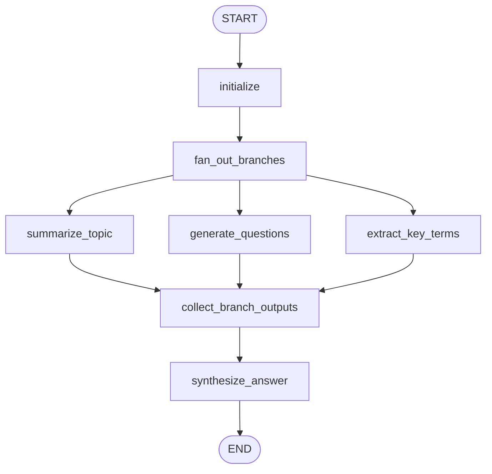
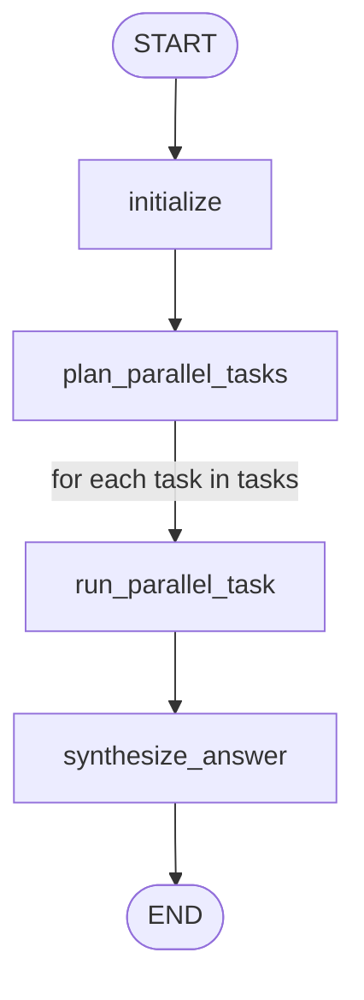

# 3: Parallelization (en)

## Pattern Summary

Parallelization executes independent workflow components at the same time instead of waiting for each component to finish sequentially. It is useful when an agentic task can be decomposed into sub-tasks that do not depend on each other's immediate outputs, such as multiple LLM calls, tool calls, API requests, database lookups, content-generation branches, validation checks, or modality-specific processors.

The pattern reduces total latency for I/O-bound work because the workflow waits for the slowest independent branch instead of the sum of all branch durations. It still requires a sequential convergence step when the independent results must be merged, validated, ranked, or synthesized. The chapter also notes that asynchronous execution provides concurrency and responsiveness for waiting tasks, but it is not the same as CPU parallelism.

Use this pattern when the workflow contains multiple independent operations whose results can be gathered before a later aggregation step. Do not use it for steps with strict data dependencies, or where parallel execution would introduce unnecessary complexity, cost, debugging difficulty, or logging ambiguity.

## Pattern Explanation

### Conceptual Overview

Parallelization runs independent parts of an agentic workflow at the same time. Instead of waiting for one LLM call or tool call to finish before starting another unrelated one, the graph fans out into multiple branches and later fans in to combine their results.

The core idea is independence. A branch should not need another branch's output to start. If the branches depend on each other, the workflow is a sequence, not a parallel pattern.

### Problem

Agentic systems often spend time waiting on external calls: LLMs, APIs, retrievers, databases, or tools. Running independent calls one after another increases latency unnecessarily. Parallelization reduces wall-clock time by executing independent work concurrently and joining the outputs at a synthesis step.

### When to Use

- Use this pattern when multiple subtasks can start from the same input.
- Use it when branch outputs are independent but all are useful for a later synthesis step.
- Use it when latency matters and branch work is I/O-bound.
- Use it when separate specialists should analyze the same problem from different angles.

### When Not to Use

- Avoid this pattern when each step needs the previous step's output.
- Avoid it when parallel calls would exceed rate limits or budget.
- Avoid it when state merge behavior is unclear.
- Avoid it when debugging parallel failures would cost more than the latency saved.

### How It Works

1. The workflow validates and initializes shared input state.
2. The graph fans out to independent branch nodes.
3. Each branch reads shared input and writes its result into a branch-keyed staging field.
4. The graph fans in to an explicit collection node after branch completion.
5. The synthesis node combines the collected outputs, handles missing branch results, and returns the final answer.

### Trade-offs

| Benefit | Cost or Risk |
| --- | --- |
| Reduces wall-clock latency for independent I/O-bound work. | Can increase simultaneous model/tool usage and rate-limit pressure. |
| Enables multi-perspective analysis. | Requires clear state merge rules. |
| Preserves successful branch results when one branch fails. | Observability and debugging are more complex than sequential chains. |

### Minimal Example

```text
Topic
  -> summarize topic
  -> generate questions
  -> extract key terms
  -> synthesize all branch outputs
```

### LangGraph Mapping

| Pattern Concept | LangGraph Element |
| --- | --- |
| Shared input | State field `input` |
| Fan-out | `fan_out_branches` node with multiple edges to branch nodes |
| Independent branches | Nodes `summarize_topic`, `generate_questions`, `extract_key_terms` |
| Concurrent-safe outputs | Branch-keyed `branch_outputs` state with a dictionary merge reducer |
| Fan-in | Branch nodes converge at `collect_branch_outputs`, then flow to `synthesize_answer` |
| Partial failure policy | `branch_errors` plus conditional handling in synthesis |

## LangGraph Implementation Goal

Build a LangGraph example named `parallel_topic_analyzer` that accepts a user topic and runs three independent analysis branches concurrently:

- generate a concise summary of the topic,
- generate follow-up questions about the topic,
- extract key terms from the topic.

After all branches complete, a synthesis node combines the branch outputs and the original topic into one structured response. The example should demonstrate LangGraph fan-out and fan-in topology rather than a plain sequential chain. Tests should use deterministic fake model/tool functions so the example does not require network access or API keys.

The workflow should make branch independence explicit. Each parallel node must read the original input and write its success or failure into `branch_outputs[branch_name]`. A collection node then derives user-facing fields such as `summary`, `questions`, `key_terms`, `completed_branches`, and `branch_errors`. The synthesis node must run only after this fan-in point has collected all available branch outputs.

## State Shape

List the state fields the graph needs.

| Field | Type | Purpose |
| --- | --- | --- |
| `input` | `str` | Original user topic or task description. |
| `branch_outputs` | `dict[str, BranchResult]` | Internal staging area keyed by branch name. Uses a dictionary merge reducer so sibling branch outputs do not overwrite each other. |
| `summary` | `str \| None` | Concise summary produced by the summary branch. |
| `questions` | `list[str]` | Follow-up questions produced by the questions branch. |
| `key_terms` | `list[str]` | Key terms produced by the key-terms branch. |
| `branch_errors` | `list[dict]` | Recoverable errors derived from `branch_outputs`, including branch name, message, and attempts. |
| `started_at` | `float \| None` | Optional timestamp for measuring total graph latency. |
| `completed_branches` | `list[str]` | Branch names derived from successful entries in `branch_outputs`. |
| `final_answer` | `str \| None` | Final synthesized response after fan-in. |
| `metadata` | `dict` | Optional runtime metadata, such as run ID, timeout values, or elapsed time. |

If implementing a dynamic fan-out variant, add:

| Field | Type | Purpose |
| --- | --- | --- |
| `tasks` | `list[dict]` | Independent task specifications created by a planning node. |
| `branch_results` | `list[dict]` | Reducer-backed collection of dynamic branch outputs. |

## Nodes

| Node | Responsibility |
| --- | --- |
| `initialize` | Normalize the input topic, initialize empty result and error fields, and attach runtime metadata. |
| `fan_out_branches` | No-op marker node that makes the fan-out point explicit for graph visualization and tracing. |
| `summarize_topic` | Run an LLM or deterministic test double that creates a concise summary from `input`; write the result to `branch_outputs["summary"]`. |
| `generate_questions` | Run an independent LLM or deterministic test double that creates follow-up questions from `input`; write the result to `branch_outputs["questions"]`. |
| `extract_key_terms` | Run an independent LLM or deterministic test double that extracts key terms from `input`; write the result to `branch_outputs["key_terms"]`. |
| `collect_branch_outputs` | Explicit fan-in node that derives `summary`, `questions`, `key_terms`, `completed_branches`, and `branch_errors` from `branch_outputs`. |
| `synthesize_answer` | Combine collected branch outputs into a structured answer, and clearly mark missing branch data if a branch failed recoverably. |
| `handle_failure` | Produce a controlled error output when required branches fail, the input is invalid, or the graph cannot safely synthesize. |

Optional dynamic variant:

| Node | Responsibility |
| --- | --- |
| `plan_parallel_tasks` | Convert the input into independent task specs and reject plans with inter-task dependencies. |
| `run_parallel_task` | Execute one task spec per dynamic branch and append the result to `branch_results`. |

## Edges

Describe the graph flow, including conditional branches.



Required conditional behavior:

- If `initialize` receives an empty or invalid topic, route to `handle_failure`.
- If a parallel branch fails with a recoverable error, record it in that branch's `branch_outputs` entry and still allow fan-in.
- If a required branch is missing and no fallback policy permits partial synthesis, route from `synthesize_answer` to `handle_failure`.
- If all required branch outputs are present, route from `synthesize_answer` to `END`.

Dynamic fan-out variant:



## Inputs and Outputs

- Input: a topic string, such as `"The history of space exploration"`, or a domain-specific research question.
- Output: a structured synthesized response that includes a summary, related questions, key terms, and a short integrated conclusion.
- Intermediate artifacts:
  - branch-specific prompts or task specs,
  - raw branch outputs,
  - branch completion metadata,
  - branch error records,
  - optional timing data showing that independent branches executed concurrently.

Example input shape:

```json
{
  "input": "The history of space exploration"
}
```

## Failure Cases

Document expected failures, retries, fallback behavior, and human-review points.

- Empty or too-short input should fail before fan-out and return a validation error.
- A branch timeout should be recorded in `branch_errors`; retry once if the branch is idempotent and the configured retry budget allows it.
- A model or tool error in one branch should not automatically discard successful outputs from other branches.
- The synthesis node must avoid inventing missing branch data. If partial synthesis is allowed, it must explicitly mark unavailable sections.
- Concurrent writes to the same state key can cause merge conflicts. Parallel nodes should write to branch-specific entries under a reducer-backed `branch_outputs` dictionary.
- If a Studio thread or checkpoint is reused, stale branch outputs from earlier runs must not be synthesized into the current run. Include a run identifier in branch outputs and filter during collection.
- Rate limits or external API failures can make parallel execution more fragile than sequential execution. The implementation should support configurable concurrency limits, timeouts, and retry budgets.
- Branches that are not actually independent should not be run in parallel. The implementation should keep dependent steps in sequence or reject the plan in the dynamic variant.
- Debugging and observability are more complex with parallel branches. Each branch should log its branch name, start/end status, and error metadata.
- Human review is appropriate when synthesis uses partial outputs for a high-impact answer or when branch outputs contradict each other.

## Test Ideas

- Verify the happy path: all three branches complete and `final_answer` includes content derived from `summary`, `questions`, and `key_terms`.
- Verify fan-out/fan-in topology: mocked branch functions record overlapping execution windows or are invoked from the same initialized state before synthesis.
- Verify empty input routes to `handle_failure` without calling any parallel branch.
- Verify one recoverable branch failure still preserves successful branch outputs and records `branch_errors`.
- Verify required-branch failure routes to `handle_failure` when partial synthesis is disabled.
- Verify concurrent state merging does not overwrite sibling entries in `branch_outputs`.
- Verify synthesis ignores stale `branch_outputs` entries from a previous run.
- Verify dynamic fan-out, if implemented, creates one `run_parallel_task` execution per independent task spec and aggregates all results.
- Verify final state contains `input`, branch outputs, `completed_branches`, `branch_errors`, and `final_answer`.
- Verify tests use fake LLM/tool implementations and do not require network access or API keys.

## Open Questions

- The TOC lists Chapter 3 as logical pages `43-57`, but the extracted chapter text appears on PDF file pages 50-64. The document should continue citing the TOC logical range while preserving this extraction note.
- The source chapter explains LangGraph parallel topology conceptually, but its concrete code examples use LangChain LCEL and Google ADK. The LangGraph implementation details should therefore be derived from the pattern rather than copied from a source code listing.
- Decide whether the first implementation should use the fixed three-branch topic analyzer or the dynamic task-planning variant. The fixed version is simpler for tests; the dynamic version better demonstrates scalable fan-out.
- Decide whether partial synthesis is acceptable when one branch fails, or whether all branches should be required for the first runnable example.
