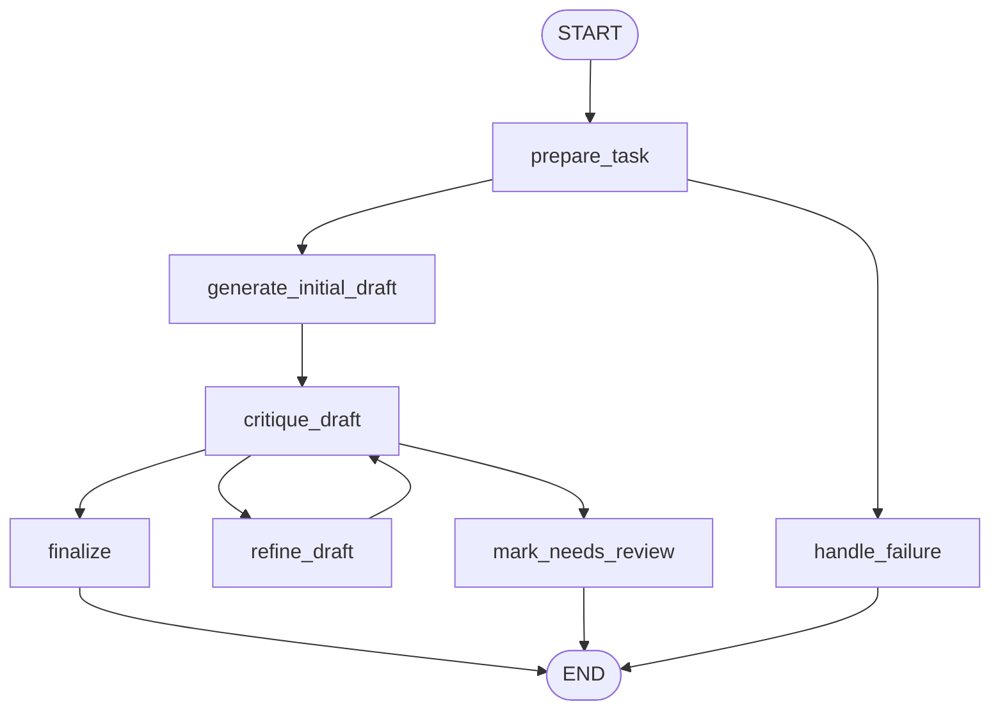

# 4: Reflection (ko)

## 패턴 요약

Reflection은 에이전트 워크플로에 피드백 루프를 추가
- 초안 결과를 최종으로 두지 않고, 초기 출력을 생성한 뒤 명시적 기준으로 비판,
- 그 비판 결과를 반영해 다시 개선.
- 장에서는 자기 교정(self-correction)으로 설명하며, 에이전트가 자신의 결과/플랜/내부 상태를 평가하고 다음 버전을 개선하도록 한다.

안정적인 구현은 두 역할로 분리
- Producer가 출력을 생성/수정하고
- Critic이 다른 프롬프트/역할/평가 정책으로 리뷰.
- LangChain 예시는 코드 생성기와 시니어 리뷰어가 `CODE_IS_PERFECT` 같은 센티넬까지 쓰는 방식이며, ADK 예시는 초안 작성자와 팩트체크 리뷰어로 structured 출력을 상태에 저장한다.
- 품질·정확성·지침 준수·미묘한 수정이 속도와 비용보다 우선인 경우에 유용하다.

## 패턴 설명

### 문제

초기 LLM 출력은 누락, 부정확, 구조 불량, 복잡 요구사항 위반이 생길 수 있다.
- 선형 워크플로에는 이를 탐지하고 수정하는 장치가 없으므로 고질적 에러가 누적된다.
- Reflection은 평가와 개선을 정식 워크플로 단계로 끌어올린다.


### 개념 개요

Reflection은 에이전트의 review-and-revise 사이클이다.
- 먼저 답변을 만들고, 그 답변을 다시 평가한 뒤 개선된 답으로 다시 생성한다. 같은 모델이 리뷰 프롬프트로 평가할 수도 있고, 별도 모델 호출/규칙/테스트/다른 에이전트가 평가할 수도 있다.
- 중요한 점은 이것이 단순한 chain이 아니라 정보가 뒤로 흐르며 “마무리/수정/승격”을 제어한다는 것이다. 비판은 다음 동작을 결정한다.


### 사용해야 할 때

- 최종 출력이 명시적 품질 기준을 만족해야 할 때 사용한다.
- 코드 생성, 디버깅, 장문 작성, 사실성 검토, 요약, 계획, 전략, 다단계 추론 작업에서 사용한다.
- Producer보다 더 객관적/전문적인 피드백이 가능한 별도 Critic 역할이 있을 때 사용한다.
- 비평 이력을 보존해 반복 실수를 줄일 수 있을 때 사용한다.
- bounded retries와 리뷰 상태를 운영적으로 허용할 수 있을 때 사용한다.

### 사용하지 말아야 할 때

- 단일 샷으로 충분한 간단한 답변에는 사용하지 않는다.
- 낮은 지연/낮은 토큰 비용이 품질 개선보다 중요할 때 피한다.
- 명확한 리뷰 기준이 없으면 비평이 노이즈만 만들어 루프가 흔들린다.
- 무한 루프가 될 수 있는 Reflection은 비용, 지연, 컨텍스트 증가, 스로틀링 위험을 키우므로 피한다.
- 고위험 검증은 deterministic 테스트/도구/인간 검토가 필요하므로 모델 단독 self-critique에만 의존하지 않는다.

### 작동 방식

1. 워크플로가 작업을 받아 명시적 성공 기준으로 변환한다.
2. Producer가 초기 초안을 생성한다.
3. Critic이 초안을 원래 작업, 기준, 이력으로 평가한다.
4. 워크플로가 수락/수정/신뢰 불가를 결정한다.
5. 수정이 필요하고 반복 예산이 남아 있으면 Producer가 비평을 반영해 초안을 개선한다.
6. 비판이 수락되거나 최대 반복 횟수 도달, 또는 실패 경로 필요 시 human review로 반복이 종료된다.


## 코드 평가 과정

1. current_draft가 없으면 평가 불가로 처리합니다.
- critique_status = "invalid"가 되고, "Cannot critique without a draft."가 기록됩니다.

2. 초안 코드에 대해 정적 체크를 먼저 합니다.
- AST 파싱과 간단한 패턴 검사를 합니다:

3. 그 정적 체크 결과를 포함해서 Critic LLM에게 리뷰를 요청합니다.
- critic prompt는 “task와 requirements만 기준으로 코드 리뷰하고, strict JSON으로 status, critique를 반환하라”고 지시.

4. LLM 출력을 파싱
  - "accepted"
  - "needs_revision"
  - "invalid"

5. 이후 src/agentic_design_patterns/patterns/chapter_04_reflection/graph.py:37가 결과를 보고 분기합니다.
  - accepted → finalize
  - needs_revision이고 아직 max_iterations 미만 → refine_draft
  - 그 외 → mark_needs_review

- 즉, 이 노드는 “정적 검사 + LLM 리뷰” 방식으로 평가합니다. 실제 테스트 실행이나 점수 기반 채점은 없고, factorial 예제에 특화된
  AST/정규식 체크 결과를 LLM critic에게 참고자료로 넘긴 뒤, LLM이 accepted 또는 needs_revision을 판단하는 구조입니다.

### 트레이드오프

| 이점 | 비용 또는 위험 |
| --- | --- |
| 품질, 정확성, 완전성, 지침 준수를 높인다. | 추가 LLM 호출로 지연 및 비용 증가. |
| Producer-Critic 분리는 검토가 더 집중된 역할을 만든다. | Critic이 이슈를 놓치거나 과도하게 지적하거나 malformed 피드백을 낼 수 있다. |
| 수정 이력을 남겨 반복 개선을 관측/테스트 가능하게 한다. | 컨텍스트가 길어져 창 크기 문제로 이어질 수 있다. |
| 승인 상태, max iteration 같은 명시적 중단 조건이 유효하다. | 중단 규칙이 부실하면 조기 승인 또는 과도한 재시도로 이어진다. |

### 최소 예시

```text
Task: write calculate_factorial(n)
  -> producer가 초기 코드 작성
  -> critic이 docstring, n=0, 음수 입력, 정확성 검토
  -> accepted면 반환
  -> critique 요청 시 attempts 남으면 revise
  -> attempts 소진 시 needs_review와 함께 최신 코드 반환
```

### LangGraph 매핑

| 패턴 개념 | LangGraph 요소 |
| --- | --- |
| 원본 작업과 리뷰 기준 | `input`, `requirements` 상태 필드 |
| Producer 역할 | `generate_initial_draft`, `refine_draft` 노드 |
| Critic 역할 | `critique_draft` 노드 |
| 피드백 루프 | `critique_draft`에서 `refine_draft`로의 조건부 엣지 |
| 종료 조건 | `critique_status`, `iteration`, `max_iterations` 기반 라우팅 |
| 수정 기록 | `revision_history` 상태 필드 |
| 통제 실패 처리 | `mark_needs_review` 노드 |

## LangGraph 구현 목표

`reflection_code_reviewer`라는 LangGraph 예제를 만들어 Producer-Critic 루프로 작은 Python 함수를 생성·개선한다. 기본 시나리오는 장의 팩토리얼 예시를 따르며 사용자 요청은 정수 입력 시 `calculate_factorial(n)`을 반환하고, docstring 포함, `0`이면 1, 음수는 `ValueError`를 발생하는 함수 생성이다.

그래프는 먼저 코드를 생성하고, senior Python reviewer처럼 critique한다. critic이 승인하면 종료하고, 문제를 찾아냈고 반복 예산이 남으면 반영해 수정 후 재평가한다. max_iterations을 넘기면 최신 코드와 `status = "needs_review"`를 반환하고 비평 이력을 유지한다.

Reflection 동작을 프롬프트 한 덩어리로 숨기지 않고 명시적으로 보여주어야 한다. 테스트는 결정론적 fake producer/critic 함수로 네트워크 없이 검증 가능해야 한다.

## 상태 형태

그래프가 필요로 하는 상태 필드를 정리한다.

| 필드 | 타입 | 목적 |
| --- | --- | --- |
| `input` | `str` | 원본 사용자 작업 또는 코드 생성 요청. |
| `requirements` | `list[str]` | 작업에서 추출되거나 미리 정의된 명시 기준. |
| `current_draft` | `str \| None` | 최신 생성/수정 코드 초안. |
| `critique` | `str \| None` | 최근 Critic 피드백. |
| `critique_status` | `Literal["accepted", "needs_revision", "invalid"] \| None` | 조건부 라우팅에 쓰는 정규화된 리뷰 결정. |
| `iteration` | `int` | 완료된 생성/수정 시도 횟수. |
| `max_iterations` | `int` | Reflection 반복 상한. |
| `revision_history` | `list[dict]` | 초안, 비평, 상태, 반복 번호의 순서 기록. |
| `errors` | `list[str]` | 검증, 모델, 파서, 라우팅의 복구 가능한 오류. |
| `status` | `Literal["ok", "needs_review", "failed"] \| None` | 최종 워크플로 상태. |
| `final_output` | `dict \| None` | 최종 코드, status, 반복 수, 리뷰 메타데이터를 담는 사용자 응답. |
| `metadata` | `dict` | 모델명, 프롬프트 버전, 런타임 설정, 추적 ID, 테스트 더블 마커. |

선택 구현 필드:

| 필드 | 타입 | 목적 |
| --- | --- | --- |
| `raw_critic_output` | `str \| dict \| None` | 파싱 전 critic raw 출력. |
| `static_check_results` | `dict \| None` | 임의 실행 없이 factorial 예시를 확인할 수 있는 결정론적 검증 결과. |

## 노드

| 노드 | 책임 |
| --- | --- |
| `prepare_task` | 입력이 비어 있지 않은지 확인하고 루프 카운터/히스토리를 초기화하며 requirements를 유도/첨부. |
| `generate_initial_draft` | producer 프롬프트 또는 fake 생성기로 첫 초안을 만들고 `iteration=1`을 설정, history에 기록. |
| `critique_draft` | 현재 초안과 requirements를 리뷰하고 `critique_status`, `critique`로 정규화 후 이력 저장. |
| `refine_draft` | 최근 비평과 기준을 사용해 Producer에게 초안 수정 요청, `iteration` 증가 및 이력 추가. |
| `finalize` | `critique_status`가 수락이면 `status = "ok"` 결과 생성. |
| `mark_needs_review` | 비평 미해결, critic 출력 invalid, 예산 초과 시 루프 종료. 최신 초안과 비평 기록 유지. |
| `handle_failure` | 빈 입력, 복구 불가 모델 오류, 초안 미존재 등 실패에 대한 제어된 실패 결과 반환. |

## 엣지

그래프 흐름을 조건부 분기 포함해 설명한다.



조건부 엣지 요구사항:

- `critique_draft` -> `finalize`는 `critique_status == "accepted"`일 때.
- `critique_draft` -> `refine_draft`는 `critique_status == "needs_revision"`이고 `iteration < max_iterations`일 때.
- `critique_draft` -> `mark_needs_review`는 `critique_status == "needs_revision"`이면서 다음 수정이 최대치를 넘는 경우.
- `critique_draft` -> `mark_needs_review`는 critic 출력이 malformed/모순/`invalid`로 정규화될 때.
- `prepare_task` -> `handle_failure`는 빈 입력에서 모델 호출 전에 수행.
- 반복은 bounded해야 하며 `refine_draft`를 무한 재방문하는 경로가 없어야 한다.

## 입력과 출력

- 입력: 코드 생성 요청, 기본값은 `calculate_factorial(n)` 요구사항.
- 출력: `status`, `final_code`, `iterations`, `accepted`, `final_critique`, `errors`를 포함한 사전.
- 중간 산출물: requirements, 각 초안 버전, 각 비평, 정규화된 비평 상태, revision_history, optional static check 결과.

예시 입력 형태:

```json
{
  "input": "Write a Python function calculate_factorial(n) that handles 0, positive integers, and invalid negative inputs."
}

{
  "input": "Write calculate_factorial(n), but keep it minimal."
}
```

성공 출력 형태 예시:

```json
{
  "status": "ok",
  "accepted": true,
  "iterations": 2,
  "final_code": "def calculate_factorial(n): ...",
  "final_critique": "Accepted: all requirements are satisfied.",
  "errors": []
}
```

해결되지 않은 출력 형태 예시:

```json
{
  "status": "needs_review",
  "accepted": false,
  "iterations": 3,
  "final_code": "def calculate_factorial(n): ...",
  "final_critique": "Still missing negative input handling.",
  "errors": ["max_iterations reached before acceptance"]
}
```

## 실패 사례

예상 실패, 재시도, 폴백 및 인간 검토 포인트를 기록한다.

- 공백 입력은 `handle_failure`로 이동하고 Producer를 호출하지 않는다.
- Producer가 코드 없이 문장만 반환하거나 사용할 수 없는 초안을 만들면 오류 기록 후 `mark_needs_review` 또는 `handle_failure`로 이동.
- Critic이 malformed 출력, status 누락, 정규화 불가 비평을 반환하면 raw 출력을 저장하고 `mark_needs_review`로 이동.
- Critic이 계속 변경을 요구해 max iterations에 도달하면 `needs_review`로 최신 초안과 history를 반환.
- Producer가 이전 비평을 반영하지 않으면 revision_history에서 관찰 가능해야 한다.
- draft/critique를 모두 보존하면 context 증가 위험이 있으므로 필요 시 이력 압축 또는 요약을 고려한다.
- 모델 제공자 오류/스로틀 실패는 `errors`에 저장해 `final_output`에 표시.
- 기본 그래프는 임의 사용자 입력을 실행해 코드를 실행하지 않는다. 결정론적 검증 시에는 알려진 고정 fixture만 사용.
- Critic가 계속 불만족하거나 안전성 이슈, 결정론적 확인이 critic과 충돌하면 human review로 넘긴다.

## 테스트 아이디어

- 첫 초안이 승인되어 `refine_draft`에 진입하지 않는 정상 경로를 검증.
- 첫 비평이 수정 요청하고 두 번째 초안이 승인되는 루프를 검증하고 `revision_history`에 2개 시도 존재 확인.
- `max_iterations`이 루프를 중단하고 무한 반복 대신 `status = "needs_review"`를 반환하는지 검증.
- 빈 입력에서 `handle_failure`로 가고 producer/critic 더블이 호출되지 않는지 검증.
- malformed critic 출력이 `invalid`로 정규화되고 `errors`에 기록되어 `mark_needs_review`로 가는지 검증.
- `iteration`은 초안 생성/수정 시에만 증가하고 max를 넘지 않는지 검증.
- 최종 상태가 항상 `status`, `final_output`, `current_draft`, `critique_status`, `revision_history`를 포함하는지 검증.
- fake Producer/Critic으로 네트워크/키 없이 테스트하는지 검증.
- 기본 factorial fixture가 docstring, `n == 0`, 음수 처리 조건을 검사하는지 검증.

## 열린 질문

- TOC는 Chapter 4를 `58-70`으로 표시하고 PDF 인덱스 `64-76`은 13페이지 챕터 내부 페이지와 맞는다. 다만 참조 전용 페이지가 인덱스 `77`에 있어 계속 추출 모호성이 있다.
- 장은 LangChain 반복 루프와 ADK 순차 draft/fact-check 파이프라인을 모두 보여준다. 구현은 상태, 조건부 라우팅, bounded cycle을 가장 잘 커버하는 반복 코드 리뷰 루프를 채택한다.
- 구현에서 소스 critic이 `CODE_IS_PERFECT`를 쓰므로, 구조화된 status 사용을 유지하되 sentinel 스타일 출력도 테스트로 커버한다.
