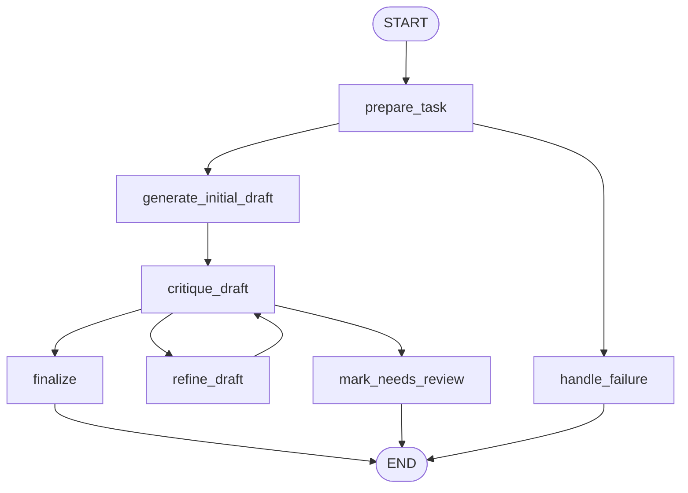

# 4: Reflection (en)

## Pattern Summary

Reflection adds a feedback loop to an agentic workflow. Instead of accepting the first output as final, the system generates an initial result, critiques it against explicit criteria, and uses that critique to refine the result. The chapter presents this as self-correction: an agent evaluates its own work, output, plan, or internal state, then improves the next version based on the evaluation.

A robust implementation separates the work into two logical roles: a Producer that creates or revises the output, and a Critic that reviews the output with a different prompt, role, or evaluation policy. The chapter's LangChain example uses a code generator and a senior-engineer reviewer that returns either critiques or the sentinel `CODE_IS_PERFECT`; its ADK example uses a draft writer and a fact-checking reviewer that writes structured review output to state.

Use this pattern when quality, accuracy, instruction adherence, or nuanced revision matters more than speed and cost. For implementation, Reflection should behave like a bounded stateful loop: preserve the current draft, critique, criteria, and revision history; stop when the critic accepts the work or when the iteration budget is exhausted; and surface incomplete or unresolved results for review rather than looping forever.

## Pattern Explanation

### Conceptual Overview

Reflection is an agentic review-and-revise cycle. The agent produces an answer, steps back to evaluate it, and then uses the evaluation to produce a better answer. The critique can come from the same model under a review prompt, a separate model call, deterministic rules, tests, or another specialized agent.

The chapter emphasizes that reflection is different from a simple chain because information flows backward into the workflow. The critique is not just another output; it controls whether the system stops, revises, or escalates.

### Problem

Initial LLM outputs can be incomplete, inaccurate, poorly structured, or misaligned with complex requirements. A linear workflow has no built-in mechanism to notice and correct those problems. Reflection solves this by making evaluation and refinement first-class workflow steps.

### When to Use

- Use this pattern when the final output must satisfy explicit quality criteria.
- Use it for code generation, debugging, long-form content, factual review, summarization, planning, strategy, or multi-step reasoning.
- Use it when a separate critic role can provide more objective or specialized feedback than the producer role.
- Use it when preserving critique history can help the model avoid repeating the same mistake.
- Use it when bounded retries and review status are acceptable operationally.

### When Not to Use

- Avoid this pattern for simple one-shot answers where revision does not materially improve the result.
- Avoid it when low latency or low token cost is more important than quality improvement.
- Avoid it when there are no clear review criteria; vague criticism can make the loop noisy.
- Avoid unbounded reflection loops because they can increase cost, latency, context length, and API throttling risk.
- Avoid relying only on model self-critique for high-stakes validation that needs deterministic tests, tools, or human review.

### How It Works

1. The workflow receives a task and converts it into explicit success criteria.
2. The Producer generates the initial draft or solution.
3. The Critic evaluates the draft against the original task, criteria, and any available history.
4. The workflow decides whether the critique accepts the draft, requests revision, or cannot be trusted.
5. If revision is needed and the iteration budget remains, the Producer refines the draft using the critique.
6. The loop repeats until the Critic accepts the draft, the maximum iteration count is reached, or a failure path requires human review.

### Trade-offs

| Benefit | Cost or Risk |
| --- | --- |
| Improves quality, accuracy, completeness, and instruction adherence. | Requires extra LLM calls, increasing latency and cost. |
| Producer-Critic separation gives the review step a focused, more objective role. | A critic can still miss issues, over-criticize, or provide malformed feedback. |
| Revision history makes iterative improvement observable and testable. | Conversation history can grow until it strains the context window. |
| Works well with explicit stopping conditions such as accepted status or max iterations. | Poor stopping rules can cause premature acceptance or wasted retries. |

### Minimal Example

```text
Task: write calculate_factorial(n)
  -> producer creates initial code
  -> critic reviews for docstring, n=0, negative input, and correctness
  -> if accepted: return code
  -> if critique found and attempts remain: producer revises using critique
  -> if attempts exhausted: return latest code with needs_review
```

### LangGraph Mapping

| Pattern Concept | LangGraph Element |
| --- | --- |
| Original task and review criteria | State fields `input` and `requirements` |
| Producer role | Nodes `generate_initial_draft` and `refine_draft` |
| Critic role | Node `critique_draft` |
| Feedback loop | Conditional edge from `critique_draft` back to `refine_draft` |
| Stopping condition | Conditional route based on `critique_status`, `iteration`, and `max_iterations` |
| Revision memory | State field `revision_history` |
| Controlled failure | Node `mark_needs_review` |

## LangGraph Implementation Goal

Build a LangGraph example named `reflection_code_reviewer` that generates and refines a small Python function using a Producer-Critic loop. The default scenario should mirror the chapter's factorial example: the user asks for a `calculate_factorial(n)` function that accepts an integer, returns `n!`, includes a docstring, returns `1` for `0`, and raises `ValueError` for negative input.

The graph should first generate code, then critique it as a senior Python reviewer. If the critique accepts the code, the graph finalizes. If the critique identifies issues and the iteration budget remains, the graph refines the code using the critique and reviews again. If the loop reaches `max_iterations` without acceptance, the graph returns the latest code with `status = "needs_review"` and preserves the critique trail.

The runnable example should make the reflection mechanics explicit rather than hiding them in one prompt. Tests should use deterministic fake producer and critic functions so the graph can be verified without network access or API keys.

## State Shape

List the state fields the graph needs.

| Field | Type | Purpose |
| --- | --- | --- |
| `input` | `str` | Original user task or code-generation request. |
| `requirements` | `list[str]` | Explicit criteria the draft must satisfy, extracted from the task or supplied by the example. |
| `current_draft` | `str \| None` | Latest generated or refined code draft. |
| `critique` | `str \| None` | Most recent critic feedback. |
| `critique_status` | `Literal["accepted", "needs_revision", "invalid"] \| None` | Normalized review decision used by conditional routing. |
| `iteration` | `int` | Number of completed generate/refine attempts. |
| `max_iterations` | `int` | Upper bound for reflection loops. |
| `revision_history` | `list[dict]` | Ordered record of drafts, critiques, statuses, and iteration numbers. |
| `errors` | `list[str]` | Recoverable validation, model, parser, or routing errors. |
| `status` | `Literal["ok", "needs_review", "failed"] \| None` | Final workflow status. |
| `final_output` | `dict \| None` | User-facing result containing final code, status, iteration count, and review metadata. |
| `metadata` | `dict` | Optional model names, prompt version, runtime configuration, trace IDs, or test-double markers. |

Optional implementation fields:

| Field | Type | Purpose |
| --- | --- | --- |
| `raw_critic_output` | `str \| dict \| None` | Unnormalized critic output before parsing. |
| `static_check_results` | `dict \| None` | Optional deterministic checks for the known factorial example, if implemented without executing arbitrary user code. |

## Nodes

| Node | Responsibility |
| --- | --- |
| `prepare_task` | Validate non-empty input, initialize loop counters and history, and derive or attach explicit requirements. |
| `generate_initial_draft` | Run the Producer prompt or deterministic test double to create the first code draft, set `iteration = 1`, and record the draft in history. |
| `critique_draft` | Run the Critic prompt or deterministic test double to evaluate `current_draft` against `requirements`; normalize output into `critique_status` and `critique`, then record the review in history. |
| `refine_draft` | Ask the Producer to revise `current_draft` using the latest critique and original requirements; increment `iteration` and append history. |
| `finalize` | Produce `final_output` with `status = "ok"` when the critic accepts the draft. |
| `mark_needs_review` | Stop the loop when critiques remain unresolved, critic output is invalid, or the iteration budget is exhausted; preserve the latest draft and critique trail. |
| `handle_failure` | Return a controlled failed result for blank input, unrecoverable model errors, or missing draft state. |

## Edges

Describe the graph flow, including conditional branches.



Conditional edge requirements:

- Route from `critique_draft` to `finalize` when `critique_status == "accepted"`.
- Route from `critique_draft` to `refine_draft` when `critique_status == "needs_revision"` and `iteration < max_iterations`.
- Route from `critique_draft` to `mark_needs_review` when `critique_status == "needs_revision"` and the next revision would exceed `max_iterations`.
- Route from `critique_draft` to `mark_needs_review` when the critic output is malformed, contradictory, or normalized to `invalid`.
- Route from `prepare_task` to `handle_failure` for blank or unusable input before any model call.
- Keep the loop bounded; the graph must not contain a path that can revisit `refine_draft` indefinitely.

## Inputs and Outputs

- Input: a code-generation task, defaulting to the chapter-style `calculate_factorial(n)` requirements.
- Output: a dictionary containing `status`, `final_code`, `iterations`, `accepted`, `final_critique`, and any `errors`.
- Intermediate artifacts: explicit requirements, each draft version, each critique, normalized critic status, revision history, and optional static check results.

Example successful output shape:

```json
{
  "status": "ok",
  "accepted": true,
  "iterations": 2,
  "final_code": "def calculate_factorial(n): ...",
  "final_critique": "Accepted: all requirements are satisfied.",
  "errors": []
}
```

Example unresolved output shape:

```json
{
  "status": "needs_review",
  "accepted": false,
  "iterations": 3,
  "final_code": "def calculate_factorial(n): ...",
  "final_critique": "Still missing negative input handling.",
  "errors": ["max_iterations reached before acceptance"]
}
```

Example input shape:

```json
{
  "input": "Write a Python function calculate_factorial(n) that handles 0, positive integers, and invalid negative inputs."
}
```

## Failure Cases

Document expected failures, retries, fallback behavior, and human-review points.

- Empty or whitespace-only input should route to `handle_failure` before calling the Producer.
- Producer returns no draft, prose without code, or an otherwise unusable draft; record an error and route to `mark_needs_review` or `handle_failure` depending on recoverability.
- Critic returns malformed output, omits a status, or provides a critique that cannot be normalized; record the raw critic output and route to `mark_needs_review`.
- Critic repeatedly asks for changes until `max_iterations` is reached; return `needs_review` with the latest draft and complete history.
- Producer ignores a previous critique; keep the critique in `revision_history` so the failure is observable.
- Context grows too large because every draft and critique is retained; implementation should cap stored history or summarize old iterations if needed.
- Model provider errors or rate-limit failures should be captured in `errors` and surfaced in `final_output`.
- Generated code should not be executed against arbitrary user input in the default graph. If deterministic checks are added, restrict them to known safe fixtures or run them in a controlled test harness.
- Human review is appropriate when the critic remains unsatisfied, the generated code may be unsafe, or deterministic checks contradict the model critique.

## Test Ideas

- Verify the happy path where the first draft is accepted and the graph finalizes without entering `refine_draft`.
- Verify the reflection loop where the first critique requests revision, the second draft is accepted, and `revision_history` contains both attempts.
- Verify that `max_iterations` stops the loop and returns `status = "needs_review"` instead of looping forever.
- Verify blank input routes to `handle_failure` without calling producer or critic test doubles.
- Verify malformed critic output is normalized to `invalid`, recorded in `errors`, and routed to `mark_needs_review`.
- Verify `iteration` increments only when a draft is generated or refined, and never exceeds `max_iterations`.
- Verify the final state always includes `status`, `final_output`, `current_draft`, `critique_status`, and `revision_history`.
- Verify tests use fake Producer and Critic implementations and require no network access or API keys.
- Verify the default factorial fixture checks for the required edge cases in the prompt: docstring, `n == 0`, and negative input handling.

## Open Questions

- `docs/agentic-design-patterns-toc.md` lists Chapter 4 as logical pages `58-70`, and PDF indexes `64-76` align to the 13 extracted chapter pages. However, a references-only continuation page appears at PDF index `77` / page label `78` with chapter-internal counter `14`, before Chapter 5 begins at index `78` / page label `79`. This document cites the TOC logical range and treats the extra page as an extraction/page-count ambiguity.
- The chapter demonstrates both an iterative LangChain code-generation loop and a sequential ADK draft/fact-check pipeline. This requirement chooses the iterative code-review loop because it best exercises LangGraph state, conditional routing, and bounded cycles.
- The source critic uses the sentinel phrase `CODE_IS_PERFECT`; the implementation should prefer a normalized structured status while still allowing tests to cover sentinel-style critic output if useful.
