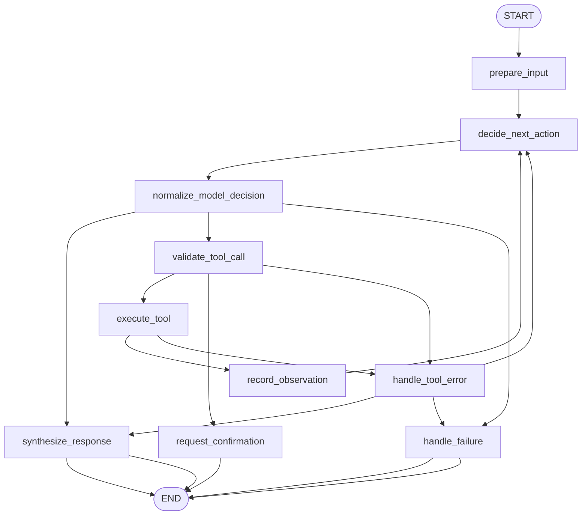

# 5: Tool Use (en)

## Pattern Summary

Tool Use, often implemented as function calling, lets an agent go beyond text generation by invoking external functions, APIs, databases, services, code execution environments, search tools, or even other specialized agents. The chapter frames tool use as the bridge between an LLM's reasoning and external capabilities that provide dynamic information, deterministic computation, private data access, or real-world actions.

The pattern has a standard control loop: define tools with clear names, descriptions, and parameter schemas; let the model decide whether a tool is needed; parse the model's structured tool request; execute the requested tool in the orchestration layer; return the tool result as an observation; then let the model produce a final response or request another tool call.

For implementation, tool use should behave like a governed action loop rather than an unrestricted model capability. The LangGraph example should validate tool names and arguments, execute only registered tools, preserve observations, handle tool errors explicitly, cap repeated tool calls, and avoid inventing results when a tool fails or does not support the request.

## Pattern Explanation

### Conceptual Overview

Tool Use gives an LLM controlled access to abilities it does not have internally. A model can reason that a user's request needs current weather, a stock price, a database lookup, a calculation, or a code execution result, but the orchestration layer must perform the actual operation.

The chapter distinguishes narrow "function calling" from broader "tool calling." A tool can be a Python function, an API endpoint, a database query, a search provider, a code interpreter, a Vertex AI extension, or a request to another agent. In all cases, the model proposes a structured action and the surrounding system decides whether and how to execute it.

### Problem

LLMs have static training knowledge, limited arithmetic reliability, no direct access to private systems, and no inherent ability to trigger external actions. Asking the model to answer from memory is risky when the answer depends on current data, proprietary data, deterministic computation, or side effects. Tool Use solves this by routing those parts of the task through explicit external capabilities and feeding the result back into the agent workflow.

### When to Use

- Use this pattern when the answer depends on real-time or external information, such as weather, stock prices, inventory, order status, or search results.
- Use it when the task requires database or API operations.
- Use it when deterministic calculations, data analysis, or code execution are more reliable than model-only reasoning.
- Use it when the agent must trigger an external action, such as sending a message or controlling a connected system.
- Use it when specialized tools or agents can perform a subtask better than the general-purpose LLM.

### When Not to Use

- Avoid this pattern for simple questions the model can answer safely without external state.
- Avoid it when no trustworthy tool or permission boundary exists for the requested action.
- Avoid automatic execution for irreversible or high-impact actions without confirmation.
- Avoid exposing broad tools with vague schemas, because the model may supply unsafe or malformed arguments.
- Avoid using tools as a workaround for missing workflow design; tool calls still need validation, error handling, and observability.

### How It Works

1. The system registers available tools with clear names, descriptions, input schemas, and runtime handlers.
2. The model receives the user request plus tool definitions and decides whether to answer directly or request one or more tool calls.
3. The model emits a structured tool call containing the tool name and arguments.
4. The orchestration layer validates the tool call against the registry and schema.
5. The tool handler executes outside the model and returns an observation or structured error.
6. The observation is added to state and passed back to the model.
7. The model either produces the final user-facing answer or requests another valid tool call, bounded by a max-tool-call policy.

### Trade-offs

| Benefit | Cost or Risk |
| --- | --- |
| Gives agents access to dynamic information and external systems. | Tool execution can fail because of bad arguments, unavailable APIs, permissions, timeouts, or rate limits. |
| Improves reliability for calculations, code execution, and private-data lookup. | The graph must validate schemas, sanitize inputs, and prevent unsafe side effects. |
| Makes agent behavior more action-oriented and useful. | Tool loops can become expensive or unbounded without call limits and clear stop conditions. |
| Keeps tool results observable as intermediate artifacts. | Logging can expose sensitive tool inputs or outputs if not designed carefully. |
| Supports multiple framework styles such as LangChain, CrewAI, Google ADK, and Vertex AI extensions. | Framework abstractions differ on whether the client or platform executes the tool, so implementation boundaries must be explicit. |

### Minimal Example

```text
User: "What is the current simulated price of AAPL and the gain on 100 shares bought at 150?"

Agent decides: call get_stock_price({"ticker": "AAPL"})
Tool result: 178.15
Agent decides: call calculate_expression({"expression": "(178.15 - 150) * 100"})
Tool result: 2815.0
Agent final answer: "AAPL is 178.15. The simulated gain is 2815.00."
```

### LangGraph Mapping

| Pattern Concept | LangGraph Element |
| --- | --- |
| User request and conversation context | State fields `input`, `normalized_input`, and `messages` |
| Tool definitions | Static registry used by `validate_tool_call` and `execute_tool` |
| Model decision to answer or call a tool | Node `decide_next_action` |
| Structured function call | State field `pending_tool_call` |
| Tool schema and permission checks | Node `validate_tool_call` |
| External tool invocation | Node `execute_tool` |
| Tool observation | Reducer-backed state field `tool_results` |
| Repeated tool-use loop | Conditional edge from `record_observation` back to `decide_next_action` |
| Final response | Node `synthesize_response` |
| Failure or review state | Nodes `handle_tool_error` and `handle_failure` |

## LangGraph Implementation Goal

Build a LangGraph example named `tool_use_assistant` that answers user requests by deciding whether to call registered tools or respond directly. The example should use deterministic local tools so tests do not require network access:

- `search_information(query: str) -> str` for simulated factual lookup, matching the chapter's LangChain search example.
- `get_stock_price(ticker: str) -> float` for simulated financial data, matching the chapter's CrewAI stock example.
- `calculate_expression(expression: str) -> float` for deterministic arithmetic, matching the chapter's code-execution and calculator discussion while avoiding unrestricted code execution in the first implementation.

The graph should demonstrate the chapter's tool-use loop: model/tool decision, structured call generation, validation, execution, observation, and final response. Tests should be able to inject a fake model decision function that emits direct answers, valid tool calls, malformed tool calls, and multi-step tool plans.

## State Shape

List the state fields the graph needs.

| Field | Type | Purpose |
| --- | --- | --- |
| `input` | `str` | Original user request. |
| `normalized_input` | `str` | Trimmed request used for model decisions and validation. |
| `messages` | `list[dict]` | Conversation-style trace containing user input, model decisions, tool observations, and final answer. |
| `available_tools` | `list[str]` | Names of tools registered for the graph run; useful for diagnostics and tests. |
| `raw_model_decision` | `dict \| str \| None` | Raw output from the model or test double before normalization. |
| `action` | `Literal["answer", "tool_call", "failure"] \| None` | Normalized next action selected by `decide_next_action`. |
| `pending_tool_call` | `dict \| None` | Structured tool call with `name` and `arguments` fields. |
| `tool_results` | `list[dict]` | Ordered observations from executed tools, including tool name, arguments, result, and status. |
| `tool_errors` | `list[dict]` | Ordered validation or execution errors, including tool name when available. |
| `tool_call_count` | `int` | Number of tool execution attempts in the current run. |
| `max_tool_calls` | `int` | Configured cap that prevents unbounded tool loops. |
| `requires_confirmation` | `bool` | Whether the next requested tool action should require human confirmation before execution. |
| `requires_human_review` | `bool` | Whether the request cannot be safely completed automatically. |
| `status` | `Literal["ok", "needs_tool", "needs_confirmation", "needs_review", "failed"]` | Current workflow status. |
| `final_output` | `str \| None` | User-facing answer produced at the end of the graph. |
| `metadata` | `dict` | Optional model name, run ID, timing, tool registry version, or test fixture metadata. |

## Nodes

| Node | Responsibility |
| --- | --- |
| `prepare_input` | Validate that `input` is present, normalize whitespace, initialize trace fields, register tool names, and set `max_tool_calls`. |
| `decide_next_action` | Use an LLM or deterministic test double to decide whether to answer directly or emit a structured tool call. |
| `normalize_model_decision` | Parse and normalize the model decision into `action` and `pending_tool_call`; reject prose-only tool requests. |
| `validate_tool_call` | Confirm the tool name exists, required arguments are present, argument types are valid, the call is allowed by policy, and the call limit has not been exceeded. |
| `execute_tool` | Dispatch to the registered local tool handler and record either a structured result or a structured exception. |
| `record_observation` | Append the tool result to `messages` and `tool_results`, clear `pending_tool_call`, and increment `tool_call_count`. |
| `synthesize_response` | Produce the final answer from the original request and accumulated tool observations without inventing missing tool results. |
| `request_confirmation` | Stop before executing a side-effecting or high-impact tool call and return a confirmation-oriented output. |
| `handle_tool_error` | Convert validation failures, tool exceptions, permissions errors, or exhausted retries into a controlled state. |
| `handle_failure` | End the graph for blank input, invalid decisions, unsafe requests, or repeated tool-loop failure. |

## Edges

Describe the graph flow, including conditional branches.



Conditional edge requirements:

- Route from `normalize_model_decision` to `synthesize_response` when `action == "answer"`.
- Route from `normalize_model_decision` to `validate_tool_call` when `action == "tool_call"` and a structured `pending_tool_call` exists.
- Route malformed, empty, or unsupported model decisions to `handle_failure` or a bounded retry policy.
- Route from `validate_tool_call` to `request_confirmation` for side-effecting tools or high-impact operations. The initial local tools should not require confirmation, but the node should exist as the policy boundary for future tools.
- Route from `validate_tool_call` to `handle_tool_error` for unknown tool names, missing arguments, schema errors, denied tools, or `tool_call_count >= max_tool_calls`.
- Route from `execute_tool` to `record_observation` on success and to `handle_tool_error` on exceptions.
- Route from `record_observation` back to `decide_next_action` so the model can use the observation to answer or request another tool.
- End through `synthesize_response` only when the graph has enough information to answer, or through `handle_failure` when it cannot safely continue.

## Inputs and Outputs

- Input: a natural-language request that may require external lookup or deterministic calculation, such as `"What is the capital of France?"`, `"What is the simulated AAPL price?"`, or `"What is the gain on 100 AAPL shares bought at 150 if the current price is AAPL's simulated price?"`
- Output: `final_output`, `status`, executed `tool_results`, and any `tool_errors`.
- Intermediate artifacts:
  - normalized user input,
  - raw model decision,
  - normalized action,
  - pending tool call name and arguments,
  - validation results,
  - tool observations,
  - final synthesis prompt inputs or fake-model inputs used by tests.

Example successful output shape:

```json
{
  "status": "ok",
  "final_output": "The simulated stock price for AAPL is 178.15.",
  "tool_results": [
    {
      "name": "get_stock_price",
      "arguments": {"ticker": "AAPL"},
      "result": 178.15,
      "status": "ok"
    }
  ],
  "tool_errors": []
}
```

Example input shape:

```json
{
  "input": "What is the gain on 100 AAPL shares bought at 150 if the current price is AAPL's simulated price?"
}
```

## Failure Cases

Document expected failures, retries, fallback behavior, and human-review points.

- Blank input should fail in `prepare_input` before calling the model or any tool.
- Unknown tool names should be rejected in `validate_tool_call`; the graph must not dynamically import or execute arbitrary functions.
- Missing, extra, or incorrectly typed arguments should produce a schema error and should not execute the tool.
- The model may request a tool when a direct answer is sufficient; this is acceptable if the call is valid and within budget, but tests should verify that direct-answer paths also work.
- Tool handlers may raise expected errors, such as an unknown stock ticker. The graph should record the error and either ask the model to recover once or synthesize a clear failure response.
- Tool handlers may time out or become unavailable in future real integrations. The implementation should support structured timeout errors and avoid losing prior successful observations.
- Multi-step tool use can loop indefinitely if the model keeps asking for tools. Enforce `max_tool_calls` and return `failed` or `needs_review` when the cap is reached.
- Side-effecting tools such as email, payment, inventory update, or device control should require confirmation or human review before execution.
- Code execution tools are high risk. The first implementation should use a safe arithmetic evaluator rather than arbitrary Python execution; any future code tool must be sandboxed and restricted.
- Tool outputs can contain sensitive data. Logs and `metadata` should avoid storing secrets or credentials.
- The final answer must be grounded in tool observations when tools were used. If the required tool failed, the graph should say so instead of fabricating a result.

## Test Ideas

- Verify a direct-answer path where the fake model returns `action = "answer"` and no tool is executed.
- Verify a single-tool happy path for `search_information` with `"capital of France"`.
- Verify a single-tool happy path for `get_stock_price` with `"AAPL"`.
- Verify a multi-step happy path that calls `get_stock_price`, records the observation, then calls `calculate_expression` before final synthesis.
- Verify that an unknown tool name is rejected without executing anything.
- Verify that missing or wrong-type arguments produce a validation error.
- Verify that an unknown ticker raises a tool error and produces a clear final response rather than a hallucinated price.
- Verify that `tool_call_count` increments only after execution attempts and cannot exceed `max_tool_calls`.
- Verify that `tool_results` preserves execution order and contains tool name, arguments, result, and status.
- Verify that `requires_confirmation` routes to `request_confirmation` for a simulated side-effecting tool if one is added to the registry.
- Verify that tests use fake model decisions and deterministic local tools, with no network access or API keys.

## Open Questions

- The TOC lists Chapter 5 as logical pages `71-90`, but extracted PDF boundaries show Chapter 5 from PDF index `78` through `98`, file pages `79-99`, with visible chapter-local page counters `1-21`. Confirm whether future docs should continue citing the TOC logical range while preserving extracted file-page spans.
- The source chapter covers LangChain, CrewAI, Google ADK search, ADK code execution, Vertex AI Search, and Vertex Extensions, but it does not provide a LangGraph-specific implementation. This requirement maps the pattern to LangGraph by using explicit nodes for model decision, validation, execution, observation, and synthesis.
- The chapter includes examples of side-effecting tools such as email and device control. The first LangGraph implementation should keep tools read-only or deterministic unless a confirmation policy is also implemented.
- Decide whether the first runnable graph should use a real model's native tool-calling output or a provider-neutral structured decision prompt. Tests should use deterministic fake decisions either way.
