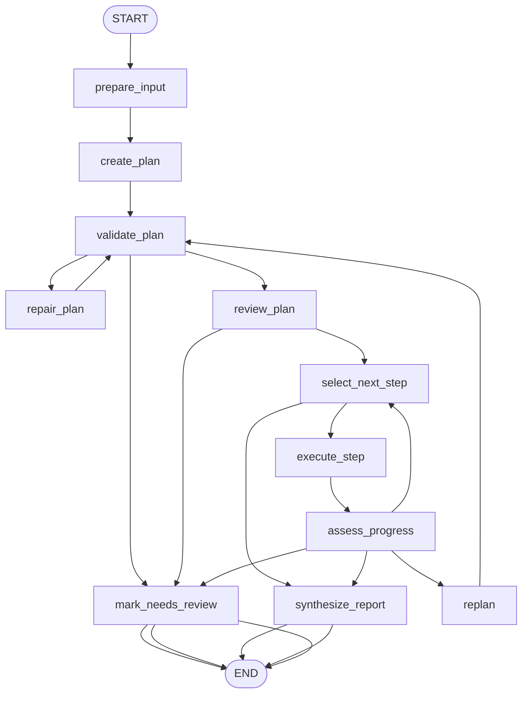

# 6: Planning (en)

## Pattern Summary

Planning enables an agent to turn a high-level objective into an ordered set of executable steps. The chapter frames this as the move from reactive behavior to goal-oriented behavior: the agent understands the initial state, the desired goal state, constraints, dependencies, and available actions, then creates a sequence that can reach the goal.

Use planning when the "how" is not fully known in advance. The chapter contrasts dynamic planning with fixed workflows: if the procedure is already reliable and repeatable, a predetermined workflow is safer. Planning is most useful when the agent must discover steps, adapt to new information, coordinate tools, or revise its approach after obstacles.

For implementation, planning should behave like an inspectable plan-execute-replan loop. The graph should generate a structured plan, validate it, execute steps in dependency order, assess progress, replan when needed, and synthesize a final result with the completed steps and unresolved gaps.

## Pattern Explanation

### Conceptual Overview

A planning agent is like a specialist that receives a goal rather than a script. The user describes what should be achieved, such as organizing an offsite, onboarding an employee, or preparing a research report. The agent determines the sequence of actions needed to get from the current state to the goal state.

The important behavior is adaptability. The initial plan is not treated as permanent. If a venue is unavailable, a source is insufficient, or a sub-task uncovers a new dependency, the agent should update the remaining plan instead of blindly continuing or failing without explanation.

### Problem

Reactive agents handle immediate requests, but complex tasks often require foresight, sequencing, dependency management, and intermediate checks. Without planning, an agent may call tools in the wrong order, miss required sub-tasks, ignore constraints, or produce a final answer without enough evidence.

Planning solves this by making the intended path explicit before execution and by giving the system a mechanism to revise that path as new observations arrive.

### When to Use

- Use this pattern when a user request requires multiple dependent steps.
- Use it when the agent must choose a sequence of actions rather than follow a known sequence.
- Use it for research, workflow automation, onboarding, support diagnosis, content planning, navigation, or other tasks with intermediate milestones.
- Use it when execution may reveal gaps, blockers, or changed constraints that require replanning.
- Use it when the plan should be visible for debugging, review, or user approval before execution.

### When Not to Use

- Avoid this pattern for simple one-step questions or transformations.
- Avoid dynamic planning when the correct procedure is already fixed, audited, and repeatable.
- Avoid it when unpredictable agent autonomy would create unacceptable operational, compliance, or safety risk.
- Avoid it when the system cannot verify step results or detect whether the plan is making progress.
- Avoid it for real-world side-effecting actions unless approval and rollback points are clearly defined.

### How It Works

1. Capture the user's goal, constraints, available context, and allowed tools.
2. Generate a structured plan made of discrete steps, dependencies, expected outputs, and acceptance criteria.
3. Validate the plan for completeness, ordering, tool availability, and circular or impossible dependencies.
4. Optionally expose the plan for review or approval before execution.
5. Execute the next ready step and store observations, artifacts, errors, and evidence.
6. Assess whether the step satisfied its criteria and whether the remaining plan still fits the goal.
7. Continue, replan, or stop for review based on progress, blockers, and retry limits.
8. Synthesize the final output from completed steps, evidence, and unresolved gaps.

### Trade-offs

| Benefit | Cost or Risk |
| --- | --- |
| Makes complex work observable by exposing the intended sequence of steps. | More orchestration state is required than a simple prompt or fixed chain. |
| Allows the agent to adapt when new information changes the task. | Replanning can loop or drift if progress criteria are weak. |
| Helps coordinate tools, dependencies, and intermediate artifacts. | Tool errors and partial results must be modeled explicitly. |
| Produces better audit trails for research or workflow automation. | Generated plans may sound plausible while missing required steps. |
| Supports plan review before expensive or side-effecting execution. | Human approval points add latency and implementation complexity. |

### Minimal Example

```text
Goal: Create a short research brief on a market trend.

Plan:
1. Identify the main sub-questions.
2. Gather relevant source notes for each sub-question.
3. Compare findings and identify gaps.
4. Revise the plan if a gap is important.
5. Write a cited brief with unresolved questions.
```

### LangGraph Mapping

| Pattern Concept | LangGraph Element |
| --- | --- |
| User goal, constraints, and available context | State fields such as `input`, `goal`, `constraints`, and `source_notes` |
| Generated action sequence | `create_plan` node that writes a structured `plan` list |
| Plan validity checks | `validate_plan` node and conditional edges for valid, repairable, or failed plans |
| Optional plan approval | `review_plan` node or future interrupt before execution |
| Step-by-step execution | `select_next_step` and `execute_step` nodes |
| Progress assessment | `assess_progress` node that updates `observations`, `knowledge_gaps`, and step status |
| Adaptive planning | `replan` node and conditional edge back to `validate_plan` |
| Final synthesis | `synthesize_report` node that creates `final_output` |
| Exhausted retries or impossible goal | `mark_needs_review` terminal node |

## LangGraph Implementation Goal

Build a LangGraph example that plans and executes a small research brief workflow over supplied source notes. The user provides a high-level research goal and optional constraints, such as target audience, length, or required comparison dimensions. The graph creates a structured plan, validates it, executes each step against a deterministic local corpus or supplied notes, checks whether important gaps remain, replans when needed, and returns a concise final brief with the completed plan and evidence notes.

The example should demonstrate the chapter's core planning behavior without depending on live web search. Tests can mock the planner and executor while still verifying plan validation, dependency ordering, replanning, and final synthesis.

## State Shape

List the state fields the graph needs.

| Field | Type | Purpose |
| --- | --- | --- |
| `input` | `str` | Original user task or research request. |
| `goal` | `str` | Normalized objective extracted from the input. |
| `constraints` | `dict` | User constraints such as audience, length, required sections, allowed tools, or deadline. |
| `source_notes` | `list[dict]` | Supplied or fixture-based source snippets available to the executor. |
| `plan` | `list[dict]` | Ordered plan steps with `id`, `description`, `depends_on`, `tool`, `acceptance_criteria`, and `status`. |
| `plan_errors` | `list[str]` | Validation errors such as missing fields, circular dependencies, or unsupported tools. |
| `approved_plan` | `bool` | Whether the plan can proceed to execution. Defaults to true for automated tests unless approval is requested. |
| `current_step_id` | `str or None` | Step currently selected for execution. |
| `step_results` | `dict[str, dict]` | Result artifact for each executed step. |
| `observations` | `list[str]` | Facts, tool outputs, and progress notes gathered during execution. |
| `knowledge_gaps` | `list[str]` | Missing evidence, unresolved questions, or unmet acceptance criteria. |
| `execution_history` | `list[dict]` | Ordered record of planning, validation, execution, assessment, and replanning decisions. |
| `replan_count` | `int` | Number of replanning attempts already used. |
| `max_replans` | `int` | Maximum allowed replanning attempts. |
| `max_steps` | `int` | Guardrail against unbounded execution. |
| `blocked_reason` | `str or None` | Human-readable reason the graph cannot continue automatically. |
| `final_report` | `str` | Synthesized answer or brief produced after execution. |
| `status` | `str` | Workflow status: `ok`, `needs_review`, or `failed`. |
| `final_output` | `dict` | User-facing result containing the status, final report, plan, evidence, and gaps. |

## Nodes

| Node | Responsibility |
| --- | --- |
| `prepare_input` | Normalize the input, reject empty goals, initialize counters, and load default constraints. |
| `create_plan` | Ask the model to create a structured, dependency-aware plan for the goal. |
| `validate_plan` | Check the plan schema, required fields, dependency order, step count, allowed tools, and acceptance criteria. |
| `repair_plan` | Ask the model to correct a malformed or incomplete plan using `plan_errors`. |
| `review_plan` | Record plan approval. In the first implementation this can auto-approve unless `approved_plan` is explicitly false. |
| `select_next_step` | Choose the next ready step whose dependencies are complete. |
| `execute_step` | Execute the selected step using deterministic local source notes or mocked tools and store the result. |
| `assess_progress` | Decide whether the step met its acceptance criteria and whether gaps or blockers require replanning. |
| `replan` | Update the remaining plan based on observations, gaps, and blocked steps while preserving completed work. |
| `synthesize_report` | Produce the final brief from completed steps, evidence notes, and unresolved gaps. |
| `mark_needs_review` | Stop when the graph cannot continue safely, preserving the plan, history, errors, and gaps. |

## Edges

Describe the graph flow, including conditional branches.



Conditional edge requirements:

- Route from `validate_plan` to `review_plan` when the plan is valid.
- Route from `validate_plan` to `repair_plan` when the plan is invalid but repair attempts remain.
- Route from `validate_plan` to `mark_needs_review` when the plan is impossible, unsafe, unsupported, or still invalid after repair.
- Route from `review_plan` to `select_next_step` when the plan is approved.
- Route from `review_plan` to `mark_needs_review` when approval is denied or required edits are missing.
- Route from `select_next_step` to `synthesize_report` when all required steps are complete or no further ready steps are needed.
- Route from `assess_progress` to `select_next_step` when the current step succeeds and more steps remain.
- Route from `assess_progress` to `replan` when a recoverable blocker or knowledge gap appears and `replan_count < max_replans`.
- Route from `assess_progress` to `mark_needs_review` when the blocker is unrecoverable, progress stalls, or replanning is exhausted.
- Route from `assess_progress` to `synthesize_report` when enough evidence exists to satisfy the goal, even if optional gaps remain.

## Inputs and Outputs

- Input: a high-level research or workflow goal, optional constraints, and optional source notes.
- Output: a final brief or execution result with `status`, the completed plan, step results, evidence notes, and unresolved gaps.
- Intermediate artifacts: normalized goal, generated plan, plan validation errors, repaired plans, step outputs, observations, gap analysis, replan attempts, and execution history.

Example successful output shape:

```json
{
  "status": "ok",
  "final_report": "A concise research brief synthesized from the completed plan.",
  "plan": [
    {
      "id": "step_1",
      "description": "Identify the main sub-questions for the research goal.",
      "status": "complete"
    }
  ],
  "knowledge_gaps": [],
  "evidence": [
    {
      "source_id": "note_1",
      "summary": "Relevant source note used by the graph."
    }
  ]
}
```

Example input shape:

```json
{
  "input": "Create a short research plan for evaluating whether our team should adopt retrieval-augmented generation for customer support.",
  "constraints": {
    "max_steps": 4
  }
}
```

## Failure Cases

Document expected failures, retries, fallback behavior, and human-review points.

- Empty or vague input should fail in `prepare_input` or return `needs_review` before any planning call.
- A plan with missing fields, unsupported tools, too many steps, or circular dependencies should route through `repair_plan` when repair attempts remain.
- A plan that remains invalid after repair should end in `mark_needs_review`.
- A selected step whose dependencies are incomplete should be treated as a plan validation or selection error, not executed out of order.
- A step result that does not satisfy its acceptance criteria should route to `replan` when the issue is recoverable.
- Missing source evidence should be recorded as `knowledge_gaps`; the graph should not invent facts to complete the final report.
- Replanning must preserve completed work and should not reset the entire graph unless the plan is fundamentally unusable.
- Replanning loops must be capped by `max_replans` and `max_steps`.
- Side-effecting tools should require explicit approval before execution, even if the initial implementation only uses deterministic local tools.
- Model or tool invocation errors should be captured in `execution_history` and surfaced in `final_output`.

## Test Ideas

- Verify the happy path: a mocked valid plan executes all steps and produces `status: ok` with a final report.
- Verify that an invalid plan schema routes through `repair_plan` and then continues after repair.
- Verify that circular dependencies or unsupported tools end in `needs_review` after repair is exhausted.
- Verify that steps execute only after their dependencies are complete.
- Verify that a recoverable missing-evidence result triggers `replan` and preserves completed step results.
- Verify that `replan_count` and `max_steps` prevent infinite loops.
- Verify that the graph records planning, validation, execution, assessment, and replanning events in `execution_history`.
- Verify that final synthesis includes unresolved `knowledge_gaps` instead of hallucinating missing evidence.
- Verify that denied plan approval routes to `mark_needs_review`.
- Verify that empty input fails before calling the planner.

## Open Questions

- `docs/agentic-design-patterns-toc.md` lists Chapter 6 as logical pages `91-103`, but PDF text extraction shows the visible Chapter 6 section at page labels `100-112` / zero-based indexes `99-111`. Confirm whether future requirement documents should cite only TOC logical pages, extracted PDF labels, or both.
- The chapter's Deep Research examples involve live web search and external APIs. The proposed LangGraph example uses deterministic local source notes for testability; confirm whether a later implementation should add optional live search behind a separate tool configuration.
- The source includes dated Deep Research model names as examples. The implementation should avoid hard-coding those names and instead use the repository's shared model configuration once available.
