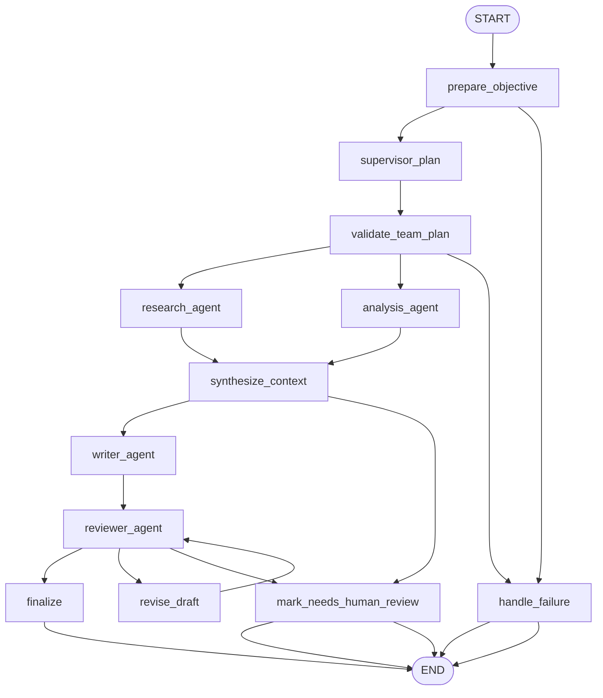

# 7: Multi-Agent Collaboration (en)

## Pattern Summary

Multi-Agent Collaboration decomposes a complex objective into sub-tasks handled by multiple specialized agents. Each agent has a role, goal, tool access, or knowledge boundary, and the system defines how those agents communicate, hand off work, resolve conflicts, and combine their outputs into a coherent result.

The chapter frames the pattern as an alternative to a monolithic agent that tries to solve every part of a multi-domain task alone. A multi-agent system can use sequential handoffs, parallel processing, debate and consensus, hierarchical supervisor-worker structures, expert teams, critic-reviewer workflows, or an agent-as-tool arrangement. The essential requirement is not merely having more than one LLM call; it is assigning clear responsibilities and using a communication protocol that makes collaboration reliable.

For implementation, this pattern should behave like a coordinated team workflow. The graph should preserve each agent's assignment, input, output, and review status; keep communication structured; route incomplete or conflicting outputs through revision or human review; and expose enough trace data to test whether the right agents contributed to the final answer.

## Pattern Explanation

### Conceptual Overview

Multi-agent collaboration turns one broad agent into a team of narrower agents. A supervisor or workflow assigns work to specialists, each specialist performs a focused part of the job, and a later step synthesizes or reviews the combined result.

The chapter emphasizes that the value comes from specialization and communication. A research agent, analyst agent, writer agent, or reviewer agent can each use a different prompt, tool set, or evaluation criterion. The system then coordinates their outputs so the team produces something stronger than a single generalist agent could produce.

### Problem

Complex tasks often require multiple kinds of expertise, multiple tools, or multiple stages of work. A single monolithic agent can become a bottleneck, mix incompatible responsibilities, lose track of intermediate evidence, or produce a result that is hard to validate. Multi-agent collaboration solves this by distributing work across explicit roles and by defining how those roles exchange information.

### When to Use

- Use this pattern when a task is too broad for one focused prompt or one tool-using agent.
- Use it when the objective naturally decomposes into distinct roles, such as research, analysis, writing, testing, review, or escalation.
- Use it when different sub-tasks need different tools, knowledge bases, policies, or model settings.
- Use it when quality improves through corroboration, critique, debate, or specialist review.
- Use it when some work can happen concurrently and later be synthesized.
- Use it when the workflow needs modular agents that can be replaced, tested, or scaled independently.

### When Not to Use

- Avoid this pattern for simple one-step requests that do not need specialization.
- Avoid it when agent responsibilities cannot be cleanly separated.
- Avoid it when communication overhead, latency, or model cost would outweigh the benefit of collaboration.
- Avoid it when no component validates agent outputs before they are combined.
- Avoid it when independent agents would have conflicting goals, tools, or authority without a conflict-resolution policy.
- Avoid dynamic delegation loops unless the system has explicit iteration limits and observability.

### How It Works

1. The workflow receives a high-level objective and validates that it is suitable for multi-agent handling.
2. A supervisor, planner, or fixed workflow decomposes the objective into role-specific assignments.
3. Specialist agents execute their assignments using constrained inputs, tools, and output formats.
4. Agents communicate through structured state, messages, or handoff artifacts rather than ambiguous free-form context.
5. A synthesis step combines specialist outputs and resolves missing, conflicting, or duplicate information.
6. A reviewer or critic checks the combined result for completeness, correctness, policy alignment, and unsupported claims.
7. The graph either finalizes the result, routes it through a bounded revision loop, or marks it for human review.

### Trade-offs

| Benefit | Cost or Risk |
| --- | --- |
| Specialized agents can produce better focused work than one broad agent. | More agents increase orchestration, prompt, and test complexity. |
| Modular roles make the system easier to inspect, replace, and scale. | Communication contracts must be explicit or handoffs become brittle. |
| Parallel or distributed work can reduce latency for independent sub-tasks. | Concurrent agents can increase rate-limit pressure and state merge complexity. |
| Reviewer, critic, or debate structures can reduce hallucinations and quality issues. | Critique loops can add latency and can stall without retry limits. |
| Failure of one specialist does not have to fail the whole workflow. | Partial outputs need a clear fallback or human-review policy. |
| Hierarchical delegation gives a clear coordination point. | The supervisor can become a bottleneck or single point of failure. |

### Minimal Example

```text
Research question
  -> supervisor creates assignments
  -> researcher gathers facts
  -> analyst identifies implications and risks
  -> writer drafts a short brief from specialist outputs
  -> reviewer checks the draft against the findings
  -> revise once if needed, otherwise finalize or request human review
```

### LangGraph Mapping

| Pattern Concept | LangGraph Element |
| --- | --- |
| High-level objective | State field `input` and normalized field `objective` |
| Supervisor or manager agent | Node `supervisor_plan` |
| Specialist agents | Nodes such as `research_agent`, `analysis_agent`, and `writer_agent` |
| Structured communication protocol | State fields `team_plan`, `agent_messages`, `agent_outputs`, and `communication_contract` |
| Sequential handoff | Normal edges from one specialist stage to the next |
| Parallel specialist work | Multiple edges from `supervisor_plan` to independent specialist nodes |
| Critic-reviewer workflow | Node `reviewer_agent` plus conditional revision routing |
| Bounded correction loop | Conditional edge from `reviewer_agent` to `revise_draft` while `retry_count < max_retries` |
| Human-review or failure fallback | Terminal node `mark_needs_human_review` |

## LangGraph Implementation Goal

Build a LangGraph example named `multi_agent_research_team` that accepts a research question or brief topic and produces a concise research brief through a small team of specialized agents. The initial implementation should use a fixed supervisor-led team so the graph is easy to test:

- `supervisor_plan` defines the assignment contract and expected output format for each role.
- `research_agent` extracts or summarizes factual findings from the supplied topic and optional source material.
- `analysis_agent` identifies implications, risks, trade-offs, and open issues.
- `writer_agent` turns the specialist outputs into a coherent short brief.
- `reviewer_agent` checks the draft against the specialist outputs and either approves it or returns actionable revision notes.

The example should demonstrate multi-agent collaboration rather than a generic chain. Each agent should have a distinct role, receive only the context it needs, write its own output field, and leave an auditable message or artifact in state. Tests should use deterministic fake model functions so the graph can run without network access or API keys.

## State Shape

List the state fields the graph needs.

| Field | Type | Purpose |
| --- | --- | --- |
| `input` | `str` | Original user research question or task description. |
| `objective` | `str` | Normalized objective used by the supervisor and specialists. |
| `source_material` | `str \| None` | Optional user-provided text that the research agent may ground findings in. |
| `team_plan` | `list[dict[str, Any]]` | Supervisor-created assignments, one per specialist role, including role name, task, expected output, and dependencies. |
| `communication_contract` | `dict[str, Any]` | Shared schema and handoff rules for agent outputs, including required fields and citation or evidence expectations. |
| `agent_messages` | `list[dict[str, Any]]` | Ordered or reducer-backed trace of agent inputs, outputs, and handoff notes. |
| `agent_outputs` | `dict[str, Any]` | Consolidated outputs keyed by agent name. |
| `research_findings` | `list[dict[str, str]]` | Factual findings or source-grounded notes produced by `research_agent`. |
| `analysis_findings` | `list[dict[str, str]]` | Implications, risks, trade-offs, and open issues produced by `analysis_agent`. |
| `context_bundle` | `dict[str, Any]` | Combined specialist output prepared for the writer. |
| `draft_report` | `str \| None` | Draft produced by the writer before review. |
| `review_result` | `dict[str, Any] \| None` | Reviewer decision, issues, unsupported claims, missing sections, and approval status. |
| `revision_notes` | `list[str]` | Actionable notes used by `revise_draft`. |
| `retry_count` | `int` | Number of draft revision attempts already performed. |
| `max_retries` | `int` | Configured cap for reviewer-driven revisions. |
| `errors` | `list[dict[str, str]]` | Recoverable validation, agent, parsing, or model invocation errors. |
| `requires_human_review` | `bool` | Whether the graph stopped because automated collaboration could not safely complete the task. |
| `status` | `str` | Workflow status: `ok`, `needs_revision`, `needs_human_review`, or `failed`. |
| `final_output` | `dict[str, Any] \| None` | User-facing result containing status, final brief, review metadata, and selected agent trace information. |
| `metadata` | `dict[str, Any]` | Optional model names, timing, run IDs, feature flags, and test overrides. |

Parallel nodes must write distinct state keys or use reducer-backed list fields for shared traces such as `agent_messages` and `errors`.

## Nodes

| Node | Responsibility |
| --- | --- |
| `prepare_objective` | Validate non-empty input, normalize the objective, initialize default state fields, and reject unsupported configuration. |
| `supervisor_plan` | Create a constrained team plan with role assignments, dependencies, expected output schemas, and communication rules. |
| `validate_team_plan` | Ensure the plan names only supported agents, has no circular dependencies, and includes required assignments for research, analysis, writing, and review. |
| `research_agent` | Produce factual findings from `objective` and optional `source_material`; include evidence notes and avoid unsupported inventions. |
| `analysis_agent` | Produce implications, risks, trade-offs, and unresolved questions from the objective and available findings. |
| `synthesize_context` | Combine specialist outputs into `context_bundle`, detect missing or conflicting information, and prepare writer context. |
| `writer_agent` | Draft a concise research brief using only the context bundle and assignment contract. |
| `reviewer_agent` | Check the draft for completeness, coherence, unsupported claims, missing required sections, and alignment with specialist outputs. |
| `revise_draft` | Apply reviewer notes to produce a revised draft and increment `retry_count`. |
| `finalize` | Create `final_output` when the reviewer approves the draft. |
| `mark_needs_human_review` | Stop safely when required agent outputs are missing, conflicts remain unresolved, or revision attempts are exhausted. |
| `handle_failure` | Produce a controlled failure output for invalid input, invalid plan, unrecoverable runtime errors, or malformed state. |

## Edges

Describe the graph flow, including conditional branches.



Conditional edge requirements:

- Route from `prepare_objective` to `handle_failure` when `input` is blank or configuration is invalid.
- Route from `validate_team_plan` to `handle_failure` when the supervisor returns unknown agents, missing required roles, malformed schemas, or circular dependencies.
- Run `research_agent` and `analysis_agent` as independent specialist branches when both can start from the objective and optional source material.
- Route from `synthesize_context` to `mark_needs_human_review` when required specialist outputs are missing, contradictory, or too weak to support a draft.
- Route from `reviewer_agent` to `finalize` when the draft is approved.
- Route from `reviewer_agent` to `revise_draft` when review issues are actionable and `retry_count < max_retries`.
- Route from `reviewer_agent` to `mark_needs_human_review` when review fails after retries, the draft contains unresolved unsupported claims, or the reviewer flags a high-risk topic.

## Inputs and Outputs

- Input: a research question or brief topic, plus optional `source_material`, `max_retries`, and model/test configuration.
- Output: `final_output`, a JSON-compatible dictionary containing `status`, the final research brief, selected specialist outputs, review status, and trace metadata.
- Intermediate artifacts: normalized objective, supervisor team plan, communication contract, specialist outputs, context bundle, draft report, review result, revision notes, agent messages, and recoverable errors.

Example successful output shape:

```json
{
  "status": "ok",
  "brief": "A concise research brief generated from specialist outputs.",
  "review": {
    "approved": true,
    "issues": []
  },
  "agents": {
    "research_agent": "completed",
    "analysis_agent": "completed",
    "writer_agent": "completed",
    "reviewer_agent": "approved"
  }
}
```

Example input shape:

```json
{
  "input": "Prepare a concise research brief on the benefits and risks of using AI coding assistants in a small engineering team.",
  "source_material": "Internal pilot notes and public vendor documentation are available."
}
```

## Failure Cases

Document expected failures, retries, fallback behavior, and human-review points.

- Blank or whitespace-only input should fail in `prepare_objective` before any model call.
- A supervisor plan with unknown agent names, circular dependencies, missing required roles, or malformed output schemas should route to `handle_failure`.
- A specialist agent that returns malformed output should be recorded in `errors`; if the missing output is required, the graph should route to `mark_needs_human_review` rather than inventing content.
- Conflicting findings between specialists should be preserved in `context_bundle` and either resolved by the reviewer or escalated to human review.
- The writer must not introduce claims unsupported by `research_findings` or `analysis_findings`; the reviewer should catch unsupported claims and route to revision.
- Repeated reviewer rejection should stop after `max_retries` and set `status` to `needs_human_review`.
- Parallel specialist branches must not overwrite each other's outputs or append unsafely to shared state.
- Model provider, tool, or parsing errors should be captured in `errors` with the responsible agent name and surfaced in `final_output`.
- High-risk topics, policy-sensitive recommendations, or outputs requiring external verification should set `requires_human_review = true`.
- Dynamic delegation, if added later, must have strict limits to avoid infinite agent spawning or unbounded cost.

## Test Ideas

- Verify the happy path produces a final brief and records completed outputs for supervisor, researcher, analyst, writer, and reviewer.
- Verify `prepare_objective` rejects blank input without invoking any specialist agent.
- Verify `validate_team_plan` rejects an unknown agent name and routes to `handle_failure`.
- Verify `research_agent` and `analysis_agent` write distinct state keys and do not overwrite each other during fan-out/fan-in.
- Verify missing required specialist output routes to `mark_needs_human_review`.
- Verify reviewer approval routes to `finalize`.
- Verify reviewer rejection routes through `revise_draft`, increments `retry_count`, and then finalizes when the revised draft is approved.
- Verify reviewer rejection after `max_retries` sets `status` to `needs_human_review`.
- Verify unsupported claims in `draft_report` are represented in `review_result.issues`.
- Verify final state always includes `status`, `final_output`, `agent_outputs`, `agent_messages`, and `errors`.
- Use fake model functions in unit tests so the graph is deterministic and does not require network access or API keys.

## Open Questions

- The TOC lists Chapter 7 as logical pages `104-120`, but extracted visible chapter boundaries are PDF file pages `113-131`, with internal chapter counters `1-19`. Confirm whether future documents should preserve both ranges in Source notes as done here.
- The visible chapter title is `Multi-Agent Collaboration`, while the TOC/progress title is `Multi-Agent`. This document uses the visible title but keeps the TOC range.
- The chapter includes CrewAI and Google ADK examples rather than a LangGraph implementation. The LangGraph graph above is therefore an implementation mapping derived from the pattern concepts, not a direct port of source code.
- Decide whether the first runnable example should use external retrieval/search tools or only user-provided `source_material` and deterministic fake tools. The latter is safer for fast tests.
- Decide whether to keep the team fixed for the first implementation or later add dynamic agent selection and delegation.
