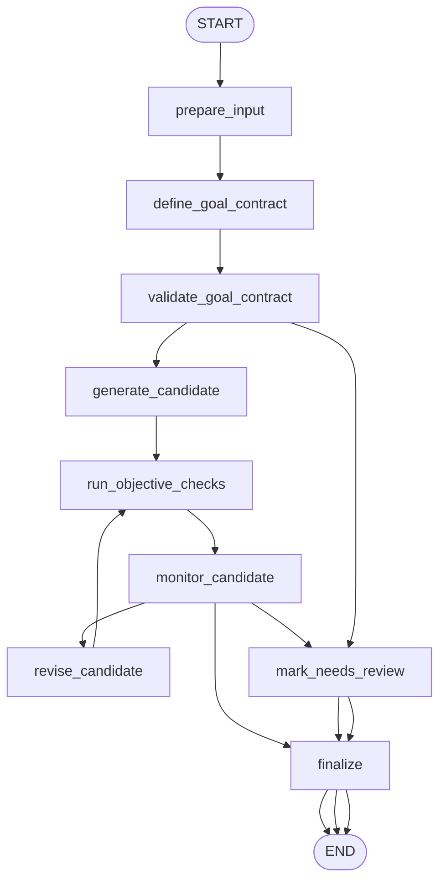

# 11: Goal Setting and Monitoring (ko)

## 패턴 요약

목표 설정 및 모니터링은 에이전트에 명시적 목표와 목표 달성 상태 판단 장치를 제공합니다. 장에서는 반응형으로 답변/행동만 하는 방식과 달리, 성공 기준을 추적하면서 목적에 맞는 수행을 하도록 목표지향 에이전트를 다룹니다.

목표, 측정 가능한 기준, 환경/도구 출력 모니터링, 그리고 결과에 따른 피드백 루프를 강조합니다. 이 루프를 통해 에이전트는 실패 시 수정하고 안전하면 완료, 실패 지속 시 escalation합니다.

첫 LangGraph 예제는 무한한 자율 작업이 아니라 한정된 목표-모니터링 루프여야 합니다. 사용자 목표를 구조화된 목표 계약으로 바꾸고, 초안을 생성한 뒤 목표 기준 검사를 실행하고, 공백/차이점을 바탕으로 수정하거나, 목표 불명확·안전성 이슈·재시도 상한 초과 시 사람 검토로 넘어가야 합니다.

## 패턴 설명

### 개념 개요

목표 설정 및 모니터링은 에이전트의 타깃을 명시적으로 설정합니다. 목표지향 에이전트는 단순 출력 생성이 아니라 어떤 결과가 성공인지, 어떤 근거로 진행도를 판단할지, 중단/수정/에스컬레이션 시점을 갖습니다.

장에서는 고객지원, 학습 시스템, 프로젝트 관리, 트레이딩, 콘텐츠 모더레이션, 코드 생성 예시로 같은 아이디어를 반복합니다. 핵심은 의도한 결과와 모니터링 보고서를 통해 현재 상태와 작업·산출물을 계속 비교한다는 점입니다.

### 문제

명시 목표가 없는 에이전트는 스텝은 진행해도 실제로 문제가 해결되었는지 판단하지 못하고, 과도하거나 조기 종료, 제약 무시, 그럴듯한 답변을 완결로 오인하는 위험이 큽니다.

목표 설정과 모니터링은 시작부터 성공 기준을 정하고, 비교 기반 의사결정(계속/수정/완료/에스컬레이션)을 워크플로 1등급 단계로 두어 해결합니다.

### 사용 시점

- 명확한 산출 목표가 있는 멀티 스텝 작업에서 사용합니다.
- 명확한 기준, 메트릭, 데드라인, 제약 조건으로 성공을 측정해야 할 때 사용합니다.
- 도구 결과·환경 상태·평가자 피드백에 따라 계획/산출을 수정해야 하는 경우 사용합니다.
- 최종 결과에 어떤 목표가 충족/미충족인지 근거 제시가 필요할 때 사용합니다.
- 무한 루프가 아닌 유한 종료 조건이 필요한 자율 실행에서 사용합니다.
- 계획, 도구 사용 같은 다른 패턴 하단의 감독 체크로 이 패턴을 사용할 때 유용합니다.

### 사용하지 말아야 할 경우

- 단순 1회 변환처럼 pass/fail 모니터링 비용이 거의 없는 작업은 피합니다.
- 목표를 구체적·측정 가능하게 표현할 수 없으면 이 패턴 적용이 어렵습니다.
- 동일 모델이 만들고 평가한 결과를 그대로 신뢰할 때 고위험 출력에는 부적합합니다.
- 사이드 이펙트 작업에서 자동 모니터링을 쓰려면 승인, 롤백, 감사 절차가 필수입니다.
- `max_iterations`/진전 조건/실패 라우팅이 없는 무한 반복은 피해야 합니다.
- 정량 점수만으로 정성적 안전·정확성·의도 이슈를 대체하면 안 됩니다.

### 작동 방식

1. 사용자 작업, 초기 상태, 제약, 원하는 결과를 수집합니다.
2. 원하는 결과를 목표 계약으로 변환해 측정 가능한 승인 기준·우선순위·중단 규칙을 둡니다.
3. 계획 또는 코드 초안 등 후보 산출물을 생성합니다.
4. 후보, 도구 출력, 결정론적 체크, 환경 상태를 관측합니다.
5. 관측 결과를 목표 계약과 비교해 모니터링 리포트를 만듭니다.
6. 판정 결과로 종료/수정/에스컬레이션을 결정합니다.
7. 매 회차 시도와 판단을 기록해 최종 결과에 무엇을 시도했고 어떤 항목이 통과/실패했는지 설명합니다.

### 트레이드오프

| 이점 | 비용 또는 위험 |
| --- | --- |
| 에이전트 동작을 목적 중심·검증 가능하게 만듭니다. | 직접 프롬프트보다 더 많은 상태/기준/라우팅 설계 필요. |
| 자율 작업의 종료 조건을 명확히 합니다. | 약한 기준은 조기 성공 판단을 유발할 수 있습니다. |
| 근거 기반 피드백으로 수정이 가능합니다. | 수정 반복이 토큰 비용/드리프트를 초래할 수 있습니다. |
| 이력과 판정 저장으로 감사가 쉬워집니다. | 모델 판단만 의존하면 모니터링 리포트가 오류할 수 있습니다. |
| 계획/도구/멀티에이전트 리뷰를 상위 루프에서 조율할 수 있습니다. | 외부 리뷰, 테스트, 부작용 제어가 추가 복잡성으로 들어옵니다. |

### 최소 예시

```text
사용 사례: 작은 Python 함수 작성.
목표:
  - 이해하기 쉬워야 함
  - 기능적으로 맞아야 함
  - 엣지 케이스를 다뤄야 함

흐름:
  -> 목표를 수용 기준으로 정규화
  -> 후보 코드 생성
  -> 목적 체크 및 리뷰 수행
  -> 모든 필수 기준 통과 시 완료
  -> 회복 가능한 미충족이면 수정 후 재시도
  -> 그렇지 않으면 미충족 목표와 함께 검토로 이관
```

### LangGraph 매핑

| 패턴 개념 | LangGraph 요소 |
| --- | --- |
| 원하는 결과 | `use_case`, `raw_goals`, `goal_contract` 상태 필드 |
| 측정 가능한 기준 | `define_goal_contract` 노드와 `success_criteria` 필드 |
| 후보 산출물 | `generate_candidate` 노드와 `candidate_artifact` |
| 관측 진행 | `run_objective_checks` 노드와 `check_results` |
| 모니터링 판정 | `monitor_candidate` 노드와 `monitoring_report` |
| 피드백 루프 | `monitor_candidate` -> `revise_candidate` 조건부 간선 |
| 종료 조건 | `iteration_count`, `max_iterations`, 조건부 라우팅 |
| 에스컬레이션 | `mark_needs_review` 노드 |
| 감사 로그 | `progress_history` 상태 필드 |

## LangGraph 구현 목표

코드 생성 사용 사례와 쉼표로 구분된 목표 리스트(예: 간결성, 정확성, 엣지케이스, 예시 포함)를 받는 목표 모니터링 기반 코딩 어시스턴트 예제를 구현합니다. 이 그래프는 목표를 구조화한 계약으로 바꾼 뒤 Python 후보 코드를 생성하고, 결정론적 체크/리뷰어 모의 평가를 통해 최종화·수정·검토를 판단해야 합니다.

예제는 장의 기본 스크립트를 다음으로 개선합니다.

- 기본적으로 생성 코드를 디스크에 쓰지 않고, 상태에 코드 문자열을 반환합니다.
- `max_iterations`로 수정 횟수를 상한 관리합니다.
- 생성과 모니터링을 가능한 분리하고, 테스트 시 결정론적 가짜 generator/evaluator 주입을 지원합니다.

예상 결과:

- 생성 전 명시적 승인 기준이 생성된 이후 존재.
- 모니터링 리포트가 목표별 충족/미충족/불확실 상태를 기록.
- 복구 가능한 누락은 bounded 재시도 루프로 보정.
- 위험, 불명확, 모순, 반복 미충족은 사람 검토로 전환.
- 최종 출력에 후보 산출물, 목표 판정, 반복 횟수, 상태를 포함.

## 상태 형태

그래프가 필요한 상태 필드를 나열합니다.

| 필드 | 타입 | 목적 |
| --- | --- | --- |
| `input` | `str` | 원본 사용자 요청(코딩 사용 사례 + 목표). |
| `use_case` | `str` | 충족 대상 코딩 과제 정규화 텍스트. |
| `raw_goals` | `list[str]` | 사용자 지정 목표(정규화 전). |
| `goal_contract` | `list[dict]` | `id`, `description`, `priority`, `acceptance_criteria`, `measurement`를 가진 구조화 목표. |
| `success_criteria` | `dict[str, Any]` | 목표 계약에서 집계한 통과 임계치/중단 규칙. |
| `candidate_artifact` | `str \| None` | 현재 생성된 Python 코드/유사 코드 텍스트. |
| `previous_artifacts` | `list[str]` | 수정·감사를 위해 보존한 이전 산출물 목록. |
| `check_results` | `dict[str, Any]` | 파싱 성공, 금지 연산 체크, 기본 예제, 정적 검증 결과. |
| `monitoring_report` | `dict[str, Any]` | 리뷰 판정, 목표별 상태, 점수, 피드백, 불확실성, 안전 플래그. |
| `goal_status` | `str` | 전반 상태: `met`, `needs_revision`, `needs_review`, `failed`. |
| `revision_feedback` | `str \| None` | 다음 생성 시 반영할 피드백. |
| `iteration_count` | `int` | 후보 생성 또는 수정 시도 횟수. |
| `max_iterations` | `int` | 최대 허용 시도 횟수(예: `2` 또는 `3`). |
| `progress_history` | `list[dict]` | 목표 정의/생성/체크/모니터링/수정/최종화 이벤트 순서. |
| `needs_human_review` | `bool` | 자동 모니터링이 부적합하거나 위험, 미해결 상태일 때 종료 플래그. |
| `errors` | `list[str]` | 검증, 모델, 파싱, 평가자, 체크 오류 목록. |
| `final_output` | `dict[str, Any] \| None` | 상태, 산출물, 목표 판정, 반복 횟수, 미해결 목표를 포함한 사용자 결과. |

## 노드

| 노드 | 책임 |
| --- | --- |
| `prepare_input` | 입력 비어있음 검사, 사용 사례/목표 분리, 카운터/히스토리/기본값 초기화. |
| `define_goal_contract` | raw goals를 구체적·측정 가능 기준·중단 규칙으로 변환. |
| `validate_goal_contract` | 누락/애매/모순/불안전/비측정 목표 검증. |
| `generate_candidate` | 사용 사례 및 목표 계약을 기반으로 첫 번째 코드 후보 생성. |
| `run_objective_checks` | 문법 파싱, 금지 연산 검사, 픽스처 기반 테스트 같은 결정론적 체크 실행. |
| `monitor_candidate` | 체크 결과와 리뷰어(또는 결정론 가짜)로 목표별 판정 생성. |
| `revise_candidate` | 이전 산출물, 모니터링 결과, 피드백 기반으로 개선된 산출물 생성; `iteration_count` 증가. |
| `mark_needs_review` | 목표 모호, 위험, 모순, 반복 미해결 시 검토 상태 설정. |
| `finalize` | 산출물, 상태, 목표 판정, 반복 횟수, 오류, 이력으로 `final_output` 생성. |

## 엣지

조건부 분기를 포함해 그래프 흐름을 정의합니다.



조건부 엣지 요구사항:

- `validate_goal_contract`가 측정 가능·비어있지 않고 자율 작성이 허용되는 목표일 때만 `generate_candidate` 진행.
- 목표가 너무 애매/모순/위험/그래프가 허용하지 않는 사이드 이펙트이면 `mark_needs_review`.
- 모든 필수 목표 충족, 안전 플래그 없음, 결정론 체크 통과면 `monitor_candidate -> finalize`.
- 필수 목표 미충족이고 조치 가능한 피드백이 있으며 `iteration_count < max_iterations`이면 `revise_candidate`.
- 안전/근거 없는 출력, 평가자 출력 손상, 반복 미충족, 핵심 정확성 불확실은 `mark_needs_review`.
- `revise_candidate`는 기존 산출물을 `previous_artifacts`에 보관하고 progress history를 추가해야 합니다.
- `max_iterations`를 넘는 루프는 발생해서는 안 됩니다.

## 입력과 출력

- 입력: 자연어 코딩 사용사례와 목표 목록(입력에 내재되거나 별도 테스트 필드).
- 출력: `final_output`에 상태, 코드/검토 요청, 목표 판정, 모니터링 리포트, 반복 횟수, 미해결 목표, 오류 포함.
- 중간 산출물: 정규화 사용 사례, raw goals, goal contract, 결정론 체크 결과, 리뷰 피드백, 이전 산출물, 수정 피드백, 진행 이력.

예시 입력 형태:

```json
{
  "input": "Implement a Python function that returns the longest binary gap for a positive integer.",
  "goals": ["correctness", "readability", "handles edge cases"]
}
```

성공 출력 예시:

```json
{
  "status": "ok",
  "artifact": "def binary_gap(n: int) -> int:\n    ...",
  "iteration_count": 1,
  "goal_verdicts": [
    {
      "goal_id": "correctness",
      "status": "met",
      "evidence": "Fixture examples passed and reviewer found no logic gap."
    }
  ],
  "monitoring_report": {
    "overall_status": "met",
    "score": 0.91,
    "feedback": "The solution is simple, handles edge cases, and includes examples."
  },
  "errors": []
}
```

리뷰 출력 예시:

```json
{
  "status": "needs_review",
  "artifact": "def update_billing(...):\n    ...",
  "iteration_count": 3,
  "unresolved_goals": ["safety", "side_effect_control"],
  "reason": "The task requires billing changes and cannot be completed without approval.",
  "errors": []
}
```

## 실패 사례

예상 실패, 재시도, 폴백 동작, 사람 검토 지점을 문서화합니다.

- 입력이 비었으면 모델 호출 전에 실패하고 `status`를 `failed`로 설정해야 합니다.
- 목표가 비어있으면 생성 없이 검토 요청이나 목표 보완 요청으로 이동해야 합니다.
- "good처럼 만들기"처럼 너무 애매한 목표는 정규화 가능 시도 후에도 불가하면 리뷰로 이동합니다.
- 상충되는 목표(짧은 코드 vs 상세 설명 등)는 생성 전에 플래그해야 합니다.
- 파싱 불가 코드는 결정론 체크 실패 후 재시도 여지가 있으면 수정 루프.
- 파일 쓰기, 네트워크, subprocess, 자격정보 접근 같은 unsafe 동작은 명시 정책이 없으면 리뷰로 이동.
- 리뷰어 출력이 손상/부족/과신되면 오류 기록 후 중요 불확실성에서 리뷰로 이동.
- 같은 모델이 자기 평가지표를 내면 편향 가능성이 있어 별도 evaluator 주입과 자체 평가지표 신뢰 가정 금지.
- `max_iterations` 초과하면 추가 수정하지 말고 `needs_review` 종료.
- 정확도 민감 코드에서 단순 LLM 판정만으로는 부족하므로 결정론 체크를 반드시 포함.
- 원문 장의 예시가 파일 쓰기 중심이어도 기본 구현은 디스크 출력 금지.

## 테스트 아이디어

- 목표가 명확해 목표 계약 생성, 코드 후보, 체크 통과, `status: ok`가 나오는 정상 경로를 검증합니다.
- 빈 입력이 목표 정의/생성 이전에 중단되는지 검증합니다.
- 모호하거나 누락된 목표가 `needs_review`로 이동하는지 검증합니다.
- 상충 목표가 `validate_goal_contract`에서 감지되는지 검증합니다.
- 문법 오류 초안이 남은 반복 횟수가 있으면 `revise_candidate`로 가는지 검증.
- `iteration_count`가 수정 때만 증가하고 `max_iterations`를 넘지 않는지 검증.
- 이전 산출물 버전이 `previous_artifacts`에 유지되는지 검증.
- unsafe 코드 동작이 점수가 높아도 `needs_review`로 이동하는지 검증.
- 평가자 출력 손상 시 오류가 추가되고 잘못된 `ok`가 나오지 않는지 검증.
- 최종 출력이 항상 `status`, `iteration_count`, `goal_verdicts` 또는 미해결 목표, `monitoring_report`, `errors`, `progress_history`를 포함해야 함을 검증.
- 네트워크 없이 가짜 생성기/체크/모니터 구성요소를 주입해 테스트할 수 있는지 검증.

## 열린 질문

- `docs/agentic-design-patterns-toc.md`는 Chapter 11을 `170-181`로 표기하지만, PDF 보이는 추출은 파일 `183-195`(chapter-local `1-13`)입니다.
- TOC 범위는 12페이지, 보이는 장은 13페이지로 차이가 있어 표기 기준을 합의할 필요가 있습니다.
- 장 개요의 계획 중심 문단이 Chapter 6과 중첩되는데, 목표/모니터링 범위는 명시적 기준·보고서·정지 조건에 집중시켰습니다.
- 기본 구현에서 모니터링을 별도 모델 역할로 분리할지, 또는 공유 모델 + 엄격한 테스트 더블을 우선할지 결정해야 합니다.
- 결정론적 코드 체크를 샌드박스 실행까지 확대할지, 아니면 파싱/정적 검사와 픽스처 기반 fake 결과로 제한할지 결정이 필요합니다.
