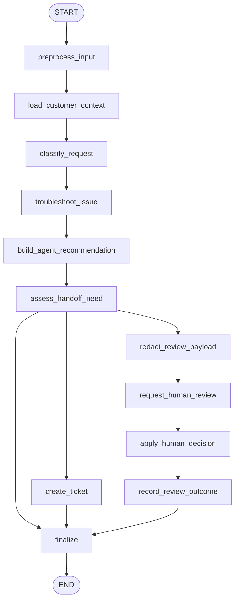

# 13: Human-in-the-Loop (en)

## Pattern Summary

Human-in-the-Loop (HITL) inserts human judgment into an agent workflow when full automation is unsafe, unreliable, ethically sensitive, or insufficiently nuanced. The chapter frames HITL as a collaboration pattern: agents handle scalable computation and routine actions, while humans provide oversight, correction, feedback, final approval, or direct intervention.

The chapter identifies several HITL forms: human oversight, intervention and correction, human feedback for learning, decision augmentation, human-agent collaboration, and escalation policies. It also describes "human-on-the-loop" as a related variation where humans define high-level policies and agents execute immediate actions within those boundaries.

For the first LangGraph example, this requirement should implement a bounded technical-support workflow. The graph should try routine troubleshooting first, create a support ticket when needed, and route complex, sensitive, ambiguous, or emotionally charged cases to a human review step. Human review must be explicit, mockable in tests, and protected by privacy redaction before the review request is produced.

## Pattern Explanation

### Conceptual Overview

HITL treats the agent as a capable first-line worker, not as the final authority for every decision. The agent can summarize context, run tools, recommend actions, and handle straightforward cases. When the task requires human judgment, domain expertise, empathy, policy interpretation, or accountability, the graph pauses or routes to a human.

In Chapter 13, this pattern is especially tied to safety, ethics, complex decision-making, and escalation. The intended LangGraph example should therefore make the handoff decision visible in state instead of hiding it inside a prompt.

### Problem

Fully autonomous agents can make confident mistakes in ambiguous, high-risk, or emotionally sensitive contexts. They can also expose sensitive information to reviewers if escalation is not designed carefully. Without a formal HITL path, an agent may either over-escalate every difficult case or continue acting when human accountability is required.

HITL solves this by defining when humans are involved, what information they receive, what decisions they can make, and how their decisions are applied back into the workflow.

### When to Use

- Use this pattern when errors can create safety, financial, legal, ethical, or reputational harm.
- Use it when the task requires nuanced judgment, empathy, moral reasoning, or domain expertise.
- Use it when an agent can prepare analysis or recommendations but a human must make the final decision.
- Use it when ambiguous or borderline cases need review, such as content moderation, fraud alerts, legal review, or customer support escalations.
- Use it when human feedback should improve future model behavior, training data, or workflow policy.
- Use it when policies are set by humans but executed automatically by the agent, as in human-on-the-loop control.

### When Not to Use

- Avoid this pattern for simple, low-risk tasks where human review only adds latency and cost.
- Avoid it when no trained human operator is available to make better decisions than the agent.
- Avoid sending raw sensitive data to reviewers when redaction, consent, or access controls are not in place.
- Avoid unbounded review queues for high-volume workflows without triage, thresholds, or sampling rules.
- Avoid using HITL as a substitute for clear automated guardrails, validation, and deterministic checks.
- Avoid pretending that human approval makes unsafe or unsupported agent output acceptable.

### How It Works

1. The workflow receives the user's request and gathers available context, such as customer information, prior support history, or applicable policies.
2. The agent classifies the task by issue type, risk, ambiguity, sentiment, and whether it fits routine automation.
3. For routine cases, the agent runs approved tools such as troubleshooting or ticket creation and drafts a response.
4. The graph evaluates whether the case requires human involvement based on escalation policies, risk signals, tool failures, missing context, or user sentiment.
5. If human review is required, the graph prepares a redacted review request containing the relevant summary, attempted actions, recommended next step, and escalation reason.
6. A human reviewer approves, edits, rejects, or escalates the recommendation. In tests, this review step should be mockable.
7. The graph applies the human decision, records the review outcome, and returns a final response or escalation status.
8. Optional human feedback can be preserved as structured metadata for later learning or policy improvement.

### Trade-offs

| Benefit | Cost or Risk |
| --- | --- |
| Adds human judgment where automation is risky or insufficient. | Human review increases latency and operational cost. |
| Supports responsible deployment in sensitive domains. | Review quality depends on trained, available domain experts. |
| Makes escalation policies explicit and testable. | Poor thresholds can over-escalate routine work or under-escalate risky cases. |
| Improves trust by preserving human accountability for critical decisions. | Human reviewers can still make inconsistent or biased decisions. |
| Enables feedback loops for model or workflow improvement. | Review payloads can create privacy exposure unless redacted and scoped. |
| Lets agents scale routine work while humans handle exceptions. | Human queues can become a bottleneck under high volume. |

### Minimal Example

```text
Customer reports laptop battery swelling
  -> load customer context and support history
  -> classify as hardware + safety risk
  -> skip routine troubleshooting
  -> prepare redacted human review request
  -> human specialist chooses "escalate immediately"
  -> create ticket with priority=safety
  -> respond with safe next steps and escalation status
```

### LangGraph Mapping

| Pattern Concept | LangGraph Element |
| --- | --- |
| User task and available context | State fields `input`, `customer_id`, `customer_info`, and `support_history` |
| Human oversight policy | State field `escalation_policy` and node `assess_handoff_need` |
| Agent routine work | Nodes `troubleshoot_issue` and `create_ticket` |
| Intervention and correction | Node `request_human_review` plus state field `human_response` |
| Decision augmentation | State fields `agent_recommendation`, `review_request`, and `escalation_reason` |
| Privacy boundary | Node `redact_review_payload` and state field `redacted_review_request` |
| Escalation policy | Conditional edge after `assess_handoff_need` |
| Human feedback for learning | State field `human_feedback` and optional node `record_review_outcome` |

## LangGraph Implementation Goal

Build a LangGraph example of a technical-support assistant that demonstrates HITL escalation. The user provides a support request and optional customer context. The graph personalizes the interaction from state, attempts approved routine support actions, detects when the case requires human judgment, and routes to a human review path before finalizing sensitive or complex outcomes.

The example should be implementation-ready without requiring a real support system. Tool calls such as troubleshooting, ticket creation, and escalation can be local deterministic functions. The human review node should support LangGraph interrupt semantics or an injectable/mock review provider so automated tests can resume the graph with a simulated reviewer decision.

Expected workflow outcome:

- Routine issues receive troubleshooting guidance or a support ticket without human review.
- Complex, sensitive, high-risk, ambiguous, or emotionally charged issues produce a human review request.
- Review payloads are redacted before they are shown to the human reviewer.
- Human decisions are applied explicitly: approve, edit, reject, escalate, or request more information.
- The final output explains the status, ticket or escalation information, and whether human review occurred.

## State Shape

List the state fields the graph needs.

| Field | Type | Purpose |
| --- | --- | --- |
| `input` | `str` | Original user support request or task description. |
| `customer_id` | `str \| None` | Optional customer identifier used to retrieve scoped customer context. |
| `customer_info` | `dict[str, Any]` | Optional context such as name, tier, products, and recent purchases. |
| `support_history` | `list[dict]` | Prior tickets, previous troubleshooting attempts, or known open cases. |
| `normalized_input` | `str` | Trimmed request text used for classification and tool calls. |
| `issue_type` | `str \| None` | Coarse issue category such as `software`, `hardware`, `billing`, `account`, `safety`, or `unknown`. |
| `sentiment` | `str \| None` | Simple signal such as `neutral`, `frustrated`, `angry`, or `distressed`. |
| `risk_level` | `str` | Triage level such as `low`, `medium`, `high`, or `critical`. |
| `ambiguity_level` | `str` | Whether the request has enough information for automation: `low`, `medium`, or `high`. |
| `escalation_policy` | `dict[str, Any]` | Rules that determine when to involve a human, including risk and ambiguity thresholds. |
| `agent_recommendation` | `dict[str, Any] \| None` | The agent's proposed action, answer, ticket, or escalation. |
| `troubleshooting_result` | `dict[str, Any] \| None` | Result of routine troubleshooting or diagnostic tool execution. |
| `ticket` | `dict[str, Any] \| None` | Support ticket data when a ticket is created. |
| `needs_human_review` | `bool` | Whether the graph must route to human review before finalization. |
| `escalation_reason` | `str \| None` | Short explanation of why human review is required. |
| `review_request` | `dict[str, Any] \| None` | Full internal review payload before redaction. |
| `redacted_review_request` | `dict[str, Any] \| None` | Reviewer-safe payload with sensitive fields removed or masked. |
| `human_response` | `dict[str, Any] \| None` | Reviewer decision, edits, notes, and any requested action. |
| `human_feedback` | `dict[str, Any] \| None` | Structured feedback that can later improve prompts, policies, or examples. |
| `review_status` | `str` | Review lifecycle value such as `not_required`, `requested`, `approved`, `edited`, `rejected`, or `escalated`. |
| `errors` | `list[str]` | Recoverable validation, tool, redaction, or review errors. |
| `final_output` | `dict[str, Any] \| None` | User-facing result containing answer, status, ticket, escalation, and review metadata. |

## Nodes

| Node | Responsibility |
| --- | --- |
| `preprocess_input` | Validate non-empty input, normalize whitespace, initialize defaults, and load configured escalation policy. |
| `load_customer_context` | Read optional customer information and support history from the incoming state or injected fixture data. |
| `classify_request` | Determine issue type, sentiment, risk level, ambiguity level, and whether the request appears routine. |
| `troubleshoot_issue` | Run approved deterministic troubleshooting for low-risk routine issues and store the result. |
| `create_ticket` | Create a mock support ticket when the issue persists, requires follow-up, or a human-approved escalation needs tracking. |
| `assess_handoff_need` | Apply escalation policy to decide whether human review is required before final output. |
| `build_agent_recommendation` | Produce the agent's proposed response or next action for either direct finalization or human review. |
| `redact_review_payload` | Remove or mask sensitive customer data before exposing the review request to a human. |
| `request_human_review` | Pause with a LangGraph interrupt or call an injectable review provider that returns a reviewer decision. |
| `apply_human_decision` | Apply human approval, edits, rejection, escalation, or request-for-information to the graph state. |
| `record_review_outcome` | Preserve reviewer notes and structured feedback for observability or later adaptation. |
| `finalize` | Produce `final_output` with status, answer, ticket data, escalation details, and review metadata. |

## Edges

Describe the graph flow, including conditional branches.



Conditional edge requirements:

- Route from `assess_handoff_need` to `finalize` when the case is low risk, clear, routine, and the troubleshooting result is sufficient.
- Route from `assess_handoff_need` to `create_ticket` when the issue is routine but needs asynchronous follow-up rather than human judgment.
- Route from `assess_handoff_need` to `redact_review_payload` when the case is high risk, safety-related, ambiguous, emotionally charged, legally or financially sensitive, outside supported automation, or failed routine troubleshooting.
- `request_human_review` must not call a real external queue in tests. It should use LangGraph interrupt/resume behavior or an injected fake reviewer.
- `apply_human_decision` must support at least `approve`, `edit`, `reject`, `escalate`, and `request_more_info`.
- `redact_review_payload` must run before any human-visible review payload is created.
- The graph must not loop indefinitely while waiting for human review; an unavailable reviewer should produce a clear `awaiting_human` or `review_unavailable` status.

## Inputs and Outputs

- Input: a natural-language support request, optional `customer_id`, optional `customer_info`, optional `support_history`, and optional mock reviewer response for tests.
- Output: `final_output`, including the support answer or escalation status, ticket data if any, whether human review occurred, human decision summary, and safe metadata.
- Intermediate artifacts: normalized input, issue classification, sentiment, risk level, ambiguity level, troubleshooting result, escalation reason, redacted review request, human response, review status, and errors.

Example human-review output shape:

```json
{
  "status": "escalated",
  "answer": "I have escalated this to a human specialist because the issue may involve hardware safety. Please stop using the device and wait for the specialist's next instructions.",
  "ticket": {
    "ticket_id": "TICKET123",
    "priority": "critical"
  },
  "human_review": {
    "required": true,
    "status": "escalated",
    "decision": "escalate",
    "reason": "Possible battery swelling requires specialist handling."
  },
  "redaction_applied": true
}
```

Example input shape:

```json
{
  "input": "My laptop battery is swelling and the case is starting to separate. What should I do?",
  "customer_id": "customer-123"
}
```

## Failure Cases

Document expected failures, retries, fallback behavior, and human-review points.

- Blank input should fail in `preprocess_input` without invoking tools or human review.
- Missing customer context should not block the graph; personalization should degrade gracefully.
- Low-confidence classification should increase `ambiguity_level` and route to review or ask for more information.
- Tool failure in `troubleshoot_issue` or `create_ticket` should append an error and route to review when the case cannot be resolved safely.
- Sensitive fields must not appear in `redacted_review_request`. A redaction failure should block human review and return a safe error state.
- High-risk safety, financial, legal, account-access, or privacy cases should route to human review before final action.
- Emotionally charged or distressed users should trigger review or escalation rather than a purely automated response.
- Human reviewer unavailability should produce an `awaiting_human` or `review_unavailable` final status rather than silently approving the agent recommendation.
- Human rejection should prevent the agent recommendation from being returned as if approved.
- Human edits should be reflected in the final answer and recorded as `human_feedback`.
- Conflicting human instructions and automated policy should favor the stricter safety policy and record an error or escalation reason.
- The graph should avoid unbounded review loops; at most one review request should be open for a given run.

## Test Ideas

- Verify a routine low-risk support issue reaches `finalize` without human review.
- Verify a complex or safety-related hardware issue routes through `redact_review_payload` and `request_human_review`.
- Verify the mock reviewer can approve, edit, reject, and escalate a recommendation.
- Verify redaction removes customer identifiers, purchase details, or other configured sensitive fields from the human-visible payload.
- Verify a missing reviewer returns `awaiting_human` or `review_unavailable` without losing the review request.
- Verify a tool failure causes a safe escalation path rather than a confident automated answer.
- Verify high ambiguity routes to human review or request-more-info instead of routine troubleshooting.
- Verify `final_output` includes status, ticket or escalation data, review metadata, and errors when present.
- Verify no branch can loop indefinitely while waiting for human review.

## Open Questions

- Page/index ambiguity: `docs/agentic-design-patterns-toc.md` lists Chapter 13 as logical pages `190-198`, but direct extraction found the chapter at PDF labels/file pages `204-212`, zero-based indexes `203-211`. The requirement cites the logical range while documenting the extracted PDF indexes.
- The chapter's figure is extractable only as a caption (`Fig.1: Human in the loop design pattern`) through `pypdf`; the diagram contents were not converted into requirements.
- The chapter includes a human-on-the-loop variation where humans define policies and agents execute immediate actions. This requirement includes policy-driven routing but keeps the first graph focused on explicit HITL escalation and review.
