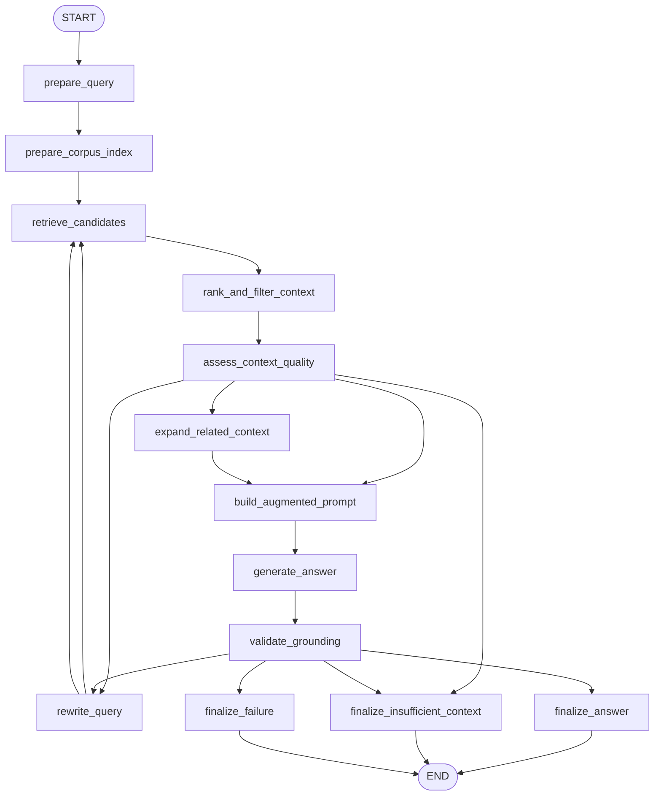

# 14: Knowledge Retrieval (RAG) (en)

## Pattern Summary

Knowledge Retrieval, commonly implemented as Retrieval-Augmented Generation (RAG), connects an LLM to external knowledge before response generation. Instead of asking the model to answer from static training data alone, the system retrieves relevant snippets from a knowledge base, augments the prompt with those snippets, and asks the model to answer from grounded context.

The chapter presents RAG as a way to make agents more accurate, current, domain-specific, and verifiable. It covers the core mechanics of embeddings, semantic similarity, chunking, vector databases, BM25 and hybrid search, citations, GraphRAG, and Agentic RAG. It also highlights operational challenges: fragmented answers across chunks, irrelevant retrieval, contradictory sources, stale indexes, latency, token cost, and maintenance overhead.

For the LangGraph example, this requirement should implement a local enterprise knowledge assistant. The graph should retrieve chunks from a small fixture corpus, rank and filter them, optionally refine the query when context is weak, generate a grounded answer with citations, and return "I don't know" or an insufficient-context status when the retrieved evidence does not support an answer.

## Pattern Explanation

### Conceptual Overview

RAG turns an LLM from a closed-book responder into an open-book responder. The model still writes the final answer, but first the application gives it relevant evidence from documents, databases, web pages, or other knowledge sources.

In Chapter 14, the important idea is that retrieval is not just keyword lookup. Modern RAG systems often use embeddings to represent text by meaning, then search for chunks whose vectors are semantically close to the user's query. The retrieved context gives the model current or proprietary facts and gives users a way to verify the answer through sources.

### Problem

LLMs can be outdated, unaware of private company data, and prone to confident factual errors. A model may not know the latest policy, product manual, inventory state, support article, or current-event detail. If the model answers without evidence, the user cannot easily verify where the information came from.

RAG solves this by making external knowledge retrieval a required step before generation. The graph can inspect what was retrieved, reject weak or irrelevant context, preserve citations, and constrain the model to answer only from available evidence.

### When to Use

- Use this pattern when answers depend on current, proprietary, specialized, or frequently changing information.
- Use it for enterprise search, internal policy Q&A, customer-support answers, technical manuals, product documentation, legal or research lookup, and current-event summarization.
- Use it when responses need citations or source traceability.
- Use it when a small amount of relevant context is better than passing an entire document into the model.
- Use it when semantic similarity can find useful matches even if the user's wording differs from the source document.
- Use Agentic RAG when retrieval quality must be evaluated, conflicting sources must be reconciled, or complex questions require multiple sub-queries.
- Use GraphRAG when the answer depends on explicit relationships between entities across multiple documents.

### When Not to Use

- Avoid this pattern when the answer is already fully present in the user input or deterministic application state.
- Avoid it when a static prompt, simple rule, or direct database query is enough.
- Avoid RAG when the knowledge base is too stale, incomplete, or poorly governed to be trusted.
- Avoid returning an answer when retrieved chunks are below the relevance threshold or do not contain the needed evidence.
- Avoid using RAG as a substitute for permissions, privacy controls, or source-quality review.
- Avoid complex Agentic RAG or GraphRAG when standard top-k retrieval is accurate enough and latency matters.
- Avoid indexing sensitive data unless retention, access control, deletion, and audit requirements are defined.

### How It Works

1. Prepare the knowledge base by loading documents, splitting them into meaningful chunks, embedding those chunks, and storing them in a searchable index.
2. Receive the user's question and normalize it into a retrieval query.
3. Retrieve candidate chunks with vector search, keyword search, or a hybrid of both.
4. Rank and filter candidates by semantic score, keyword score, freshness, authority, source type, and configured thresholds such as `top_k` or distance.
5. If the retrieved context is incomplete, conflicting, or below threshold, optionally rewrite the query, run a second retrieval, or expand through related document links.
6. Build an augmented prompt containing the question, selected context, citation metadata, and instructions to answer only from retrieved evidence.
7. Generate a concise answer and attach citations to the chunks that support the claims.
8. Validate that the answer is grounded in retrieved context; if not, retry within limits or return an insufficient-context response.
9. Finalize with the answer, citations, retrieval metadata, confidence, and any errors or warnings.

### Trade-offs

| Benefit | Cost or Risk |
| --- | --- |
| Gives the model access to current, proprietary, and domain-specific information. | Requires ingestion, chunking, embedding, indexing, and periodic refresh. |
| Reduces hallucination by grounding output in retrieved evidence. | Irrelevant or incomplete retrieval can still mislead the model. |
| Enables citations and source traceability. | Citation handling must be validated so unsupported claims are not attributed falsely. |
| Keeps prompts focused by passing only relevant chunks. | Retrieval adds latency, token usage, and infrastructure cost. |
| Semantic search finds meaning-based matches beyond exact keywords. | Embedding quality, chunk size, and thresholds strongly affect answer quality. |
| Hybrid search improves recall for both concepts and exact terms. | More ranking logic creates more tuning and testing burden. |
| Agentic RAG can validate, reconcile, and refine retrieved knowledge. | Agent loops can increase cost, latency, and failure modes. |
| GraphRAG can answer relationship-heavy questions across sources. | Knowledge graph construction and maintenance are expensive and specialized. |

### Minimal Example

```text
User asks: "What is our current remote work policy?"
  -> normalize the query
  -> retrieve top policy chunks from the company handbook corpus
  -> discard an outdated 2020 blog post because the 2025 handbook is authoritative
  -> build a prompt with the current policy chunk and citation metadata
  -> generate a concise answer grounded in the retrieved handbook
  -> validate that each claim is supported
  -> return the answer with source title, section, and chunk id
```

### LangGraph Mapping

| Pattern Concept | LangGraph Element |
| --- | --- |
| User question | State fields `input`, `normalized_query`, and `retrieval_query` |
| Knowledge base | State fields `corpus_name`, `documents`, `chunks`, and `index_metadata` |
| Chunking | Node `prepare_corpus_index` and state field `chunks` |
| Embeddings and vector search | Node `retrieve_candidates` and state fields `retrieval_config`, `retrieved_chunks`, and `scores` |
| BM25 or hybrid search | State field `retrieval_strategy` and node `rank_and_filter_context` |
| Augmentation | Node `build_augmented_prompt` and state field `augmented_prompt` |
| Grounded generation | Node `generate_answer` and state field `draft_answer` |
| Citations | State fields `citations`, `source_metadata`, and `supporting_chunk_ids` |
| Context-quality check | Node `assess_context_quality` and conditional edges for retry or insufficient context |
| Agentic RAG refinement | Nodes `rewrite_query` and `validate_grounding` |
| Lightweight GraphRAG behavior | Node `expand_related_context` using source relationship metadata when available |

## LangGraph Implementation Goal

Build a LangGraph example of an enterprise knowledge assistant for internal policy and product documentation. The user asks a natural-language question. The graph retrieves relevant chunks from a small local fixture corpus, filters low-quality results, generates an answer grounded in the selected context, and returns citations.

The first implementation should be deterministic and testable without network calls or a production vector database. A simple in-memory retriever is acceptable, but its interface should make the retrieval concepts explicit: chunk ids, source metadata, scores, `top_k`, relevance threshold, and retrieval strategy. The implementation can later swap the fixture retriever for a real vector store such as Chroma, Weaviate, Qdrant, Redis, Elasticsearch, Postgres with `pgvector`, or a managed RAG service.

Expected workflow outcome:

- Relevant questions return concise answers grounded in retrieved chunks.
- Final answers include citation metadata for each supporting source.
- Weak retrieval produces query refinement at most once before returning insufficient context.
- Contradictory sources are detected and resolved by authority or freshness metadata when possible.
- Unsupported answers are blocked or rewritten rather than finalized.
- The final state exposes retrieval, ranking, grounding, and citation metadata for tests.

## State Shape

List the state fields the graph needs.

| Field | Type | Purpose |
| --- | --- | --- |
| `input` | `str` | Original user question. |
| `normalized_query` | `str` | Trimmed and normalized question text used by retrieval and prompts. |
| `retrieval_query` | `str` | Query sent to the retriever; may differ from the original after rewriting. |
| `query_rewrites` | `list[str]` | Ordered list of rewritten queries attempted by the graph. |
| `corpus_name` | `str` | Name of the local fixture corpus or configured knowledge base. |
| `documents` | `list[dict]` | Source documents with ids, titles, body text, metadata, and optional relationships. |
| `chunks` | `list[dict]` | Chunked document snippets with chunk ids, text, source ids, section labels, and metadata. |
| `index_metadata` | `dict[str, Any]` | Index preparation details such as chunk size, overlap, embedding model name, and corpus version. |
| `retrieval_strategy` | `str` | Strategy such as `semantic`, `keyword`, or `hybrid`. |
| `retrieval_config` | `dict[str, Any]` | Config such as `top_k`, `score_threshold`, `vector_distance_threshold`, and `max_retrieval_attempts`. |
| `retrieval_attempts` | `int` | Number of retrieval attempts already performed. |
| `retrieved_chunks` | `list[dict]` | Raw chunks returned by the retriever with scores and metadata. |
| `ranked_chunks` | `list[dict]` | Filtered and ranked chunks selected for prompt context. |
| `related_chunks` | `list[dict]` | Optional relationship-expanded chunks for fragmented or multi-hop questions. |
| `context` | `str` | Concatenated, bounded context passed to the answer-generation prompt. |
| `source_metadata` | `list[dict]` | Citation-ready metadata for selected chunks, including title, section, source id, and chunk id. |
| `context_quality` | `str` | Quality label such as `sufficient`, `weak`, `contradictory`, or `missing`. |
| `contradictions` | `list[dict]` | Detected source conflicts and resolution notes. |
| `knowledge_gap` | `str \| None` | Explanation of missing evidence when the graph cannot answer from the corpus. |
| `augmented_prompt` | `str` | Prompt containing the question, retrieved context, citation metadata, and grounding instructions. |
| `draft_answer` | `str` | Model-generated answer before grounding validation. |
| `citations` | `list[dict]` | Citations used in the final answer, mapped to supporting chunks. |
| `grounding_status` | `str` | Validation result such as `grounded`, `unsupported`, `partially_supported`, or `not_checked`. |
| `confidence` | `float` | Implementation-defined confidence score based on retrieval and grounding quality. |
| `errors` | `list[str]` | Recoverable validation, retrieval, generation, or grounding errors. |
| `final_output` | `dict[str, Any] \| None` | User-facing answer, status, citations, confidence, retrieval metadata, and errors. |

## Nodes

| Node | Responsibility |
| --- | --- |
| `prepare_query` | Validate non-empty input, normalize whitespace, initialize defaults, and build the initial retrieval query. |
| `prepare_corpus_index` | Load fixture documents, create chunks, attach metadata, and prepare the in-memory retrieval index if it is not already available. |
| `retrieve_candidates` | Retrieve candidate chunks using the configured strategy, `top_k`, and score or distance threshold. |
| `rank_and_filter_context` | Remove weak or stale candidates, prefer authoritative and current sources, and produce `ranked_chunks`. |
| `expand_related_context` | Add relationship-linked chunks for multi-hop or fragmented questions when source metadata supports it. |
| `assess_context_quality` | Decide whether the selected context is sufficient, weak, contradictory, or missing. |
| `rewrite_query` | Produce one focused query rewrite when the first retrieval attempt is weak or missing. |
| `build_augmented_prompt` | Compose the grounded answer prompt from the user question, selected context, citation metadata, and "answer only from context" instruction. |
| `generate_answer` | Generate a concise answer from the augmented prompt using the shared model pattern or a mock model in tests. |
| `validate_grounding` | Check whether the answer is supported by selected chunks and whether citations map to real source metadata. |
| `finalize_answer` | Return a successful answer with citations, confidence, retrieval metadata, and no unsupported claims. |
| `finalize_insufficient_context` | Return a controlled "I don't know" or insufficient-context response with retrieval metadata and the knowledge gap. |
| `finalize_failure` | Return a controlled failure when validation, retrieval, or model execution fails unexpectedly. |

## Edges

Describe the graph flow, including conditional branches.



Conditional edge requirements:

- Route from `assess_context_quality` to `build_augmented_prompt` when selected context is sufficient.
- Route from `assess_context_quality` to `expand_related_context` when evidence appears fragmented across related chunks or the query requires multi-hop synthesis.
- Route from `assess_context_quality` to `rewrite_query` when context is weak or missing and `retrieval_attempts < max_retrieval_attempts`.
- Route from `assess_context_quality` to `finalize_insufficient_context` when context is missing after allowed retrieval attempts.
- Route from `validate_grounding` to `finalize_answer` only when the answer is grounded and all citations map to selected source chunks.
- Route from `validate_grounding` to `rewrite_query` when the answer is unsupported but one retrieval refinement remains.
- Route from `validate_grounding` to `finalize_insufficient_context` when the answer cannot be supported by retrieved evidence.
- Route from `validate_grounding` to `finalize_failure` only for unexpected runtime or schema failures.
- The graph must not loop beyond `max_retrieval_attempts`.
- The implementation should keep retrieval and generation dependencies injectable so tests can use deterministic fake retrievers and fake model outputs.

## Inputs and Outputs

- Input: a natural-language question, optional retrieval configuration, and optional fixture corpus override for tests.
- Output: `final_output`, including `status`, `answer`, `citations`, `confidence`, `retrieval_attempts`, `retrieved_sources`, `grounding_status`, and `errors`.
- Intermediate artifacts: normalized query, retrieval query, chunks, retrieved chunks, ranked chunks, related chunks, context quality, contradictions, knowledge gap, augmented prompt, draft answer, and source metadata.

Example successful output shape:

```json
{
  "status": "answered",
  "answer": "Employees may work remotely up to three days per week with manager approval.",
  "citations": [
    {
      "source_id": "hr-handbook-2025",
      "title": "Employee Handbook 2025",
      "section": "Remote Work",
      "chunk_id": "hr-handbook-2025::remote-work::1"
    }
  ],
  "confidence": 0.86,
  "retrieval_attempts": 1,
  "grounding_status": "grounded",
  "errors": []
}
```

Example insufficient-context output shape:

```json
{
  "status": "insufficient_context",
  "answer": "I don't know based on the available knowledge base.",
  "citations": [],
  "confidence": 0.0,
  "retrieval_attempts": 2,
  "grounding_status": "unsupported",
  "knowledge_gap": "No retrieved chunk describes contractor remote-work eligibility.",
  "errors": []
}
```

Example input shape:

```json
{
  "input": "How many days per week can employees work remotely under the current handbook?",
  "retrieval_config": {
    "top_k": 3
  }
}
```

## Failure Cases

Document expected failures, retries, fallback behavior, and human-review points.

- Blank input should fail in `prepare_query` without retrieval or model invocation.
- Missing or empty corpus should produce `finalize_failure` or `finalize_insufficient_context` with a clear error.
- Chunking failure should stop before retrieval and preserve a controlled failure state.
- Retriever unavailable or malformed retriever output should append an error and avoid generating an ungrounded answer.
- No chunks above `score_threshold` should trigger one query rewrite when allowed, then return insufficient context.
- Retrieved chunks that are irrelevant or stale should be filtered before prompt construction.
- Contradictory chunks should be resolved by authority and freshness metadata when possible; otherwise the graph should return a cautious answer or insufficient-context status.
- Generated answers that contain claims not supported by selected chunks should not be finalized as successful.
- Citations must reference real selected chunks; missing or fabricated citations should fail grounding validation.
- The graph should not expose hidden metadata, credentials, raw stack traces, or unrelated document contents in `final_output`.
- Prompt-injection text inside retrieved documents should be treated as document content, not as system instructions.
- Query rewrite and validation loops must stop at `max_retrieval_attempts`.
- If a future implementation uses live web search or external vector stores, network failures should degrade to controlled failure or insufficient-context status, not hallucinated answers.

## Test Ideas

- Verify the happy path where a policy question retrieves a relevant chunk and returns a grounded answer with citation metadata.
- Verify an unknown question returns `status: "insufficient_context"` rather than a fabricated answer.
- Verify low retrieval scores trigger one query rewrite and do not exceed `max_retrieval_attempts`.
- Verify stale and current sources are ranked so the current authoritative source wins.
- Verify contradictory retrieved chunks are recorded in `contradictions` and resolved or rejected.
- Verify generated answers with unsupported claims fail `validate_grounding`.
- Verify fabricated citation ids fail grounding validation.
- Verify prompt-injection text inside a retrieved chunk does not override the answer-generation instruction.
- Verify retrieval dependencies can be replaced with deterministic fake retrievers in tests.
- Verify final state always includes `final_output`, `retrieval_attempts`, `grounding_status`, `citations`, `confidence`, and `errors`.
- Verify optional related-context expansion can answer a fragmented multi-hop question when linked chunks are available.

## Open Questions

- Page/index ambiguity: `docs/agentic-design-patterns-toc.md` lists Chapter 14 as logical pages `199-215`, but direct extraction found the visible chapter at PDF labels/file pages `213-230`, zero-based indexes `212-229`, with chapter-local counters `1-18`. Chapter 15 begins at PDF label/file page `231`, zero-based index `230`.
- Figure extraction ambiguity: `pypdf` extracted captions for Fig. 1, Fig. 2, and Fig. 3, but not the full visual contents. The requirement uses the surrounding text and captions rather than inferring diagram details.
- The chapter includes ADK examples for Google Search and Vertex AI RAG Corpus, plus a LangChain/LangGraph example using Weaviate and OpenAI. The first local implementation should avoid required network services and use injectable local fixtures for deterministic tests.
- The chapter discusses standard RAG, GraphRAG, and Agentic RAG. This requirement includes lightweight query refinement, grounding validation, and related-context expansion, but does not require a production knowledge graph in the first implementation.
