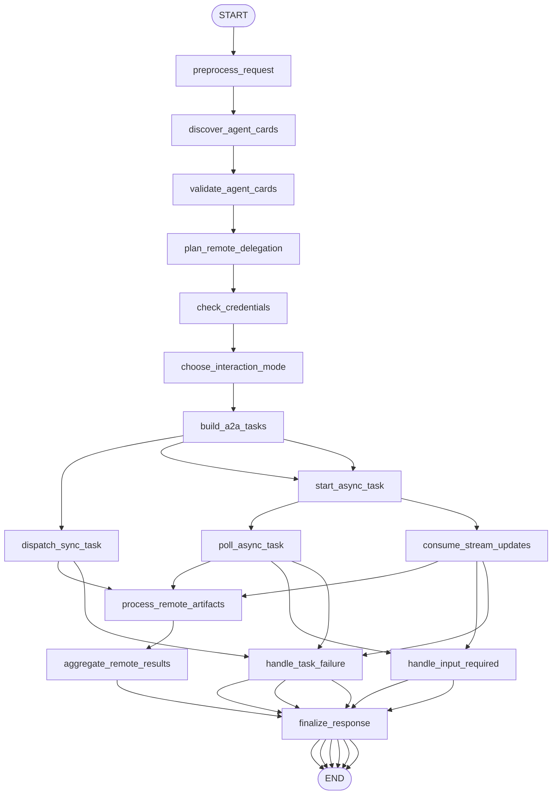

# 15: Inter-Agent Communication (A2A) (en)

## Pattern Summary

Inter-Agent Communication (A2A) gives independent AI agents a shared protocol for collaboration. Instead of one monolithic agent handling every skill, an A2A client agent can discover remote agents, inspect their capabilities through Agent Cards, delegate work as tasks, receive messages or artifacts, and combine the results into a larger workflow.

Chapter 15 presents Google's A2A protocol as an open, HTTP-based standard for communication between agents built with different frameworks such as LangGraph, CrewAI, and Google ADK. The chapter emphasizes core actors, Agent Cards, discovery, asynchronous task state, message and artifact parts, sync and streaming interaction modes, push notifications, security requirements, and the difference between A2A and MCP.

For implementation, this requirement should build a LangGraph A2A coordinator that acts as an A2A client. The graph should discover a small set of mocked remote Agent Cards, choose the right remote agent skills, build A2A-like task requests, dispatch them through an injectable fake transport, handle sync, polling, streaming, and input-required states, then aggregate artifacts into a final user-facing answer.

## Pattern Explanation

### Conceptual Overview

A2A treats each agent as an independent service with a public description of what it can do. The client agent does not need to know the remote agent's internal framework, prompt, tools, or graph design. It only needs the remote agent's Agent Card, endpoint, supported input/output modes, authentication requirements, and skills.

The pattern is different from simply adding more nodes to one graph. In A2A, remote agents are opaque collaborators. The local graph coordinates them by exchanging standardized tasks, messages, statuses, and artifacts over a protocol boundary.

### Problem

Complex agentic systems often need specialized capabilities that do not live in the same runtime or framework. A calendar agent may be built with Google ADK, a research agent with LangGraph, and a business workflow agent with another platform. Without a shared protocol, every pair of agents requires custom integration code, capability discovery is manual, and long-running work is hard to coordinate reliably.

A2A solves this by defining how agents identify themselves, how client agents discover capabilities, how work is represented as tasks, how results are returned, and how context is preserved across multi-turn interactions.

### When to Use

- Use this pattern when a workflow needs two or more specialized agents to collaborate across framework, process, team, or service boundaries.
- Use it when agents should be discoverable through Agent Cards instead of hard-coded directly into the coordinator.
- Use it when remote work may be long-running and needs task IDs, statuses, polling, streaming updates, or push notifications.
- Use it when the client should treat remote agents as opaque systems and depend only on their advertised protocol contract.
- Use it when a modular architecture is more valuable than one large agent with every tool and prompt loaded at once.
- Use it when interoperability between LangGraph, Google ADK, CrewAI, or other agent frameworks is a core requirement.

### When Not to Use

- Avoid this pattern for a single-agent workflow where ordinary LangGraph nodes or direct tool calls are simpler and sufficient.
- Avoid it when all components run inside one trusted process and do not need protocol-level discovery or task state.
- Avoid it when low-latency deterministic execution is required and network-style delegation would add unnecessary overhead.
- Avoid it before authentication, authorization, transport security, audit logging, and data-sharing boundaries are defined.
- Avoid dynamic discovery in regulated workflows unless allowed remote agents are curated or explicitly approved.
- Avoid treating A2A as a replacement for MCP; Chapter 15 frames A2A as agent-to-agent coordination, while MCP is about model access to external tools, data, and resources.

### How It Works

1. The user gives a request to a local A2A client agent or coordinator.
2. The coordinator discovers available remote agents through well-known Agent Card URLs, curated registries, or direct configuration.
3. The coordinator validates Agent Cards, including endpoint URL, version, input and output modes, skills, advertised capabilities, and authentication requirements.
4. The coordinator chooses one or more remote agents whose skills match the user's task.
5. The coordinator creates A2A task messages with metadata, content parts, accepted output modes, session or context identifiers, and any task-specific parameters.
6. For quick work, the coordinator sends a synchronous request and waits for one complete result.
7. For longer work, the coordinator records the task ID and either polls for status, consumes streaming updates, or waits for a webhook-style notification.
8. Remote agents return task states, messages, and artifacts, where artifacts may contain text, files, JSON, or streamed partial results.
9. The coordinator handles `input-required`, `working`, `completed`, and `failed` states by asking the user for clarification, continuing to wait, aggregating results, or routing to fallback.
10. The graph records audit metadata, redacts sensitive fields from logs, and produces a final answer that explains which remote capabilities were used.

### Trade-offs

| Benefit | Cost or Risk |
| --- | --- |
| Enables interoperable collaboration between agents built with different frameworks. | Adds protocol, discovery, transport, and task-state complexity. |
| Keeps specialized agents modular and independently deployable. | Remote agents become operational dependencies with latency and availability risks. |
| Agent Cards make capabilities discoverable and inspectable. | Malformed, stale, or over-broad Agent Cards can cause unsafe or incorrect delegation. |
| Supports synchronous, polling, streaming, and webhook-style interactions. | Each interaction mode needs separate timeout, retry, and state-handling logic. |
| Lets the coordinator treat remote agents as opaque services. | Opaqueness makes debugging harder without strong audit logs and trace metadata. |
| Complements MCP by focusing on agent coordination and task delegation. | Teams may confuse A2A with tool/resource access and put the wrong boundary in the design. |
| Encourages distributed scaling through independently hosted agents. | Authentication, authorization, credential handling, and data sharing must be explicit. |

### Minimal Example

```text
User: "Check whether I am free tomorrow afternoon and whether the weather is good for an outdoor meeting."

Coordinator graph:
  -> discover configured Agent Cards
  -> select Calendar Agent skill: check_availability
  -> select WeatherBot skill: get_forecast
  -> send A2A task to Calendar Agent
  -> send A2A task to WeatherBot
  -> poll or stream until both tasks complete
  -> aggregate returned artifacts
  -> answer with availability, weather, and any unresolved remote-agent errors
```

### LangGraph Mapping

| Pattern Concept | LangGraph Element |
| --- | --- |
| User request | State field `input` |
| A2A client agent | The LangGraph coordinator graph |
| Remote A2A server or remote agent | Fake transport-backed remote agent fixtures referenced by `remote_agents` |
| Agent Card | State fields `agent_cards`, `validated_agent_cards`, and node `discover_agent_cards` |
| Discovery strategy | State field `discovery_mode` and node `discover_agent_cards` |
| Agent skill selection | Node `plan_remote_delegation` and state field `delegation_plan` |
| A2A task | State fields `a2a_tasks` and `task_statuses` |
| Message parts and artifacts | State fields `task_messages`, `remote_artifacts`, and `stream_events` |
| Context continuity | State fields `session_id` and `context_id` |
| Sync, polling, streaming, or webhook interaction | Conditional edges after `choose_interaction_mode` |
| Authentication declaration | State fields `auth_requirements` and `credential_status` |
| Auditability | State field `audit_log` and node `record_audit_event` |
| Remote failure or missing input | Conditional edges to `handle_task_failure` or `handle_input_required` |

## LangGraph Implementation Goal

Build a LangGraph example of an A2A meeting-preparation coordinator. The user asks for help with a task that requires more than one specialized remote agent, such as checking calendar availability and weather before planning an outdoor meeting. The graph acts as the A2A client and communicates with deterministic fake remote agents through an injected A2A transport adapter.

The first implementation should not require live HTTP servers, Google credentials, webhook hosting, or real A2A infrastructure. It should model the A2A contract closely enough to teach the pattern: Agent Cards, discovery, skill matching, task IDs, task states, message parts, artifacts, context IDs, sync response, async polling, streaming updates, authentication metadata, and clear failure handling.

Expected workflow outcome:

- The graph discovers or loads Agent Cards before choosing remote agents.
- The graph selects remote skills based on the user request and advertised Agent Card metadata.
- The graph builds A2A-like JSON-RPC task payloads instead of calling remote logic directly.
- The graph can complete a synchronous remote task and an asynchronous polling or streaming remote task.
- The graph handles `input-required`, `failed`, timeout, unsupported mode, and authentication failure states explicitly.
- The final output aggregates remote artifacts and reports which agents, skills, task IDs, and interaction modes were used.

## State Shape

List the state fields the graph needs.

| Field | Type | Purpose |
| --- | --- | --- |
| `input` | `str` | Original user request or task description. |
| `normalized_input` | `str` | Trimmed and normalized request text used for planning and remote messages. |
| `session_id` | `str` | Client-side session identifier used across related remote tasks. |
| `context_id` | `str \| None` | Server-generated or coordinator-assigned context identifier for multi-turn continuity. |
| `discovery_mode` | `str` | Discovery source such as `direct_config`, `registry`, or `well_known_uri`. |
| `agent_cards` | `dict[str, dict]` | Raw Agent Cards discovered or loaded for candidate remote agents. |
| `validated_agent_cards` | `dict[str, dict]` | Agent Cards that pass schema, capability, mode, and security validation. |
| `remote_agents` | `dict[str, Any]` | Test fixture or adapter metadata for deterministic fake A2A servers. |
| `candidate_skills` | `list[dict]` | Skills from validated Agent Cards that could satisfy part of the user request. |
| `delegation_plan` | `list[dict]` | Ordered or parallel remote-agent calls, including selected agent, skill, interaction mode, and reason. |
| `auth_requirements` | `dict[str, dict]` | Authentication schemes declared by selected Agent Cards. |
| `credential_status` | `dict[str, str]` | Whether credentials for each selected remote agent are `available`, `missing`, or `invalid`. |
| `a2a_tasks` | `dict[str, dict]` | A2A-like task request payloads keyed by local task alias or remote task ID. |
| `task_statuses` | `dict[str, str]` | Current remote task states such as `submitted`, `working`, `input-required`, `completed`, `failed`, or `timeout`. |
| `task_messages` | `dict[str, list[dict]]` | Messages exchanged with remote agents, including role, attributes, and content parts. |
| `remote_artifacts` | `dict[str, list[dict]]` | Artifacts returned by remote agents, including text or structured JSON parts. |
| `interaction_modes` | `dict[str, str]` | Selected mode per task: `sync`, `polling`, `streaming`, or `webhook_mock`. |
| `poll_attempts` | `dict[str, int]` | Number of polling attempts per task, used to enforce retry limits. |
| `stream_events` | `dict[str, list[dict]]` | Incremental updates received from fake streaming tasks. |
| `pending_user_questions` | `list[str]` | Clarifying questions generated when a remote task returns `input-required`. |
| `aggregation_result` | `dict[str, Any] \| None` | Combined interpretation of successful remote artifacts. |
| `audit_log` | `list[dict]` | Non-secret trace of discovery, delegation, status changes, and errors. |
| `errors` | `list[str]` | Recoverable validation, transport, authentication, task, parsing, or timeout errors. |
| `final_output` | `dict[str, Any] \| None` | User-facing result with answer, remote-agent metadata, statuses, artifacts summary, and errors. |

## Nodes

| Node | Responsibility |
| --- | --- |
| `preprocess_request` | Validate non-empty input, normalize text, create `session_id`, and initialize defaults. |
| `discover_agent_cards` | Load Agent Cards from direct config or a fake registry and store raw card data. |
| `validate_agent_cards` | Validate required card fields, endpoint shape, skills, input/output modes, capabilities, and authentication declarations. |
| `plan_remote_delegation` | Match user intent to advertised remote skills and produce a delegation plan. |
| `check_credentials` | Verify that required mock credentials or credential aliases exist before dispatch. |
| `choose_interaction_mode` | Select `sync`, `polling`, `streaming`, or `webhook_mock` based on task duration and Agent Card capabilities. |
| `build_a2a_tasks` | Build A2A-like JSON-RPC task payloads with task IDs, session ID, messages, accepted output modes, and context metadata. |
| `dispatch_sync_task` | Send quick tasks through the fake transport and capture a complete result. |
| `start_async_task` | Submit a long-running task, record the remote task ID, and store the initial `working` status. |
| `poll_async_task` | Poll fake remote task status until completion, failure, input-required, or timeout. |
| `consume_stream_updates` | Consume fake streaming updates and collect partial artifacts or status changes. |
| `handle_input_required` | Convert remote `input-required` status into `pending_user_questions` and a final or resumable state. |
| `process_remote_artifacts` | Validate returned message and artifact parts, reject malformed or oversized payloads, and normalize useful data. |
| `aggregate_remote_results` | Combine calendar, weather, or other remote artifacts into one coherent workflow result. |
| `handle_task_failure` | Record failed tasks, unsupported modes, auth failures, transport errors, and timeout decisions. |
| `record_audit_event` | Append non-secret trace entries for discovery, delegation, request, status, and response events. |
| `finalize_response` | Produce `final_output` with answer text, agent/task metadata, result summaries, and errors. |

## Edges

Describe the graph flow, including conditional branches.



Conditional edge requirements:

- Route from `validate_agent_cards` to `finalize_response` when no valid Agent Cards are available.
- Route from `plan_remote_delegation` to `finalize_response` when no advertised skill matches the request.
- Route from `check_credentials` to `handle_task_failure` when a selected Agent Card requires credentials that are missing or invalid.
- Route from `build_a2a_tasks` to `dispatch_sync_task` when the selected task is quick and the remote Agent Card supports the required input and output modes.
- Route from `build_a2a_tasks` to `start_async_task` plus `poll_async_task` when the task is long-running and polling is the selected mode.
- Route from `build_a2a_tasks` to `start_async_task` plus `consume_stream_updates` when streaming is selected and the Agent Card advertises streaming support.
- Route to `handle_input_required` when any remote task returns `input-required`; do not invent missing user details.
- Route to `handle_task_failure` on `failed`, timeout, unsupported mode, malformed response, authentication failure, or transport failure.
- Proceed to `aggregate_remote_results` only after required remote tasks are `completed` or a partial-output policy has been applied.
- Do not loop indefinitely while polling or streaming; enforce maximum attempts and timeout state.

## Inputs and Outputs

- Input: a natural-language request, optional discovery mode, optional mock Agent Card registry, optional fake remote-agent fixtures, and optional credential aliases for selected agents.
- Output: `final_output`, including answer text, status, selected remote agents, selected skills, task IDs, task statuses, interaction modes, artifact summaries, audit summary, pending user questions, and errors.
- Intermediate artifacts: validated Agent Cards, candidate skills, delegation plan, A2A-like task payloads, task messages, stream events, poll attempts, remote artifacts, aggregation result, credential status, and audit log.

Example successful output shape:

```json
{
  "status": "ok",
  "answer": "You are free tomorrow afternoon, and the forecast is clear enough for an outdoor meeting.",
  "agents_used": [
    {
      "name": "Calendar Agent",
      "skill": "check_availability",
      "task_id": "task-calendar-001",
      "mode": "sync",
      "status": "completed"
    },
    {
      "name": "WeatherBot",
      "skill": "get_forecast",
      "task_id": "task-weather-001",
      "mode": "polling",
      "status": "completed"
    }
  ],
  "artifact_summary": {
    "calendar": "free from 13:00 to 17:00",
    "weather": "clear, 22 C, low rain risk"
  },
  "errors": []
}
```

Example input-required output shape:

```json
{
  "status": "input_required",
  "answer": "The calendar agent needs the meeting date before it can check availability.",
  "pending_user_questions": [
    "Which date should I check?"
  ],
  "agents_used": [
    {
      "name": "Calendar Agent",
      "skill": "check_availability",
      "task_id": "task-calendar-002",
      "status": "input-required"
    }
  ],
  "errors": []
}
```

Example input shape:

```json
{
  "input": "Ask the travel agent to draft a two-day Seoul itinerary and return the result as a summary.",
  "discovery_mode": "fixture"
}
```

## Failure Cases

Document expected failures, retries, fallback behavior, and human-review points.

- Blank input should fail in `preprocess_request` without discovery or remote dispatch.
- Missing discovery configuration should produce a clear `no_agents_available` output instead of crashing.
- Malformed Agent Cards should be rejected before skill selection, with the validation error recorded.
- Agent Cards that omit required fields such as name, URL, version, skills, input modes, or output modes should not be used.
- Unsupported input or output modes should prevent dispatch and explain which mode was missing.
- Missing, invalid, or disallowed credentials should stop the affected task before any fake remote call is made.
- No matching skill should produce a direct explanation that no suitable remote agent is available.
- Remote task submission may fail because the endpoint is unavailable, the fake transport rejects the request, or the request payload is invalid.
- Polling and streaming must enforce maximum attempts to avoid unbounded loops.
- A remote `input-required` state should ask the user for missing information instead of fabricating task parameters.
- A remote `failed` state should preserve the task ID, remote error message, and selected skill in `errors`.
- Streaming may disconnect or produce malformed partial events; the graph should keep valid prior events and return a partial or failed status based on policy.
- Webhook behavior should be mocked only; lack of real callback hosting should not block the example.
- Returned artifacts may be malformed, too large, unsupported, or inconsistent with the requested output mode; `process_remote_artifacts` should reject them.
- Audit logs must not store raw credentials or secret tokens.
- If one delegated task succeeds and another fails, `aggregate_remote_results` should return a partial result only when the response clearly marks the missing dependency.

## Test Ideas

- Verify the happy path where the graph discovers Calendar Agent and WeatherBot Agent Cards, dispatches both tasks, and aggregates completed artifacts.
- Verify synchronous dispatch builds an A2A-like request payload with task ID, session ID, message parts, accepted output modes, and selected skill metadata.
- Verify asynchronous polling handles `working` followed by `completed` without exceeding the poll limit.
- Verify streaming mode records incremental events and produces the same normalized artifact shape as polling.
- Verify a remote `input-required` state creates `pending_user_questions` and does not fabricate missing values.
- Verify malformed Agent Cards are rejected before delegation.
- Verify no matching skill returns a clear final output without remote dispatch.
- Verify missing credentials prevent dispatch and record an authentication error.
- Verify remote `failed` status routes through `handle_task_failure`.
- Verify timeout after maximum polling attempts produces a stable final output.
- Verify unsupported output mode prevents task creation.
- Verify malformed artifacts are rejected and do not appear in the aggregated result.
- Verify partial success is clearly marked when one required remote task succeeds and another fails.
- Verify `audit_log` contains non-secret discovery, delegation, and status metadata.
- Verify final state always includes `agent_cards`, `delegation_plan`, `task_statuses`, `remote_artifacts`, `errors`, and `final_output`.

## Open Questions

- Page/index ambiguity: `docs/agentic-design-patterns-toc.md` lists Chapter 15 as logical pages `216-230`, but direct extraction found the chapter at one-based file pages `231-245`, zero-based indexes `230-244`, with local counters `1-15`. The requirement cites the logical range while documenting the extracted PDF indexes.
- The chapter text uses both JSON-RPC-style method names `sendTask` and `sendTaskSubscribe` in examples and `tasks/send` and `tasks/sendSubscribe` in the key takeaways. The first implementation should use a small internal interaction-mode enum and keep method-name mapping inside the fake A2A transport adapter.
- The chapter references both `google-a2a/a2a-samples` and `a2aproject/a2a-samples` repository paths in different excerpts. This requirement does not depend on either live repository.
- The visual summary was extractable only as the caption `Fig.2: A2A inter-agent communication pattern`; diagram internals were not converted into requirements.
- Chapter 15 describes mTLS, OAuth 2.0 tokens, API keys, and HTTP headers, but the first LangGraph example should mock credential presence and avoid real secret handling until an implementation explicitly adds live A2A transport.
