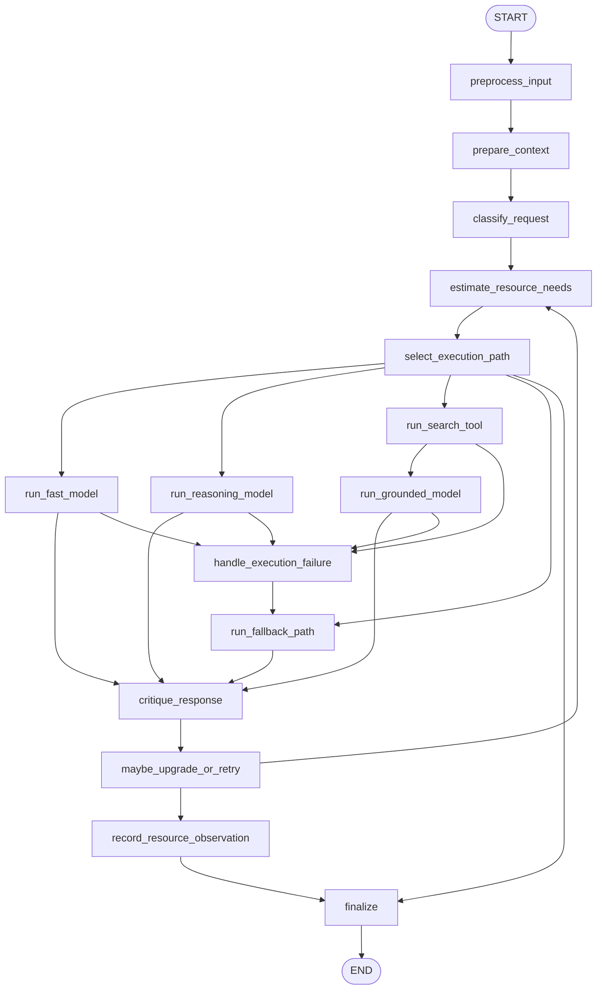

# 16: Resource-Aware Optimization (ko)

## 패턴 요약

자원 인지 최적화는 작업별로 어떤 계산/시간/비용/데이터/서비스 용량을 쓸지 스스로 선택하는 패턴입니다. 단순 절차 나열이 아니라 품질 목표를 충족하면서 예산·지연·가용성·신뢰성 제약 내에서 경로를 선택합니다.

핵심은 요청 분류 → 자원 제약 점검 → 적절한 모델/도구/컨텍스트/폴백 선택입니다. 단순 질의는 저비용/저지연 경로를, 복잡 추론이나 실시간 정보/고가치 작업은 더 강한 모델·검색·재시도·추가 계산을 사용합니다. critique 단계로 라우팅 품질을 평가해 정책을 개선할 수도 있습니다.

LangGraph 예제는 질의형 Q&A 라우터입니다. 질의 분류, 리소스 추정, 컨텍스트 축약, 모델·도구 경로 선택, 예산 추적, 실패 시 폴백, 품질 저하/업그레이드, 최종 메타 반환까지 구현합니다.

## 패턴 설명

### 개념 개요

자원을 1급 상태로 다루는 패턴입니다. 항상 최상위 모델을 쓰지 않고, 작업 요구사항, 사용자/시스템 제약, 현재 자원을 고려해 실행 계획을 정합니다.

16장은 동적 모델 스위칭, 적응형 도구 선택, 컨텍스트 요약, 사전 비용 예측, 다중 에이전트 자원 분산, 에너지 효율 배포, 학습 기반 할당, graceful degradation, 폴백까지 다룹니다.

### 문제

같은 무거운 경로를 모든 요청에 적용하면 비용, 응답 지연, 취약성이 모두 상승합니다. 단순 질문에 까다로운 경로를 쓰면 비효율이고, 반대로 복잡 업무에 저사양만 쓰면 재작업이 늘어납니다.

이 패턴은 작업 복잡도와 자원 사용 간 간극을 줄여 비용·지연·신뢰성·자원 가용성의 균형을 제공합니다.

### 사용해야 할 때

- 모델/도구/검색 호출의 비용 차이가 의미 있을 때.
- 일부 요청은 빠른 응답이 더 중요한 경우.
- 여러 모델 tier, 도구 선택, 컨텍스트 전략, 폴백 제공자가 있는 그래프.
- 단순 질의·복잡 추론·실시간 정보가 혼재.
- 토큰/비용/시간/API 호출/대역폭/에너지 예산이 있는 경우.
- 공급자 불안정·요금 제한·필터링 가능성.
- critique 결과를 기반으로 라우팅 개선이 필요한 경우.

### 사용하지 말아야 할 때

- 정책 또는 품질 상 항상 동일 경로가 강제되는 경우.
- 라우팅/회계/폴백이 과한 초소형 프로토타입.
- 비용 절감을 이유로 높은 리스크를 cheap path에 맡길 때.
- 신뢰 가능한 평가 텔레메트리가 없는데 학습 라우팅을 적용할 때.
- 사용자 신뢰/안전/정합성이 비용 최적화보다 우선인 경우.
- 폴백 변경이 모델·비용·품질 임팩트를 숨기면 위험.

### 동작 방식

1. 사용자 질의와 제약(예산, 지연 목표, 토큰, 사용 가능한 도구/모델)을 수신.
2. 요청을 `simple`, `reasoning`, `current_info`, `tool_required`, `unsupported` 분류.
3. 가능한 경로의 비용·지연·문맥 크기·신뢰도를 추정.
4. 입력/대화 맥락이 크면 정리/요약 후 실행.
5. 정책으로 cheapest acceptable path 선택.
6. 선택 경로 실행 중 추정 및 실제 사용량을 기록.
7. 실패(타임아웃, 제한, 가용성, 필터링, 예산 초과)는 폴백 경로로 이동.
8. 답변 품질이 떨어지면 남은 예산에서 업그레이드/재시도/검색 추가 또는 투명한 저품질 응답.
9. 최종적으로 답변, 경로, 자원 사용, 폴백 상태, critique 결과를 반환.

### 트레이드오프

| 장점 | 비용/위험 |
| --- | --- |
| 작업 복잡도에 맞춰 비용을 줄임 | 분류 오류 시 복잡 업무를 약한 경로로 보낼 위험 |
| 간단 요청에서 지연 개선 | 빠른 경로는 깊이/완성도 손실 가능 |
| 실패 시 graceful degradation | 폴백 품질 변화가 출력 메타에 반영되지 않으면 오해 |
| 자원 정책이 테스트/추적 가능 | 계측·임계값·정책 유지관리 필요 |
| Critique로 정책 개선 가능 | 품질 신호 잡음 시 잘못된 학습 위험 |
| 엣지/저대역폭 환경 대응 | 과도한 요약은 중요한 문맥 손실 |
| 다중 에이전트 전체 자원 조율 | 지역 최적화가 전역 최적화와 충돌 가능 |

### 최소 예시

```text
질문: "오스트레일리아의 수도는?"
  -> simple 분류
  -> 비용 제약 내 low-cost 허용
  -> 경량 모델 사용
  -> critique 생략
  -> 답변 + low-cost 사용량 메타 반환

질문: "두 투자 전략의 리스크를 3가지 시나리오로 비교해줘."
  -> reasoning 분류
  -> 예산/지연 확인
  -> 강화 모델 사용
  -> quality critique
  -> 통과 시 종료

질문: "2026년 호주 오픈은 언제 시작해?"
  -> current-info 분류
  -> 검색 허용·예산 허용 시 검색
  -> 검색+모델 결합
  -> 실패 시 검증 불가 저품질 응답 반환
```

### LangGraph 매핑

| 패턴 개념 | LangGraph 요소 |
| --- | --- |
| 사용자 요청 및 제약 | `input`, `resource_limits`, `allowed_capabilities` |
| 작업 복잡도 라우팅 | `classify_request`, `select_execution_path` 분기 |
| 예산/지연 회계 | `resource_budget`, `resource_usage`, `candidate_paths`, `deadline_ms` |
| 동적 모델 교체 | `selected_model`, `model_tier`, `run_fast_model`, `run_reasoning_model` |
| 최신정보 경로 | `run_search_tool` + `run_grounded_model` |
| 맥락 압축 | `prepare_context`, `compressed_context` |
| 적응형 도구 선택 | `select_execution_path`, `selected_tools` |
| 폴백·저품질 처리 | `handle_execution_failure`, `run_fallback_path` |
| Critique 피드백 | `critique_response`, `quality_score`, `routing_feedback` |
| 라우팅 관측성 | `record_resource_observation`, `routing_trace` |
| 최종 투명 응답 | `finalize`, `final_output` |

## LangGraph 구현 목표

리소스 제약 하에서 질의형 비서 예제를 구현합니다. 사용자 질의와 예산 제약을 받아 단순 질문은 경량 모델, 추론 질문은 강화 모델, 실시간 정보는 검색 기반 경로를 고릅니다.

모델 및 검색 실행은 네트워크 없는 주입형 인터페이스/더미 함수로 테스트 가능해야 하며, 실제 제공자 연동은 fake adapter로 대체할 수 있어야 합니다.

예상 결과:

- 간단 질문은 `run_fast_model`.
- 추론질문은 예산/지연 허용 시 강화 모델.
- 실시간 질문은 허용된 검색에서만 search/grounded path.
- oversized context는 축약.
- 기본 경로 실패 시 bounded fallback.
- critique 저품질이면 예산이 남으면 업그레이드/재시도 1회.
- 최종 응답은 상태/자원/폴백/피드백 포함.

## 상태 형태

| 필드 | 타입 | 목적 |
| --- | --- | --- |
| `input` | `str` | 원본 질의/작업 |
| `context` | `list[dict]` | 대화 이력, 검색 스니펫 등 |
| `compressed_context` | `str \| None` | 토큰/지연 제어용 축약 문맥 |
| `resource_limits` | `dict[str, Any]` | 비용/지연/토큰/도구 호출/모델 tier 제약 |
| `resource_budget` | `dict[str, float]` | 남은 예산(USD, 토큰, tool_calls, ms) |
| `resource_usage` | `dict[str, float]` | 누적 사용량 |
| `deadline_ms` | `int \| None` | 전체 런타임 지연 목표 |
| `allowed_capabilities` | `list[str]` | 허용 기능 목록 |
| `classification` | `str \| None` | `simple`, `reasoning`, `current_info`, `tool_required`, `unsupported` |
| `complexity_score` | `float \| None` | 난이도 점수 |
| `freshness_required` | `bool` | 최신/외부 정보 요구 |
| `quality_target` | `str` | `draft`, `standard`, `high` |
| `candidate_paths` | `list[dict]` | 대안 경로 후보 목록 |
| `selected_path` | `dict[str, Any] \| None` | 최종 선택 경로 |
| `selected_model` | `str \| None` | 선택된 모델 |
| `model_tier` | `str \| None` | `fast`, `reasoning`, `grounded`, `fallback` |
| `selected_tools` | `list[str]` | `search`, `summarizer` 등 선택 툴 |
| `search_results` | `list[dict]` | 검색/조회 결과 |
| `model_response` | `str \| None` | 모델 원문 응답 |
| `quality_score` | `float \| None` | critique 점수 |
| `critique` | `dict[str, Any] \| None` | 개선 제안 |
| `routing_feedback` | `dict[str, Any] \| None` | 라우팅 품질 피드백 |
| `fallback_chain` | `list[str]` | fallback 후보 순서 |
| `fallback_used` | `bool` | 폴백 사용 여부 |
| `degradation_reason` | `str \| None` | 저품질/비검색 응답 사유 |
| `errors` | `list[str]` | 검증·예산·도구·모델·타임아웃·파싱 오류 |
| `routing_trace` | `list[dict]` | 분류, 예산 검사, 경로, 재시도, 폴백, critique 기록 |
| `final_output` | `dict[str, Any] \| None` | 사용자 응답 및 투명성 메타 |

## 노드

| 노드 | 책임 |
| --- | --- |
| `preprocess_input` | 입력 검증, 제약/예산/사용량 초기화 |
| `prepare_context` | 맥락이 크면 요약/축약 |
| `classify_request` | 요청 분류 및 난이도 점수 부여 |
| `estimate_resource_needs` | 가능한 경로의 비용/토큰/지연/품질 추정 |
| `select_execution_path` | 제약을 만족하는 최저 비용 경로 선택 |
| `run_fast_model` | 단순 질의를 위한 경량 모델 실행 |
| `run_reasoning_model` | 복잡 추론/고품질 경로 실행 |
| `run_search_tool` | 최신 정보가 필요하고 허용된 경우 검색 실행 |
| `run_grounded_model` | 검색 결과 기반 답변 생성 |
| `handle_execution_failure` | 실행 오류를 폴백 의사결정으로 전환 |
| `run_fallback_path` | 다음 대체 경로 또는 저품질 상태 출력 |
| `critique_response` | 품질/적합성 검토 |
| `maybe_upgrade_or_retry` | 한 번의 업그레이드/재시도 또는 종료 결정 |
| `record_resource_observation` | 사용량·경로·점수·피드백을 trace에 저장 |
| `finalize` | 최종 응답 생성 |

## 간선



조건 간선 요구사항:

- simple이며 fast 경로가 품질·예산·지연 제약을 충족하면 `run_fast_model`.
- 다단계 추론 필요 + 예산 허용 시 `run_reasoning_model`.
- 최신성 필요 + search 허용 + tool budget 남음이면 `run_search_tool`.
- 이상 경로 미가용 시 fallback가 가능하면 `run_fallback_path`, 아니면 `finalize`(unsupported/예산초과).
- 모델/툴 실패는 직접 성공 마무리로 가지 않고 `handle_execution_failure`.
- `maybe_upgrade_or_retry`는 각 실행에서 최대 1회 `estimate_resource_needs`로만 재유도.
- 업그레이드/재시도는 남은 예산만 체크 후 허용.
- `record_resource_observation`은 모든 비검증 경로 종료 전 수행.

## 입력/출력

- 입력: 사용자 질의, 선택 `context`, 자원 제약, 사용 가능 기능, 테스트용 더미 모델/검색 결과.
- 출력: `final_output`에 `answer`, `classification`, `selected_path`, `resource_usage`, `fallback_used`, `degraded`, `routing_feedback`, `errors`.
- 중간 산출물: 축약 문맥, 난이도, 후보 경로, 선택 경로, 검색 결과, 모델 응답, 품질 점수, fallback 체인, trace.

예시 입력 형태:

```json
{
  "input": "Summarize this support conversation and suggest the next best action.",
  "context": "Customer reports intermittent Wi-Fi failures after a router update.",
  "resource_constraints": {
    "max_latency_ms": 1500,
    "max_cost_usd": 0.02
  }
}
```

예시 성공 출력:

```json
{
  "status": "answered",
  "answer": "캔버라는 오스트레일리아의 수도입니다.",
  "classification": "simple",
  "selected_path": {
    "model_tier": "fast",
    "model": "gpt-4o-mini",
    "tools": []
  },
  "resource_usage": {
    "estimated_cost_usd": 0.001,
    "tokens": 220,
    "tool_calls": 0,
    "time_ms": 450
  },
  "fallback_used": false,
  "degraded": false,
  "quality_score": 0.92,
  "routing_feedback": {
    "route_was_appropriate": true,
    "reason": "단순 factual 질의라 저비용 경로가 적합했습니다."
  }
}
```

실패/저품질 예시:

```json
{
  "status": "degraded",
  "answer": "요청된 항목은 최신 데이터가 없어 검증 가능한 답을 보장할 수 없습니다.",
  "fallback_used": true,
  "degraded": true,
  "routing_feedback": {
    "route_was_appropriate": false,
    "reason": "검색이 비활성화되어 실시간 질의에는 충분한 정확도를 확보할 수 없습니다."
  },
  "errors": []
}
```

## 실패 사례

- 빈 입력은 도구/모델 호출 없이 사전 단계 종료.
- 잘못된 제약은 안전값으로 치환 및 errors 기록.
- 분류 미상은 보수적으로 기준 경로 시도 후 부족 시 clarification.
- 품질 목표 미달은 적합한 path가 없으면 명시적 degraded/오류 반환.
- 검색 필요 질문에서 search 비활성/불가/예산초과 시 허위 최신 정보를 생성하지 않음.
- 툴/모델 타임아웃은 `handle_execution_failure` 경유 fallback.
- rate limit, provider 불가, 필터링, 모델 오류는 시도 모델·fallback 의사결정과 함께 기록.
- fallback 체인 소진 시 `fallback_exhausted` 또는 `unavailable`.
- 축약은 유의미한 사용자 맥락을 모두 제거하지 않고, 필요시 clarification 또는 degraded 반환.
- critique 실패도 유효한 저위험 답변은 막지 않으며 quality_score 미설정으로 처리.
- 낮은 critique 점수는 예산이 있으면 업그레이드/재시도 1회.
- 자원 회계는 음수 금지.
- trace에 시크릿(API 키 등) 노출 금지.

## 테스트 아이디어

- 단순 질의가 `run_fast_model`로 이동하고 도구 미호출인지.
- 추론 질의가 예산 내에서 `run_reasoning_model`를 선택하는지.
- 실시간 질문이 search 허용 시 `run_search_tool`+`run_grounded_model`.
- search 비활성 시 허위 최신 정보 생성 방지.
- 큰 컨텍스트에서 `prepare_context` 실행 및 축약물 보존.
- 예산 고갈 시 추가 모델/툴 호출 중단.
- primary timeout/레이트리밋이 `handle_execution_failure`로 이어지고 fallback.
- fallback 소진 시 stable final status.
- critique로 업그레이드/재시도 1회 한정.
- 무한 루프 방지.
- routing_trace에 분류, 경로, 예산 검사, 폴백, critique, 최종 사용량이 기록되는지.
- 최종 출력에 필수 필드 존재.

## 열린 질문

- TOC 논리 범위와 PDF 라벨 불일치로 16장 길이 추정이 상이합니다(추출값 `246-261`).
- 챕터의 hands-on 예시는 Google ADK/OpenAI/Google Custom Search/OpenRouter를 언급해 테스트에서 실제 API 호출 없이 adapter/fake로 격리 필요.
