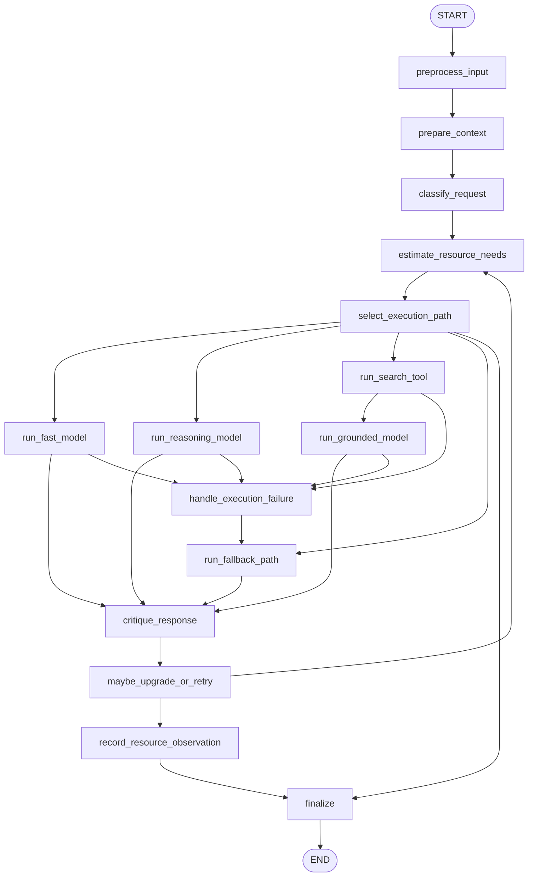

# 16: Resource-Aware Optimization (en)

## Pattern Summary

Resource-Aware Optimization lets an agent choose how much compute, time, money, data, and external service capacity to spend on a task. The chapter frames this as more than planning: instead of only sequencing actions, the agent must select execution paths that satisfy quality goals while staying within budget, latency, availability, and reliability constraints.

The central implementation pattern is a router that classifies a request, checks resource constraints, and selects an appropriate model, tool, context size, or fallback path. Simple work should use cheaper and faster resources. Complex reasoning, current-information requests, or high-value tasks may justify stronger models, retrieval, search, critique, retries, or additional computation. A critique step can evaluate answer quality and routing quality so the policy improves over time.

For the LangGraph example, implement a resource-aware question-answering router. The graph should classify each query, estimate required resources, prune context when needed, choose a model/tool path, track budget consumption, use fallback when a primary path fails or is unavailable, optionally critique the result, and produce a final answer with resource metadata.

## Pattern Explanation

### Conceptual Overview

Resource-Aware Optimization treats resources as first-class state. The agent does not always call the strongest model or every available tool. It asks what the task needs, what the user or system can afford, and what resources are currently available.

In Chapter 16, this includes dynamic model switching, adaptive tool selection, contextual pruning and summarization, proactive resource prediction, cost-sensitive multi-agent behavior, energy-efficient deployment, distributed-compute awareness, learned allocation policies, graceful degradation, and fallback mechanisms. The common idea is that every execution choice has a cost profile, and the agent should make that trade-off explicitly.

### Problem

Agentic systems can become too expensive, too slow, or too brittle when every request follows the same heavy path. A simple factual question should not consume the same model, context, tools, and retries as a complex multi-step reasoning task. Conversely, under-allocating resources to complex work can produce low-quality answers that require rework or human correction.

This pattern solves the mismatch between task complexity and resource use. It gives the graph a way to balance answer quality, cost, latency, reliability, and resource availability at runtime.

### When to Use

- Use this pattern when LLM, tool, search, or retrieval calls have meaningful cost differences.
- Use it when latency matters and some requests need a fast response more than a perfect response.
- Use it when the graph supports multiple model tiers, tool choices, context strategies, or fallback providers.
- Use it when requests vary widely in complexity, such as simple factual questions, reasoning tasks, and current-information searches.
- Use it when the agent has explicit budgets for tokens, money, wall-clock time, API calls, bandwidth, or energy.
- Use it when service reliability matters and primary models or tools may be unavailable, rate-limited, or filtered.
- Use it when feedback from critique or evaluation should refine routing decisions over time.

### When Not to Use

- Avoid this pattern when all requests require the same approved model and resource path for policy or quality reasons.
- Avoid it for tiny prototypes where routing, accounting, and fallback logic add more complexity than value.
- Avoid using cheap paths for tasks where errors are high impact and stronger review is mandatory.
- Avoid learned or adaptive routing when there is no reliable telemetry to evaluate routing decisions.
- Avoid over-optimizing for cost when user trust, safety, correctness, or compliance is the stronger requirement.
- Avoid fallback chains that silently change model behavior without recording the final model, cost, and quality implications.

### How It Works

1. The graph receives the user query plus resource constraints such as cost budget, latency target, token budget, and allowed tools or models.
2. A router classifies the task by complexity and need: simple, reasoning-heavy, current-information, tool-dependent, or unsupported.
3. The graph estimates the expected cost, latency, context size, and reliability of possible execution paths.
4. If the input or history is too large, the graph prunes or summarizes context before model execution.
5. A resource policy selects the cheapest acceptable path: a small model for simple answers, a stronger model for reasoning, search or retrieval for current information, or a degraded response when budgets are tight.
6. The selected model or tool path runs while recording estimated and actual resource consumption.
7. If the primary path fails because of timeout, rate limiting, provider unavailability, content filtering, or exhausted budget, the graph follows a configured fallback path.
8. A critique step can evaluate answer quality and routing choice. If the result is weak and budget remains, the graph may retry, upgrade the model, add search, or return a transparent degraded result.
9. The graph finalizes with the answer, model/tool path used, budget consumption, degradation or fallback status, and any critique feedback.

### Trade-offs

| Benefit | Cost or Risk |
| --- | --- |
| Reduces unnecessary spend by matching task complexity to model and tool cost. | Incorrect classification can route hard tasks to weak resources. |
| Improves latency by using faster paths for simple or time-sensitive requests. | Fast paths may produce less complete or less nuanced answers. |
| Supports graceful degradation when preferred models or tools fail. | Fallback behavior can change answer quality unless surfaced in output metadata. |
| Makes budgets, limits, and resource decisions explicit and testable. | Requires resource accounting, thresholds, and policy maintenance. |
| Can improve over time through critique and routing telemetry. | Feedback loops can reinforce bad routing if quality signals are noisy. |
| Enables edge, low-bandwidth, and constrained deployments. | Aggressive pruning or summarization can remove important context. |
| Helps multi-agent systems coordinate cost and workload. | Optimizing each local step can conflict with global workflow quality. |

### Minimal Example

```text
User asks: "What is the capital of Australia?"
  -> classify as simple
  -> check budget: low-cost path allowed
  -> use small fast model
  -> critique not required
  -> return answer with model=gpt-4o-mini and low estimated cost

User asks: "Compare the risk of two investment strategies under three scenarios."
  -> classify as reasoning
  -> check budget and latency
  -> use stronger reasoning model
  -> critique answer quality
  -> if critique passes, finalize with cost and latency metadata

User asks: "When does the Australian Open 2026 start?"
  -> classify as current-information
  -> run search if budget permits
  -> use search results with a capable model
  -> if search fails, fallback to a transparent cannot-verify response
```

### LangGraph Mapping

| Pattern Concept | LangGraph Element |
| --- | --- |
| User request and constraints | State fields `input`, `resource_limits`, and `allowed_capabilities` |
| Task complexity routing | Node `classify_request` and conditional edges from `select_execution_path` |
| Budget and latency accounting | State fields `resource_budget`, `resource_usage`, `candidate_paths`, and `deadline_ms` |
| Dynamic model switching | State fields `selected_model`, `model_tier`, and nodes `run_fast_model`, `run_reasoning_model` |
| Current-information path | Node `run_search_tool` followed by `run_grounded_model` |
| Contextual pruning and summarization | Node `prepare_context` and state field `compressed_context` |
| Adaptive tool selection | Node `select_execution_path` and state field `selected_tools` |
| Graceful degradation and fallback | Nodes `handle_execution_failure` and `run_fallback_path` |
| Critique agent feedback | Node `critique_response` and state fields `quality_score`, `routing_feedback` |
| Learned allocation telemetry | Node `record_resource_observation` and state field `routing_trace` |
| Final answer with transparency | Node `finalize` and state field `final_output` |

## LangGraph Implementation Goal

Build a LangGraph example of a resource-aware question-answering assistant. The user provides a natural-language query and optional constraints such as cost tier, latency target, token budget, and whether web/search tools are allowed. The graph classifies the query, chooses an execution path, tracks resource use, applies fallback when needed, critiques selected responses when useful, and returns both the answer and the resource decision trace.

The example should be runnable without real paid API or search calls in tests. Model and search execution should be wrapped behind injectable interfaces or deterministic fake functions. The production-facing shape can still mirror real providers by representing fast, reasoning, grounded-search, and fallback paths as model/tool adapters.

Expected workflow outcome:

- Simple questions use a fast, low-cost model path.
- Reasoning-heavy questions use a stronger model path when budget and latency allow.
- Current-information questions use a search or retrieval path only when that capability is allowed and the budget supports it.
- Oversized context is summarized or pruned before execution.
- Primary-path failures trigger a bounded fallback chain.
- Low-quality outputs can trigger one upgrade or retry if remaining budget permits.
- Final output includes answer text, selected path, resource use, fallback/degradation status, and routing feedback.

## State Shape

List the state fields the graph needs.

| Field | Type | Purpose |
| --- | --- | --- |
| `input` | `str` | Original user query or task description. |
| `context` | `list[dict]` | Optional conversation history, retrieved snippets, or supplied working context. |
| `compressed_context` | `str \| None` | Pruned or summarized context used to control token and latency cost. |
| `resource_limits` | `dict[str, Any]` | User or system limits such as max cost, max latency, max tokens, max tool calls, and allowed model tiers. |
| `resource_budget` | `dict[str, float]` | Remaining budget tracked by category, such as `cost_usd`, `tokens`, `tool_calls`, and `time_ms`. |
| `resource_usage` | `dict[str, float]` | Actual or estimated resource use accumulated during the graph run. |
| `deadline_ms` | `int \| None` | Optional latency target for the whole run. |
| `allowed_capabilities` | `list[str]` | Capabilities enabled for this run, such as `fast_model`, `reasoning_model`, `search`, `fallback`, and `critique`. |
| `classification` | `str \| None` | Routing class such as `simple`, `reasoning`, `current_info`, `tool_required`, or `unsupported`. |
| `complexity_score` | `float \| None` | Numeric estimate of task difficulty used by routing policy. |
| `freshness_required` | `bool` | Whether the answer requires current or external information. |
| `quality_target` | `str` | Desired quality level such as `draft`, `standard`, or `high`. |
| `candidate_paths` | `list[dict]` | Possible execution plans with estimated cost, latency, model/tool choices, and expected quality. |
| `selected_path` | `dict[str, Any] \| None` | Execution path chosen by the resource policy. |
| `selected_model` | `str \| None` | Model identifier used by the selected path or fallback path. |
| `model_tier` | `str \| None` | Model tier such as `fast`, `reasoning`, `grounded`, or `fallback`. |
| `selected_tools` | `list[str]` | Tools selected for the run, such as `search` or `summarizer`. |
| `search_results` | `list[dict]` | Search or retrieval results used for current-information answers. |
| `model_response` | `str \| None` | Raw response from the selected model path. |
| `quality_score` | `float \| None` | Critique score for the response, normalized from `0.0` to `1.0`. |
| `critique` | `dict[str, Any] \| None` | Critique details, improvement suggestions, and routing-quality observations. |
| `routing_feedback` | `dict[str, Any] \| None` | Structured feedback about whether the selected route was too cheap, too expensive, too slow, or adequate. |
| `fallback_chain` | `list[str]` | Ordered fallback path identifiers to try after primary failure. |
| `fallback_used` | `bool` | Whether any fallback path was used. |
| `degradation_reason` | `str \| None` | Explanation when the graph returns a reduced-quality or no-search answer due to constraints. |
| `errors` | `list[str]` | Recoverable validation, budget, tool, model, timeout, or parsing errors. |
| `routing_trace` | `list[dict]` | Auditable record of classification, budget checks, selected path, retries, fallback, and critique decisions. |
| `final_output` | `dict[str, Any] \| None` | User-facing answer plus resource metadata and transparency fields. |

## Nodes

| Node | Responsibility |
| --- | --- |
| `preprocess_input` | Validate non-empty input, normalize whitespace, initialize resource limits, resource budget, usage counters, trace, and allowed capabilities. |
| `prepare_context` | Prune or summarize supplied context when it exceeds the token or latency budget, preserving source metadata where possible. |
| `classify_request` | Classify the query as simple, reasoning-heavy, current-information, tool-required, or unsupported, and assign a complexity score. |
| `estimate_resource_needs` | Build candidate execution paths with estimated cost, token use, latency, model tier, tools, and expected quality. |
| `select_execution_path` | Choose the lowest-cost path that satisfies required freshness, quality, budget, latency, and capability constraints. |
| `run_fast_model` | Produce an answer using the cheap, low-latency model path for simple queries. |
| `run_reasoning_model` | Produce an answer using the stronger model path for complex or high-quality reasoning tasks. |
| `run_search_tool` | Retrieve current or external information when freshness is required and search is allowed. |
| `run_grounded_model` | Generate an answer grounded in search or retrieval results. |
| `handle_execution_failure` | Convert provider errors, timeouts, rate limits, budget exhaustion, or blocked tools into a structured fallback decision. |
| `run_fallback_path` | Execute the next configured fallback path or produce a degraded response when no fallback remains. |
| `critique_response` | Evaluate answer quality, factual fit to available context, and whether the routing choice was appropriate. |
| `maybe_upgrade_or_retry` | Decide whether to perform one retry, upgrade model tier, add search, or finalize based on critique and remaining budget. |
| `record_resource_observation` | Append resource usage, selected path, quality score, and routing feedback to the trace for later policy improvement. |
| `finalize` | Produce `final_output` with answer text, selected model/tool path, resource usage, fallback/degradation status, critique summary, and errors. |

## Edges

Describe the graph flow, including conditional branches.



Conditional edge requirements:

- Route from `select_execution_path` to `run_fast_model` when the request is simple and the fast path satisfies quality, budget, and latency constraints.
- Route from `select_execution_path` to `run_reasoning_model` when the request needs multi-step reasoning and the budget allows a stronger model.
- Route from `select_execution_path` to `run_search_tool` when freshness is required, search is allowed, and tool budget remains.
- Route from `select_execution_path` to `run_fallback_path` when the ideal path is unavailable but a configured fallback can still satisfy a minimum answer.
- Route from `select_execution_path` to `finalize` with an unsupported or budget-exhausted status when no acceptable path exists.
- Any model or tool failure should route to `handle_execution_failure`, not directly to a confident final answer.
- `maybe_upgrade_or_retry` may return to `estimate_resource_needs` at most once per run to avoid unbounded optimization loops.
- Critique-driven retries must check remaining budget before upgrading or adding tools.
- `record_resource_observation` must run before finalization for all non-validation paths.

## Inputs and Outputs

- Input: user query, optional context, optional resource limits, optional allowed capabilities, optional fake model/search outcomes for deterministic tests.
- Output: `final_output`, including answer text, classification, selected model/tool path, resource usage, fallback or degradation status, critique summary, and errors.
- Intermediate artifacts: compressed context, complexity score, candidate paths, selected path, search results, model response, quality score, routing feedback, fallback chain, and routing trace.

Example final output shape:

```json
{
  "status": "answered",
  "answer": "Canberra is the capital of Australia.",
  "classification": "simple",
  "selected_path": {
    "model_tier": "fast",
    "model": "gpt-4o-mini",
    "tools": []
  },
  "resource_usage": {
    "estimated_cost_usd": 0.001,
    "tokens": 220,
    "tool_calls": 0,
    "time_ms": 450
  },
  "fallback_used": false,
  "degraded": false,
  "quality_score": 0.92,
  "routing_feedback": {
    "route_was_appropriate": true,
    "reason": "Simple factual query fit the low-cost path."
  }
}
```

Example input shape:

```json
{
  "input": "Summarize this support conversation and suggest the next best action.",
  "context": "Customer reports intermittent Wi-Fi failures after a router update.",
  "resource_constraints": {
    "max_latency_ms": 1500,
    "max_cost_usd": 0.02
  }
}
```

## Failure Cases

Document expected failures, retries, fallback behavior, and human-review points.

- Blank input should fail in `preprocess_input` without model or tool calls.
- Missing or malformed resource limits should be replaced with safe defaults and recorded in `errors`.
- Unknown classification should route to a conservative standard path if budget allows, otherwise return a request for clarification.
- If the requested quality target cannot be met within budget, the graph should return a transparent degraded status rather than silently using an inadequate path.
- Search-required queries should not invent current facts when search is disabled, unavailable, or over budget.
- Tool or model timeouts should route through `handle_execution_failure` and try a bounded fallback path if available.
- Rate limits, provider unavailability, content filtering, or model errors should be recorded with the attempted model and fallback decision.
- Fallback chain exhaustion should produce a clear `fallback_exhausted` or `unavailable` status.
- Context pruning should not drop all user-provided context; if useful context cannot fit, return a clarification or degraded answer with the reason.
- Critique failure should not block a valid low-risk answer; record the critique error and finalize with `quality_score` unset.
- Low critique score should trigger at most one retry or model upgrade when budget remains.
- Resource accounting must never produce negative remaining budget; budget exhaustion should stop additional model/tool calls.
- Routing trace should not expose secrets such as API keys, provider credentials, or private raw tool payloads.

## Test Ideas

- Verify a simple factual query routes to `run_fast_model`, uses no tools, and produces low resource usage.
- Verify a reasoning query routes to `run_reasoning_model` when budget permits.
- Verify a current-information query routes through `run_search_tool` and `run_grounded_model` when search is allowed.
- Verify a current-information query with search disabled returns a degraded or cannot-verify response instead of fabricating freshness.
- Verify an oversized context triggers `prepare_context` and preserves a compressed context artifact.
- Verify budget exhaustion prevents expensive model/tool calls and records a transparent failure or degraded output.
- Verify primary model timeout or rate limit routes through `handle_execution_failure` and uses the configured fallback path.
- Verify fallback chain exhaustion produces a stable final status without looping.
- Verify a low critique score can trigger one upgrade or retry when remaining budget allows.
- Verify `maybe_upgrade_or_retry` cannot loop indefinitely.
- Verify `routing_trace` includes classification, selected path, budget checks, fallback decisions, critique results, and final resource usage.
- Verify final output contains `answer`, `classification`, `selected_path`, `resource_usage`, `fallback_used`, `degraded`, and `errors`.

## Open Questions

- The TOC logical range `231-245` does not align with the PDF labels where Chapter 16 text was found. The verified extraction used PDF indexes `245-260` / labels `246-261`.
- The TOC says Chapter 16 is 15 pages, but the extracted chapter-local counters run from `1` through `16`; page label `261` contains the end of Chapter 16, including conclusions and references, while Chapter 17 begins at label `262`.
- The chapter's hands-on examples mention Google ADK, OpenAI, Google Custom Search, and OpenRouter. The LangGraph implementation should keep provider calls behind adapters or fakes so tests remain deterministic and do not require network access.
