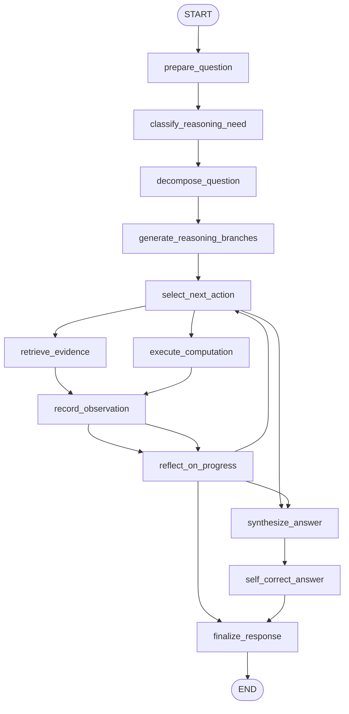

# 17: Reasoning Techniques (en)

## Pattern Summary

Reasoning Techniques make an agent spend deliberate inference effort on complex problems instead of producing a single-pass answer. The chapter presents reasoning as a family of methods that expose and structure intermediate problem solving: Chain-of-Thought (CoT) decomposes a task into steps, Tree-of-Thought (ToT) explores multiple paths, self-correction reviews and revises work, Program-Aided Language Models (PALMs) use code execution for symbolic work, and ReAct interleaves reasoning with external tool use.

The chapter also broadens reasoning beyond one agent. Chain of Debates (CoD), Graph of Debates (GoD), and Multi-Agent System Search (MASS) show how multiple agents or argument structures can critique and validate each other. Deep Research is presented as a practical long-running agentic workflow that repeatedly searches, reflects on gaps, refines queries, and synthesizes a cited report.

For the first LangGraph example, implement a bounded reasoning research graph. The graph should accept a complex user question, decompose it, explore several candidate reasoning or search paths, use local mock tools for retrieval and optional computation, reflect on missing evidence, revise the answer, and return a final response with a concise reasoning summary, supporting evidence, and budget metadata.

## Pattern Explanation

### Conceptual Overview

Reasoning Techniques turn an agent from a direct answer generator into a structured problem solver. Instead of asking the model to respond immediately, the workflow gives it a process: break the task into subproblems, decide what information is needed, gather or compute evidence, compare alternative paths, critique the draft, and finalize only after the answer is sufficiently supported.

Chapter 17 repeatedly ties this to inference-time compute. Harder tasks benefit from more "thinking time": more steps, more candidate branches, more tool calls, more reflection, or more agents debating the answer. The implementation should make that effort visible as structured state and metadata, while exposing only a concise user-safe reasoning summary rather than raw hidden model deliberation.

### Problem

Single-pass LLM answers are fragile for tasks that require multi-step logic, external evidence, calculation, planning, or correction after feedback. They can skip implicit assumptions, fail to notice gaps, hallucinate unsupported facts, or choose the first plausible path even when a better path exists.

This pattern solves the problem by making reasoning an explicit workflow. The graph allocates a bounded inference budget, records intermediate artifacts, routes between search, computation, reflection, and revision, and stops when the answer has enough support or when the budget is exhausted.

### When to Use

- Use this pattern when a task requires decomposition, multi-hop inference, or strategic planning.
- Use it when the agent must combine evidence from multiple sources or tool calls.
- Use it when calculation, code execution, or symbolic manipulation can verify part of the answer.
- Use it when a first draft should be reviewed for accuracy, completeness, clarity, or missing constraints.
- Use it when multiple plausible solution paths should be compared before finalizing.
- Use it when a long-running research workflow should identify gaps, run follow-up searches, and synthesize a report.
- Use it when latency and cost budgets allow extra inference-time work for higher answer quality.

### When Not to Use

- Avoid this pattern for simple factual or transactional requests that a direct answer can handle reliably.
- Avoid it when latency, token cost, or tool quotas are more important than extra deliberation.
- Avoid exposing raw chain-of-thought as a user-facing artifact; return concise rationale, evidence, and decision metadata instead.
- Avoid tool-using reasoning when tools are unavailable, untrusted, or not needed for the task.
- Avoid unbounded branch exploration, debate, or reflection loops without explicit stop criteria.
- Avoid using self-correction as a substitute for deterministic validation when structured rules or tests are available.
- Avoid multi-agent debate for low-stakes tasks where it only adds complexity and inconsistent outputs.

### How It Works

1. The graph receives a complex question and initializes a bounded reasoning budget such as maximum branches, search rounds, tool calls, and reflection rounds.
2. The agent decomposes the question into subquestions, constraints, assumptions, and likely evidence needs.
3. A branch generator creates one or more candidate reasoning paths, search plans, or solution strategies, reflecting the ToT idea of exploring alternatives.
4. For each selected branch, the agent chooses actions in a ReAct-style loop: retrieve evidence, run a calculation, inspect observations, and decide whether more information is needed.
5. A reflection step checks whether the current evidence answers the subquestions, identifies gaps or contradictions, and either routes back for another round or advances to synthesis.
6. The graph drafts an answer, runs self-correction against the original question and gathered evidence, and revises unsupported or incomplete claims.
7. The final step returns the answer, supporting evidence, concise reasoning summary, and metadata showing which branches, tools, and budget were used.

### Trade-offs

| Benefit | Cost or Risk |
| --- | --- |
| Improves answers for multi-step, evidence-heavy, or calculation-heavy tasks. | Adds latency, token usage, tool calls, and implementation complexity. |
| Makes reasoning artifacts testable through state, traces, and structured decisions. | Raw deliberation can be sensitive or misleading if exposed directly. |
| Enables backtracking and comparison across multiple solution paths. | Branching can grow quickly without strict budgets and pruning. |
| ReAct loops let the agent adapt to observations from tools and data. | Tool failures or low-quality observations can mislead later reasoning. |
| Self-correction catches missing constraints and unsupported claims before final output. | A model can critique superficially unless checks are grounded in evidence. |
| PALM-style computation improves reliability for math, code, and symbolic tasks. | Code execution requires sandboxing, validation, and deterministic tests. |
| Debate-style reasoning can reduce individual model bias. | Multi-agent workflows are more expensive and harder to evaluate. |

### Minimal Example

```text
User asks: "Compare classical and quantum computers and name one useful application."
  -> decompose into: differences, mechanisms, application
  -> create candidate paths: hardware comparison, information representation, application-first
  -> retrieve fixture evidence for bits, qubits, superposition, entanglement, drug discovery
  -> reflect: enough evidence for all subquestions
  -> draft answer
  -> self-correct: remove unsupported claims and keep answer concise
  -> return final answer with evidence and reasoning summary
```

### LangGraph Mapping

| Pattern Concept | LangGraph Element |
| --- | --- |
| Complex user task | State field `input` |
| Inference-time thinking budget | State fields `reasoning_budget`, `budget_used`, `max_reflection_rounds`, and `max_tool_calls` |
| Chain-of-Thought decomposition | Node `decompose_question` and state field `subquestions` |
| Tree-of-Thought branch exploration | Node `generate_reasoning_branches` and state field `candidate_branches` |
| ReAct thought-action-observation cycle | Nodes `select_next_action`, `retrieve_evidence`, `execute_computation`, and `record_observation` |
| PALM-style symbolic execution | Optional node `execute_computation` with an injectable local computation tool |
| Self-correction | Node `self_correct_answer` and state field `critique` |
| Deep Research reflection loop | Node `reflect_on_progress` with conditional routing back to evidence gathering |
| Evidence-grounded synthesis | Node `synthesize_answer` and state field `supporting_evidence` |
| Safe user-facing rationale | State field `reasoning_summary`, not raw hidden chain-of-thought |
| Stop criteria | Conditional edges based on `answer_ready`, `budget_exhausted`, and `needs_more_evidence` |

## LangGraph Implementation Goal

Build a LangGraph example of a reasoning research assistant for complex questions. The user provides a question plus optional configuration such as reasoning depth, maximum rounds, and whether computation is allowed. The graph decomposes the task, explores candidate reasoning paths, gathers evidence from deterministic mock retrieval data, optionally runs a local computation tool, reflects on gaps, revises a draft answer, and returns a final grounded response.

The example should not require network access. Retrieval should use an injectable in-memory knowledge base so tests can simulate enough evidence, missing evidence, contradictory evidence, and tool failures. Computation should be optional and local. The graph should demonstrate reasoning mechanics rather than depend on a live search API.

Expected workflow outcome:

- Simple but still multi-part questions can complete in one decomposition and retrieval round.
- Complex questions can trigger multiple reasoning branches and at least one reflection-driven follow-up round.
- Calculation or symbolic subquestions can route to a computation node.
- The final answer includes a concise reasoning summary, not raw internal chain-of-thought.
- The final state records evidence, observations, critique, selected branch, and budget usage.
- If evidence is missing or the budget is exhausted, the final output clearly marks the answer as partial or unsupported rather than inventing details.

## State Shape

List the state fields the graph needs.

| Field | Type | Purpose |
| --- | --- | --- |
| `input` | `str` | Original user question or task description. |
| `normalized_input` | `str` | Trimmed and normalized question used by prompts and tools. |
| `reasoning_depth` | `str` | Requested effort level such as `standard`, `deep`, or `minimal`. |
| `reasoning_budget` | `dict[str, int]` | Configured caps for branches, reflection rounds, tool calls, and computation calls. |
| `budget_used` | `dict[str, int]` | Counters for branch evaluations, reflection rounds, retrieval calls, computation calls, and model calls. |
| `subquestions` | `list[dict[str, Any]]` | Decomposed parts of the task, including evidence needs and whether computation is useful. |
| `candidate_branches` | `list[dict[str, Any]]` | Alternative reasoning paths, search plans, or solution strategies. |
| `selected_branch_id` | `str \| None` | Identifier of the branch currently being evaluated or chosen for synthesis. |
| `action_plan` | `list[dict[str, Any]]` | Planned ReAct-style actions such as retrieve, compute, compare, or finalize. |
| `next_action` | `dict[str, Any] \| None` | The next action selected by the planner. |
| `observations` | `list[dict[str, Any]]` | Ordered results from retrieval, computation, and reflection steps. |
| `supporting_evidence` | `list[dict[str, Any]]` | Evidence snippets or fixture records used to support final claims. |
| `contradictions` | `list[dict[str, Any]]` | Conflicting or low-confidence evidence found during reflection. |
| `knowledge_gaps` | `list[str]` | Missing evidence or unresolved subquestions. |
| `computation_requests` | `list[dict[str, Any]]` | Symbolic or numeric tasks prepared for the computation node. |
| `computation_results` | `list[dict[str, Any]]` | Validated outputs from the local computation tool. |
| `draft_answer` | `str \| None` | Initial synthesized answer before critique. |
| `critique` | `dict[str, Any] \| None` | Self-correction review covering accuracy, completeness, support, and clarity. |
| `revised_answer` | `str \| None` | Answer after critique-driven revision. |
| `reasoning_summary` | `str \| None` | User-safe concise rationale describing the major steps and evidence basis. |
| `answer_ready` | `bool` | Whether the graph has enough support to finalize. |
| `budget_exhausted` | `bool` | Whether configured reasoning or tool limits have been reached. |
| `status` | `str` | Lifecycle status such as `ok`, `partial`, `insufficient_evidence`, `tool_error`, or `invalid_input`. |
| `errors` | `list[str]` | Recoverable validation, retrieval, computation, or synthesis errors. |
| `final_output` | `dict[str, Any] \| None` | User-facing result with answer, evidence summary, reasoning metadata, and status. |

## Nodes

| Node | Responsibility |
| --- | --- |
| `prepare_question` | Validate non-empty input, normalize text, initialize budgets, counters, status, and empty artifact lists. |
| `classify_reasoning_need` | Decide whether the task needs decomposition, retrieval, computation, branch exploration, or direct finalization. |
| `decompose_question` | Break the task into subquestions, constraints, assumptions, and evidence requirements. |
| `generate_reasoning_branches` | Create alternative solution or search strategies and cap them by `reasoning_budget`. |
| `select_next_action` | Choose the next ReAct-style action for the active branch based on gaps, evidence, and budget. |
| `retrieve_evidence` | Query an injectable in-memory knowledge base and append validated observations and supporting evidence. |
| `execute_computation` | Run an optional local computation request for arithmetic, symbolic, or code-like subproblems and validate the result. |
| `record_observation` | Normalize tool outputs, update counters, detect contradictions, and attach observations to the active branch. |
| `reflect_on_progress` | Evaluate whether all subquestions have adequate support, identify gaps, and set `answer_ready` or `budget_exhausted`. |
| `synthesize_answer` | Draft an answer from supported evidence, computation results, and the selected branch. |
| `self_correct_answer` | Critique the draft against the original task, evidence, contradictions, and constraints, then produce a revised answer. |
| `finalize_response` | Build `final_output` with answer, status, concise reasoning summary, evidence list, gaps, and budget metadata. |

## Edges

Describe the graph flow, including conditional branches.



Conditional edge requirements:

- Route from `classify_reasoning_need` directly to `synthesize_answer` only when the input is valid, simple, and does not need retrieval, computation, or branch exploration.
- Route from `select_next_action` to `retrieve_evidence` when the next unresolved subquestion requires external or fixture-backed facts.
- Route from `select_next_action` to `execute_computation` when a subquestion is numeric, symbolic, or code-verifiable and computation is enabled.
- Route from `select_next_action` to `synthesize_answer` when no useful tool action remains and enough evidence exists.
- Route from `reflect_on_progress` back to `select_next_action` when gaps remain and budgets allow another action.
- Route from `reflect_on_progress` to `synthesize_answer` when `answer_ready` is true.
- Route from `reflect_on_progress` to `finalize_response` when the budget is exhausted before a supported answer can be synthesized.
- The graph must not exceed configured branch, reflection, retrieval, or computation budgets.
- Tool nodes must be injectable so tests can simulate success, missing evidence, contradictions, and failures.

## Inputs and Outputs

- Input: a complex natural-language question, optional `reasoning_depth`, optional budget overrides, optional in-memory knowledge base fixture, and optional flag enabling local computation.
- Output: `final_output`, including `status`, `answer`, `reasoning_summary`, `supporting_evidence`, `knowledge_gaps`, `contradictions`, `selected_branch_id`, `budget_used`, and `errors`.
- Intermediate artifacts: normalized input, subquestions, candidate branches, action plan, observations, computation requests and results, draft answer, critique, revised answer, and stop-condition flags.

Example successful output shape:

```json
{
  "status": "ok",
  "answer": "Classical computers use bits that are either 0 or 1, while quantum computers use qubits that can represent superposition states and exploit entanglement. One useful application is simulating molecular behavior for drug discovery.",
  "reasoning_summary": "The graph decomposed the comparison into representation, processing model, and application subquestions, retrieved supporting evidence for each, and revised the answer for completeness.",
  "supporting_evidence": [
    {
      "id": "kb_quantum_bits",
      "claim": "Classical computers use bits; quantum computers use qubits."
    },
    {
      "id": "kb_quantum_applications",
      "claim": "Molecular simulation is a common quantum computing application area."
    }
  ],
  "knowledge_gaps": [],
  "contradictions": [],
  "selected_branch_id": "branch_information_representation",
  "budget_used": {
    "branches": 2,
    "reflection_rounds": 1,
    "retrieval_calls": 2,
    "computation_calls": 0
  }
}
```

Example partial output shape:

```json
{
  "status": "partial",
  "answer": "I can compare the main computing models, but I do not have enough evidence in the configured knowledge base to support a specific application.",
  "reasoning_summary": "The graph found evidence for the comparison but exhausted the retrieval budget before resolving the application subquestion.",
  "supporting_evidence": [
    {
      "id": "kb_quantum_bits",
      "claim": "Classical computers use bits; quantum computers use qubits."
    }
  ],
  "knowledge_gaps": ["supported application of quantum computing"],
  "budget_used": {
    "branches": 1,
    "reflection_rounds": 2,
    "retrieval_calls": 3,
    "computation_calls": 0
  }
}
```

Example input shape:

```json
{
  "input": "Compare classical and quantum computers, then give one practical application of quantum computing.",
  "reasoning_depth": "standard",
  "allow_computation": true
}
```

## Failure Cases

Document expected failures, retries, fallback behavior, and human-review points.

- Blank input should fail in `prepare_question` with `status` set to `invalid_input` and no tool calls.
- Unsupported `reasoning_depth` values should fall back to `standard` or produce a validation error before graph execution continues.
- Missing evidence should produce `status` `partial` or `insufficient_evidence`, not fabricated claims.
- Contradictory evidence should be recorded in `contradictions` and either resolved by another retrieval round or disclosed in the final output.
- Retrieval tool failure should append an error, consume budget only for the attempted call, and allow synthesis only from existing evidence.
- Computation failures should be captured as structured errors and should not allow unvalidated numeric or symbolic results into the final answer.
- Budget exhaustion should terminate the loop and return the best supported partial result.
- Self-correction should remove unsupported claims; if the critique finds major unsupported content, the final status should not be `ok`.
- Branch generation should never create more branches than the configured maximum.
- Reflection should not loop indefinitely; each reflection round must increment `budget_used.reflection_rounds`.
- User-facing output should include a concise rationale and evidence metadata, not raw hidden chain-of-thought.
- If all candidate branches fail, `final_output` should explain the unresolved gaps and include diagnostic metadata for tests.

## Test Ideas

- Verify a complex comparison question decomposes into subquestions and reaches `finalize_response` with `status` `ok` when fixture evidence covers every subquestion.
- Verify a missing-evidence fixture triggers at least one reflection loop and then returns `status` `partial` when the budget is exhausted.
- Verify the graph caps candidate branches according to `reasoning_budget`.
- Verify a numeric question routes through `execute_computation` when computation is enabled.
- Verify computation is skipped or produces a controlled error when computation is disabled.
- Verify contradictory fixture evidence is recorded and prevents an unsupported `ok` answer unless resolved.
- Verify retrieval tool exceptions are captured in `errors` and do not crash the graph.
- Verify `self_correct_answer` removes claims not present in `supporting_evidence`.
- Verify `final_output` contains `answer`, `reasoning_summary`, `supporting_evidence`, `knowledge_gaps`, `budget_used`, and `status`.
- Verify no route can exceed `max_reflection_rounds`, `max_tool_calls`, or maximum branch count.

## Open Questions

- Page/index ambiguity: `docs/agentic-design-patterns-toc.md` lists Chapter 17 as logical pages `246-269`, but direct extraction found the chapter at PDF file pages `262-285`, zero-based indexes `261-284`. The requirement cites the logical range while documenting the extracted PDF indexes.
- The chapter's figures are extractable through `pypdf` mainly as captions (`Fig. 1: CoT prompt...`, `Fig.2: Example of Tree of Thoughts`, `Fig.3: Reasoning and Act`, `Fig. 4: MASS Framework`, `Fig. 5: Google Deep Research`, `Fig. 6: DeepSearch`, and `Fig. 7: Reasoning design pattern`). Diagram internals were not converted into requirements.
- The source chapter includes current product examples such as Deep Research offerings and a Google LangGraph quickstart. This requirement treats them as chapter examples only and designs the implementation to be local and deterministic rather than dependent on those external services.
- The chapter uses examples that expose internal Chain-of-Thought-style text. The implementation requirement intentionally exposes only concise rationale and structured evidence metadata to users while keeping intermediate reasoning artifacts as internal testable state.
