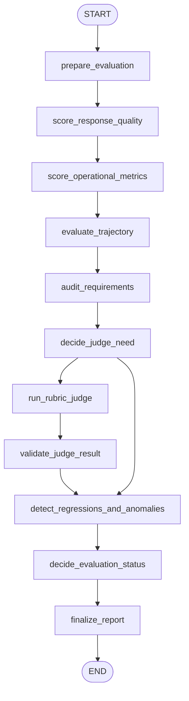

# 19: Evaluation and Monitoring (ko)

## Pattern Summary

평가와 모니터링은 구축/배포 후에도 에이전트의 효과성·효율성·정렬 상태를 지속적으로 측정하는 패턴입니다. 내부 목표 모니터링과 구분되는 바, 응답 품질, 지연 시간, 토큰 사용, 안전/컴플라이언스, 드리프트, 이상치, 트랙터리 품질, 다중 에이전트 협업 등 외부 지표를 정기적으로 봅니다.

장에서는 라이브 성능 추적, A/B 테스트, 컴플라이언스 감사, 드리프트/이상 탐지, 학습 진행 평가, 정밀도 채점, 지연/토큰 추적, LLM-as-a-Judge 루브릭, 트랙터리 평가, evalset/test file, ADK 기반 평가를 언급합니다.

첫 예제는 기록된 에이전트 실행(run) 하나를 채점하는 평가 하네스입니다. 실행기록, 기대 동작, 임계값, baseline을 받아 결정론적 품질·운영 지표를 계산하고, 선택적으로 모의 judge로 주관적 채점, 실제 트랙터리 비교, 드리프트/이상 탐지 후 보고서를 생성합니다.

## Pattern Explanation

### Conceptual Overview

평가는 “한 번 잘 나왔다”가 아니라 “항상 모니터한다”가 핵심입니다. 에이전트는 그럴듯한 답변을 하더라도 잘못된 도구를 쓰거나, 너무 느리거나, 과도한 토큰을 쓰거나, 정책을 위반할 수 있습니다.

챕터는 측정 층을 구분합니다. 지연·토큰·정확한 도구 호출 같은 정량 지표와 유용성·중립성 같은 정성 지표를 분리하며, 정량은 자동화 규칙으로, 정성은 판정자(judge)로 보강합니다.

### Problem

확률적 모델 특성상 동일 요청도 다른 출력이 가능합니다. 도구 경로가 깨지거나 배포 후 성능이 저하되어도 단일 통과/실패 테스트만으로는 탐지하기 어렵습니다.

이 패턴은 무엇을 측정할지 정의하고, 실행별 관측치를 수집해 기대 대비 편차를 찾고, 보고서를 통해 회귀·A/B·드리프트 탐지·감사·리뷰를 가능하게 합니다.

### When to Use

- 프로토타입을 넘어 재현 가능한 평가가 필요한 경우
- 품질, 정확성, 도움성, 중립성, 준수성 측정 필요
- 지연/토큰/비용 같은 운영 지표가 중요한 경우
- 도구 호출 순서가 정답성의 일부인 경우
- 모델/프롬프트/라우터 버전 비교가 필요한 경우
- 배포 환경 변화로 성능 저하 감시가 필요한 경우
- 다중 에이전트 협업 품질을 시스템 단위로 평가할 때
- 감사 보고·알림이 필요한 규제·고위험 워크플로

### When Not to Use

- 단발성 데모처럼 단순 assertion 하나면 충분한 경우
- 고위험 결정에서 judge-only 방식(보정/교차검증 없음)을 쓰는 경우
- 출력 텍스트 유사도만 단일 지표로 쓰는 방식
- 임계값·책임자·조치가 없는 감시(알림만 생성) 설정
- 개인정보 정책 없는 원문/출력/페이로드 수집
- 점수 해석을 진실의 근거로 오해

### How It Works

1. 실행 기록을 캡처(입력, 출력, 중간응답, 도구 호출, 지연, 토큰, 모델 버전, 정책 메타).
2. 기대 동작(정답, 기대 트랙터리, 루브릭, 임계값)을 로드.
3. 정확도/표준 유사도/키워드 커버리지/필수 출력 검사 등 결정론 지표 계산.
4. 운영 지표(경과시간·토큰·비용 추정) 계산.
5. 실제 트랙터리를 기대 경로와 비교(정확/순서/순서무관/precision-recall/단일 도구 모드).
6. 정성 판단이 필요하면 judge를 호출하고 구조화 출력 검증.
7. 임계값/베이스라인과 비교해 회귀·드리프트·이상치 탐지.
8. 최종 보고서에 통과/실패, 알림, 대응 제안 포함.

### Trade-offs

| 이점 | 비용/위험 |
| --- | --- |
| 단일 답변을 넘는 품질 측정 | 지표 설계 부담, 상태 증가 |
| 배포 전 문제 탐지(도구, 지연, 비용, 안전) | 오탐이 많으면 경보 피로도 증가 |
| A/B 및 버전 비교 | 트래픽/입력 분포 차이로 오해 가능 |
| 트랙터리 분석으로 잘못된 경로 탐지 | 엄격 비교는 대체 경로를 과도하게 배제 |
| Judge 스케일링 | judge 편향/불안정/실패 가능성 |
| 감사성 강화 | 로그 내 민감 정보 노출 위험 |
| 연속 모니터링으로 드리프트 감지 | 임계값 유지 보수 필요 |

### Minimal Example

```text
실행기록:
  user_input: "2층 화장실 기기 device_2를 끄기"
  actual_tools: [set_device_info(location="Bedroom", device_id="device_2", status="OFF")]
  final_output: "device_2를 끄는 동작을 수행했습니다."
  latency_ms: 820
  tokens: 143

기대 동작:
  required_tool: set_device_info
  expected_final_response: "device_2 상태를 off로 설정했습니다."
  latency_limit_ms: 1500
  token_limit: 300

흐름:
  -> 답변 품질 지표 계산
  -> 트랙터리 평가
  -> 지연/토큰 임계값 검사
  -> 필요 시 judge 실행
  -> 기준선 대비 회귀/이상치 탐지
  -> pass/fail 또는 알림 보고
```

### LangGraph Mapping

| 패턴 개념 | LangGraph 요소 |
| --- | --- |
| 기록된 실행 | `agent_run`, `actual_output`, `actual_trajectory`, `run_metadata` |
| 기대 동작/계약 | `reference_output`, `expected_trajectory`, `rubric`, `thresholds` |
| 응답 채점 | 노드 `score_response_quality`, 상태 `response_metrics` |
| 운영 모니터링 | 노드 `score_operational_metrics`, 상태 `operational_metrics` |
| 트랙터리 평가 | 노드 `evaluate_trajectory`, 상태 `trajectory_metrics` |
| judge 루브릭 | 노드 `run_rubric_judge`, 상태 `judge_result` |
| 드리프트/이상 탐지 | 노드 `detect_regressions_and_anomalies`, 상태 `baseline_metrics`, `drift_signals`, `alerts` |
| 컴플라이언스 감사 | 노드 `audit_requirements`, 상태 `audit_findings` |
| 최종 보고 | 노드 `finalize_report`, 상태 `evaluation_report` |

## LangGraph Implementation Goal

단일 run과 평가 계약을 받아 품질·운영·트랙터리·컴플라이언스를 점수화하고 구조화된 보고서를 산출하는 평가 하네스를 구축합니다.

외부 ADK/모니터링 서비스 호출 없이 로컬 결정론 코드로 동작해야 하며 judge는 주입/모의 구현을 사용합니다. 초기 버전은 1개 run 평가에 초점을 두고 추후 evalset/AB/생산 모니터링 확장 가능한 상태 필드를 둡니다.

예상 동작:

- run 기록과 평가 계약 존재 검증
- 정밀 지표·트랙터리·임계값 비교 계산
- 정성 기준 있을 때만 judge 호출
- 실제/기대 트랙터리 비교, baseline 비교로 경보 생성
- `evaluation_report`와 권장 조치 반환

## State Shape

| 필드 | 타입 | 용도 |
| --- | --- | --- |
| `input` | `str` | 평가 런의 식별명/설명 |
| `agent_run` | `dict[str, Any]` | 사용자 입력, 최종 출력, 중간 메시지, 도구 호출, 타임스탬프, 메타 |
| `actual_output` | `str` | 에이전트 실제 최종 출력 |
| `reference_output` | `str \| None` | 기대 최종 답변(있을 경우) |
| `actual_trajectory` | `list[dict[str, Any]]` | 실제 도구/행동 순서 |
| `expected_trajectory` | `list[dict[str, Any]]` | 기대 또는 허용되는 트랙터리 |
| `trajectory_match_mode` | `str` | `exact`/`in_order`/`any_order`/`precision_recall`/`single_tool` |
| `run_metadata` | `dict[str, Any]` | 지연, 토큰, 모델명, 프롬프트 버전, 환경 |
| `thresholds` | `dict[str, Any]` | score/지연/토큰/비용/안전 임계값 |
| `rubric` | `dict[str, Any] \| None` | 정성 평가 기준 |
| `baseline_metrics` | `dict[str, Any] \| None` | 이전/대조군 메트릭 |
| `response_metrics` | `dict[str, Any]` | 정확도·문자열 유사도·키워드·필수 출력 여부 |
| `operational_metrics` | `dict[str, Any]` | 지연/토큰/비용 및 임계 충족 |
| `trajectory_metrics` | `dict[str, Any]` | 일치 점수·누락/추가 액션·순서 위반·정밀도/재현율 |
| `judge_result` | `dict[str, Any] \| None` | judge 점수/근거/우려/권고 |
| `audit_findings` | `list[dict[str, Any]]` | 준수/안전/개인정보/계약 위반 탐지 |
| `drift_signals` | `dict[str, Any]` | 회귀·드리프트·이상치 신호 |
| `alerts` | `list[dict[str, Any]]` | severity, metric, reason, owner/action |
| `evaluation_status` | `str` | `passed`, `failed`, `warning`, `needs_review`, `invalid` |
| `errors` | `list[str]` | 검증/채점/judge/파싱/데이터 결손 오류 |
| `evaluation_report` | `dict[str, Any] \| None` | 최종 보고서 |

## Nodes

| Node | Responsibility |
| --- | --- |
| `prepare_evaluation` | 필수 입력 검증, 실행기록 정규화, 출력/트랙터리/메타 데이터/임계값 추출 |
| `score_response_quality` | exact-match, 문자열 정규화 유사도, 키워드 커버리지, 필수 항목 체크 |
| `score_operational_metrics` | 지연·입출력 토큰·비용 추정·임계값 확인 |
| `evaluate_trajectory` | 실제와 기대 트랙터리 비교 |
| `audit_requirements` | 안전/컴플라이언스/계약 검사 |
| `decide_judge_need` | judge 필요성 판정 |
| `run_rubric_judge` | 주입 judge 또는 모의 judge 호출 |
| `validate_judge_result` | 점수범위, 근거, 권고 검증 |
| `detect_regressions_and_anomalies` | 임계값/기준선 대비 회귀/드리프트/이상치 계산 |
| `decide_evaluation_status` | 전체 상태 종합 |
| `finalize_report` | 지표/실패/알림/근거/권장조치 포함 보고서 생성 |

## Edges



조건부 엣지:

- `prepare_evaluation`에서 실행기록 결손/형식 오류 시 `finalize_report`로 가며 `evaluation_status: invalid`
- judge가 필요하고 주관 기준이 있거나 결과가 불명확하면 `run_rubric_judge`
- judge가 불필요하면 `detect_regressions_and_anomalies`로 직접 이동
- judge 결과가 깨져도 오류 기록 후 진행은 계속되되 해당 항목은 `failed/needs_review`
- 회귀/드리프트/이상치 감지는 임계 초과/기준선 회귀/trajectory 이상에 대해 경고 생성
- 상태 집계는 정책 위반 > 무효 입력 > 경보 심각도 우선 순위로 결정
- 테스트에서 네트워크 호출 금지, judge는 주입/모의

## Inputs and Outputs

- Input: 실행기록, 참조 출력, 기대 트랙터리, 임계값, 루브릭, baseline, judge 응답
- Output: `evaluation_report`(상태, 지표 값, 트랙터리 결과, 감사 항목, judge 요약, 드리프트/이상 신호, 알림, 권장 조치)
- 중간 산출물: 정규화 run, 품질/운영/트랙터리 지표, 감사 결과, judge 결과, 경보, 오류, 상태

예시 입력 형태:

```json
{
  "agent_run": {
    "input": "Where is order 12345?",
    "final_output": "Order 12345 is currently in transit.",
    "tool_calls": ["lookup_order"]
  },
  "reference_output": "Order 12345 is in transit.",
  "thresholds": {
    "latency_ms": 1500
  }
}
```

예시:

```json
{
  "status": "failed",
  "summary": "응답 품질은 허용되지만, 도구 트랙터리가 필수 액션을 누락했고 지연이 임계값을 초과했습니다.",
  "metrics": {
    "response": {
      "exact_match": false,
      "keyword_coverage": 1.0,
      "passed": true
    },
    "operational": {
      "latency_ms": 1840,
      "latency_limit_ms": 1500,
      "total_tokens": 260,
      "passed": false
    },
    "trajectory": {
      "match_mode": "in_order",
      "passed": false,
      "missing_actions": ["set_device_info"]
    }
  },
  "alerts": [
    {
      "severity": "critical",
      "metric": "trajectory",
      "reason": "필수 도구 액션이 누락되었습니다."
    },
    {
      "severity": "warning",
      "metric": "latency_ms",
      "reason": "지연이 임계값을 초과했습니다."
    }
  ],
  "recommended_action": "릴리스 차단 후 라우팅을 점검하세요."
}
```

## Failure Cases

- `agent_run` 누락/형식오류는 judge 호출 없이 `evaluation_status: invalid`
- `reference_output` 누락은 전체 실패로 처리하지 않고, 트랙터리/운영 지표는 계속 계산
- exact-match는 동치 패러프레이즈를 대체할 수 없으므로 단독 판정 금지
- `expected_trajectory` 누락은 경로 점수를 생략하거나 `not_applicable` 처리
- 지원하지 않는 `trajectory_match_mode`는 오류 기록 후 `needs_review` 또는 `invalid`
- 지연/토큰/비용 메타가 없으면 `missing/estimated/measured` 상태 구분

## Test Ideas

- 기준이 충족되면 `status: passed/failed` 판단이 정확히 반영되는지 검증
- missing-evidence 대신 주관 judge가 필요한 케이스에서 judge 경로 유도 검증
- 임계값 위반, baseline 회귀, 트랙터리 오차 알림이 모두 emit되는지 검증
- 네트워크 없이 mock judge 결과만으로 report가 결정되는지 검증
- 기준선 대비 드리프트/회귀 판단이 알림과 추천 액션으로 이어지는지 검증
- `needs_review`/`invalid` 우선순위 정책이 적용되는지 검증
