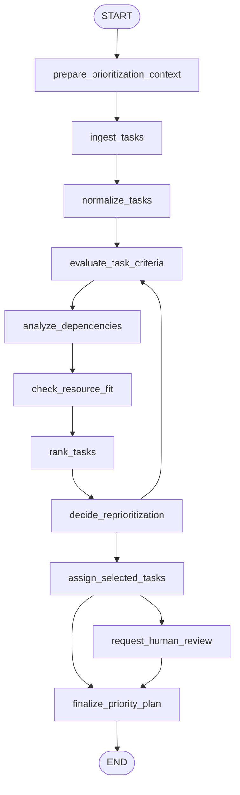

# 20: Prioritization (en)

## Pattern Summary

Prioritization gives an agent a structured way to choose what to do next when it faces many possible actions, conflicting goals, limited time, and constrained resources. Instead of treating every task as equal, the agent evaluates candidate tasks against criteria such as urgency, importance, dependencies, resource availability, cost versus benefit, and user preferences.

Chapter 20 presents prioritization as useful at several levels: high-level goal selection, sub-task ordering within a plan, and immediate action selection. The chapter's hands-on example is a project manager agent that creates tasks, assigns priority levels `P0`, `P1`, or `P2`, assigns workers, uses defaults when information is missing, and lists the resulting task board.

For the LangGraph example, implement a task triage and prioritization graph. The graph should accept new task requests, an optional backlog, worker availability, and scoring criteria; normalize tasks; evaluate criteria; rank tasks; assign the highest-priority work; and return a structured priority plan with rationale, warnings, and a human-readable task board.

## Pattern Explanation

### Conceptual Overview

Prioritization is the agentic pattern for deciding focus. In the chapter, an agent is not just executing a single instruction. It is operating in an environment where several tasks may compete for attention, some are time-sensitive, some unlock other work, and some cannot be completed because the right worker, tool, or information is unavailable.

The pattern makes the decision process explicit. The agent first defines or receives criteria, evaluates each candidate task against those criteria, ranks the candidates, and then selects or schedules the next work. Because real environments change, the agent must also be able to re-prioritize when a new critical event appears, a deadline changes, or resources become unavailable.

### Problem

Agentic systems can become inefficient or ineffective when they have no clear method for choosing the next action. They may spend resources on low-impact work, ignore urgent tasks, perform dependent tasks too early, or fail to adapt when circumstances change.

The Prioritization pattern solves this by turning task selection into an observable decision workflow. Candidate tasks are scored, dependency and resource constraints are considered, the next actions are chosen, and the resulting decision is recorded with enough rationale to inspect or test.

### When to Use

- Use this pattern when an agent must manage multiple tasks, goals, or actions at the same time.
- Use it when tasks have different urgency, importance, business value, or risk.
- Use it when dependencies matter, such as one task needing to be completed before another can start.
- Use it when resources are constrained, including workers, tools, time windows, budget, or context.
- Use it when a system needs to adapt to changing events, deadlines, alerts, or user preferences.
- Use it for project management, support ticket triage, cloud scheduling, cybersecurity alert handling, personal assistant scheduling, trading workflows, or other dynamic queues.
- Use it when the final output should explain why one task was selected over another.

### When Not to Use

- Avoid this pattern when there is only one task and no meaningful ordering decision.
- Avoid it when a fixed external scheduler already determines execution order.
- Avoid using a purely LLM-scored priority for safety-critical real-time control without deterministic constraints and independent validation.
- Avoid it when priorities are political, legal, ethical, or high-stakes and cannot be delegated without human review.
- Avoid complex weighted scoring when a small rule such as first-in-first-out or earliest-deadline-first is sufficient.
- Avoid dynamic re-prioritization when constant reshuffling would prevent any task from finishing.

### How It Works

1. Collect candidate tasks from a user request, existing backlog, system alerts, or agent-generated subgoals.
2. Define evaluation criteria such as urgency, importance, dependencies, resource availability, cost/benefit, and user preference.
3. Normalize task records so each task has an ID, description, status, optional deadline, optional assignee, and any known dependency or resource requirements.
4. Evaluate each task against the criteria using deterministic rules, an LLM extraction step, or a combination of both.
5. Detect blocked work, missing resources, invalid priority labels, dependency cycles, and tasks that need clarification.
6. Rank tasks into an ordered plan and map scores to priority labels such as `P0`, `P1`, and `P2`.
7. Select the next action or task sequence, optionally assigning work to available workers.
8. Re-run evaluation when a critical event, deadline change, resource change, or new user preference arrives.
9. Return a prioritized task board and rationale so the decision can be inspected, tested, or revised.

### Trade-offs

| Benefit | Cost or Risk |
| --- | --- |
| Helps the agent focus limited resources on the most critical work. | Requires criteria design, weights, and maintenance. |
| Makes task selection inspectable instead of hidden inside a prompt. | Scores can create false precision if criteria are vague. |
| Handles conflicting goals, deadlines, and dependencies more consistently. | Strict ranking can hide acceptable alternatives or local context. |
| Supports dynamic adaptation when circumstances change. | Frequent re-prioritization can cause churn and unfinished work. |
| Produces useful artifacts such as ranked boards, assignments, and rationale. | More state and validation are needed than in a simple task executor. |
| Can combine deterministic rules with LLM judgment for ambiguous requests. | LLM-based scoring can be inconsistent unless constrained and tested. |

### Minimal Example

```text
Input:
  "Create a task to implement a login system. It is urgent and should go to Worker B."

Backlog:
  TASK-001: Review marketing website content, no deadline, no assignee

Flow:
  -> create TASK-002 for the login system
  -> extract urgency: urgent
  -> map urgent/ASAP/critical to P0
  -> assign Worker B because the request names that worker
  -> score backlog tasks with default priority P1 if priority is missing
  -> rank TASK-002 before TASK-001
  -> return the updated task board and priority rationale
```

### LangGraph Mapping

| Pattern Concept | LangGraph Element |
| --- | --- |
| Candidate task intake | State fields `input`, `new_task_requests`, `existing_tasks`, and node `ingest_tasks` |
| Criteria definition | State fields `criteria_weights`, `priority_policy`, and node `prepare_prioritization_context` |
| Task normalization | Node `normalize_tasks` and state field `tasks` |
| Criteria evaluation | Node `evaluate_task_criteria` and state field `task_evaluations` |
| Dependency and resource checks | Nodes `analyze_dependencies` and `check_resource_fit` |
| Priority ranking | Node `rank_tasks` and state fields `ranked_tasks` and `priority_labels` |
| Dynamic re-prioritization | Conditional node `decide_reprioritization` and state field `reprioritization_reason` |
| Worker assignment | Node `assign_selected_tasks` and state field `assignments` |
| Human review or clarification | Conditional node `request_human_review` and state fields `warnings`, `errors`, and `needs_review` |
| Final task board | Node `finalize_priority_plan` and state fields `priority_plan` and `final_response` |

## LangGraph Implementation Goal

Build a LangGraph example of a project-management prioritization agent. The user supplies one or more task requests, an optional existing backlog, available workers, and optional priority criteria. The graph creates or updates task records, scores and ranks them, applies `P0`/`P1`/`P2` priority labels, assigns work when possible, and returns an ordered task board.

The implementation should use deterministic scoring for tests and allow an injectable model or parser for extracting task details from natural language. It should not replicate the chapter's LangChain `AgentExecutor`; instead, it should express the prioritization pattern as explicit LangGraph state transitions, nodes, and conditional edges.

Expected workflow outcome:

- New task requests are converted into structured task records with generated IDs.
- Urgency terms such as `urgent`, `ASAP`, and `critical` map to `P0` unless policy overrides them.
- Missing priority and assignee values receive documented defaults, matching the chapter's project manager example: default `P1` priority and default `Worker A` when available.
- Existing backlog tasks are included in the same ranking pass as new tasks.
- Dependencies and resource availability can block or lower a task's executable priority without deleting the task.
- The final response includes the ranked task list, selected next actions, assignments, decision rationale, warnings, and errors.

## State Shape

List the state fields the graph needs.

| Field | Type | Purpose |
| --- | --- | --- |
| `input` | `str` | Original user request or batch of task requests. |
| `existing_tasks` | `list[dict[str, Any]]` | Optional backlog before the graph runs. |
| `new_task_requests` | `list[str]` | Parsed or provided task request strings to create. |
| `tasks` | `list[dict[str, Any]]` | Normalized task records with ID, description, priority, assignee, status, deadline, dependencies, and resource needs. |
| `workers` | `list[dict[str, Any]]` | Available workers, skills, capacity, and current load. |
| `criteria_weights` | `dict[str, float]` | Weights for urgency, importance, dependencies, resource fit, cost/benefit, and user preference. |
| `priority_policy` | `dict[str, Any]` | Priority labels, defaults, urgency keyword mappings, tie-breakers, and review thresholds. |
| `environment_context` | `dict[str, Any]` | Current deadlines, incidents, resource changes, user preferences, and other dynamic context. |
| `task_evaluations` | `dict[str, dict[str, Any]]` | Per-task criterion scores, extracted signals, and rationale. |
| `dependency_graph` | `dict[str, list[str]]` | Task dependency relationships by task ID. |
| `blocked_tasks` | `list[dict[str, Any]]` | Tasks blocked by missing dependencies, missing resources, invalid data, or required clarification. |
| `resource_fit` | `dict[str, dict[str, Any]]` | Per-task worker/tool/resource availability and capacity checks. |
| `ranked_tasks` | `list[dict[str, Any]]` | Ordered tasks after score calculation, dependency checks, tie-breakers, and priority label assignment. |
| `selected_next_actions` | `list[dict[str, Any]]` | Tasks or actions chosen for immediate execution or assignment. |
| `assignments` | `list[dict[str, Any]]` | Worker assignments, default assignments, and reasons. |
| `reprioritization_reason` | `str \| None` | Reason a dynamic re-ranking was triggered, such as a critical event or deadline change. |
| `needs_review` | `bool` | Whether the result should be inspected by a human before execution. |
| `warnings` | `list[str]` | Non-fatal issues such as missing assignee, tied scores, or unavailable preferred worker. |
| `errors` | `list[str]` | Fatal validation or routing errors. |
| `priority_plan` | `dict[str, Any] \| None` | Structured final plan with ranked board, assignments, blocked tasks, and rationale. |
| `final_response` | `str \| None` | Human-readable summary of the prioritized task board. |

## Nodes

| Node | Responsibility |
| --- | --- |
| `prepare_prioritization_context` | Validate inputs, load default `P0`/`P1`/`P2` policy, default worker list, criteria weights, and tie-breakers. |
| `ingest_tasks` | Convert the user request and provided backlog into candidate task records. |
| `normalize_tasks` | Generate missing IDs, normalize descriptions, priorities, deadlines, assignees, dependencies, and status values. |
| `evaluate_task_criteria` | Score each task for urgency, importance, dependency impact, resource need, cost/benefit, and user preference. |
| `analyze_dependencies` | Build the dependency graph, identify blocked tasks, and detect dependency cycles. |
| `check_resource_fit` | Check whether required workers, tools, capacity, or information are available for each task. |
| `rank_tasks` | Combine criterion scores, dependency status, resource fit, and tie-breakers into an ordered task list with `P0`/`P1`/`P2` labels. |
| `decide_reprioritization` | Decide whether new context requires another ranking pass before assignment. |
| `assign_selected_tasks` | Assign the highest-priority executable tasks to available workers, using defaults when policy allows. |
| `request_human_review` | Mark tasks or plans that cannot be safely auto-prioritized because of ambiguity, conflicting critical tasks, or unavailable resources. |
| `finalize_priority_plan` | Produce the structured `priority_plan` and human-readable `final_response`. |

## Edges

Describe the graph flow, including conditional branches.



Conditional edge requirements:

- Route from `prepare_prioritization_context` directly to `finalize_priority_plan` when there is no input and no backlog, returning an empty plan with an explanatory warning.
- Route from `normalize_tasks` to `request_human_review` when task records are malformed beyond repair.
- Route from `analyze_dependencies` to `request_human_review` when a dependency cycle is detected.
- Route from `decide_reprioritization` back to `evaluate_task_criteria` when `environment_context` contains a new critical event, deadline change, resource change, or explicit user priority override that was not included in the previous score.
- Route from `assign_selected_tasks` to `request_human_review` when two or more `P0` tasks compete for the same unavailable resource or when policy forbids default assignment.
- Route from `assign_selected_tasks` directly to `finalize_priority_plan` when all selected tasks have valid priority labels and assignments or documented blocked reasons.
- The graph should not call network services in tests. Any model-based task extraction or scoring must be injectable or replaced with deterministic fakes.

## Inputs and Outputs

- Input: natural-language task request, optional existing backlog, optional workers, optional criteria weights, optional priority policy, and optional dynamic environment context.
- Output: `priority_plan`, including ranked tasks, priority labels, selected next actions, assignments, blocked tasks, warnings, errors, and rationale.
- Intermediate artifacts: normalized tasks, task evaluations, dependency graph, resource-fit checks, ranked task list, reprioritization reason, and assignment records.

Example output shape:

```json
{
  "ranked_tasks": [
    {
      "id": "TASK-002",
      "description": "Implement a new login system",
      "priority": "P0",
      "assigned_to": "Worker B",
      "score": 0.94,
      "rationale": ["urgent request", "explicit assignee", "high product impact"]
    },
    {
      "id": "TASK-001",
      "description": "Review marketing website content",
      "priority": "P1",
      "assigned_to": "Worker A",
      "score": 0.48,
      "rationale": ["default priority", "default assignee", "no blocking dependency"]
    }
  ],
  "selected_next_actions": ["TASK-002"],
  "blocked_tasks": [],
  "warnings": ["TASK-001 used default priority and assignee."],
  "needs_review": false
}
```

Example input shape:

```json
{
  "input": "Create a task to implement the login system. It is urgent and Worker B should own it.",
  "backlog": [
    {
      "id": "TASK-001",
      "description": "Review marketing website content"
    }
  ],
  "workers": ["Worker A", "Worker B"]
}
```

## Failure Cases

Document expected failures, retries, fallback behavior, and human-review points.

- Empty `input` with no `existing_tasks` should return an empty plan and a warning rather than failing silently.
- Invalid priority labels should be normalized only when policy permits; otherwise mark the task for review.
- Missing priority should default to `P1` when policy allows, and the default must be recorded in warnings or rationale.
- Missing assignee should default to `Worker A` only when that worker exists and has capacity.
- Urgency keyword extraction can be wrong for negated text such as "not urgent"; deterministic tests should cover this.
- Dependency cycles should stop automatic assignment and route to human review.
- A task blocked by unavailable resources should remain in the ranked list but be marked blocked rather than assigned.
- Tied scores should use deterministic tie-breakers, such as earlier deadline, higher importance, lower effort, then stable input order.
- Dynamic re-prioritization should have a maximum pass count to prevent loops when context keeps changing.
- Model-based extraction or scoring failures should fall back to deterministic parsing when possible and otherwise produce `needs_review: true`.
- Safety-critical domains such as autonomous driving or cybersecurity incident response require hard constraints that override weighted LLM judgment.

## Test Ideas

- Verify that an urgent login-system request assigned to Worker B becomes a `P0` task assigned to Worker B.
- Verify that a task with missing priority and assignee receives default `P1` and `Worker A` when policy allows.
- Verify that an existing backlog and a new urgent task are ranked together, with the urgent task first.
- Verify that a dependency blocks a task until its prerequisite appears as complete or executable.
- Verify that a dependency cycle routes to `request_human_review`.
- Verify that an unavailable preferred worker produces a warning and either selects another worker or requires review according to policy.
- Verify that dynamic context, such as a new critical outage, triggers one re-prioritization pass and moves the incident above routine work.
- Verify deterministic tie-breaking for tasks with equal scores.
- Verify the final state contains `priority_plan`, `ranked_tasks`, `assignments`, `warnings`, `errors`, and `final_response`.
- Verify tests use fake or deterministic parsers and do not require network access.

## Open Questions

- The TOC gives logical pages `307-316`, but the extracted chapter appears at PDF labels/file pages `325-334` and zero-based indexes `324-333`. The chapter boundary was determined from visible chapter headings, not by assuming the TOC logical pages are file indexes.
- The embedded code sample spans file pages `327-331`, but PDF extraction flattened indentation and line breaks. The requirement captures its architecture and behavior: task model, in-memory task manager, create/priority/assignment/list tools, `P0`/`P1`/`P2` priority labels, default `P1`, default `Worker A`, and two simulation scenarios.
- The visual summary figure on file page `333` was extractable only as the caption `Fig.1: Prioritization Design pattern`; no implementation-relevant diagram text was available from extraction.
