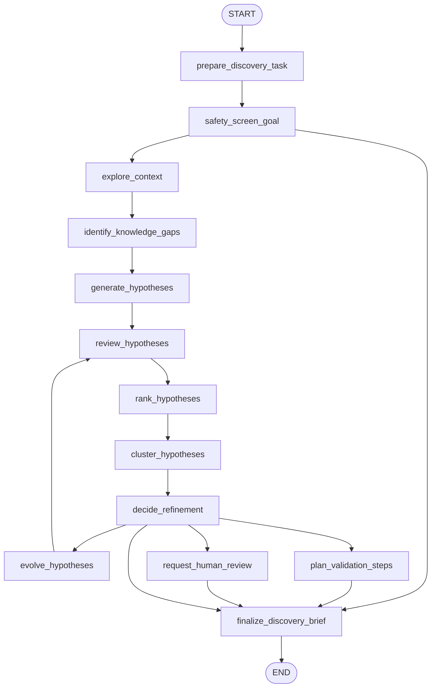

# 21: Exploration and Discovery (ko)

## Pattern Summary

탐색과 발견은 단일 응답 최적화가 아닌, “알지 못하는 것”을 찾아내고 가설을 넓히는 패턴입니다. 기존 해결공간 내 최적화가 아니라, 조사·실험·비교·개선으로 가능한 후보를 늘립니다.

과학 자동화, 전략 발견, 시장조사, 취약점 탐색, 창작, 교육 같은 개방형 도메인을 다루며, Google Co-Scientist/Agent Laboratory 예시로 다중 에이전트 협업을 제시합니다. 각각 가설 생성, 평가, 군집/선별, 진화, 인간 연구자의 감독을 수행합니다.

LangGraph 예제는 바운디드한 가설 발견 워크플로입니다. 목표와 제약, 안전 정책을 받아 후보 가설을 생성하고, 근거/타당성/위험성/명확성으로 리뷰 후 순위화·군집화, 진화시키며 검증 단계 제안까지 수행합니다. 테스트는 외부 검색 없이 mock model+로컬 근거로 진행합니다.

## Pattern Explanation

### Conceptual Overview

에이전트가 반응형으로 주어진 과제만 처리하지 않고, “무엇이 부족한가”를 계속 질문하며 후보를 넓혀 가는 모드입니다. 맥락이 완비되지 않은 과제에서 특히 유효합니다.

탐색은 서로 다른 관점의 에이전트가 서로 역할을 나눠 수행합니다(생성, 리뷰, 순위, 합성). 최종적으로는 사람의 검토가 개입해 과도한 추정을 제어합니다.

### Problem

개방형 문제는 정답이 하나로 정해져 있지 않습니다. 단일 패스는 정적 지식에 머물거나 뻔한 아이디어만 반복할 수 있습니다. 또한 근거 없는 추측과 유망한 가설을 구분하지 못합니다.

패턴은 맥락 정리 → 갭 탐지 → 다중 가설 생성 → 다각적 평가 → 정렬/군집 → 진화 → 인간 검토 가능 출력으로 구조화해 이 문제를 해결합니다.

### When to Use

- 문제 정의가 완전하지 않고 해법 공간이 넓은 경우
- 가설, 전략, 트렌드, 창의안, 새로운 가능성 생성이 필요할 때
- 후보 다양성이 필요하고 한 방향 고착을 피해야 할 때
- novelty/feasibility/safety 등 다중 기준 리뷰가 필요한 경우
- 전문가가 후보 비교/트레이드오프를 보고받아야 할 때
- 추가 지연·도구 호출이 허용되는 경우

### When Not to Use

- 정해진 질의에 대한 단순 정확 답변이 목표일 때
- 단순 검색/분류/우선순위가 충분한 경우
- 고위험 의료/보안/금융/물리 실험을 사람 승인 없이 자동 실행할 때
- 맥락/근거 소스가 빈약해 추측이 대부분일 때
- 지연/비용 예산이 낮은 실시간 작업
- 발견 가설을 사실로 착각하고 바로 실행할 때

### How It Works

1. 탐색 목표, 도메인, 제약, 맥락, 안전 경계를 설정
2. 목표를 안전 정책으로 사전 검사
3. 제공된 근거/컨텍스트에서 주제·갭·가정·미탐색 각도 추출
4. 다중 가설 집합 생성
5. novelty/타당성/근거/실현성/위험/명확성으로 가설 리뷰
6. 순위화 및 클러스터링으로 중복 제거와 다양성 유지
7. 상위 가설을 요약/재구성/도전/재프레이밍하여 진화
8. 품질 기준/반복 한도까지 반복
9. 최종 발견 브리프에 가설, 근거 링크, 제한사항, 위험, 다음 실험 제안 포함

### Trade-offs

| 이점 | 비용/위험 |
| --- | --- |
| 명확한 답보다 넓은 탐색 | 근거 불충분 시 허위 가설 위험 |
| 다중 관점 리뷰로 품질 향상 | 노드·상태가 늘어 디버그 난이도 증가 |
| 순위화/군집으로 가독성 개선 | 주관 점수 편향 가능성 |
| 반복 진화로 가설 개선 | 추가 호출로 지연/비용 증가 |
| 인간 루프에서 정렬 유지 | 자동화 속도 저하 |
| 안전 스크리닝으로 오남용 예방 | 과도한 필터는 정당한 탐색을 억제 |

### Minimal Example

```text
입력:
  research_goal: "B2B SaaS 온보딩 이탈 원인을 찾기"
  context:
    - activation analytics summary
    - support-ticket themes
    - product constraints

흐름:
  safety_screen_goal -> pass
  explore_context -> evidence and gap summary
  generate_hypotheses -> 8개 후보 생성
  review_hypotheses -> novelty/feasibility/근거 점수화
  rank_and_cluster -> 다양한 상위 후보 유지
  evolve_hypotheses -> 상위 3개 정제, 검증 실험 제안
  finalize_discovery_brief -> 결과 가설/실험/리스크/질문 제시
```

### LangGraph Mapping

| 패턴 개념 | LangGraph 요소 |
| --- | --- |
| 탐색 목표 | `input`, `research_goal`, `domain`, `constraints` |
| 안전 경계 | 노드 `safety_screen_goal`, 상태 `safety_policy`, `safety_findings`, 차단 분기 |
| 맥락 탐색 | 노드 `explore_context`, 상태 `seed_context`, `evidence_items`, `context_summary` |
| 갭 정의 | 노드 `identify_knowledge_gaps`, 상태 `knowledge_gaps` |
| 가설 생성 | 노드 `generate_hypotheses`, 상태 `candidate_hypotheses` |
| 피어 리뷰 | 노드 `review_hypotheses`, 상태 `review_results` |
| 순위/토너먼트 | 노드 `rank_hypotheses`, 상태 `ranked_hypotheses` |
| 군집/다양성 유지 | 노드 `cluster_hypotheses`, 상태 `hypothesis_clusters` |
| 진화/정제 | 노드 `evolve_hypotheses`, 상태 `evolved_hypotheses`, `iteration_count` |
| 전문가 개입 | 노드 `request_human_review`, 상태 `human_feedback` |
| 발견 산출물 | 노드 `finalize_discovery_brief`, 상태 `discovery_brief` |

## LangGraph Implementation Goal

개방형 목표에 대한 bounded 탐색 보조자를 구현합니다. 목표·제약·안전 정책·로컬 근거를 입력으로 받아, 가설을 생성·리뷰·순위화·클러스터링·정제 후 검증 계획까지 제시합니다.

외부 검색, 실험실 실행, 코랩/DB 호출 없이 `seed_context`/`evidence_items`를 입력으로 받고, 모델은 주입 가능한 mock로 고정합니다.

예상 동작:

- 목표 존재 및 범위 확인
- 유해/지원 불가 목표는 가설 생성 전 차단
- 맥락에서 주제·갭 추출
- 후보를 생성/리뷰/정렬/클러스터링 후 진화
- 저품질은 폐기 또는 1회 진화 루프
- 고위험/저신뢰/정책 민감 후보는 리뷰 요구
- `discovery_brief`는 가설, 근거, 가정, 한계, 위험, 다음 검증 단계 분리 표시

## State Shape

| 필드 | 타입 | 용도 |
| --- | --- | --- |
| `input` | `str` | 탐색 요청/요약 |
| `research_goal` | `str` | 탐색 목표 |
| `domain` | `str` | product/science/education/security/creative 등 |
| `constraints` | `dict[str, Any]` | 범위 제한, 금지 접근, 자원/일정 |
| `safety_policy` | `dict[str, Any]` | 비허용 목표, 고위험 도메인, 리뷰 트리거 |
| `seed_context` | `list[str]` | 초기 맥락/메모/요약 |
| `evidence_items` | `list[dict[str, Any]]` | source/claim/relevance/confidence |
| `context_summary` | `str` | 맥락 요약 |
| `knowledge_gaps` | `list[str]` | 가정/불확실성/미탐색 영역 |
| `exploration_questions` | `list[str]` | 다양화용 질문 리스트 |
| `candidate_hypotheses` | `list[dict[str, Any]]` | 가설 본문·근거·가정·위험 |
| `review_results` | `list[dict[str, Any]]` | 가설별 novelty/feasibility/impact/risk 점수 |
| `ranked_hypotheses` | `list[dict[str, Any]]` | 순위와 이유 포함 결과 |
| `hypothesis_clusters` | `list[dict[str, Any]]` | 유사군 묶음 |
| `evolved_hypotheses` | `list[dict[str, Any]]` | 정제/결합 가설 |
| `selected_hypotheses` | `list[dict[str, Any]]` | 최종 후보 |
| `validation_plan` | `list[dict[str, Any]]` | 다음 검증 실험/분석 제안 |
| `human_feedback` | `dict[str, Any] \| None` | 사용자/전문가 피드백 |
| `safety_findings` | `list[dict[str, Any]]` | 안전/윤리/오남용 발견사항 |
| `iteration_count` | `int` | 진화 반복 횟수 |
| `max_iterations` | `int` | 반복 상한 |
| `quality_thresholds` | `dict[str, float]` | novelty/feasibility/etc 최소값 |
| `needs_human_review` | `bool` | 리뷰 필요 여부 |
| `discovery_status` | `str` | `ready`, `blocked`, `needs_review`, `completed`, `failed` |
| `errors` | `list[str]` | 검증/파싱/안전/점수/증거 오류 |
| `discovery_brief` | `dict[str, Any] \| None` | 최종 출력 |

## Nodes

| Node | Responsibility |
| --- | --- |
| `prepare_discovery_task` | 필수 필드 검증, constraints/임계치 기본값 설정, 상태 초기화 |
| `safety_screen_goal` | 목표를 안전정책에 대조하여 차단/리뷰/경고 |
| `explore_context` | 컨텍스트를 정규화해 `evidence_items`, `context_summary` 생성 |
| `identify_knowledge_gaps` | 누락/불확실/약한 근거 영역과 탐색 질문 도출 |
| `generate_hypotheses` | 목표, 맥락, 갭, 제약 기반으로 다각 가설 생성 |
| `review_hypotheses` | 가설별 novelty/feasibility/evidence/safety/clarity 채점 |
| `rank_hypotheses` | 임계치 적용 후 정렬/거절 후보 표시 |
| `cluster_hypotheses` | 중복 억제를 위한 군집화 후 대표 후보 선별 |
| `decide_refinement` | 충분도 판단, 1회 진화, 리뷰 필요 또는 실패 결정 |
| `evolve_hypotheses` | 상위 가설 결합/단순화/도전/재프레이밍 |
| `plan_validation_steps` | 후보별 실험/분석/관측/사용자 실험 계획 |
| `request_human_review` | 고위험 후보나 분쟁 시 리뷰 경로로 |
| `finalize_discovery_brief` | 최종 브리프 작성 |

## Edges



조건부 엣지:

- `safety_screen_goal`에서 위험/비허용 시 `discovery_status: blocked`로 즉시 완료
- 안전상 저위험은 탐색 진행
- `decide_refinement`에서 통과 후보가 적고 반복 한도 미도달 시 `evolve_hypotheses`
- 임계치를 충족하고 다양성 유지되면 `plan_validation_steps`
- 분쟁, 낮은 신뢰, 도메인 리스크는 `request_human_review`
- 후보 소진 또는 반복 한도 도달은 `discovery_status: failed`로 최종
- 테스트 재현을 위해 모델/판정은 mock/주입형

## Inputs and Outputs

- Input: 탐색 목표, 도메인, 제약, 안전 정책, seed context, evidence, quality threshold, max iteration, human feedback
- Output: `discovery_brief` (상태, 최종 가설, 순위 요약, 근거, 가정, 한계, 리스크, validation plan, review 필요)
- 중간 산출물: context_summary, knowledge_gaps, exploration_questions, 후보, 리뷰, rank table, 클러스터, 진화본, 안전 이슈, 오류

예시 입력 형태:

```json
{
  "input": "Find promising product ideas for reducing support ticket volume in a B2B SaaS app.",
  "domain": "customer support automation",
  "constraints": ["low implementation cost", "no external data sharing"],
  "seed_context": "Most tickets are password resets, billing confusion, and onboarding questions."
}
```

예시:

```json
{
  "status": "completed",
  "summary": "온보딩 이탈 원인으로 3개 가설이 검증 후보로 선정되었습니다.",
  "selected_hypotheses": [
    {
      "title": "관리자 권한 부재로 설정 단계에서 이탈",
      "novelty": 0.66,
      "plausibility": 0.91,
      "evidence_refs": ["support-theme-admin-permissions", "analytics-step-3-dropoff"],
      "assumptions": ["지원 티켓 사용자가 이탈 집단을 충분히 대표한다."],
      "risks": ["지원 티켓이 없는 이탈자는 과소추정됨"]
    }
  ],
  "validation_plan": [
    {
      "hypothesis": "관리자 권한 부재로 설정 단계에서 이탈",
      "next_step": "역할/권한 상태별 설정 단계 이탈률 비교",
      "success_signal": "비관리자 사용자군의 drop-off가 통계적으로 유의하게 높음"
    }
  ],
  "safety_notes": [],
  "needs_human_review": false
}
```

## Failure Cases

- `research_goal` 누락은 `discovery_status: failed`, 하위 노드 호출 없음
- 위험/비허용 목표는 `discovery_status: blocked` 처리
- 고위험 도메인은 기본적으로 human review 필요 또는 policy override
- seed context가 비어 있거나 약하면 확신 없는 speculative 태그와 함께 낮은 근거 점수
- 모델 출력 malformed는 1회 재시도 후 `errors` 기록 후 리뷰/실패
- 유사 가설은 클러스터링/제외로 다양성 유지
- 심사자 이견은 집계 점수로 숨기지 않고 review 트리거
- 모든 후보 실패 시 최대 반복 후 실패 또는 리뷰로 종료
- 윤리/안전 이슈 가설은 제외/차단/리뷰로 처리
- 탐색 가설을 검증된 사실처럼 표현하지 않음

## Test Ideas

- 성공 경로에서 context 요약→생성→리뷰→순위/군집→진화→완료 브리프 확인
- unsafe goal은 `generate_hypotheses` 이전 차단
- goal 누락 시 하위 노드 미실행 검증
- 근거 희소 시 speculative limitation 표시 확인
- 중복 가설 병합/클러스터링 확인
- 낮은 점수 후보가 반복 횟수 내 진화 경로 타는지 검증
- 반복 한도 도달 시 failed 또는 needs_review 반환
- 리뷰 점수 불일치 시 `needs_human_review`
- malformed json/hypothesis parse가 errors에 저장되는지 검증
- 최종 상태에 `discovery_brief`, `selected_hypotheses`, `validation_plan`, `review_results`, `safety_findings` 포함 확인

## Open Questions

- 페이지/인덱스 모호성: TOC 논리 범위 `317-329`는 13페이지인데, 추출은 PDF 라벨 `335-348` 기준 14페이지입니다.
- 그림(Architecture/summary)은 캡션만 추출되어 내부 구조를 완전히 복원하지 못했습니다.
- Agent Laboratory 코드 예시는 평면 추출되어 스키마와 역할 흐름만 반영했습니다.
- 초기 구현은 저위험 도메인 가설발굴로 제한하며, 보안/의료/금융은 명시적 안전 정책 또는 인간 승인 없이는 동작하지 않도록 정책을 가져가야 합니다.
