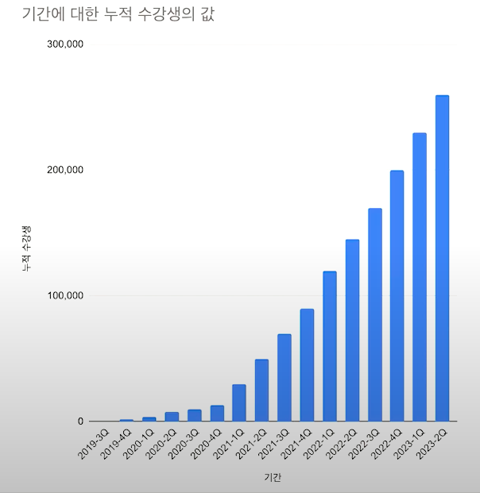

# 어느 날 고민 많은 주니어 개발자가 찾아왔다 2탄: 주니어 시절 성장과 고민들 | 인프콘2023

ref : https://www.youtube.com/watch?v=cePPOjCU7f4

- [어느 날 고민 많은 주니어 개발자가 찾아왔다 2탄: 주니어 시절 성장과 고민들 | 인프콘2023](#어느-날-고민-많은-주니어-개발자가-찾아왔다-2탄-주니어-시절-성장과-고민들--인프콘2023)
  - [영한님의 누적 수강생 수](#영한님의-누적-수강생-수)
  - [엔지니어의 성장은 크게 2가지](#엔지니어의-성장은-크게-2가지)
    - [기술적 성장 싸이클](#기술적-성장-싸이클)
    - [기술적 성장 관점에서 3가지 개발자 Leveling](#기술적-성장-관점에서-3가지-개발자-leveling)
  - [비즈니스 이해](#비즈니스-이해)
    - [큰 지도 만들기](#큰-지도-만들기)
    - [비즈니스 관점에서 개발자 Leveling](#비즈니스-관점에서-개발자-leveling)
    - [좋은 시스템을 설계하라면?](#좋은-시스템을-설계하라면)
  - [성장 부스팅 - 용기, WHY](#성장-부스팅---용기-why)
    - [약간의 용기 필요](#약간의-용기-필요)
    - [WHY](#why)
    - [커뮤니케이션 주의](#커뮤니케이션-주의)
    - [내가 리더라면 ?](#내가-리더라면-)
  - [성장과 환경](#성장과-환경)
    - [좋은 환경](#좋은-환경)
    - [안 좋은 환경](#안-좋은-환경)
  - [고민을 많이 해서 개발 속도가 안나는 사람](#고민을-많이-해서-개발-속도가-안나는-사람)
    - [개발 구조](#개발-구조)
    - [최적화](#최적화)
    - [아키텍처](#아키텍처)
  - [조급한 마음 거북이 마음 (원씽)](#조급한-마음-거북이-마음-원씽)

## 영한님의 누적 수강생 수  

  

- J커브를 그린다.  
- 근데 그 곡선이 4년이 걸린다.  
- 정말 꾸준하게 해야 한다.  
- 2년만에 개발 분야 전체 수강생 1위  

영한님의 장점  
- 기획자도 이해할 수 있을정도로 쉽게 이해 한다.  
- 대부분 주니어 개발자들은 영한님 강의를 듣고 공부한다.  
- 주니어 개발자 교육이 걱정인데, 그냥 영한님 강의를 추천한다.  
- 업계 전반의 수준이 올라간다.  

## 엔지니어의 성장은 크게 2가지  

1.기술 2.비즈니스  

### 기술적 성장 싸이클  

팀 기술 학습의 장점  
- 1.책이나 youtube를 보고 학습을 하고 
- 2.토이 프로젝트를 만들어 보고  
- 3.업계에 적용을 해본다.  

- 이론과 실습의 완벽한 조화   
- 잘 성장하는 주니어는 이 싸이클을 잘 활용 한다.   
- 팀 기술 > 업계 메인 기술 > 주변, 최신 기술로 확장 하자.   

### 기술적 성장 관점에서 3가지 개발자 Leveling  

1.기술 공부를 안하는 개발자.   
- 팀의 동작하는 코드를 보고 따라하는 개발자.   
- 팀에서 새로운 기술 도입을 꺼려한다.  
- 1년차 경험을 10번 반복하는 10년차가 정말 있다.  
2.기술 트렌드 찍먹 개발자.  
- 팀에서 사용하는 기술도 제대로 이해하지 못한 상태  
- 새로운 기술만 급급해서 도입한다. 기술의 깊이가 만들어지기 어렵다.  
3.팀 기술을 잘 이해하는 개발자.  
- 팀에서 사용하는 기술 역량을 잘 쌓아둔다.  
- 팀에서 신뢰와 기술 포인트를 쌓게 된다.  
- 팀에서 점점 중요한 업무를 맡게 된다.  
- 결과적으로 평가와 연봉에 반영

## 비즈니스 이해  

주니어 시절에 비즈니스의 중요도를 잘 이해하지 못하는 경우가 많다.  
- 퍼즐의 한 조각으로 일하는 느낌이 있었다.   
- 무조건 비즈니스 먼저 이해하고 정리했다. 그게 성장하는데 엄청 많은 도움이 되었다.  
- 기술을 학습하는데 시간을 들이는 만큼, 비즈니스도 투자를 많이 해야 한다.  

개발자가 비즈니스를 이해한다는 것은 뭔가 ?  
- 비즈니스와 개발이 어떻게 연결되어 있는지 이해하는 큰 지도를 그리는 것   
- 95%는 기존의 시스템에 온보딩 한다.  

### 큰 지도 만들기    

1.비즈니스 이해  
1.1 비즈니스에 대해 듣고 알아야 한다.  
- 기획자랑 많이 친해져서 반드시 알아야 한다.    
- 팀장님한테 계속 물어 봐야 한다.  
- 문서를 다 살펴야 한다.  

1.2 팀에서 만든 모든 피처를 사용해보기  
- 어드민 기능 하나하나 다 사용하기   
- 사용자의 기능 다 사용 해보기  
- 그래서 큰 그림을 그릴 수 있어야 한다.  

- *실수하는 것 : 내가 업무를 맡으면 그제서야 관련된 기능들을 사용해 본다.  
- 그러면 퍼즐조각처럼 취급되는 것  

2.비즈니스 구현 이해  

2.1 데이터 : 핵심 테이블(엔티티)를 확실하게 이해 해야 한다.  
- 핵심 필드 정리해야 한다.  
2.2 핵심 업무 프로세스 정리하기     
- 사람이 하는 업무 프로세스 정리하기  
- 컴퓨터 로직이 하는 업무 프로세스 정리하기  

### 비즈니스 관점에서 개발자 Leveling  

1.비즈니스 이해가 약한 개발자  
- 큰 그림에서 전체 상황을 이해하지 못함  
- 지도가 없으므로 어디까지 질문해야 할지를 잘 모름   
- 작업의 영향 범위가 어디까지 영향을 미치는지 파악이 어려움  
- 요구사항을 제대로 처리하지 못함  
- 중요한 메인 업무가 있을 때, 영향 범위를 잘 모르기 떄문에 실패할 가능성이 높음.  
- **더 큰 업무를 맡기기는 어려움 (팀의 서브 업무)**

- 안타깝게도 개발을 잘 해도, 일을 못하는 경우가 있다.  
- 배민에 처음 합류했을 때, 백단의 수백개의 로직을 모르고 그냥 갈아치우자 라고 말했다.  

2.비즈니스를 잘 이해한 개발자  
- 지도가 있으므로 어디까지 질문해야 할지를 잘 이해  
- 시간이 지날수록 전체 그림에 살을 붙여서 비즈니스와 아키텍처에 대한 이해도가 높아진다.  
- 큰 변경사항이 있어도 영향 범위가 어디까지 미치는지 이해 
- 큰 그림으로 전체 상황을 이해하기 때문에 영향도 이해, 아키텍처 변경도 가능  
- 조직에서도 더 큰 업무를 맡김 (팀의 메인 업무)  
- 도전적인 업무 가능  

### 좋은 시스템을 설계하라면?  

- 개발을 잘 하기 위해서는 비즈니스 이해가 필수  
- 비즈니스를 이해해야 좋은 아키텍처 설계 가능  
  - 아키텍처 설계는 트레이드 오프  
- 애플리케이션 아키텍처의 선택은 변경 가능성의 영향이 큼  

## 성장 부스팅 - 용기, WHY  

### 약간의 용기 필요  

비즈니스를 이해하는데는 3~6개월이 필요하다.  
- 중요한 일을 조금씩 해 나가야 한다.  
- 약간의 용기가 필요하다.  
- 과감하게 업무를 본인이 조금 

### WHY  

- 비즈니스 기반의 이해 + 기술적 이해도 필요  

- 근본적인 이유를 알아야 본질적인 답을 찾을 수 있다.  
- 기술이든 비즈니스든, 근본적인 이유를 알아야 올바른 대안 찾을 수 있다.  
- 그냥 해야 하는 것은 없다. 위에서 시켜한다 라는 것은 제일 안좋은 예다.   

*나에게 주는 가치들  
- 동기부여 : 어떠한 비즈니스적 가치를 만들지 기대를 해야 한다.  
- 기술적 역량 성장 : 왜 기술을 도입하고, 왜 코드를 이렇게 짜야 하지 ? 질문 많이 하기  
- 제대로 된 비즈니스 이해
- 제대로 된 기술 검증

### 커뮤니케이션 주의  
- 공격 어투 조심
- 기획자에게 
- 개발자에게 

- 기가막힌 마법의 단어 : '고민이 있습니다.', 
  - 존중하는 사람한테 할 수 있는 말.  
  - '질문이 있습니다.', '궁금한게 있습니다.'  

### 내가 리더라면 ?  

- 리더는 100번 질문해도 100번 대답할 준비가 되어 있어야 한다.  
- 왜 이 일을 해야 하는지 잘 풀어서 설명 해야 한다. ( 전후관계까지 설명  )    
- 팀장만 리더가 아니다. 모두가 리더다.  
- 기술,비즈니스 모두  

## 성장과 환경  

### 좋은 환경  
- 지금 좋다기 보다는 일하기 좋은 방향으로 바꾸어 나가려고 노력하는 조직  
- 내가 고민하고 생각하는 것들을 응원해주는 조직  

### 안 좋은 환경  
- 구지 바꿔야 하는 거야 ?, 엔지니어들에게 프로세스를 강조하고 도전하지 않게 만드는 조직  

## 고민을 많이 해서 개발 속도가 안나는 사람  

### 개발 구조  
- 항상 최대한 단순한 방법을 선택해서 실행하기  
- 뭔가 만들어야 개선점이 보인다.  
- 구체화와 추상화를 어려번 하면 답이 나온다.  

- 죽어도 목차가 안나온다.  
  - 구체적으로 글을 쓰고 나니까, 목차가 나오더라... 
  - 그래서 차라리 구체화,추상화 싸이클을 타라.  

### 최적화
- 어설픈 최적화가, 오버엔지니어링으로 확장이 굉장히 어렵다.    

### 아키텍처
- 아키텍처도 단순하게 시작해야 한다.  
- 우선은 간단하게 ~  

## 조급한 마음 거북이 마음 (원씽)  

- 인간은 컨텍스트 스위칭 비용이 굉장히 크다.  
- 번잡하게 하다보면 이도저도 안된다.  
- 한번에 하나씩 처리하자.  
- 차라리 거북이처럼 하나씩 제대로 1개 CPU로 전진하자.    

