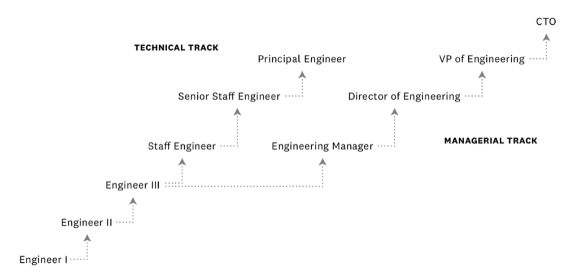

# 시니어 개발자로 성장하기  

- [시니어 개발자로 성장하기](#시니어-개발자로-성장하기)
    - [Job Lader](#job-lader)
    - [Expectations per level](#expectations-per-level)
    - [Roles](#roles)
  - [섹션 1. 성과 내기](#섹션-1-성과-내기)
  - [기대치 이해하기](#기대치-이해하기)
  - [완료하고 반복하기](#완료하고-반복하기)
  - [눈도장 찍기](#눈도장-찍기)
  - [결과물 정리하기](#결과물-정리하기)
    - [결과물 남기기에 대한 조언들](#결과물-남기기에-대한-조언들)
  - [섹션 2. 영향력 키우기](#섹션-2-영향력-키우기)
  - [역할을 맡기](#역할을-맡기)
  - [큰 일을 맡기](#큰-일을-맡기)
    - [큰 일을 맡은 후](#큰-일을-맡은-후)
  - [2.3 아이디어 제안하기](#23-아이디어-제안하기)
  - [다른 팀의 일들 도와 주기](#다른-팀의-일들-도와-주기)
  - [섹션 3. 소통하기](#섹션-3-소통하기)
  - [3.1 매니저와 소통하기](#31-매니저와-소통하기)
    - [매니저와 소통하기 - 좋은 주제들](#매니저와-소통하기---좋은-주제들)
    - [매니저와 소통하기 - 좋은 습관들](#매니저와-소통하기---좋은-습관들)
  - [4.좋은 습관들](#4좋은-습관들)
  - [4.1 측정하며 정리하기](#41-측정하며-정리하기)
    - [무엇을 측정해야 할까](#무엇을-측정해야-할까)
    - [기록하기](#기록하기)
  - [4.2 도움을 받기](#42-도움을-받기)
    - [필요한 연습](#필요한-연습)
    - [FYI: Google Community Guidelines](#fyi-google-community-guidelines)
  - [4.3 개인 기록 남기기](#43-개인-기록-남기기)
    - [개인 기록 남기기 - 개인 OKR (개인 성과 관리, Goal 작성)](#개인-기록-남기기---개인-okr-개인-성과-관리-goal-작성)
  - [4.4 이력서 갱신하기](#44-이력서-갱신하기)
    - [모르는 사람이 봐도 알 수 있게 정리하기](#모르는-사람이-봐도-알-수-있게-정리하기)
    - [갱신 주기 설정하기](#갱신-주기-설정하기)
  - [Q](#q)
    - [장기적인 커리어 관점에서 기술 vs 매니징 역량 중 뭐가 더 중요할까?](#장기적인-커리어-관점에서-기술-vs-매니징-역량-중-뭐가-더-중요할까)
    - [한국과 미국의 일 하는 환경](#한국과-미국의-일-하는-환경)
    - [프로모션은 언제 준비해야 할까요?](#프로모션은-언제-준비해야-할까요)

25년차 개발자 
- 한국 벤쳐기업에서 주니어 엔지니어로 시작  
- 텔레카라는 글로벌 기업과 ETRI 연구소   
- 2007년 구글의 한국 진출에 합류해서 한국과 미국 구글 본사에서 13년 정도 근무  
- 구글에서 테크 리드 역할과 people manager 역할   
- 2022년부터는 한국에서 뱅크샐러드에서 기술 이사 역할을 하며 senior management    

Roles: Software engineer / Tech lead (manager) / People manager / Product owner(or Product Owner) / Technical advisor / Leadership (senior manager) / Adiunct Professor  
- 다양한 Role을 가지고 계신것 같다.  
Domains: Embedded / Smartphone(s) / Consumer servic@ / Tech infrastructure / Big Data / Al / ...  
- 다양한 도메인들을 구분해서 정리 했다.  

큰 주제 : 성과내기 + 영향력 키우기 + 소통하기 + 좋은 습관 키우기  

### Job Lader  

https://www.levels.fyi/t/software-engineer

https://www.levels.fyi/blog/what-are-career-levels-ladders.html

  

- Engineer1 에서 시작한다.  
- 보통 시니어는 Engineer3 부터 말한다.  
- 테크니컬 Track, 관리/매니저 Track으로 나눈다.  

### Expectations per level

L4 
- Being independent, initiating a task
L5 - Senior software engineer
- Autonomous  
- Project management, leadership, impact
L6 - Staff software engineer
- Company-wide impact first
L7+
- Industry-wide impact   

*프로모션 : 이미 L5 일을 하고 있으니, 프로모션 기회를 달라 라고 말하기.  

### Roles

Tech Lead (TL)  
- 담당 영역에 대해 기술적 결정, 질문들에 대한 담당자
- Variations: Uber Tech Lead, Area Tech Lead

Engineering Manager (EM)  
- 일들의 우선 순위 정리
- 채용, 자원 관리
- reportee들의 정신 건강

Tech Lead Manager (TLM)  
- 50% TL, 50% EM
- ~ 7-10 9  

팀 : 공통의 목표와 성과가 정해지는 그룹  
팀장 : 책임을 질 수 있는 담당자, 잘하면 크레딧을 다 가져가고, 아니라면 질책을 모두 당할 수 있음.  

## 섹션 1. 성과 내기

## 기대치 이해하기

Software Engineer I Expectations
- Coding  
- Debugging and issue resolution  
- Quality assurance  
- Collaboration and learning  

Software Engineer II Expectations  
- Independent work - 기본적인 잣대   
- Coding and develoment  
- Design contributions  
- Debugging and code reviews  
- Mentoring and knowledge sharing  

Software Engineer III Expectations
- Project leadership   
- Design and architecture  
- Technical excellence   
- Mentoring and training  
- Product contribution - 프로젝트 아이디어 제안    

Senior Software Engineer Expectations
- Project ownership
- Besian and architecture
- Technical expertise
- Code quality

Staff / Senior Staff Software Engineer Expectations
- Technical vision
- High-impact projects
- Contribute to decision making
- Lead and manage teams
- Drive innovations

## 완료하고 반복하기  

주어진 일은 완료하고, 반복하자  
- 당연한 이야기, 완료와 반복
- 팀장이나 매니저가 신경 덜 쓰는 방향으로
- **신뢰 획득이 목표**

• 팁
- 여러 개의 환경을 다루어 병렬적으로 진행한다.  
- 리팩토링, 클린업, 유닛 테스트에 기여한다.  
- 매니저 모르게는 하지 않는다.  

## 눈도장 찍기  

좋은 일로 언급되기 - 예제

1.결과물 잘 만들기  
- code review , issue update 5    

2.팀의 사고에 빠른 대처  
3.많이 하면 더 눈에 띈다.  
4.Optional 인 미팅에 들어가서 견문을 넓힌다.  
- 할 수 있는 것들을 찾는다.  
- E.g. note-taking   

5.없는 일을 억지로 만들 필요는 없다.  
6.남으로 인해 자랑될 수 있는 것을 목표로  

## 결과물 정리하기  

코드 
- 저장소 기여자, 코드 리뷰어  
Tracked Issues  
- 이슈와 관련된 해결 사항들   
각종 문서들  
- OnePager, 각종 제안서, Design doc, 실험 리포트  
더 중요한 문서들 
- 회사 개발 블로그  
- 내 이름이 들어간 특허  

### 결과물 남기기에 대한 조언들  

언제 ?  
- context를 바꿀 때 ( 사람 혹은 기능이 업데이트 )  
- 주기적으로 업데이트  

어떻게 ?  
- 제목과 처음 반 페이지에 신경 많이 쓰기  
- 다른 신입이나 새로운 팀원이 보고 이해할 수 있게  
- 쉬운 언어와 reference 로  
- 실패한 경우에도 남겨라  
- 팀원들의 리뷰와 함께 ( 가급적 많이 )  

## 섹션 2. 영향력 키우기

## 역할을 맡기

어떠한 감투를 쓰거나, 혹은 비즈니스 기능의 담당자로 지정 받기    

다음 목표  
- 어떤 부분에 대해 담당자가 되어
- 나를 찾는 사람이 생기게 하고
- 더 많은, 좋은 동료들을 만들자.

방법 / 팁
- 잘 할 수 있는 영역에서
- 매니저와 팀원들의 지원 하에
- eg. 운영을 맡으면서 유지 보수 등의 담당이 되어  
- e.g. 툴과 문서들에 이름을 넣자.

긍정적 효과 -> 영향력 확대
- 능동적, 주도적으로 문제와 과제를 접근하게 됨
- 제품, 동료, 회사에 영향력을 주는 것을 연습
- 상대방의 입장에서 협업 기회를 연습

챌린지
- 순수 개발 이외의 영역에 시간과 에너지가 사용됨 (시간관리 잘해야함)  
- 인터럽트에 노출 됨 (코어 타임이 필요할 수)  

## 큰 일을 맡기  

- 큰 일 = 더 많은 역할   
- 대답할 수 있는(or 대답해야 하는) 질문이 많아지고  
- 만나는 사람이 많아짐  
- 팀장과 팀원들의 동의 필요  
- Autonomous 기대 (알아서 일이 진해이 되고, 어느순간 끝나 있더라)  

### 큰 일을 맡은 후
- 일이 더 많아짐
- 더 많은 책임감
- 시간 관리가 더 중요해 짐.
- 사소한 팁들
  - 더 많은 기록 남기기 (말보다는 문서가 주는 효과가 크다.)  
  - 팀장과 매니저의 시간을 더 확보해 주자.  
  - 다른 멤버들을 이용하자. E.g. 주고 받기

## 2.3 아이디어 제안하기  

협업에서의 아이디어    

언제, 어떤 아이디어를 ?
- 답보다는 질문을 하기, 제안을 하기  
- 문제점과 개선절을 명확하게 할 수 있는 것으로  
- 내가 할 수 있는 것들 위주, 내 제안은 내가 진행하기  
- 주변의 지지를 받을 수 있는 것들로  

어떻게?
- 적극적으로
- 생각 날 때마다
- 문서로 남기면 좋음 - one pager
- 피드백 받고 몇 번 polishing 하고, 공유하기

주의할 점  
- 상호 존중
- 상처 받을 필요 없음

## 다른 팀의 일들 도와 주기

---

## 섹션 3. 소통하기

## 3.1 매니저와 소통하기

### 매니저와 소통하기 - 좋은 주제들  

- 내가 잘 하고 있나요?   
- 여기서 막혀 있는데, 어떻게 당신이 도와 줄 수 있나요?  
- 여기서 막혀 있는데, 어떻게 회사가 도와 줄 수 있나요?  
- 내가 **당신을 위해** 어떤 걸 하면 될까요 ?  

Aggressive
- 내가 어떻게 하면 promotion 으로 갈 수 있나요?  
- 내가 어떻게 하면 당신이 promotion 할 수 있나요? 
- *서로 윈윈할 수 있는 전략을 취해야 한다. 
- 예) 매니저의 일을 50% 분담한다, 대신 매니저가 다른 업무로 성과를 낼 수 있도록 돕는다.   

### 매니저와 소통하기 - 좋은 습관들  

- 매니저가 뭘 할 수 있는지를 이해하고
- 정기적 미팅과 비정기적 미팅 구분해서 하기
  - 정기적 미팅은 가급적 유지
  - 1-2주에 한 번?
- 직접적인 업무 이외의 내용들 위주로  
- 노트를 남기기
- 커피, 산책 등
- Action item 을 주고 받기
0 굳이 업무 내용이 아니더라도

동료 팀원과 소통하기

다른 팀원과 소통하기

---

## 4.좋은 습관들

분기말에 한번에 정리하는것은 좋지 않다.  
- 프로젝트 작은 단위마다 측정하는게 좋다.  

## 4.1 측정하며 정리하기   

### 무엇을 측정해야 할까

1.운영 메트릭 측정  
- 응답 시간, 에러율, 트래픽  
- MAU, DAU  

2.코드 품질 지표
- 복잡도 
- 테스트 커버리지  
- 기술 부채

3.팀 프로세스
- 리드 타임
- 작업 효율성
- 이슈 처리 속도
- *예) oo기능으로 업무 프로세스 xx 시간 단축  

4.프로젝트 진행 상황
- 빌드 시간  
- timelines  

5.별도의 리포트
- 실험 리포트  
- 고객 만족도  

### 기록하기

이력서에 남길 수 있는 내용들을 모으기  
- 팀의 활동으로 기록하여 주간리포트에 반영하기, 동료평가 좋음   
- Impact을 정의하고 정리하기  
- 새로운 툴을 사용했다면 이를 적기   
- 장애 해결 경험 등, 회사에 교훈이 되는 내용도 괜찮음  
- 이러한 기록물들은 추후 의사결정, 설득, 코드 리뷰에 사용된다.  

- 안 쓰는 걸 만들지는 말자.   
- 다른 사람들이 보고 이해하지 못하면 도움 되지 않음   

## 4.2 도움을 받기  

모든 일을 다 혼자할 수 없다.  
- 그래서 도움을 받는 훈련도 해야 한다.  

긍정적 도움의 예  
- 개발자가 그림을 그리고 있을 때 디자이너의 도움  
- 비개발자의 단순 반복적인 작업들을 위한 개발 보조 도구  
- 당번 순번 조절  

### 필요한 연습  
- 어떤 도움이 필요한 지 파악하기  
- 회사의 리소스를 컨트롤 할 수 있는 매니저를 이용 - 적절한 인재를 소개 부탁, 소통, 칭찬  
- 각자의 미팅 시간을 조절 하되, 부탁한 사람의 시간을 맞추어야 한다. (배려)  

### FYI: Google Community Guidelines  

• Summary  
- Be responsible. 여러분의 말과 행동은 중요합니다. 자신의 말과 행동에 책임을 져야 합니다.    
- Be helpful.  여러분의 의견은 많은 도움이 됩니다. 생산적인 의견을 내 주세요.  
- Be thoughtful.  여러분의 발언은 의도와 상관없이 Google의 입장으로 인식될 수 있으므로 상대방이 오해할 수 있는 발언을 하지 않도록 주의해야 합니다.  

1.When communicating, follow the three Google Values.  
- Respect the user.  
- Respect the opportunity.  
- Respect each other.  

[community-guidelines](https://about.google/community-guidelines/)

## 4.3 개인 기록 남기기  

문서들을 습관으로 남기면 큰 도움이 된다. 복리의 효과가 있다.  
Don't  
- 평가 시즌에 몰아서 하지 말자.  
- 잊어 버리기 전에 모아 둔다.  
- >과제의 스프린트 사이클에 맞추어서 갱신하면 좋다.   

### 개인 기록 남기기 - 개인 OKR (개인 성과 관리, Goal 작성)  

1.분기 별 작성
- (팀 OKR Or KPI 에서 발췌)
- 중간에 한 번 체크 : 1주~2주 마다 progress 체크하여 마감까지 완성할 수 있는지 체크하기  
- 개인 grading : 스스로 점수를 매기기  
- 업무 이외의 것도 포함 : 자기계발, 건강관리 업무등도 10%정도 비중으로 두고 작성을 한다.  

2.매니저와 공유 추천  
- 중간중간 피드백, 공유 하기  

## 4.4 이력서 갱신하기  

### 모르는 사람이 봐도 알 수 있게 정리하기   

- 대외용을 기준으로 작성하자. 전배가 있다면 사내 기밀정보를 담을 수 있는 정보도 좋다.(사내용)  
- 팀의 일과 나의 일을 구분해서 작성을 해야 한다.  
- Impact 위주로 추가하기   

### 갱신 주기 설정하기  
- 큰 프로젝트 정리할 때  
- 분기 별 한 번  

## Q

### 장기적인 커리어 관점에서 기술 vs 매니징 역량 중 뭐가 더 중요할까?  

둘 다 중요하다.  
- 향후 10~20년을 생각해보면 모두 챙겨야 하는 역량이다.  

### 한국과 미국의 일 하는 환경  

매니저의 performance을 올리라는 주문은 당연히 있다.  
- 이때, 자발적이고, 공격적인 업무를 하고, 성과의 양을 비교할때 차이가 많이 난다.  

### 프로모션은 언제 준비해야 할까요?  
- 매니저와 계속 '언제'라는 이야기를 했다.  
- 한국의 경우 감투를 먼저 주고 일을 시키는 경우도 있다.    
- 기약보다는 보상의 형태이다.   
- 주변 사람들이 인정할 만한 성과가 있어야 한다.  

