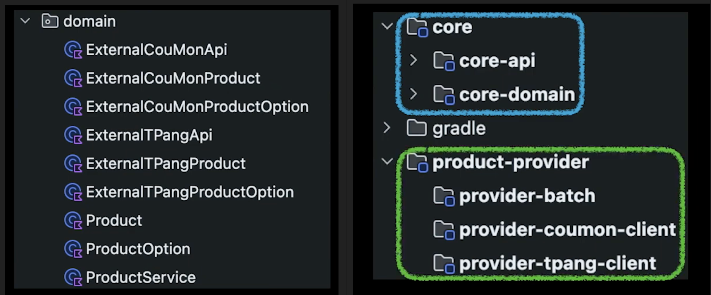

# 개발자의 사고력 - 격벽

## 지속 성장 가능한 설계를 만들어가는 방법 | 인프콘2024
>https://www.youtube.com/watch?v=HCB8jgAfG44  

- 핵심 키워드 : 개념과 격벽  
- 주제 : 설계를 하지 않는것이 설계를 잘하는 방법  

## 개념, 격벽  
개념 : 웹툰하면 떠오르는 도메인 지식, 비즈니스 로직들 
  - 예) PD, 작가, 연재, 랭킹, 작품, 독자, 포인트, 구매, 소장과 만료, 추천, 리뷰, 찜    
  - 상태 : 개념안에 존재하는 값    
  - 행위 : 개념에서 행위를 통해 상태가 변경되거나, 새로운 개념이 만들어진다.    

격벽 : 개념들을 그룹으로 묶고 벽처럼 격리하는 경계   
- 개념과 격벽을 잘못사용하면? : 포인트 서비스를 수정했는데, 페이먼츠, 리뷰 서비스 등 추가로 수정할것이 생긴다.  
- 상태는 개념이 아니다. 개념안에 상태가 존재하는 것이다.  
- 개념이라고 생각했던것이 행위로 판명이 되면 지운다.    

주의할 점
- 하나의 개념이 많이 쓰이면 분리를 검토하자.  
- 상태에 의해 개념이 생기면 격벽을 세워보자.  
- 처음에 상태나 행위를 개념으로 정의할 수 있다.   

### 예) 사례 1: 대출 서비스 (개념을 너무 크게 잡았을 때) 

문제 1: 처음엔 '대출'이라는 큰 개념 안에 '신청', '실행', '상환'을 모두 넣었습니다. 그랬더니 코드가 너무 복잡하게 얽혔습니다.
- 해결 1: '신청', '실행', '상환'은 '대출'의 하위 기능이 아니라, 각각 독립적인 '개념'으로 분리했습니다.

---

문제 2: '상환' 개념에 '상환 실패' 시 '재시도', '추가 이자' 기능이 자꾸 붙었습니다. '상환'이 너무 비대해졌습니다.
- 해결 2: '상환'과 '상환 실패 이후' 사이에 격벽을 쳤습니다.
  - '상환' 개념은 '성공/실패'까지만 책임집니다.
  - '재시도', '추가 이자' 등은 '연체'라는 새로운 개념을 만들어 넘겼습니다.
- 교훈: 하나의 개념이 너무 많은 일을 하거나, 특정 '상태'(예: 실패) 때문에 복잡해지면, 개념을 분리할 때입니다.

- 상환이 영원히 끝나지 않는 상태가 의심스러움 -> 격벽을 세워 연체라는 개념 분리  

- 연체라는 개념으로 처리  

### 예) 커머스  

외부연동사 API는 개념이 아니다. 내부에서 다뤄질 수 없는 침범 불가능한 영역이다.  
- 그래서 외부의 영역은 핵심 비즈니스가 아닌 영역과 분리하고 격리한다.   

  
  
- Before > After  

### 인정해야 하는 것  
- 1.요구사항은 계속 변한다.  
- 2.완벽한 설계는 없다. 그것은 죽어가는 소프트웨어 이다.  
- 3.소프트웨어는 유연해야 한다.  

요구사항을 바탕으로 설계를 하지 말고 구현을 바로 진행한다.  
- 개념과 격벽으로 테스트 코드를 작성한다.  
- 증명하고 피드백 받아 수정하면서 자연스럽게 설계가 된다.  

지속 성정 가능한 설계를 만들어나가는 방법
- 개념을 잡고, 격벽을 세워 구현을 채워나가 설계를 완성한다.  