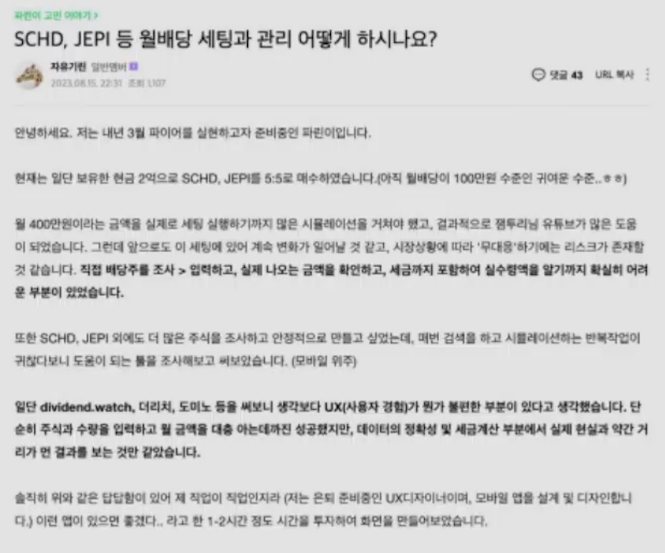

# 롤모델:조쉬  

- 1인 디자인 에이전시 Joshua  
- 솔로프리너 글쓰기 클럽  
- 솔로프리너 커뮤니티 운영  
- *솔로프리너 컨퍼런스 / 솔로프리너 Youtube      

## 📌 뉴스레터 시작  

1.자료 리서치를 정말 정말 열심히 했다.   

2.글쓰기에 혼신의 힘을 넣은 과정이 있다.  

3.뉴스레터를 통해서 오디언스 빌딩을 진행  
- 한주 150-200 명 구독  
- 똑똑한 오디언스들이 모임   
- *회사에서는 1개의 재능만 원했다. 사업에서 글쓰기와 디자인의 2개의 재능을 조합하니 세상이 완전히 바뀌었다.  

## 📌 월배당 관리 - 사이드 프로젝트 

- SCHD, JEPI = 5:5 매수, 현금 2억 - 월배당 100만원 수준  
- Pain : 월 400만원이라는 금액까지 가는데 리스크 관리 필요
  - 1.배당주 조사 > 2.입력 > 3.월배당 실제 확인 > 4.실수령액 체크 프로세스 자동화  
  - 데이터의 정확성, 세금 계산 등 괴리감이 있는 부분이 있었다.  

## 📌 N개의 소득 레이어   

1.노동소득을 주식배당으로 꾸준하게 적립하고 있다.  
- (2022) 월배당 주식 180 ( from SK텔레콤 ), 추정 자산 3.8억
- (2023) 월배당 주식 220 ( from SK텔레콤, 파트타임 ), 추정 자산 4.2억
- (2023) 월배당 주식 280 ( from SK텔레콤, 파트타임, 솔로프리너 챌린지, 솔로프리너 랩 ), 추정자산 5.6억  
- (2023.12) 월배당 주식 280 ( from SK텔레콤, 파트타임, 솔로프리너 챌린지, 솔로프리너 랩 ), 추정자산 5.6억  
- (2024.12) 월배당 주식 300 ( from 파트타임, 솔로프리너 챌린지, 솔로프리너 랩 ), 추정자산 6억    
- (미래) 월배당 주식 1000  추정자산 20억      
- 가정 - *2천만원 = 월배당 10만원   

