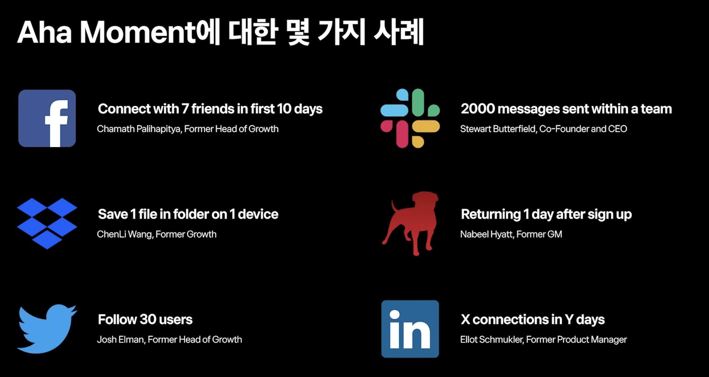

# 토스 리더가 말하는 PO가 꼭 알아야할 개념 | PO SESSION

## C.C 

>C.C라는 개념, inflow, churn rate %을 알면 MAU를 알 수 있다.  
데이터 그로쓰 모델링 Growth Dynamics  

Q1.
You notice that your power users all have taken some action (e.g. filled out their profile) so you try to encourage all users to fill out their profile to get them more hooked on your product. Does this actually help?  

내 생각 : 아닐것 같다. 그들은 시스템이 아닌 로열유저를 따라하는 것임.  
>정답은 Yes or No / 연관관계, 상관관계 질문이다.  
- 프로필 작성과 파워유저의 상관관계를 검증해야 한다.  
- 통제된 A/B 테스트 수행을 통해서 알 수 있다.  
  - B 그룹 : 프로필 작성을 권장, 의무화한다. -> 파워유저의 메트릭까지 올라가는지 인과관계 확인.
  - 이때, Churn Rate가 떨어지면 안된다.  

Q2.
You have 24 hours of downtime, the next day you come back up your traffic is down. Will this have a long-term effect you need to worry about?

내 생각 : 장기적으로 봤을땐 문제 없을듯.
>Inflow, Churn만 봤을때 그 값의 변동만 없으면 다시 MAU를 회복한다. 신뢰도 하락으로 Churn Rate가 올라가면 새로운 C.C가 만들어진다. 대부분의 경우엔 MAU에 리스크는 적다.  

Q3.
You have 100K uniques per day and so does your competitor, but are these 100K people who come back everyday or 700K people who each come once per week? Does it matter?

내 생각 : 상관없을듯, 어차피 계속 오니까.  
>C.C를 계산하면 된다. 오히려 알림을 자주해서 이탈을 늘리는 경우를 막아야 한다.  

Q4.
You turn on a new advertising campaign and see your # of unique visitors per day start to increase, you assume that this will continue increasing so long as you keep the ads running, right?

내 생각 : 언젠가 한계가 있다. 빠져나가는 유저와 평형점
>C.C 만큼만 광고를 해야 한다. 그 이상하면 어차피 빠진다.  

Q5.
You start having email deliverability problems (or Facebook turns off notifications) so you can't notify users of new activity on the site. The # of unique visitors decreases slightly but you're not too worried, should you be?

내 생각 : 큰 문제가 없을듯, 다른 수단도 있으니
>C.C 에는 영향이 없는지 와야한다. 놀랍게도 유입도 줄고 쓸모없는 알림이 없어져서 이탈률도 줄어서 C.C 가 같다면 영향이 없다.  

## Carrying Capacity 

개념 : 호수가의 물의 높이가 어디까지 올라올까?    
- inflow(정수) 와 outflow(%)의 비율이 MAU을 결정하게 된다.  
- C,C 라고도 한다.

데이터 그로쓰 모델링
- Total Customers = New Customer Today와 Lost Customers Today,
- 단 두 가지 요소만 영향을 미친다.

📕 Customer 에 대한 정의
a. Active를 어떻게 정의하나?
- i. 95%이상의 Visitor가 꼭 하게 되는 활동
- ii. Page by Page, Repeatable하고, Meaningful Action인가?

b. Churn은 어떻게 정의하나?
- i. 얼마를 안써야 안오는 거라고 정의할까? 1일? 4일?
- ii. 상식적으로 이정도를 안썼으면 Loss될 것 같다를 정한다. (나중에 바꾸면 안됨!)
- 1. ex 사장 : 한 달에 한번 쓰는 앱. 3개월을 Churn으로 정의
- 2. 토스 송금은? 30%가 이전달에 온 적이 없는 유저

📕 C.C 계산방법
1.만약 MAU가 75만, 유입수 7.5K, 1% Churn Rate  
- 7천 5백명이 들어오는 족족, 7500이 나가니까 MAU 75만이 유지가 된다.  
2.만약 MAU가 75만, 유입수 7K, 1% Churn Rate
- 7천명이 들어오는데, 7500명이 나가니 500명씩 유출이 된다. 대신 나가는 1%도 줄어들게 되어, MAU 70만으로 평형점을 이루게 된다.  
- 공식 MAU = 유입수 / Churn Rate %  

💡 MAU 체력을 아는 방법  
- MAU는 1달 ~ 2달 안에 알 수 있다.  
- 즉 CC는 Retention을 측정하면서 알게 된다.  
- 본질적으로 새로운 유저, 이탈율을 알면 MAU 체력을 알게 된다.  
- *2가지 숫자를 바꾸는것만이 MAU를 바꿀 수 있다.*  
  - 광고를 해서 유저를 데려와도 MAU는 정해져 있고,
  - 광고를 하지 않아도 MAU가 늘어날 수 있다.  

💡 광고를 할 것인가?   
- 10만이면 50~60만까지 광고를 걸어서 빨리 키우고.  
- 50~60만에서 2가지 숫자 개선을 위한 제품 개선을 열심히 할 것이다.  
- 항상 광고를 키면 C.C 체력을 모른다. 광고를 2달만 끄고 MAU를 측정해봐야 정확하다. 

💡 새로운 제품 만들지 기존 제품 개선할지의 의사결정.   
- 송금 서비스 C.C의 한계가 도달했음을 미리 알아서 새로운 서비스를 런칭했다.  
- 새로운 서비스는 새로운 C.C를 다시 만들게된다. 새로운 유입과 이탈을 만들어 내기 때문이다.  
- 추가로 송금 서비스를 엄청 개선해서 2가지 지표를 바꾸었다.
- 획득에 집중하느라 낭비하지 마라, 서비스의 이탈율을 당장 계산해서, C.C를 측정.  

## Retenion & Activation  

📕 Product Market Fit의 정의    

- Retention의 Plateauing을 봐야 한다.  
- 사용자가 이탈하다가 어느순간부터 수렴하는 구간이 생기면 계속 쓰는 사용자가 생긴것이다.  
- 광고를 하지 않아도 계속 해서 쓰는 유저가 있으니, 제품에 가치가 있는것이다.

📕 스타트업과 아닌 회사의 차이점, 린스타트업
- 제품, 시장, 고객에 대한 불확실성이 있으면 스타트업.  
- 3가지가 확실하면 MBA 경영자가 경영의 단계로 가면된다.  
- 린스타트업 : 불확실성을 ( 에릭 )

💡 PMF를 찾고나서 당장 해야하는것.  
- Retenion Curve를 분석하는 것.  
- 그리고 Retenion 고치고, Activation, Acquisition 순서로 고쳐야 한다.  
- 유저가 떠나지 않을 본질적인 제품을 만들어야 한다.  
- 1.떠난 유저들에게 왜 떠났는지 Usability Test를 해야 한다.  
- 2.Retenion 유저들에게 왜 계속쓰는지 분석해야 한다.  

📕 UT를 하는 이유는 나중에 CC를 늘리기 위한 개선을 찾는것.  
- 이탈 그룹에 대한 Usability Test
- 우리가 채우지 못하는 Usecase가 무엇인지 알 수 있습니다.
- 장기적으로 우리가 Carrying Capacity를 높이기 위해 어떤 기능과 솔루션이 도입 되어야 하는지 알 수 있습니다.
- 유저에게 물을 때, 왜 우리 것을 사용하지 않나요?'라고 묻지 말고, 당신은 00의 목적을 달성하고자 할 때 무엇을 사용하나요?'라고 물어야 목적을 달성할 수 있습니다. 
- 많은 경우 5번의 UT로도 동일한 문제에 대해 상당히 일관된 답을 들을 수 있습니다. 
- 하지만 저는 시장 기회에 대한 직감과 패턴을 발견하기 위해 20번 이상의 UT를 하기도 합니다.이 UT는 Retention을 개선하는데 당장의 도움이 되지 않습니다. 
- 장기적인 관점에서, 우리가 앞으로 커버 해야하는 Usecase를 발견하기 위함입니다.  
- *UT를 통해서 다음 CC를 새롭게 채울 수 있다.*

📕 리텐션 그룹에 대한 데이터 분석  
- PMF 도달 이후 데이터 분석으로 페르소나를 명확히 파악해야 한다.  
- 뿐만 아니라 성별, 지역, 나이, 산업, 회사 등  

💡 Retenion Plateauing  
- 70% : 세상을 바꾸고 산업을 혁신할 수 있다. - 페이스북, 인스타 그램, 토스  
- 40% : 꽤 괜찮은 큰 회사를 만들 수 있다.
- 20% : 2000~3000억 회사를 만들고 끝.  
  - 20% 보다 낮은 경우 : 리텐션이 없어서 회사를 만들 수 없다.

📕 리텐션 개선 핵심 = Aha Moment 운동일으킨다.  
- 아하 모멘트는 이 제품의 핵심 가치를 경험하는 순간이다.  
- 회사 50명이 넘어가는 순간 회사가 복잡해지고 제품에 의견도 많이 생기는 순간이다.  
- 서비스를 계속 쓰게 되는 특이점 (Singularity)  
  - *이 행동을 한 유저는 95% 리텐션이 생기는 행동  
- 토스에서는 4일안에 2번 송금하면 아하모멘트 였다.  그 외에는 남지 않는 유저들이였다.  
  - > 4일 안에 2번 송금하게만 만들면 된다. 그 사람이 해야할 일은 그것뿐이다.   

- 정량적으로 정의되는, 유저가 서비스에 남게 되는 결정적인 순간  
- 정성적으로도 상식적인 인과관계가 있는 순간  
- Simplicity, not Science  
  - 아주 단순한 산수. 팀원들이 무지성 추종을 하게 되는 단순한 한 문장. (O)  
  - 복잡하고 정교한 분석 결과 (X)  
- 연역 추리와 귀납 추리 모든 과정을 통해 찾는 것이 적절하다    
  - 이러해서 이러하니 괜찮지 않을까? / 전체 데이터를 보고 결정해보는 것.  
- 리텐션 개선을 위한 Silver bullet이 아니다.  
  - 💡 모든 유저가 아하 모멘트에 몰입시켜서 20~30% 개선이 가능하다.  
  - 💡 그 외에는 UT를 통해서 C.C를 봐야 한다.  

💡 다른 회사에서의 인과관계의 사례들, 무지성을 하면 효과가 있는 것들 및 집중.  

- 행동 (Aha Moment) | 맥락 / 제품 | 인사이트 제공자
- 가입 후 10일 내에 친구 7명 연결 | Facebook | Chamath Palihapitiya (전 Growth 총괄)
- 1개의 파일을 1개의 기기에 저장 | Dropbox |ChenLi Wang (전 Growth)
- 30명 이상 팔로우 | Twitter | Josh Elman (전 Growth 총괄)
- 팀 내에서 2000개의 메시지 전송 | Slack | Stewart Butterfield (공동창업자 및 CEO)
- 가입 다음 날 재방문  | 여러 앱의 (Retention 지표로 사용) | Nabeel Hyatt (전 GM)
- X일 내에 Y명의 친구 연결 |LinkedIn 등 Elliot Schmukler (전 Product Manager)

💡 XX라는 행동을 YY라는 날짜 안에 ZZ번 한다.   

아하 모먼트의 형태
- XX : 만든 서비스가 가치가 있다면(이미 PIM Fit을 찾은 후이므로), 그 서비스의 핵심 가치를 경험할 때 (간편송금이라면 송금을 한다라는 acvitation의 정의조항)을 한번 경험하면 그 가치를 전달받게 됩니다.
  - 그래서 결국 그 Xx라는 행동을 여러번하게 하는 것이 리텐션을 만드는 가장 좋은 무기가 되야하는게 상식인거죠. 
  - (만약 아직 Retention이 없다면, PM Fit을 찾기 전인것이고, 그렇다면 아직 서비스에 가치가 없는 것이기 때문에, 아직 AhaMoment를 찾을때가 아닙니다.)
- YY : 매일매일 많은 서비스속에서 복잡한 삶을 사는 인간들은 어떤 서비스를 경험했을때 오랫동안 기억하거나 상기하지 않습니다.
  - 즉, 일정 시간이 지나면 그 서비스를 써보려고 했었다는 것을 잊어버리게 되는거죠. 그래서 가입한 후에 너무 많은 시간이 지나기 전에 그 서비스를 계속 쓰도록 만드는 가치제안을 해내야합니다.
- ZZ : 아주아주 훌륭한 서비스가 아니라면 대부분의 경우 그 서비스를 한번 경험해서는 그 서비스를 계속 쓰도록 되지 않습니다. 그래서 여러번 경험시켜야만 보통 리텐션이 생길 수 있습니다. 
  - XX가 아주 훌륭한 Recuring Value면 Zz는 1번만일 수도 있지만, 대부분의 경우 그렇지 않고 보통 2~10번이어야 하는 경우가 많습니다  

