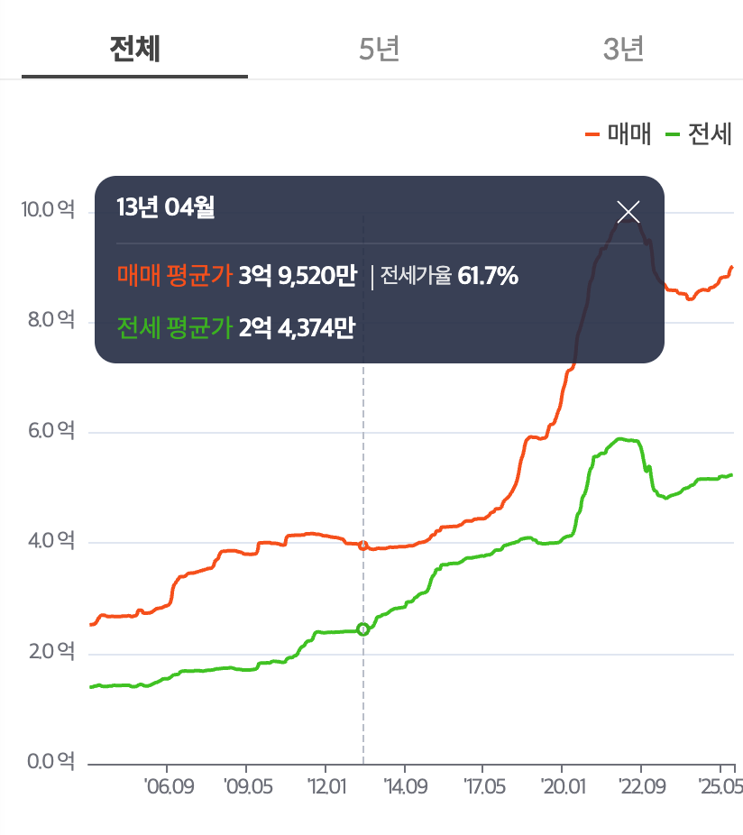

# 아티클 

다음 부동산 대세상승장 준비
https://www.valley.town/space/@developer/articles/681df4ae5c547c641cef71f9  
- 하락장 사이클의 전형적인 반등장, 마지막 불꽃이라고 본다.    
- 이유1, 낮은 거래량 + 신고가, 다주택 규제 -> 똘똘한 한 채 선호현상 (과거와 유사한 패턴 )  
- *자금이 충분하다면 사이클 계산하지 말고 매수하기  
- 27년~28년 어느 시점부터는 바닥을 다지고 서서히 오를 것.  
- 대세상승장 신호는 빌딩, 분양권, 재개발 재건축에서 먼저 나타날 것.  

하락 시나리오  
- 2011년 초 고점 4억 2000만원  
- 2013년 초 3억 9520만원 (-10% 하락)  
  

집을 산다는 것에 대한 생각들
https://www.valley.town/space/@911gt3rs/articles/6732faaa20c49bc7231924d1  

