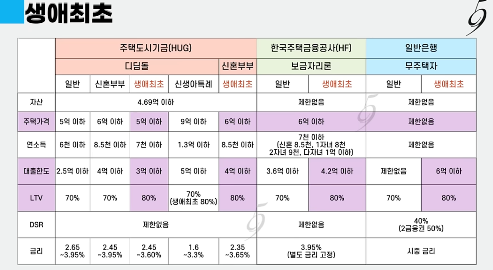

# 3,부동산 자금 계획 (대출, 상환)    

- [3,부동산 자금 계획 (대출, 상환)](#3부동산-자금-계획-대출-상환)
  - [자금 계획 하기](#자금-계획-하기)
    - [주택담보대출 어떻게 받지?](#주택담보대출-어떻게-받지)
    - [QnA](#qna)
    - [적정 부채수준](#적정-부채수준)
    - [증빙 자료](#증빙-자료)
    - [부가비용 고려](#부가비용-고려)
  - [향후 전략](#향후-전략)

## 자금 계획 하기

>아파트 매수 자금 정리 - https://docs.google.com/spreadsheets/d/11I-IXKvEzN4YG-TT5HH-EulLDfmOD8ObjJ2inVVMKZc/edit?gid=0#gid=0  
> **과도한 부채는 리스크다. 최악의 상황은 모든 월급을 원리금 상황에 쓰다가, 급매로 손절하는 케이스.**  

### 주택담보대출 어떻게 받지?

📌 주택담보대출 받는법 - 크게 3가지 방법이 있음

1.창구 방문
- 디딤돌, 보금자리 등 기금 대출은 창구 방문 필수  
- Cons : 대기표와 창구 직원의 변경으로 대출 상담이 번거롭고 어렵다.  

2.비대면 모바일 신청
- 비대면 금리 조금 내려준다. 카카오 주담대 같은 경우 해볼만 하다.?  

3.대출 상담사 활용 ( 공인중개사 소개 )
- 지속적인 컨텍으로 대출 플랜 세우기 좋음 ( 수수료도 은행이 내준다. 대출액의 0.3% 보수 )  
- *대출 상담사 통한다고 금리가 더 높거나, 수수료가 발생하지는 않는다.  

📌 주택담보대출 단계
1.담보물인 주택을 바탕으로 먼저 대출 상담을 받아야 한다.
- 고려해야 할 주요 팩터
    - 중도상환 수수료가 있는지  
    - 상환 방식별 원리금 계산해보기  

2.매매 계약서 쓴다. 
- 대출을 받는데 15일에서 ~ 30일 정도 소요 된다. 잔금일이 얼마 남지 않으면 대출이 거절 될 수 있다.

3.대출금은 법무사 갔다가 내 통장에 들어온다. 나는 계약자에게 입금해서 잔금 치른다.  

📌 대출 금리 비교하기
- 1.은행 연합회 : https://portal.kfb.or.kr/compare/loan_household_new.php
- 2.토스 뱅크 , 주담대 금리 비교
- 3.네이버 페이 , 주담대 금리 비교

### QnA

🙋 스트레스 DSR?, 스트레스 금리?, 대출 한도가 줄어든다고 하네.
- 스트레스 DSR은 앞으로 금리가 오를 것까지 대비해서 대출 한도를 더 깐깐하게 계산하는 제도  
- 25.12월 기준 서울·경기·인천(수도권) 1.5% 기본  
- *LTV와는 직접적인 상관이 없습니다.  

🙋 LTV는 시세 기준? 매매가 기준?  
- LTV산출은 min(시세, 매매가)이다. KB시세보다 훨씬 비싸게 사도 대출이 다 안나올 수 있다.  

🙋 지금 금리가 내려가는 추세인데, 6개월 변동금리 ( 4.725% ) vs 5년 변동금리 ( 4.448% ) 뭐가 유리할까? 
- 전략1, 금리 하락 속도에 대한 본인의 확신에 따라 선택해야 함.  
- 위 경우 6개월 변동금리가 시작 금리가 0.277%p 더 높음   
- 1년 내 금리가 0.5%p 이상 폭락할 것 같다면 6개월 변동 금리가 유리  
- 전략2, 갈아타기  
- 주택담보대출은 3년이 지나면 중도상환수수료가 없어진다  
- 당장 더 저렴한 5년 주기형 받고, 중도상환 수수료 없이 더 낮은 금리 상품으로 갈아타기 가능.  

🙋 이직하는 경우 신용 대출에 문제가 생길 수 있다.   
- 1금융권은 재직 3개월~6개월 이상을 요구한다.  

🙋 주택담보대출 갈아타기  
- 아이가 생긴 경우 -> 신생아 특례 등으로 갈아 타기 가능?

🙋 주택 담보 대출을 받을 때, 중도금을 어떻게 처리해? 주담대는 잔금만 나오잖아?  
- 신축 아파트 분양의 경우: "중도금 대출" 활용  
- 기존 주택 매매의 경우: "개인 자금"이 원칙, 본인의 현금이나 신용대출로 해결해야 한다.  
  - 1,중도금 없이 '계약금 10% → 잔금 90%'로 계약을 진행  
  - 2,매도인에게 전세퇴거자금대출 권유 (매수인이 전세금 마련해줄 필요가 없다.)
  - 3,
    - 내 소유권이 보장되지 않은 상태에서 큰돈이 넘어가는 것이므로 매우 위험  

### 적정 부채수준  

📌 소득 기반 적정 주택 부채 비율은 얼마일까?  
- 주택 관련 빛만 있다면 최대 28% 권장
- 주택과 자동차 할부 등 포함 총 부채는 36% 권장한다.
- *위 값 가장 낮은 연체율을 보장하는 통계값 ( 미국 모기지 연방 )

부대비용도 많이 깨진다. 자금 계획에 반드시 고려해야 함 ( 계산 귀찮다면, 대략 2천만원 생각 )

📌 중도상환 수수료 비율 ( 리스크 - 없음 ) 

- 중간에 돈을 갚으면 수수료를 일부 내야 한다. (대부분 최대 3년)  
- 중도 상환 수수료율에 체감식( 남은 대출기간 만큼 비율로 곱함 ) 적용.  

📌 주택담보대출 - 1 ( 큰 그림 )

📌 주택담보대출 - 2 ( 기금, 공사 )

- 디딤돌이나 보금자리론은 못받는다.  
- 1,주택가격 문제  
  - 일반 디딤돌: 매매가 5억 원 이하   
  - 신생아 특례 디딤돌: 매매가 9억 원 이하   
  - 보금자리론 매매가 기준: 6억 원 이하  
- 2, 연소득 5~7천 구간 
- 신생아특례가 아닌 이상 처다도 못본다. ( *나중에 신생아 특례로 갈아타기 등 가능 )  
- *2023년 특례보금자리론 (종료)  
  - 소득 제한 없이, 주택 가격 9억원 이하, 대출 최대 5억원, 연 4%대 고정금리 (변동금리 없음)    

### 증빙 자료

주택취득자금 조달 및 입주계획서 나중에 작업 해야함

https://office.mybox.naver.com/webCalc/?mode=CALC_EDITOR&docId=28d19e81dd034f88c9812459716b5b5b3ab1506dce70013fe17bd6aea6300f0a&lang=ko_KR

### 부가비용 고려  
- 취득세
- 등기비용
- 중개수수료
- 인테리어 비용
- 이사비용

## 향후 전략  

1,(Worst Case) 2년후 전세,월세를 주는 전략, 자금난을 극복 할 수 있다.   
- 1억에 대한 원리금이 월 40만원 (4.7% 금리) 이다.  
- 3억의 부채는 2년동안 대략 3천만원이다. 이것을 극복하고 나면  
- 150만원 (추가 이익 30만원)이 매달 만들어지는 구조이다.  

2, (금리가 낮아지면) 3년 후 중도상환 수수료가 없다. 더 낮은 금리로 언제든 갈아타기 가능하다.  
- 앞으로 금리가 낮아질 전망이다. 중도상환 수수료를 없애고 갈아타자.  

3, (신생사 특례) 신생사 특례는 2% 저리로 대출을 받을 수 있다.  
- 금리를 더 낮추어 혜택을 받을 수 있다.  

